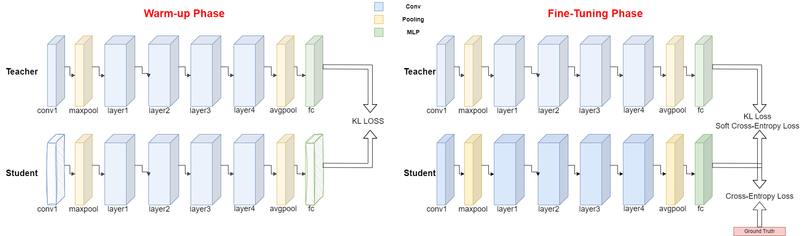
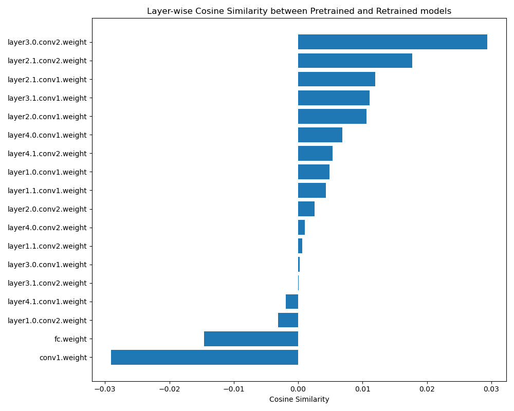
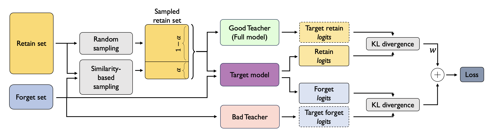

# NeurIPS 2023 Machine Unlearning 轻量深读（Tier B）

> 赛事：Research ｜ 主题 cv（机器遗忘）｜ 1188 队 ｜ 代码赛 ｜ 指标：unlearn metric（遗忘质量 + 保留性能的复合指标，含 MIA 类攻击）
> 材料基础：`digests/neurips-2023-machine-unlearning.md`（6 篇正文：6th 458740 / 2nd 458721 / 5th 458531 / 12th 458648 / 论文合集 438660 / 奖牌争议 438567；80 条主题索引）+ 8 张归档图
> 轻读时间：2026-10（Tier B B12）

## 1. 一句话重述与数字账

给一个预训练图像分类模型（及 retain/forget 子集定义），产出"已遗忘"的模型：既要让 forget 集不再是成员（抗 MIA 检查），又要保住 retain 集性能。本届的实践结论是**"简单重置/蒸馏/微调"打败论文里的 SOTA 遗忘算法**——6th 重置首末层 + KL 蒸馏 + 三损失微调（最保守的一版私榜 0.07831）；2nd 用"1 轮 KL 打平 logits + 8 轮对抗微调"（CosineAnnealingLR 把公榜 0.084 抬到 0.091）；而 5th 报告 RelaxLoss、SCRUB、class weights 等全部无效。

| 关键数字 | 值 | 来源 |
| --- | --- | --- |
| 6th（458740） | 选择性参数重置（**第一层 conv1 + 最后一层 fc**）+ 验证集 KL 蒸馏预热 + 微调（硬 CE + 软 CE + KL）；两版提交：全类预热 公 0.08383 / 私 **0.07219**；仅前两类（forget 集只含 0/1 类）预热 公 0.08324 / 私 **0.07831**（私榜更优）；CIFAR-10 上 conv1/fc 的权重余弦相似度约 **-0.03 / -0.014**（方向相反）；fine-tune、eu-k、cf-k、bad teaching、SCRUB 均未超过基线微调；class weights 无效 | 458740 |
| 2nd（458721） | 两阶段：1 轮"KL→均匀分布"遗忘 + 8 轮对抗微调（forget 轮 = 实例级监督对比损失，温度 1.15；retain 轮 = CE）；retain batch 256 + 8 轮公榜最佳；forget 轮加 **CosineAnnealingLR**：公榜 0.084 → **0.091** | 458721 |
| 5th（458531） | 两路模型集成：(1) **Conv2D 权重整体转置**后重训 3 轮（等效于翻转输入、保特征）；(2) 伪标签微调（用重训模型的错误做伪标签）；组合 246+266 / 266+246 → 私榜 0.078518 / 0.075631；失败清单：class weights、LLRD/init-freeze、softmax/KL、**RelaxLoss、SCRUB**；自述"指标太严苛，光防 MIA 不够" | 458531 |
| 12th 公榜（458648） | Similarity-Based Sampling Bad Teaching：好教师（全模型）+ 坏教师（仅 retain 预训练）+ 学生 KL 对齐（retain→好、forget→坏）；retain 按与 forget 的相似度采样（α 比例）+ 加权遗忘 + "先破坏后重建"的批构造；**最终因超时未进最终榜** | 458648 |
| 赛事治理 | 不给积分/奖牌（50 票 / 34 评论）；公开 notebook 与官方 starter 高度雷同（23 票 / 8 评论）；提交成功但评分失败（14 票 / 12 评论）；"少 epoch 反而更好"（16 票 / 13 评论）；"一致性是关键"（14 票 / 9 评论）；指标复现帖（13 票） | 索引 |
| 9th（索引） | 不依赖 forget set 的方案拿到公榜第 3（11 票） | 主题索引 |

## 2. 逐方案对照矩阵

| 维度 | 6th | 2nd | 5th | 12th（公榜） |
| --- | --- | --- | --- | --- |
| 核心机制 | 重置首末层 + KL 蒸馏 + 微调 | 打平 logits + 对抗微调 | 权重转置重训 + 伪标签 | 双教师 KL + 相似度采样 |
| 用 forget set？ | **不需要** | 需要（对抗轮） | 间接（伪标签） | 需要 |
| 关键超参 | 高温度、CosineAnnealing | 温度 1.15、batch 256、8 轮 | 3 轮重训、模型数配比 | α 采样比例、加权 W |
| 最好私榜 | 0.07831（前两类预热） | — | 0.078518 | 超时未上最终榜 |
| 对论文方法的态度 | 全部不如基线微调 | 借鉴 bad teaching 思路 | RelaxLoss/SCRUB 失败 | 改造 bad teaching |

## 3. 共识、分歧与裁决

### 共识一：本场指标严苛且离线复现困难，必须自建评测（12th 超时、6th/2nd/5th 的细微差异、社区帖；置信度中高）

6th 的两版提交公榜几乎相同（0.08383 vs 0.08324）但私榜差 0.006；12th 公榜很高却因超时失去成绩；社区有"指标复现"专帖与"提交成功但评分失败"的长帖。**裁决**：先把官方 metric（含 MIA 部分）在本地复现，并用多次提交检查顺序稳定性，再做模型选择。置信度：中高。

### 共识二：简单可控的"重置/蒸馏/微调"优于论文 SOTA 算法（6th、2nd、5th；置信度中高）

6th 的一串对照实验显示 eu-k、cf-k、bad teaching、SCRUB 等都不优于基线微调；5th 也报告 RelaxLoss、SCRUB 无效；而 6th/2nd 的简单两阶段/三损失方案拿到前列。**裁决**：该赛道的公开方法在比赛指标下迁移性差，工程化的简单方案 + 充足调参更可靠。置信度：中高（多队独立报告）。

### 共识三：小技巧收益明确——CosineAnnealingLR、高温度、少 epoch（2nd、6th、441318；置信度中高）

2nd 在 forget 轮加 CosineAnnealingLR 直接 +0.007 公榜；两方都用高温度；社区热帖"少 epoch 反而更好"。**裁决**：本任务的训练动力学与传统分类不同，轮数与调度是首要超参。置信度：中高。

### 分歧一：是否依赖 forget set（6th vs 2nd/12th；置信度中）

6th 明确"方法不需要 forget set"，还能拿到私榜前列；2nd/12th 则围绕 forget 集设计对比损失/双教师。**裁决**：两条路线都能得分，但不能归因于某一方——评估指标与模型选择比方法族差异更大。置信度：中。

### 事件：无积分奖牌 + 公榜同质化 + 超时风险（438567、442946、442093、458648；置信度中高）

官方以"探索性强、风险高"为由不授积分/奖牌（50 票 / 34 评论）；社区观察到公开 notebook 与 starter 高度相似（23 票）；提交评分失败与超时案例多起，12th 因此丢分。**裁决**：Research 类比赛的参与成本与回报需提前评估；工程稳健性（超时、评分）与技术同等重要。置信度：中高。

## 4. 证据分级

| 断言 | 等级 | 说明 |
| --- | --- | --- |
| 6th 的重置首末层依据（余弦相似度图）与分数 | 自述 + 3 张图 | 中高 |
| 2nd 的对比损失设计与 +0.007 增益 | 自述 + 公式图（OCR 不全） | 中 |
| 5th 的转置重训 + 伪标签 + 失败清单 | 自述 + 开源 notebook | 中高 |
| 12th 的双教师机制与超时 | 自述 + 架构图 | 中 |
| "SOTA 算法未超基线" | 两队一致自述 | 中 |
| 无奖牌/同质化/超时事件 | 高票帖 + 官方帖 | 高 |

## 5. 悬案与缺口（登记）

- 1st/3rd/4th 方案未收录；7th/9th 只有索引标题；
- 官方 metric 的精确公式未整理（仅能确认含 MIA 与 retain 性能）；
- 2nd 的公式图 OCR 缺失，温度/损失细节需回看原帖；
- 归档 8 图，本深读内嵌 3 张；
- **图证缺口**：无（8 张归档图充足）。

## 6. 图表证据

**图 1**（topic 458740，6th）：预热阶段用教师 KL 蒸馏被重置首末层的学生；微调阶段叠加硬 CE + 软 CE + KL。

**图 2**（topic 458740，6th）：预训练模型与"仅 retain 重训"模型的逐层权重余弦相似度——`conv1.weight` 与 `fc.weight` 为负（约 -0.03 / -0.014），成为"重置首末层"的实验依据。

**图 3**（topic 458648，12th）：retain 经随机 + 相似度采样（1−α / α）后，学生分别对齐好教师（retain）与坏教师（forget），按权重 W 合成 KL 损失。

## 7. 出处

- 6th（13 票）：https://www.kaggle.com/competitions/neurips-2023-machine-unlearning/discussion/458740
- 2nd（35 票 / 17 评论）：https://www.kaggle.com/competitions/neurips-2023-machine-unlearning/discussion/458721
- 5th（30 票）：https://www.kaggle.com/competitions/neurips-2023-machine-unlearning/discussion/458531
- 12th 公榜 / 相似度采样 bad teaching（14 票）：https://www.kaggle.com/competitions/neurips-2023-machine-unlearning/discussion/458648
- 相关论文与代码合集（45 票）：https://www.kaggle.com/competitions/neurips-2023-machine-unlearning/discussion/438660
- 无积分/奖牌争议（50 票 / 34 评论）：https://www.kaggle.com/competitions/neurips-2023-machine-unlearning/discussion/438567
- 公开 notebook 同质化（23 票）：https://www.kaggle.com/competitions/neurips-2023-machine-unlearning/discussion/442946
- 提交评分失败（14 票 / 12 评论）：https://www.kaggle.com/competitions/neurips-2023-machine-unlearning/discussion/442093
- 少 epoch 更好（16 票 / 13 评论）：https://www.kaggle.com/competitions/neurips-2023-machine-unlearning/discussion/441318
- 指标复现（13 票）：https://www.kaggle.com/competitions/neurips-2023-machine-unlearning/discussion/453735
