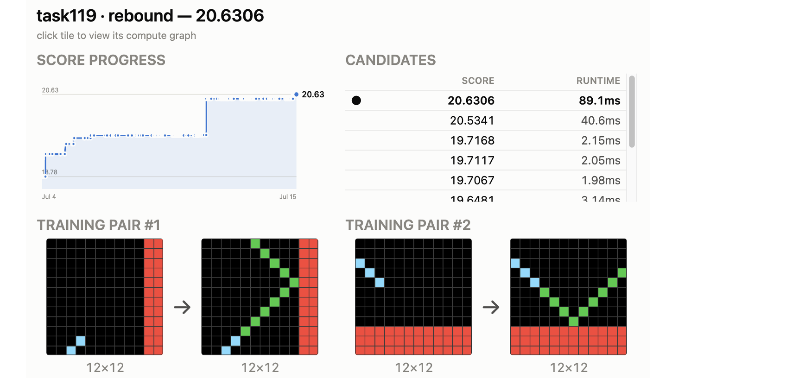

# NeuroGolf 2026 轻量深读（Tier B）

> 赛事：Featured/Research ｜ 主题 sim-agent（LLM agent + ONNX 高尔夫）｜ 2963 队 ｜ 标准赛 ｜ 指标：NeuroGolf Metric（5/6 改版后：`cost = memory + parameters`，`score = max(1, 25 − ln(max(1, cost)))`，MACs 仅诊断）
> 材料基础：`digests/neurogolf-2026.md`（6 篇正文：9th 726653 / 1st 管线 726799 / 1st 自进化提示 726883 / 1st 总述 726654 / 焦点帖 724795 / 骗局帖 726541；80 条主题索引）+ 12 张图
> 轻读时间：2026-10（Tier B B05）

## 1. 一句话重述与数字账

用**手写 ONNX 图**解 400 道 ARC-AGI 题，同时把"内存占用 + 参数量"压到最小——一个**程序合成 + 代码高尔夫**任务。真正的考点不是某道题，而是**搭建"LLM agent 工厂"：并行探索 → 机械验证 → 事务化晋级 → 在线反馈 → 技巧沉淀**。

| 关键数字 | 值 | 来源 |
| --- | --- | --- |
| 1st（Kaggle Agent 团队） | **架构重写平均 +0.5/题，本地优化现有图仅 +0.05/题** → 战术定为"永远先找更好的架构"；token 效率工程：给 worker 设硬目标（+1.5/题）、预烘焙 task notes、共享 cookbook、公共 Python 工具、保存 builder 脚本；两条流水线：纵向单题深挖（单轮 worker）+ 横向多题迁移（聚类找相似题灌新技巧）；"自进化提示"：4 小时迷你赛 → 人类导师 → 三轮后晋升经理 agent；用 Claude Code（Opus 4.8/Fable 5）、Codex、ChatGPT Pro（5.6-Sol/5.5） | 1st |
| 9th（66 票） | Codex 调度器：N 并发 worker、每题一个持久 session（`codex exec resume`）、**backup→experiment→validate→promote/restore** 事务门；三文件任务单元（`taskNNN.onnx` + `attack_tNNN.py` + `docs/task-NNN.md`）；在线回归用**差分提交二分定位**；技巧经在线确认后合并进 `docs/tricks.md`。**五天无人值守：7516.01 → 7575.78（+59.77），改动 271 题、严格降本 256 题、零回归**；代表改进 T032 48→32、T142 246→180、T308 1902→1478、T363 5565→4532 | 9th |
| 9th 六招 | ① 直接写图输出（输出张量不计内存；T001 单个 226 操作数 Einsum，cost 98 = 0 内存 + 98 参数）② **重算代替搬运**（T017 60→10）③ 一份"付费基座"充当多角色（T096 cost 1364）④ 用有限状态/数论代数替换查找表（T061 606→70）⑤ 原生算子当运输工具（T082 cost 21；T098 270→37）⑥ **收缩顺序=模型状态**（同 cost 下 run-time −13%、再 −16%） | 9th |
| 事件 | 5/6 计分改版（早期 loophole 失效）；"7957 分数据集"实为加密的公开 baseline（骗局帖）；作弊指控与"专注你的方案"对线；"ChatGPT Plus $20/月就够了"热帖 | 社区 |

## 2. 逐方案对照矩阵

| 维度 | 1st（Kaggle Agent） | 9th |
| --- | --- | --- |
| 组织单位 | 单题 worker + 经理 agent | 单题三文件单元 + 持久 session |
| 并发 | 预烘焙输入、codex exec 并行；Claude/ChatGPT 多线 | 有界 worker 池、队列补位、断点续跑 |
| 质量门 | 本地验证 + 目标分驱动 | 严格 checker + 全部样例 + 成本单调下降 |
| 知识沉淀 | cookbook + task notes + 工具库 | 任务文档 + 仅在**在线确认**后合并 tricks |
| 在线反馈 | 未细述 | 差分提交+二分定位回归，再加权技巧 |
| 核心武器 | 架构重写（+0.5/题） | 事务化优化 + 在线闭环（+59.77/5 天） |

## 3. 共识、分歧与裁决

### 共识一：agent 工厂 > 单次生成（2/2 + 社区）

1st 用两条流水线 + 自进化提示；9th 用调度器 + 事务门 + 在线闭环。**裁决**：这类"独立小任务 × 机械化验证"的赛制里，**吞吐量与验证机制**决定上限；提示词技巧是二级变量。置信度：高。

### 共识二：架构重写才跳得出平台期（1st 量化）

1st 自述"本地优化 +0.05/题，架构重写 +0.5/题"，并给出硬目标（+1.5）迫使 agent 先算理论上限；9th 的 T061（606→70）、T001（单 Einsum 98）都是重写而非修剪。**裁决**：在对数计分 + 结构成本的目标下，"小修小补"的边际收益被系统性高估。置信度：高（1st 有全量任务分数历史，见图 2）。

### 共识三：验证器与回滚是 agent 化生产的生命线（2/2）

9th 的 promote/restore 事务门 + 本地/在线双验；1st 用本地样例 + ARC-GEN 生成样例验证并保留 builder。**裁决**：没有"回滚 + 可复现构建脚本"的 agent 流水线会累积静默回归。置信度：高。

### 分歧一：持久多轮 vs 单轮 + 预烘焙上下文

9th 让每题保住长期会话记忆（resume）；1st 明确"纵向流水线只用单轮，输入预烘焙好再收结果"。**裁决**：取决于上下文质量——若能把任务事实/死胡同写成 notes，单轮更省 token；否则持久会话更稳。两者都以"避免重新发现"为设计原则。置信度：中高。

### 事件：计分改版与骗局

5/6 改版把 MACs 移出成本（计算免费、内存/参数贵），彻底改变优化方向；同时期出现假高分数据集（zipCrypto 加密的 baseline）与作弊指控。**裁决**：LLM agent 赛的规则与榜面都需要"机械可验证 + 社区审计"双保险；早先按 loophole 优化的方案在改版后价值归零，而 9th 因提前加约束反而受益。置信度：中高（事件层面）。

## 4. 证据分级

| 断言 | 等级 | 说明 |
| --- | --- | --- |
| 9th 的调度器/事务门/五天 +59.77 | 自述 + 具体数字 + 公开三文件样例 | 高 |
| 9th 六个核心技巧与成本数字（T001/T017/T061/T082/T096/T098） | 自述 + 成本明细 | 中高 |
| 1st 的 +0.5 vs +0.05 架构重写对比 | 自述 + dashboard 分数史（图证） | 中高 |
| 1st 的 token 效率经验与自进化提示 | 自述（无逐项消融） | 中 |
| 骗局/作弊 | 论坛帖 + 数据集（未涉我方复核） | 中（现象） |

## 5. 悬案与缺口（登记）

- 2nd–8th 的方案未入库；1st 的完整 write-up 当时仍标注"soon/待续"，本场最终分数账缺席；
- 计分改版前后的分数不可比，早期 loophole 时代的方案价值未系统整理；
- 9th 的三文件样例只贴了 T001，其他 399 题的过程数据未归档；
- 骗局与作弊指控无官方结论（材料中仅有帖子）。

## 6. 图表证据

**图 1**（topic 726799）：1st 的"纵向单题深挖（单轮 worker + 架构重写 + 本地验证）↔ 横向多题迁移（cookbook + 任务聚类 + 交叉收益）"双流水线，底部闭环为 Explore → Mine tricks → Exploit → Repeat——与 9th 的"探索-沉淀-利用"结构同构。

**图 2**（topic 726654）：1st 的 dashboard 单题示例（task119，20.6306）——分数曲线长期平台后出现阶梯式跳升，对应"架构重写"而非微调；候选列表中 20.63 分/89ms 与 2ms 级候选并存，也说明成本与运行时的权衡。

## 7. 出处

- 1st 总述（115 票）：https://www.kaggle.com/competitions/neurogolf-2026/discussion/726654
- 1st 管线（34 票）：https://www.kaggle.com/competitions/neurogolf-2026/discussion/726799
- 1st 自进化提示（38 票）：https://www.kaggle.com/competitions/neurogolf-2026/discussion/726883
- 9th（66 票）：https://www.kaggle.com/competitions/neurogolf-2026/discussion/726653
- 焦点帖（44 票）：https://www.kaggle.com/competitions/neurogolf-2026/discussion/724795
- 骗局帖（77 票）：https://www.kaggle.com/competitions/neurogolf-2026/discussion/726541
- LB 10000 漏洞帖（42 票）：https://www.kaggle.com/competitions/neurogolf-2026/discussion/696377
