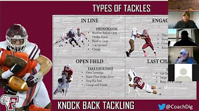

# NFL Big Data Bowl 2024 轻量深读（Tier B）

> 赛事：Community（评审制 analytics）｜ 主题 cv/tracking（NFL 擒抱分析）｜ 约 300 份提交 ｜ 截止 2024-01-08
> 材料基础：`digests/nfl-big-data-bowl-2024.md`（6 篇正文：术语表 447174 / 擒抱技术 448833 / 进攻球员评估与 EPA 447660 / 生态工具与历史冠军 446946 / 赛后总结 468229 / 官方欢迎 446943；80 条主题索引）+ 1 张归档图
> 轻读时间：2026-10（Tier B B19）

## 1. 一句话重述与数字账

第六届 Big Data Bowl，主题是**擒抱（tackling）**：用 NGS 追踪数据 + tackles 数据研究"防守方如何把持球人放倒"。延续系列传统：**先补领域知识**（阵型/位置/统计口径/擒抱技术），再谈分析；同时本场给足了"指标体系"素材——nflWAR 论文的 EP/WP/EPA/WPA 建模、Next Gen Stats 的 xRY/RYOE、The Zoo 的"22 人相对位置+速度、不依赖人工特征"的经典冠军范式。评审由 NFL 各队分析部门打分，**分数不公开**，赛后只公布 finalist 与总结。

| 关键数字 | 值 | 来源 |
| --- | --- | --- |
| 规模与赛道 | 第六届 BDB；**约 300 份提交（同比 +15%，创 analytics 赛记录）**；Metric / Undergrad / Coaching 约 **45 / 30 / 25** 分布；由 NFL 球队分析人员评审 | 468229 |
| 时间线 | 1/8 截止 → finalist 公告（2024-01，14 票 / 20 评论）→ 摘要称 finalist 预计 2 月初；**规则与最终分数不公开** | 472712 / 472752 |
| 术语与口径 | 阵型（Shotgun/Singleback/I/Empty/Pistol/Jumbo/Wildcat）、位置缩写、球衣号码规则、传球统计口径；擒抱类型（In Line / Open Field / Engaged / Last Chance）与 solo/assist/total 计数 | 447174 / 448833 |
| 指标体系 | nflWAR：多项式 logistic 估 EP → GAM 估 WP → 多水平模型算 WAR；传球拆"空中/接球后"分摊给传球者/接球者/防守；冲球拆 QB/非 QB；xRY、RYOE、RYOE/Att、ROE、首攻概率、达阵概率 | 447660 / 446946 |
| 历史范式 | The Zoo（BDB 2020 冠军）：**只用 22 名球员相对位置与速度、不用预造特征**，因此可迁移到任意 play/时刻 | 446946 |
| 数据质量问题 | "Is there a Data Discrepancy?"（14 票 / 6 评论）；preSnap 胜率列命名错位（447011）；部分 play 位置"滞后"；tackles 数据不一致；追踪数据缺失；passresult 缺失；ball_snap 事件缺失；gameId 2022091808 缺失；plays/tracking 不一致 | 447639 / 447011 / 448035 / 461347 / 451985 / 451804 / 452944 / 459352 / 460396 |
| 交付/合规 | 2000 词限制讨论；GIF/SVG 动画提交报错（多个帖）；外部数据（StatsBomb 公开仓库、All-22 影片）合法性被问；NFL Vision 新版公告；简历投递通道 | 464862 / 466521 / 450982 / 461515 / 470693 / 478371 |

## 2. 逐方案对照矩阵

| 维度 | 领域口径线（447174 / 448833） | 指标体系线（447660 / 446946） | 数据工程线（多帖） |
| --- | --- | --- | --- |
| 内容 | 阵型/位置/擒抱技术/助攻口径 | EP→WP→EPA/WPA→WAR；xRY 家族 | 缺失值、命名错位、tracking 滞后 |
| 产出 | 能正确标注一次擒抱/一次错失 | 可解释的球员/战术价值 | 可信的分析底表 |
| 风险 | 口径理解错 → 结论错 | 直接回归"下一次得分"不稳 | 脏数据导致假结论 |

## 3. 共识、分歧与裁决

### 共识一：评审制分析赛先统一"统计口径"（447174 / 448833 / 447710；置信度高）

什么算 solo/assist、什么算 missed tackle、play 何时算擒抱——这些定义直接决定标签质量；技术帖给出教练视角的四类擒抱与计数规则。**裁决**：开赛先写"口径备忘"（数据列 ↔ 官方定义 ↔ 例外），再建派生指标。置信度：高。

### 共识二：EP/WP 类指标要按事件概率建模（447660；置信度中高）

nflWAR 的做法是先多项 logistic 估各得分事件概率再求期望（EP），把 EP 作为 GAM 特征估 WP，再取前后差得 EPA/WPA；比"直接回归下一次得分"更稳、更可解释。**裁决**：做 play 估值时走"事件概率→期望→差分"链；传球/冲球按子模型拆分信用。置信度：中高。

### 事件一：追踪数据必须先做一致性与缺失审计（447639 / 448035 / 451985 / 452944 / 459352；置信度中高）

数据差异、位置滞后、缺失 tracking/ball_snap/整场数据等被反复报告。**裁决**：任何 play 级派生（速度、距离、相对位置）前，先做事件对齐与缺失图；把剔除规则写进 notebook。置信度：中高。

### 事件二：公开生态（nflverse/cfbfastR/xRY）是低成本起点（446946；置信度中高）

R 生态能直接取 play-by-play、EP 模型教程与可视化；Next Gen Stats 公开了 xRY/RYOE 的定义。**裁决**：先复现公开 EP 模型与 xRY 口径，再叠加追踪数据做增量。置信度：中高。

### 事件三：交付格式是常见翻车点（464862 / 466521 / 466257 / 465620；置信度中）

2000 词限制、GIF/SVG 嵌入、submission notebook 报错在这个社区赛里占据大量帖子。**裁决**：提前用最小 notebook 验证动画/图片渲染与提交流程；字数按最保守口径统计。置信度：中。

### 分歧：外部数据与影片的合规边界（450982 / 461515；置信度中）

StatsBomb 公开数据与 All-22 影片是否可用被公开询问，官方答复未归档。**裁决**：外部数据先用官方允许的公开来源（nflverse 等），影片只在明确允许时使用；有疑问赛前发帖确认。置信度：中。

## 4. 证据分级

| 断言 | 等级 | 说明 |
| --- | --- | --- |
| 约 300 提交与 45/30/25 分布 | 官方总结帖（468229） | 高 |
| 术语/擒抱口径 | 高票社区整理（447174 / 448833） | 中高 |
| nflWAR 指标体系 | 论文引用 + 长帖（447660） | 高（论文可查） |
| The Zoo / xRY 范式 | 官方链接与历史帖（446946） | 中高 |
| 数据质量问题 | 多帖（447639 等） | 中高（现象密集） |
| 规则与分数不公开 | 官方帖（472752） | 高 |

## 5. 悬案与缺口（登记）

- 最终分数/规则说明不公开，获奖作品正文未归档；
- 数据差异与 tracking 滞后的官方修复结论未归档；
- 外部数据/影片合规边界无归档答复；
- 赛道（metric/undergrad/coaching）之间的评分差异未公开；
- **图证缺口**：无（1 张图，已内嵌）。

## 6. 图表证据

**图**（topic 448833）：Fordham 教练 Vincent DiGaetano 的四类擒抱技术图（In Line / Open Field / Engaged / Last Chance）——术语与口径帖的核心配图，也是把教练语言翻译成数据标签的起点。

## 7. 出处

- 官方欢迎（19 票 / 18 评论）：https://www.kaggle.com/competitions/nfl-big-data-bowl-2024/discussion/446943
- 术语表（20 票 / 3 评论）：https://www.kaggle.com/competitions/nfl-big-data-bowl-2024/discussion/447174
- 擒抱技术与计数口径（19 票 / 6 评论）：https://www.kaggle.com/competitions/nfl-big-data-bowl-2024/discussion/448833
- 进攻球员评估与 EPA（16 票 / 0 评论）：https://www.kaggle.com/competitions/nfl-big-data-bowl-2024/discussion/447660
- 生态工具与历史冠军（17 票 / 0 评论）：https://www.kaggle.com/competitions/nfl-big-data-bowl-2024/discussion/446946
- 赛后总结（16 票 / 2 评论）：https://www.kaggle.com/competitions/nfl-big-data-bowl-2024/discussion/468229
- finalist 公告（14 票 / 20 评论）：https://www.kaggle.com/competitions/nfl-big-data-bowl-2024/discussion/472712
- 规则与分数不公开（3 票 / 3 评论）：https://www.kaggle.com/competitions/nfl-big-data-bowl-2024/discussion/472752
- 数据差异（14 票 / 6 评论）：https://www.kaggle.com/competitions/nfl-big-data-bowl-2024/discussion/447639
