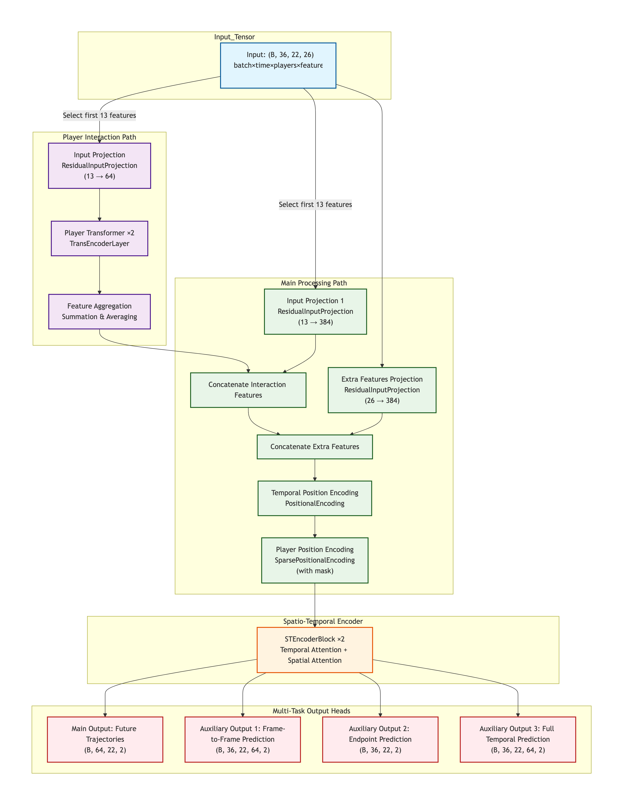

# NFL Big Data Bowl 2026 - Prediction 轻量深读（Tier B）

> 赛事：Featured ｜ 主题 cv/tracking（球员轨迹预测）｜ 1899 队 ｜ 代码赛（在线评测 API）｜ 指标：`NFL_2025`（位置误差型）
> 材料基础：`digests/nfl-big-data-bowl-2026-prediction.md`（6 篇正文：1st 651604 / 3rd 668048 / 4th-5th 651814 / 5th 1059 行处 / 33rd 651530；80 条主题索引）+ 7 张图
> 轻读时间：2026-10（Tier B B10）

## 1. 一句话重述与数字账

给定一次传球进攻的追踪数据，预测指定球员未来 48 帧的位置。真正的考点是**"小数据下的增强 + 损失函数设计 + 时空架构"**：1st 只用竞赛数据就夺冠（靠**高斯 NLL 损失**与强增强）；3rd 则把官方允许的 2018 追踪数据（NFL BDB 2021）按"事件链"重构成同构任务做预训练，再用**双路径（球员交互 + 个体运动）+ 时空注意力**微调。

| 关键数字 | 值 | 来源 |
| --- | --- | --- |
| 1st（651604） | **只用竞赛数据**（数据集小 → 必须强增强 + 好损失 + 好架构）；特征：**传球前 20 帧动态特征**（每帧 10 维：x/y、sin(o)/cos(o)、sin(dir)·s/cos(dir)·s、相对落点的 x/y、相对接球手的 x/y）+ **12 维静态特征**（player_role 的 4 维 one-hot、预测帧数、输入帧数、传球者末帧坐标、落点坐标、球员末帧坐标）；**目标 = 相对最后一帧输入的位移 (Δx, Δy)**，最终轨迹=末帧坐标+预测位移；解码器：(256, player) → 1536 → reshape (32, 48) → 多个 Conv1d(k=3) → 投影出 2（xy）+ 4（辅助项）；验证：**按 game_id 分组的 5 折 × 3 次不同切分**；RAdam + **EMA(0.9995)**、210 epoch、每 6 epoch 评估；损失：**GaussianNLLLoss（同时预测均值与方差，方差用 `softplus(var)+1e-3` 约束为正）**——自动降低高方差样本的权重，优于 SmoothL1，且"逐帧加权无益"；辅助损失来自预测 xy 的速度（一阶差分）与加速度（二阶差分） | 651604 |
| 3rd（668048） | 完整工程：① **特征**：原始量（x/y/s/a/dir/o/落点/num_frames_output）+ 速度分解（velocity_x/y）+ 运动方向（angle_to_ball、dir_rad 等）；② **增强**：**沿中场线的水平翻转**、**180° 旋转**（进攻/防守标签不变、路线对称）、**随机球员丢弃**（从首帧统计有效球员，随机把 1–min(5, 有效−4) 名球员的 36 帧张量清零并置 mask=False）、**球内随机重排**（打破"slot 0=离 QB 最近"的偏置，迫使模型依赖几何特征）、**随机输入裁剪**（若 seq_len>12，从头部丢 2–6 帧、保留至少 7 帧尾帧后补零）；验证集禁用全部增强；③ **额外数据**：官方允许的 2018 追踪数据，按事件链 `ball_snap → pass_forward → pass_arrived` 过滤，输入=ball_snap 到 pass_forward、输出=pass_forward+1 到 pass_arrived，落点取 `event=pass_arrived & team=football` 的行，角色=QB 为传球者、接球手=pass_arrived 时离落点最近的主队进攻球员；④ **两阶段训练**：先用"小而可信"的特征集在 2018+2026 数据上预训练（离线验证 0.62–0.68），再**加一个小线性 bridge 层**加载权重、用完整特征集微调；⑤ **架构（图 1）**：双路径——**Player Interaction Path**（前 13 特征 → 投影 13→64 → 2 层 Transformer → 聚合）+ **Main Processing Path**（13→384 + 额外 26→384 → 拼接 → 时间位置编码 + 带 mask 的稀疏球员位置编码）→ **时空编码器（STEncoderBlock×2，时间注意力+空间注意力）** → **四个多任务头**（未来轨迹主输出 + 帧到帧预测 + 终点预测 + 全时序预测）；⑥ 训练细节：**所有模块 Dropout=0**（纯回归里 dropout 有害）、**宽而浅（hidden 384×2）优于窄而深（128×6）**、主损失用带**时间衰减权重 `e^(−0.03t)`** 的 TemporalHuber + 速度平滑项；另有 TTA 与集成章节、"什么没 help"清单 | 668048 |
| 社区/事件 | "**Model architectures**"（57 票 / 57 评论）、"**Online training / Structural data leakage**"（54 票 / 18 评论）——在线评测与结构性泄漏是全场焦点、"可视化 play 的代码"（45 票）、"防守方 player_to_predict 怎么选"（26 票）、"提交一度被禁用，后启用新评测 API"（36 票 / 49 评论）、"榜单最终确定"（25 票） | 社区 |

## 2. 逐方案对照矩阵

| 维度 | 1st | 3rd |
| --- | --- | --- |
| 数据 | **只用竞赛数据** | 竞赛 + 2018 追踪数据（事件链重构） |
| 输入/目标 | 传球前 20 帧（10 维/帧）+12 静态维；目标=末帧位移 | 36 帧 ×22 球员 ×26 特征；多任务头 |
| 架构 | (256,player)→1536→(32,48)→Conv1d→2+4 输出 | **双路径 + 时空注意力 + 4 个输出头** |
| 损失 | **GaussianNLL（均值+方差）** + 速度/加速度辅助 | TemporalHuber（时间衰减 e^(−0.03t)）+ 速度平滑 |
| 增强 | 强增强（细节见其训练 notebook） | 翻转/旋转/球员丢弃/重排/裁剪 |
| 正则 | EMA 0.9995 | **Dropout=0、宽浅结构** |

## 3. 共识、分歧与裁决

### 共识一：损失函数是预测型赛的关键杠杆（1st/3rd）

1st 用 **GaussianNLL**（同时学均值与方差、自动降权高方差样本）明确优于 SmoothL1；3rd 用带时间衰减的 TemporalHuber + 速度平滑。**裁决**：轨迹预测的误差分布异质（不同球员/时刻的确定性不同），"学不确定性并降权"或"按时间衰减加权"是比纯 L2 更合适的归纳偏置。置信度：高（1st 有对照）。

### 共识二：小数据赛靠增强与外部同构数据（1st/3rd）

1st 只用竞赛数据但强调"必须强增强"；3rd 用官方 2018 数据经**事件链重构**成同构任务并两阶段预训练（外加 small bridge 层适配）。**裁决**：先做"事件语义对齐"再谈迁移；bridge 层是低成本的特征空间重映射。置信度：中高。

### 共识三：时空结构要显式建模（3rd）

3rd 的双路径（球员交互 + 个体运动）+ 分离的**时间与球员位置编码** + 带 mask 的变长球员处理 + 时空注意力。**裁决**：多智能体轨迹预测的标准配方是"交互图/注意力 + 个体编码 + 位置/时间编码 + 掩码处理变长"。置信度：中高。

### 分歧一：用不用外部（2018）数据

1st 完全不用仍夺冠；3rd 用 2018 数据预训练。**裁决**：只要事件定义能对齐，外部同源数据可显著加速收敛；但冠军证明它不是必需。置信度：中。

### 事件：在线评测与结构性泄漏（54 票帖）

比赛改用了在线评测 API（可对新赛季比赛提交），社区专门讨论"在线训练/结构性数据泄漏"；提交一度被禁用后重启（36 票帖）。**裁决**：当评测是"在线滚动"时，要审计"输入里是否包含未来信息"（如 `num_frames_output`、落点坐标是否在推理时可得）；这类结构性泄漏是本赛的最大争议点。置信度：中高。

## 4. 证据分级

| 断言 | 等级 | 说明 |
| --- | --- | --- |
| 1st 的 GaussianNLL 与特征/训练细节 | 自述 + 公开 notebook/训练代码 | 高 |
| 3rd 的完整管线（增强/预训练/双路径/多任务） | 自述 + 架构图 + 图 | 高 |
| 在线评测与结构性泄漏 | 高票讨论（54 票） | 中高 |
| 33rd 的 Transformer + 增强技巧 | 自述（32 票） | 中 |
| 榜单/评测 API 变更 | 官方帖 | 高 |

## 5. 悬案与缺口（登记）

- 2nd/4th（公榜第 5）/5th 的方案未细读；"Model architectures"讨论帖（57 票 / 57 评论）未细读；
- 1st 的"强增强"具体清单未在 write-up 展开（在训练 notebook 中）；
- 结构性泄漏争议无官方结论；
- 归档 7 图：3rd 的完整架构图（图 1）与 1st 的特征/掩码图为关键图证。

## 6. 图表证据

**图 1**（topic 668048）：输入张量 (B, 36 帧, 22 球员, 26 特征) 分两路——**Player Interaction Path**（前 13 特征 → 13→64 投影 → 2 层 Transformer → 特征聚合）与 **Main Processing Path**（13→384 + 额外 26→384 拼接 → 时间位置编码 + 带 mask 的稀疏球员位置编码）→ **时空编码器（STEncoderBlock×2：时间注意力 + 空间注意力）** → **四个多任务输出头**（未来轨迹 / 帧到帧 / 终点 / 全时序）。这是"多智能体轨迹预测"标准结构的完整实现。

## 7. 出处

- 1st（651604）：https://www.kaggle.com/competitions/nfl-big-data-bowl-2026-prediction/discussion/651604
- 3rd（45 票）：https://www.kaggle.com/competitions/nfl-big-data-bowl-2026-prediction/discussion/668048
- 4th/5th（43 票）：https://www.kaggle.com/competitions/nfl-big-data-bowl-2026-prediction/discussion/651814
- 33rd（32 票）：https://www.kaggle.com/competitions/nfl-big-data-bowl-2026-prediction/discussion/651530
- Model architectures（57 票 / 57 评论）：https://www.kaggle.com/competitions/nfl-big-data-bowl-2026-prediction/discussion/610240
- 在线训练/结构性泄漏（54 票）：https://www.kaggle.com/competitions/nfl-big-data-bowl-2026-prediction/discussion/612263
