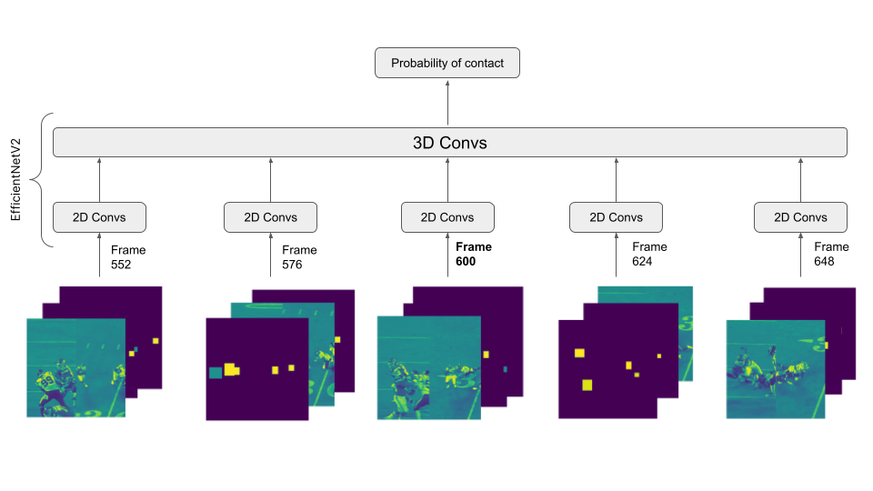

# NFL Player Contact Detection 轻量深读（Tier B）

> 赛事：Featured ｜ 主题 cv（tracking/视频事件检测）｜ 939 队 ｜ 代码赛 ｜ 指标：Matthews Correlation Coefficient（MCC）
> 材料基础：`digests/nfl-player-contact-detection.md`（6 篇正文：2nd Hydrogen 391740 / 6th TK 391620 / 1st 391635 / 14th 391609 / 往届索引 370685 / 4th K_mat 391719；80 条主题索引）+ 8 张图
> 轻读时间：2026-10（Tier B B02）

## 1. 一句话重述与数字账

从端区+边线视频与追踪数据判断"球员-球员（PP）/球员-地面（PG）接触"（MCC）。真正考的是**视频时序表示 + 追踪特征编码进 CNN + 邻域时序后处理**；测试只有 61 个 play，验证要按 game_key 分组。

| 关键数字 | 值 | 来源 |
| --- | --- | --- |
| 1st | 三段式：弱 XGB 去易负样本（CV≈0.72）→ **resnet50-irCSN**（mmaction2 动作识别）→ XGB 后处理；PP 用 endzone+sideline+**追踪画成图像**（18 帧上限），PG 不用追踪（23 帧）；头盔头圈标记（保持 3 通道）；1 epoch 训练+4 seed 全量；后处理用邻域概率：PP ±10 → **+0.005 CV**，PG ±15（含 pre-xgb/cnn 概率）→ **+0.04 CV** | 1st |
| 2nd Hydrogen | 61 个测试 play → 按 game_key 的 StratifiedGroupKFold；blend CV 0.807 / 公 0.796 / 私 **0.796**；24 帧×双方向；端区+边线**横向拼接早融合**；**5 通道追踪编码**（灰度 ROI/框 mask/距离×128/同队标志/移动距离，uint8）；6 模型×3 seed；mixup；±3 帧抖动 + TTA；追踪 10→60Hz 线性插值 + 头盔框插值；stage2 LGBM（stage1 概率+距离/lag+step_pct+归一化坐标）+ 50:50 平滑原始预测 | 2nd |
| 6th / 14th / 4th | 6th TK&penguin46、14th、4th K_mat 的 CNN 可视化（391719） | 材料 |

## 2. 逐方案对照矩阵

| 维度 | 1st | 2nd Hydrogen |
| --- | --- | --- |
| 结构 | 预处理 XGB → CNN → 后处理 XGB | 单段 CNN（追踪通道编码）→ stage2 LGBM |
| 输入 | PP：视频+追踪图；PG：仅视频 | 视频+5 追踪通道（早融合） |
| 时序 | PP 18 帧 / PG 23 帧采样 | 24 帧×2 方向；±3 帧抖动 |
| 骨干 | resnet50-irCSN（动作识别） | EfficientNetV2-s/b3（2D+3D） |
| 后处理 | 邻域概率 → XGB | stage2 LGBM + 50:50 平滑 |
| 验证 | — | game_key 分组 CV；CV 0.807 与 LB 0.796 接近 |

## 3. 共识、分歧与裁决

### 共识一：把追踪数据编码进 CNN 是核心（1st/2nd）

1st 把追踪画成"鸟瞰圆点图"当第三个视角；2nd 用 5 通道 uint8 编码（距离、同队、移动距离等），并指出"CNN 自己能学到的距离有限，所以直接给"。**裁决**：结构化先验（距离/队别）直接编码进视觉网络，比让 CNN 硬学更省样本。置信度：高。

### 共识二：PP 与 PG 分开建模，且输入需求不同（1st 明证）

PG 加追踪无增益；PG 因此能用更长时序（23 vs 18 帧）。**裁决**：两类接触的物理先验不同，分开建模并分别做超参/后处理。置信度：中高。

### 共识三：邻域时序后处理稳定加分（1st + 2nd）

1st 用前后 10/15 步概率喂 XGB（+0.005/+0.04）；2nd 用 stage2 LGBM + 平滑。**裁决**：接触是时序稠密事件，单帧判断必被邻域平滑修正。置信度：高。

### 共识四：小测试集 → 分组验证至关重要（2nd）

61 个 play、按 game_key 分组；CV 0.807 与 LB 0.796 仅差 ~0.01。**裁决**：体育视频事件赛要用"比赛级"分组 CV，否则同场泄漏。置信度：高。

### 分歧一：单段 vs 两段

2nd 明确"编码追踪后主要依赖单段，减少在 OOF CNN 预测上做 2 阶段的过拟合"；1st 仍是"XGB→CNN→XGB"三段。**裁决**：单段更简洁、泛化好；两段在易负样本多时省算力。融合两种思路可兼得。置信度：中高。

### 分歧二：追踪插值/头盔框补全

2nd 用线性插值把追踪 10→60Hz 并补头盔框（承认引入噪声但整体有益）；1st 未提。**裁决**：时间对齐误差大于插值噪声时，插值净收益；需以分组 CV 验证。置信度：中。

## 4. 证据分级

| 断言 | 等级 | 说明 |
| --- | --- | --- |
| 2nd 的 CV/LB（0.807/0.796）与消融表 | 自述 + 图 | 中高 |
| 1st 的后处理增益（+0.005/+0.04） | 自述 | 中 |
| PP/PG 输入差异 | 1st/2nd 一致 | 高 |
| 61 个测试 play | 2nd 明示 | 高 |
| 追踪编码有效性 | 两队独立 | 高 |

## 5. 悬案与缺口（登记）

- 3rd/5th 方案未收录；MCC 阈值优化与类别不平衡处理细节缺失。
- 1st 的预处理 XGB 只给 CV≈0.72，未展开；PG 后处理 +0.04 的来源需更多验证。
- 往届 NFL 索引（370685）与 4th 的可视化（391719）未细读。

## 6. 图表证据

**图 1**（topic 391740）：5 个时间帧（552/576/600/624/648）× 多通道（灰度 ROI/mask/距离/同队/移动）→ 每帧 EffNetV2 2D Conv → 3D Conv 融合 → 接触概率。**"视频+追踪通道早融合"的完整骨架**。

## 7. 出处

- 2nd Team Hydrogen（391740）：https://www.kaggle.com/competitions/nfl-player-contact-detection/discussion/391740
- 6th TK&penguin46（391620）：https://www.kaggle.com/competitions/nfl-player-contact-detection/discussion/391620
- 1st（391635）：https://www.kaggle.com/competitions/nfl-player-contact-detection/discussion/391635
- 14th（391609）：https://www.kaggle.com/competitions/nfl-player-contact-detection/discussion/391609
- 往届索引（370685）：https://www.kaggle.com/competitions/nfl-player-contact-detection/discussion/370685
- 4th K_mat 可视化（391719）：https://www.kaggle.com/competitions/nfl-player-contact-detection/discussion/391719
