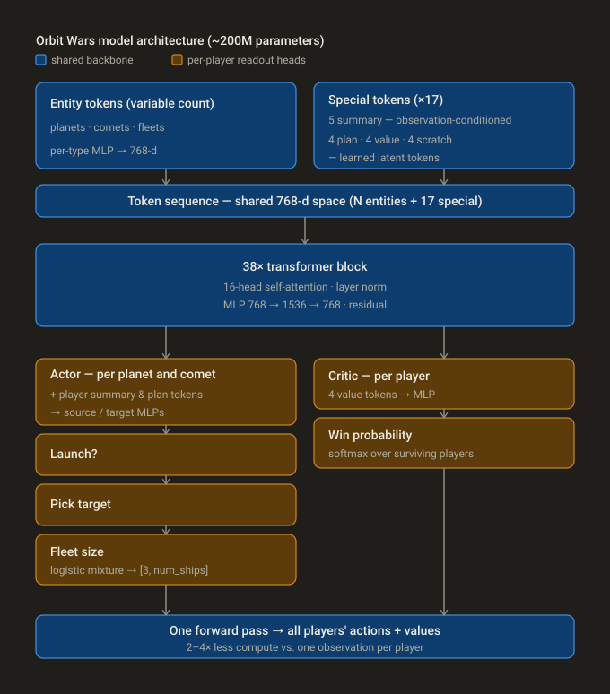
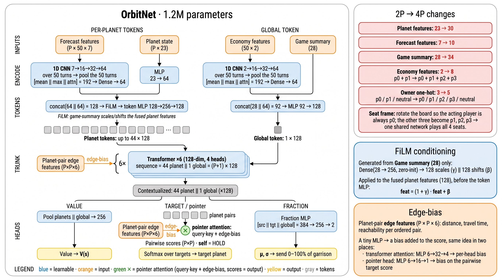
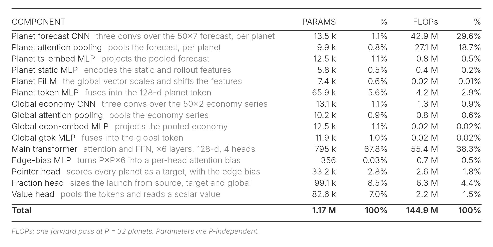
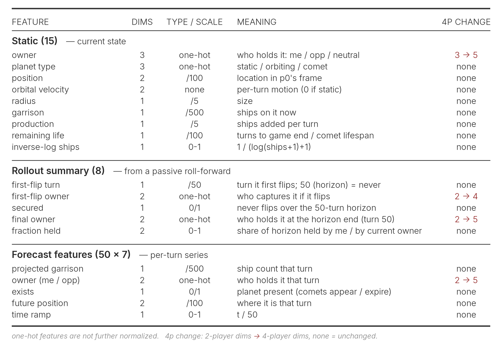
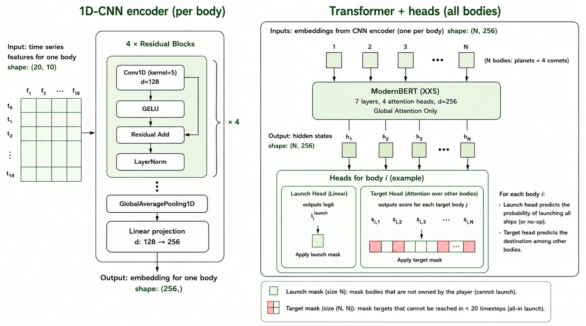
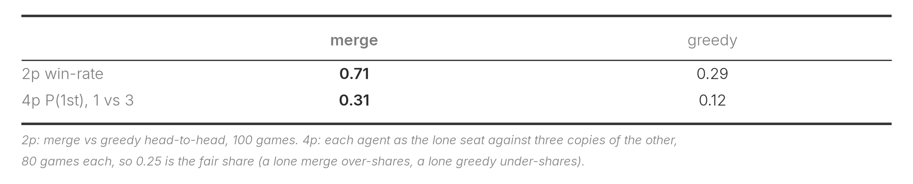
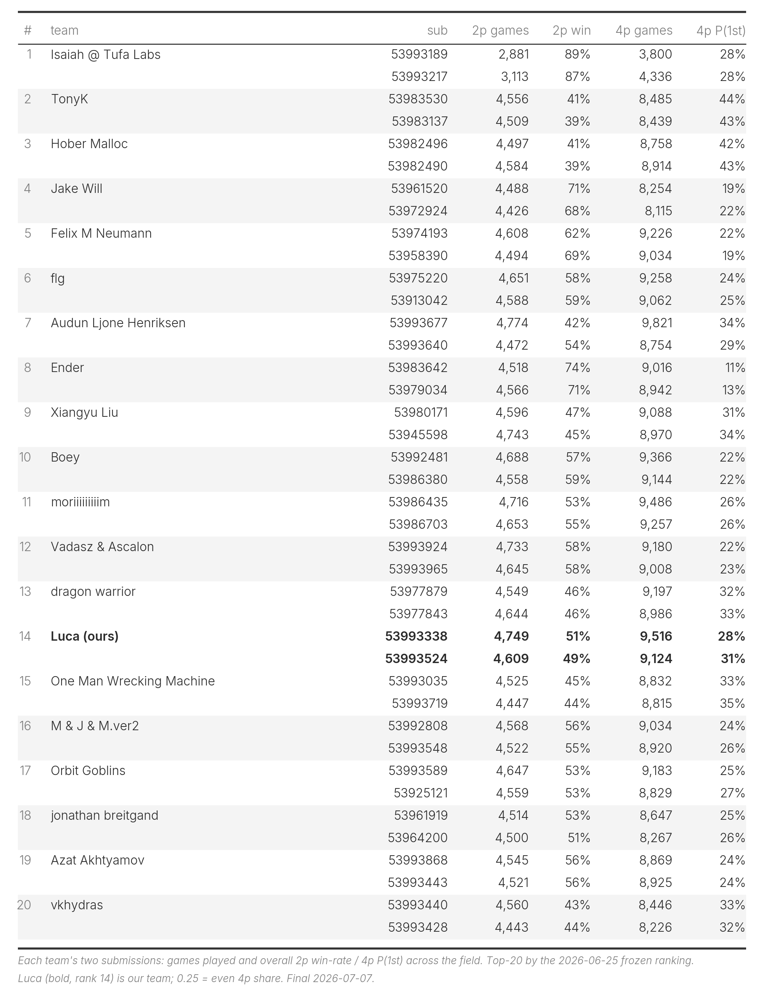
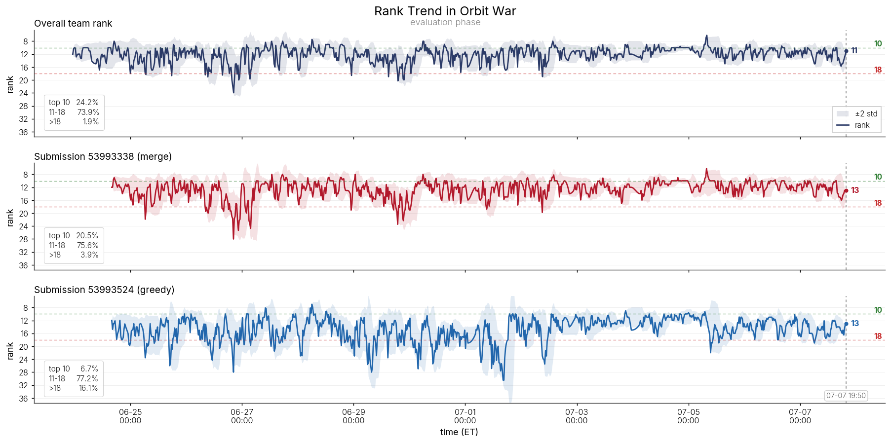
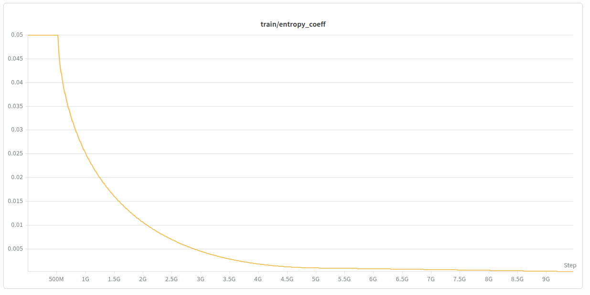
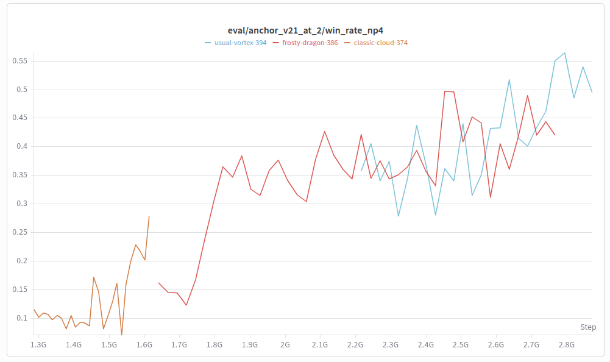

# Orbit Wars 深读：硬推理预算下的自对弈军备竞赛

> 赛事：Featured ｜ 主题 sim-agent ｜ 4729 队 ｜ 提交 agent + 持续配对评分（2026-07-07 截止）
> 材料基础：`digests/orbit-wars.md`（10 篇正文 = **8 篇独立**，含 2 对同作者重发）+ 23 张图片资产（含 1 张 8.6MB GIF 未内嵌）
> 深读时间：2026-10（Tier A #9）

## 0. 一句话重述：这道题真正在考什么

表面题面是"写一个 RTS 游戏 agent"，实际被考的是**一条把算力转化为策略强度的工程链**，可降解为 6 步：

1. **仿真吞吐**：把官方 Python 环境重写为 JAX / C++ / Rust（各家都做，且与官方逐帧 parity 校验）——不重写就做不了 RL；
2. **表示设计**：在"1s/回合 + 60s 透支、提交文件 ≤100MiB"两个硬交付约束下，把星图折叠为有界 token 序列（≤44 个行星/彗星槽位；无界的舰队要么限流、要么折叠进行星的未来态）；
3. **动作设计**：把"打谁 + 出多少船 + 什么角度"降解为"意图"（目标 + 语义动作档），精确数量/角度由引擎确定性解出；
4. **自对弈 + 多样性**：PPO 自对弈是基底；4 人局必须加联赛/PFSP 防退化，2 人局也要防策略循环；
5. **选择与增益**：在噪声极大的持续配对评分里，用本地全对全竞技场（all-pairs）选出提交点，并叠加推理期搜索/双模型融合；
6. **交付工程**：量化（int8/NF4）、模型降级 fallback（5M 小模型兜底）、时间预算调度（用 60s 透支银行分级降深度）。

一句话：**这是"工程吞吐 × 表示先验 × 模型容量"三者的置换游戏**——冠军用 2400 B200-hours 买"让模型自己学"的自由度；13th 用 ~200 B200-hours（$630）买"人设计表示"，两者都走到领奖台边缘。

## 1. 材料与角色

| # | 帖子 | 作者 | 票数 | 角色与独有信息 |
| --- | --- | --- | --- | --- |
| 1 | [724268](https://www.kaggle.com/competitions/orbit-wars/discussion/724268)（1st）｜早期版 [714324](https://www.kaggle.com/competitions/orbit-wars/discussion/714324)（150 票） | IsaiahP | 90｜150 | **冠军路线**：200M transformer、15B steps、2400 B200h、纯 agentic 开发；量化+fallback 的交付工程最全 |
| 2 | [723728](https://www.kaggle.com/competitions/orbit-wars/discussion/723728)（2nd）｜早期版 [713276](https://www.kaggle.com/competitions/orbit-wars/discussion/713276)（98 票） | simjeg | 90｜98 | **极简动作空间的胜利**：4.3M、all-in-only、10B steps from scratch、8×H100 40K SPS |
| 3 | [723820](https://www.kaggle.com/competitions/orbit-wars/discussion/723820)（3rd） | Felix M Neumann | 31 | **可达性张量 + 语义动作**：6.2M、JAX 环境、熵调度、PFSP 的工程细节最细 |
| 4 | [723731](https://www.kaggle.com/competitions/orbit-wars/discussion/723731)（13th） | Luca | 38 | **小算力范式**：1.2M OrbitNet、被动 rollout 表示、$630/200 B200h；评测期全场对照表（独有数据） |
| 5 | [723325](https://www.kaggle.com/competitions/orbit-wars/discussion/723325)（Jake Will） | Jake Will | 38 | **辅助损失组合拳**：no-op KL 锚、launch-success BCE、投降机制砍 60–70% 回合、4p PFSP 量化权重 |
| 6 | [713519](https://www.kaggle.com/competitions/orbit-wars/discussion/713519)（FLG） | flg | 38 | **推理期搜索的边界**：2p +30–40 分、4p 搜索反而变弱；相对坐标消融；SWA |
| 7 | [713126](https://www.kaggle.com/competitions/orbit-wars/discussion/713126) | Nebraskinator | 40 | **Evoformer 迁移**：节点/边双流、边打分全发送、联合动作概率；SBR 搜索尝试失败 |
| 8 | [697725](https://www.kaggle.com/competitions/orbit-wars/discussion/697725)（RL lessons，126 票） | Lin Myat Ko | 126 | **过程学**：600K 参数/$250 预算；"reward shaping signs of life"；附件含 Opus 的 RL 训练排障清单 |

**两对重复帖的版本学**（对引用纪律有意义）：
- 714324（06-26，150 票）→ 724268（07-10，90 票，标题加 "1st Place"）——IsaiahP 同文重发；
- 713276（06-24，98 票，"N < 10th 🤞"）→ 723728（07-08，90 票，"2nd Place"）——simjeg 同文重发，且**正文互相覆盖了对方的早期版本**（723728 比 713276 多出 IL 表格的 Finetuned 列与 RL 配置脚注）。

**已知材料缺口（未扩采，登记备查）**：主题索引还有约 20 条 write-up 标记帖未收录，含 [8th "Ender <$200"（723739，30 票）](https://www.kaggle.com/competitions/orbit-wars/discussion/723739)、[7th（728348）](https://www.kaggle.com/competitions/orbit-wars/discussion/728348)、[5th（727619）](https://www.kaggle.com/competitions/orbit-wars/discussion/727619)、[9th（727595）](https://www.kaggle.com/competitions/orbit-wars/discussion/727595)、[10th（727854）](https://www.kaggle.com/competitions/orbit-wars/discussion/727854)、[11th（727715）](https://www.kaggle.com/competitions/orbit-wars/discussion/727715)、[One Man Wrecking Machine（714276）](https://www.kaggle.com/competitions/orbit-wars/discussion/714276)、[GPU Poor Top 2%（714226）](https://www.kaggle.com/competitions/orbit-wars/discussion/714226) 等。其中 8th 的 Ender 帖被 13th 与 simjeg 正文点名引用（Billy 的 24 回合 horizon、造价 <$200），本深读只能通过二手引用使用。社区机制帖（[旋转对称 694310](https://www.kaggle.com/competitions/orbit-wars/discussion/694310)、[OOB bug 694605](https://www.kaggle.com/competitions/orbit-wars/discussion/694605)、[排名收敛质疑 CPMP/Ascalon](https://www.kaggle.com/competitions/orbit-wars/discussion/723920)）同样仅索引级掌握。

## 2. 逐方案对照矩阵

| 维度 | 1st IsaiahP | 2nd simjeg | 3rd Felix | Jake Will | FLG | Nebraskinator | 13th Luca |
| --- | --- | --- | --- | --- | --- | --- | --- |
| 参数 / 主干 | **200M**，38 层 16 头 d768 | 4.3M（CNN 290K+BERT 3.9M+头 130K） | 6.2M，8 层 d192 | 7.5M，8 层 | 2.5M，4 层 d256 | 144d/160 对偶流 5 层 | **1.2M**，6 层 4 头 d128 |
| 观测表示 | 原始实体（行星/彗星/**舰队**）+5 摘要 token，最低加工 | 10 特征 × T=19 被动时间序列 | 嵌入 garrison + arrival calendar + reachability | 自状态+combat preview+top-K 舰队摘要+成对几何 | 23 个到达桶（13 回合），相对坐标 | 节点/边；舰队折叠为"目的地未来事件" | 静态 23 + 50×7 预测序列；**舰队折叠进行星未来** |
| 舰队是否一等 token | 是（+限流 128/玩家） | 否（时间序列承载） | 否（到达日历） | 否（摘要） | 否（到达桶） | 否（时间线） | 否（被动 rollout） |
| 动作空间 | 目标 + **连续**船数（logistic 混合 8 分量） | **only no-op / all-in**（ETA<20） | 目标 × **4 语义动作**（全发/出击/守成/恰好拿下） | 目标 × 3 档（100%/拿下后守住/保住本星）+no-op | NxN × 4 比例档（实际只用 100%） | 边打分全发送（每源 softmax 含自边） | 指针目标 + 连续比例（截断高斯，后改 μ-only 更好） |
| 抗退化机制 | 无联赛（后悔）；>70% 胜率更新 best | 4p 曾用冻结池（决赛弃用） | **PFSP**（对手固定 2 个 update） | 2p 最近 3 ckpt；**4p PFSP 组合权重** | 4p 手工联赛 | 未见 | **PFSP 联赛**（70% 准入/池≤30） |
| 奖励/辅助损失 | ±1；KL+CE vs best | ±1，500 步封顶降为 0.5 | 终端 ±1（4p −1/3 零和） | 4p +1/0/−0.5/−1；**launch BCE + no-op KL 锚** | 终端 outcome；高斯直方图价值 | 终端；分布价值（two-hot/symlog） | ±1；4p 先手率做准入 |
| 推理期增益 | int8 + 5M fallback；单次前向出全员动作 | 4/8 视角 TTA；阈值 53%/56% | 直接 argmax（4p T=0.1） | 单次前向（无自回归） | **2 步 rollout 搜索 2p +30–40 分** | SBR 搜索放弃 | **双 ckpt merge**（价值头裁判，2–3 步） |
| 训练算力 | **2400 B200h**；6.3M step/GPU·h | 8×H100×3 天；40K SPS | 2×RTX6000；19K/15K SPS | 8×5090（CPU 瓶颈）；15–20K SPS | 3090→1×A100；800–2000 SPS | 未述 | 2×B200×198h；36K/28K SPS；**$630** |
| 训练步数 | 15B | 10B（3 阶段 3+3.5+3.5B） | 8.4B（2p）+2.7B（4p） | 4B（2p）+2B（4p） | 未述 | 未述 | 13B+9.8B samples |

> 8 个位次区间里，13th（1.2M/$630）与 1st（200M/2400 B200h）分列效率前沿两端——参数差 167×、算力差约 12×，最终只差 12 个名次。

## 3. 共识、分歧与裁决

### 结论一：环境重写是入场券（近乎全覆盖）

1st Rust（parity 对照 replay）、2nd Rust+C+JAX（还从 Torch 移植到 CUDA 配合 PufferLib）、3rd JAX、13th JAX×2+numpy 四引擎 lockstep、FLG C++/pybind、lightmk JAX——**没有一家用官方 Python 环境做训练**。2nd 用 8×H100 跑到 40K SPS；13th 单 B200 36K SPS；3rd 双卡 19K SPS。

**裁决**：sim-agent 比赛的第一笔投资永远是把环境吞吐抬到 ≥1万 SPS 量级；否则后续一切实验都做不动。（依据：全员做法一致性；置信度高）

### 结论二：舰队不做一等 token，"折叠进行星的未来态"是主流最优解

13th 论证最完整：舰队只影响**发射瞬间的源行星**与**到达时刻的目标行星**，因此"被动前滚"（双方不再发射）投影出的 garrison/owner 时间线已经无损携带全部在飞舰队信息。simjeg 的 T=19 时间序列、FLG 的 23 个到达桶、Nebraskinator"舰队=未来事件"、Jake 的 combat preview 全是同一机制的变体。horizon 选择：13th=50 回合、FLG=13 回合/23 桶、simjeg=20、Billy=24、Simon=20（13th 引用）。

**对比反例**：1st 保留舰队为实体 token 并用"训练期限流 128/玩家"控制有界性——在 200M/15B 规模下模型自行学会了动力学。

**裁决**：中小算力（≤10M 参数量级）必须用折叠表示，且它可能**同时**是更强的归纳偏置：13th 用 1.2M 达到 rank 13，而 1st 需要 167× 参数来"自己学物理"。（依据：5 家做法 + 两端的成绩对照；置信度高）

### 结论三：动作空间——"语义意图"加速学习，"分辨率"本身几乎不贡献

- 3rd：从固定比例档（25/50/75/100%）改为四种语义动作（全发/出击/守成/恰好拿下），"**学习速度大量提升**（以打穿参考 agent 所需步数计）"；
- Jake：三档（100%/拿下后长期守住/保住本星）与 3rd 同构；
- simjeg：把动作砍到 **no-op / all-in 两档**，决赛第 2；
- FLG：花了大量工程做多比例档，结论"**firing less than 100% 完全没有增益**"；
- 1st：连续比例 + 8 分量混合；13th 承认 σ 几乎不收缩（均值 ~0.88），"predicting μ only 可能更干净"。

**裁决**：让**引擎确定性解算**"要多少船/什么角度"（意图→数值），把策略问题留给"打哪、为什么"，这是稳定加速 RL 的免费午餐；把它退化成"输出精确数值"才是税。多比例档在 2p 近似 all-in 主导时无用（FLG）；语义档在需要防守数学时有用（3rd/Jake）。（依据：3 个正面 + 2 个负面 + 1 个冠军反例按算力分层；置信度中高）

### 结论四：推理期搜索——2p 有效、4p 存疑、深度受时间预算约束

- 13th：双 ckpt merge（不一致的动作各前滚 2–3 回合，价值头当裁判）——2p 100 局 **0.71 vs 0.29**；4p 80 局对 3 个克隆 **0.31 vs 0.12**（公平份额 0.25）；
- FLG：2p 2 步贪心 rollout **+30–40 分**；CFR 近似也可但噪声大；4p 搜索"本地大涨、LB 变弱"；
- Nebraskinator：SBR 搜索在训练里"把全部墙钟烧在搜索展开"，放弃。

**裁决**：搜索增益的必要条件是"对手走子可被准确预测 + 局面可精确前滚"；2p 零和结构满足，4p 的联合动作空间与对手建模精度都不满足。**且搜索的可行性由时间预算显式约束**：13th 按 60s 透支银行分级（>20s 深度 3 / >10s 深度 2 / 其余贪心）。（依据：三家的正反结果；置信度中高）

### 结论五：IL vs 从零自对弈——IL 是脚手架，不是天花板

- simjeg：IL 先进前 10，RL 微调进前 5，**赛前 5 天从零训练反超 IL 初始化的模型**；
- 13th：2p 提交用随机初始化；warm start 前期领先，**10k–20k update 窗口被反超**，最终随机版登顶本地榜（类比 AlphaGo Zero 放弃 warm start）；
- FLG：小模型（2 层 d128）稠密奖励预训练 → 大模型 KL 蒸馏"大幅加速"，属于"课程化提速"而非 IL 初始化天花板。

**裁决**：IL 的价值在**架构/特征筛选迭代快**（13th 明说用它做 feature selection）与冷启动；最终上限以自对弈为准。若计算受限，小模型稠密奖励→大模型蒸馏是比"IL 初始化大模型"更划算的课程。（依据：2 个直接对照 + 1 个课程化变体；置信度中高）

## 4. 增量数字账

**效率前沿（本场最重要的对照数字）**

| 方案 | 参数 | 训练量 | 硬件成本 | 名次 |
| --- | --- | --- | --- | --- |
| IsaiahP | 200M | 15B steps | **2400 B200-hours**（约 6.3M steps/GPU·h） | 1 |
| simjeg | 4.3M | 10B steps | 8×H100×3 天（~40K SPS） | 2 |
| Felix | 6.2M | 11.1B steps（8.4+2.7） | 2×RTX6000（19K/15K SPS） | 3 |
| Luca | **1.2M** | ~22.8B samples（13+9.8B） | **2×B200×198h ≈ $630** | 13 |

**单点增量归属**

| 动作 | 数字 | 来源 |
| --- | --- | --- |
| merge 融合（2p） | 0.71 vs 0.29（100 局，对 greedy 自己） | 13th 图表 |
| merge 融合（4p） | P(1st) 0.31 vs 0.12（各 80 局；公平 0.25） | 13th 图表 |
| 4-bit NF4 量化代价 | 量化版对原版头对头 **~40% 胜率**（即约 −10pp） | 1st 自述 |
| int8 + 5M fallback 覆盖率 | 约 8% 的 4p 局触发降级；"100% 转化胜势" | 1st 自述（无分母） |
| 熵系数调度（3rd） | 0.05 → ~0.0005（约 3B 步后躺平） | 3rd 图表 |
| 4p bug 修复跳变 | ~1.8B 步处胜率阶跃（0.3→0.5 区间的陡升） | 3rd 图表自述 |
| 投降机制省算力 | 砍掉 **60–70% 回合**（2p only） | Jake 自述 |
| 早停省算力 | 170 回合省 ~30 回合（~18%） | FLG 自述 |
| no-op 锚 | 目标 10% 平均发射率；KL 系数 0.5→0.1（500M 步） | Jake 配置 |
| IL 上限（2nd 的测试集） | Launch AP 81.73→83.80；Target acc@1 79.86→82.12（finetune+TTA） | 2nd 表格 |
| TTA 视角数 | 2p 4 视角 / 3–4p 8 视角；阈值 53%/56% | 2nd |

**可复算校验（3 处独立算术全部吻合）**

1. 1st：2400 B200h × 6.3M steps/GPU·h = **15.12B ≈ 15B steps** ✓；
2. 13th：100h×36K SPS = 12.96B ≈ "13B samples"；98h×28K = 9.8B ✓；
3. 2nd：1 epoch = horizon 128 × 1024 agents × 8 GPUs = **1.049M ≈ "~1M steps"** ✓。

**量化预算算术（本深读新增推演）**：200M 参数 @4-bit = 95.4 MiB；加上 group=128 的 fp16 scale（每 128 权重 2 字节）= +3.1 MiB → **98.5 MiB ≤ 100 MiB**。这解释了为何"group 128 + fp16 scale"是唯一刚好过线的组合：fp32 scale 会 +6.2 MiB 超限，3-bit 虽能塞下更多参数但精度损失反超收益（1st 试过并回退）。

## 5. 机制推演

**M1｜被动 rollout 为什么无损**：舰队在时间窗内是可枚举事件——它对世界的影响仅有"发射时扣源行星 garrison"与"到达时结算目标行星（可能还有源方在途中被拦截？没有：拦截只发生在航行途中与其它舰队/行星碰撞，本作舰队不与舰队交战）"。因此对每个行星做"不再发射"的前滚，就能把全部在飞舰队折算成未来 garrison/owner 曲线；token 数上界=行星+彗星槽位（44）。13th 量化了最坏情况：100·√2 对角线 @ 最小速度 1 格/回合 ≈ 140 回合；实际 99% 舰队 20–30 回合内到达——这解释了各家 horizon 选 13/20/23/50 都够用。

**M2｜为什么"语义动作"能加速**：策略要学的不是"356.7 艘船"这种连续算术（网络不擅长、梯度稀疏），而是"打一个我刚够得着但守不住的目标是否值得"这种**战略判断**。把"够不够、守不守得住"交给确定性物理计算（reachability tensor / 前向预测），等价于把动作空间的"数值维度"从策略里删掉，只留"意图维度"——这正是 3rd 的 4 动作、Jake 的 3 档、simjeg 的 all-in 的共同内核。

**M3｜熵是分类动作空间的"含氧量"**：3rd 的 4p 首跑（lr 3e-4、ent 0.05）在几百个 update 后"行星完全停止发射"；降到 ent 0.02 修复。13th 用 0.02（4p）/0.01（2p）。机制：类别分布熵过高时小幅子策略（发射）的优势被均值稀释，策略漂移到 no-op；过低则锁定早期策略。lightmk 附件给出**前兆信号**：clip_frac 从 0.10 单调爬向 0.30+ 先于 entropy 崩溃/KL 尖峰。

**M4｜联赛的数值设计是本场少见的"可抄配方"**（13th）：每 200 update 存 checkpoint（<1000 update 不参池）；准入=EMA 胜率 ≥70%（≥1024 局）或到 5000 update；采样 ∝(1−winrate)，2% 下限；池≤30，淘汰最旧。4p 无头对头胜率，改用 P(1st) ≥0.35（512 局）。Jake 的 4p 变体：先打 200 组合×50 局找 <25% 胜率的对手组合，按 (25%/wr) 平方加权再训——300M 步内"显著提升且未饱和"。

**M5｜多玩家价值头需要技巧**：4p 不是零和（+1/0/−0.5/−1 有中位），1st 用"对存活玩家 softmax 的胜率"避免 γ 折扣破坏定义（代价是 γ=1.0 → 拖局）；Jake 加三个对手价值头做辅助；FLG 用 51 bin 高斯直方图；13th 把价值头当搜索裁判（EV>0.95 才敢信）。共识：**4p 的价值学习比 2p 难一档**，需要分布性或辅助结构。

**M6｜"已决局"是终端奖励 RL 的最大算力黑洞**：1st 因 γ=1.0 学会拖局（无时间偏好），训练算力大量烧在已胜/已败局；Jake 的价值头投降机制砍 60–70% 回合；FLG 早期终止（95% 船只+全行星）省 ~18% 回合。三者对照说明：这是**训练效率的免费杠杆**，但实现有风险（13th 的 resign 试验导致"稳赢局崩溃"，最终弃用）。

## 6. 证据分级

| 断言 | 等级 | 说明 |
| --- | --- | --- |
| 三处算力/步数算术吻合 | **可复算** | 2400h×6.3M、100h×36K、128×1024×8 |
| NF4 尺寸 98.5 MiB ≤ 100 MiB | **可复算** | 4-bit+group128 fp16 scale 算术 |
| merge vs greedy：0.71/0.29、0.31/0.12 | **可读取（帖内表）** | 100/80 局，样本量小但数字完整 |
| 评测期全场对照表（2p/4p 胜率） | **可读取（帖内表）** | 约 4–9K 局/提交，样本量大；快照时点局限 |
| 熵调度 0.05→0.0005 | **可读取（图）** | 曲线清晰；无对照实验 |
| "语义动作大幅加速学习" | **自述（强）** | 3rd 无对照数字；由 simjeg/FLG 的负面结果间接支持 |
| "PFSP 极其有效" | **自述（中）** | Jake 300M 步窗口，无 A/B |
| "投降砍 60–70% 回合" | **自述（中）** | 与 FLG 的 18% 差异大（机制阈值不同，可并存） |
| "5M fallback 100% 转化胜势" | **自述（弱）** | 无分母/局数 |
| "8% 的 4p 局超时触发降级" | **自述（弱）** | 无分布细节 |
| 排名不收敛（6th–28th 摆动） | **可读取（图）+ 社区共识** | top10 时间占比 24.2%；CPMP/Ascalon 两帖同结论 |

## 7. 边界条件与反事实

- **评测分布非平稳**：1st 依据"比赛中强手 2p 局占多数"把训练后段调到 90% 2p 且弃联赛；**截止后 4p 配对比例反转**——同一 agent 的 4p 能力被大量消耗。反事实：保持 1:1 + 加联赛，4p 弱项（其表格 P(1st)=28%）可能被显著改善；但 2p 统治力（87–89%）是否受影响未知。
- **硬交付约束塑造算法**：1s/回合+60s 透支 → 200M 是上限（int8 后仍超 8% 慢机；需 5M fallback）；100MiB → 4-bit 量化；若换更宽松的时限/文件限制，冠军的架构选择会变。
- **4p 的排序比 2p 更不收敛**：13th 的 4p 本地评测用"1v3 克隆"被人诟病（3rd 也承认）；3rd 的 4p 在 1.8B 步才修掉致命 bug，4p 榜单对训练末段极敏感。反事实：若 4p 采用多样对手池评测，名次带宽可能更窄。
- **本地竞技场 ↔ LB 相关性有限**：merge 在本地 2p 强（0.71）但评测期提交的 merge 2p 胜率 51% vs greedy 49%，4p 反而 greedy 更高（28% vs 31%）；最终同分同位。反事实：纯按本地榜选提交会把 merge 排最前——本地 all-pairs 与平台持续配对的分布不同（对手池、配对权重、时间漂移）。
- **小参数的反例**：13th 的 4M 模型"明显差于 1.2M"——在这个动作空间/特征下，容量超出表示瓶颈无益；与 1st"每放大一档都大涨"的结论并不矛盾：1st 的表示更低加工（容量成为瓶颈），13th 的表示已被精心工程化（容量过剩）。

## 8. 悬案与失败学

**悬案**

1. **排名从不收敛**：评测期 rank 在 6–28 间摆动（top10 时间占比 24.2%，11–18 占 73.9%），"最后几十局决定名次"；社区提出对齐/收敛方案（CPMP、Ascalon），官方未采纳。
2. **merge 的真实增益在 LB 上无法裁决**：2p/4p 结论相反（merge 2p 更稳、greedy 4p 更高），最终同分同位——需要多日重复评测才能测量。
3. **半成品写未收录**：5th–11th 方案与 8th 的 <$200 路线（被两家引用）未进入本仓，效率前沿左端（低成本路线）的图像不完整。

**失败学（什么没奏效——本场负面清单）**

| 失败 | 来源 | 教训 |
| --- | --- | --- |
| γ=1.0 拖局，训练算力烧在已决局 | 1st | 终端奖励 RL 必须处理"已决局"，要么折扣要么早停 |
| 动作遮挡（防射日）反而变差 | 1st | 让模型被迫内部建模物理，可能优于人工硬约束（但其最后又加回做微调+推理） |
| resign 机制引发稳赢局崩溃 | 13th | 训练期终止条件会改变策略对"残局价值"的学习 |
| 4M 模型差于 1.2M | 13th | 表示已成瓶颈时，加参数无益 |
| 4p 首跑 ent 0.05/lr 3e-4 彻底停止发射 | 3rd | 类别动作空间熵预算是第一旋钮 |
| 多比例档训练工程 → 完全无增益 | FLG | 动作分辨率≠动作质量 |
| 4p 搜索本地涨、LB 跌 | FLG | 对手模型不准时搜索是自嗨 |
| SBR 搜索吞掉全部墙钟 | Nebraskinator | 搜索×训练步数的乘性成本通常不可负担 |
| 40 步 no-op 截断 rollout（后来怀疑是坏主意） | simjeg | 截断策略会丢掉"蓄力"这类真实行为 |
| 训练/评测同 1,024 张图 → 评估虚高 | 13th | 评测地图必须与训练不重叠 |
| 两天上 7 个架构改动 → 无法归因崩坏 | lightmk/Opus | RL 里 "7 wins vs 1 baseline" 的算术不成立，一次一个 delta |
| 100% 可复现的 JAX 编译超时风险（4p） | 3rd | 每回合时限内不能把 JIT 编译开销算进去；关键 kernel 建议 Rust/C++ |

## 9. 图表证据

> 路径均相对本文件（`analysis/deep/`）：`../../intel/orbit-wars/bodies/<topic>_img/NN.ext`。
> 未内嵌：`723731_img/01.gif`（8.6MB 对局回放，仓库内可查）；两篇帖子的封面插画（723728/713276 `01.png`，装饰性）。

**图 1：冠军的 200M 架构（Shape 信息为正文所无）**（1st，topic 724268）——`../../intel/orbit-wars/bodies/724268_img/01.svg`

*读图结论*：768-d 共享空间；实体 token（行星/彗星/舰队，变长）+ **17 个特殊 token = 5 摘要 + 4 plan + 4 value + 4 scratch**；38× 16 头残差块，MLP 768→1536→768；每玩家 source/target MLP → "Launch? / Pick target / Fleet size（logistic mixture → [3, num_ships]）"；Critic 用 4 个 value token 过 softmax 出胜率。**单次前向出全员动作**（下方角注：2–4× 省算力）——这正是 13th 承认自己落后之处（后者按座位跑网络 2/4 遍）。

**图 2：13th 的 OrbitNet 全图**（13th，topic 723731）——`../../intel/orbit-wars/bodies/723731_img/05.jpg`

*读图结论*（正文只有文字，数字来自图）：CNN 7→16→32→64 × 50 回合 + [mean‖max‖attn] 池化；静态 23 维经 MLP；concat 64‖64=128 → FiLM（**feat=(1+γ)·feat+β**，γ/β 由 28 维 game summary 零初始化投影）→ token MLP 128→256→128；边特征 P×P×6 经 MLP **6→32→4** 变逐头注意力偏置、指针头再经 **6→16→1** 加成对目标分；fraction 头输入 [src‖tgt‖global]=384→256→2（μ,σ）；右栏列出 2p→4p 的全部维度变化（planet 23→30、forecast 7→10、summary 28→34、economy 2→8、owner 3→5）与"座位归一化=一套权重打 4 个座位"。

**图 3：参数/FLOPs 分解——"CNN 吃掉一半算力"的量化**（13th）——`../../intel/orbit-wars/bodies/723731_img/06.png`

*读图结论*：总计 **1.17M 参数 / 144.9M FLOPs**（P=32 单次前向）；主干占参数 67.8%（0.795M）但 FLOPs 只有 38.3%，而 **forecast CNN 29.6% + 注意力池化 18.7% ≈ 48% FLOPs 花在 50 回合序列上**。这为"把 50 回合砍到 20–30、或弃 CNN 改 flatten"提供了定量依据——13th 自己承认 CNN 可能不值得。

**图 4：行星 token 特征表（静态 15 + rollout 8 + 预测 50×7）**（13th）——`../../intel/orbit-wars/bodies/723731_img/02.png`

*读图结论*：静态 15 维（owner 3、type 3、pos 2、vel 2、radius/garrison/production/life/ilog 各 1）+ rollout 摘要 8 维（first-flip turn/owner、secured、final owner、fraction held）+ 50 回合 ×7 维预测序列；右栏"4P CHANGE"给出 4p 增量：owner 3→5、first-flip owner 2→4、final owner 2→5。**"给网络 50 回合的未来曲线"是它 1.2M 参数能打的核心原因**。

**图 5：2nd 的极简架构（all-in only 的完整管线）**（2nd，topic 723728）——`../../intel/orbit-wars/bodies/723728_img/02.png`

*读图结论*：左=每体 (20,10) 时间序列过 4×残差块（Conv1D k=5 d=128→GELU→残差→LayerNorm）+ GAP + 128→256 投影；右=ModernBERT XXS（7 层 4 头 d256，仅全局注意力）→ 每体 launch head 与 target head（对其它体的注意力打分）；红绿掩码语义完整（launch mask=非己方行星不可发；target mask=20 回合内不可达）。**"20×10 特征 + 两档动作"进前 2，是本场对"表示 > 容量"最干净的反例**。

**图 6：merge vs greedy 的本地评测（13th 的核心数字）**（13th）——`../../intel/orbit-wars/bodies/723731_img/10.png`

*读图结论*：2p 头对头 100 局 merge **0.71** / greedy 0.29；4p 各 80 局孤独位打 3 克隆 merge **0.31** / greedy 0.12（公平份额 0.25——merge 超配、greedy 欠配）。**注意样本量小**：0.71 的 95% 置信区间约 ±0.09，只能支持"merge 在 2p 明确不差"，不能支持精确幅度。

**图 7：评测期全场对照表——2p 与 4p 能力分化**（13th）——`../../intel/orbit-wars/bodies/723731_img/12.png`

*读图结论*（正文未含的分队数字）：Isaiah 2p **89%/87%**（约 2.9–3.1K 局）但 4p 仅 28%；Jake Will 2p 71%/68% 而 4p 19%/22%；TonyK 2p 41%/39% 而 4p **44%/43%**；Luca 51%/49% + 28%/31%。"同一个 agent 的 2p/4p 强度可以完全脱钩"被量化——这是"单一总分 + 不均衡配对"争议的直接证据。

**图 8：排名漂移——评测不确定性可视化的范本**（13th）——`../../intel/orbit-wars/bodies/723731_img/13.png`

*读图结论*：三面板都在 6–28 名间摆动（±2σ 灰带）；top10 时间占比：团队整体 24.2%、merge 20.5%、**greedy 仅 6.7%**；>18 名时间占比：1.9%/3.9%/16.1%。merge 的稳定性优势主要体现在"不跌出前 18"。收尾竖线处（07-07 19:50）三者停在 11/13/13。

**图 9：3rd 的熵调度曲线（断言"最重要旋钮"的证据）**（3rd，topic 723820）——`../../intel/orbit-wars/bodies/723820_img/03.png`

*读图结论*：0.05 保持到 500M 步，随后指数式衰减：1.5B≈0.011、2B≈0.006、3B≈0.002、3.5B 后进入 ~0.0005 平台直至 9B。**"先高熵探索、后长尾锁死"**——与 13th 的 0.01/0.02 常数、Jake 的 0.002+no-op 锚是同一问题的三种解法。

**图 10：3rd 的 4p 胜率曲线（含 bug 修复跳变的原始证据）**（3rd）——`../../intel/orbit-wars/bodies/723820_img/05.png`

*读图结论*：1.3B–2.8B 步间 4p 胜率从 ~0.1 爬到 ~0.5；**1.8B 附近出现阶跃（两条不同实验线同步抬升）**，对应"比赛结束前 36 小时发现的致命 bug 修复"。它同时证明：4p 训练在截止时仍未收敛——4p 名次对训练末段的偶然事件高度敏感。

## 10. 对既有笔记/playbook 的修订点

1. `notes/sim-agent/orbit-wars.md` 升级：材料表补作者/票数/重复帖说明与未收录缺口；方案谱系从 8 行扩为 7 方案对照矩阵；补 13th（Luca）、Jake、FLG、Nebraskinator 的机制细节；新增"推理期搜索/融合""联赛数值配方""失败学"与图证节。
2. `playbook/sim-agent.md` 增补：
   - "**折叠表示**"（舰队→行星未来态；horizon 13–50 皆可，看物理上限）；
   - "**语义动作 > 数值动作**"（意图由策略定、数量由引擎算）；
   - "**熵预算与 clip_frac 前兆**"；
   - "**早期终止/投降 = 训练效率杠杆**（60–70% 回合可砍，但会引入策略崩溃风险）"；
   - "**联赛配方数值化**（准入胜率/池大小/PFSP 权重/4p 用 P(1st)）"；
   - "**交付工程三件套**（量化预算算术、fallback 小模型、时间预算分级搜索）"。
3. `playbook/00-通用方法论.md` 增补："持续配对评分 ≠ 静态测试集：分布非平稳、名次带宽极宽；本地竞技场只能用于粗筛，不能用于精确选提交"。

## 11. 出处

- 1st（IsaiahP）：https://www.kaggle.com/competitions/orbit-wars/discussion/724268 ｜早期版（150 票）：https://www.kaggle.com/competitions/orbit-wars/discussion/714324
- 2nd（simjeg）：https://www.kaggle.com/competitions/orbit-wars/discussion/723728 ｜早期版（98 票）：https://www.kaggle.com/competitions/orbit-wars/discussion/713276
- 3rd（Felix M Neumann）：https://www.kaggle.com/competitions/orbit-wars/discussion/723820
- 13th（Luca）：https://www.kaggle.com/competitions/orbit-wars/discussion/723731
- Jake Will：https://www.kaggle.com/competitions/orbit-wars/discussion/723325
- FLG：https://www.kaggle.com/competitions/orbit-wars/discussion/713519
- Nebraskinator：https://www.kaggle.com/competitions/orbit-wars/discussion/713126
- RL lessons（Lin Myat Ko）：https://www.kaggle.com/competitions/orbit-wars/discussion/697725
- 索引与缺口（未扩采，登记备查）：https://www.kaggle.com/competitions/orbit-wars/discussion/723739 ｜ 728348 ｜ 727619 ｜ 727595 ｜ 727854 ｜ 727715 ｜ 714276 ｜ 714226
