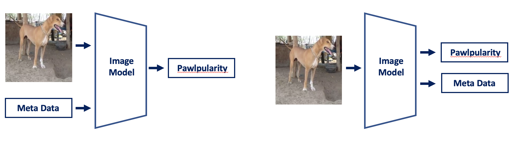
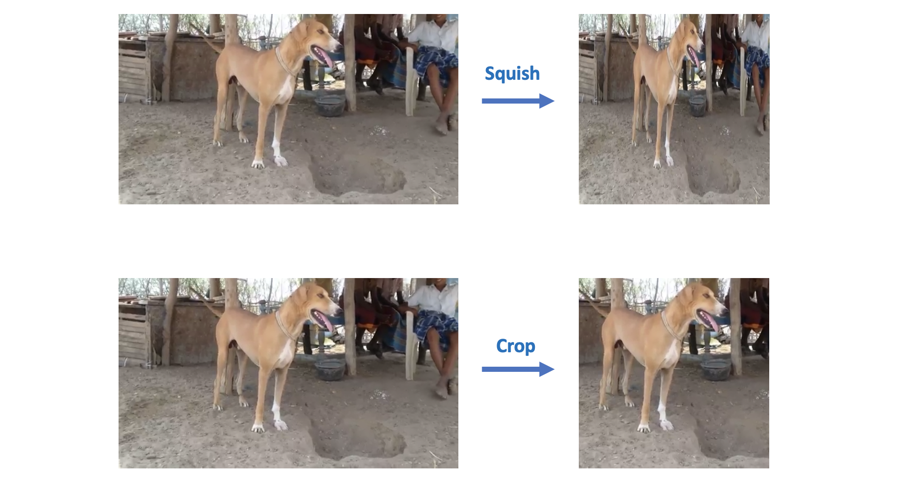

# 深读：PetFinder Pawpularity（小信号回归里的"锚、头、辅、重"）

> 素材：现有 8 篇正文 + 120 条主题索引（含 293 票的 NN 技巧汇编）。
> 本篇亮点：用"均值锚 20.59"校准全部分数；裁决"元数据怎么用"三种用法；拆出"分类头特征 > 内部嵌入"的证据链。

## 0. 一句话重述：这道题真正在考什么

预测宠物照片的"可爱度"（1–100，RMSE）。目标主观、元数据弱、信号小（可学区间约 17–18）。**先立锚**：全预测 38.04（训练均值）的 RMSE=20.59——任何低于它的模型才算有预测力。

→ 任务降解为：**① 用预训练模型把图像变成"可回归的表征"；② 决定元数据是输入、辅助输出还是后处理；③ 在 1e-1 分差的名次带里做融合与选模。**

## 1. 材料与角色

| 帖子 | 角色 | 关键信息 |
| --- | --- | --- |
| 1st 全文（301686，329 票） | 冠军 | 双路线：① 575 个 timm/CLIP 模型提特征 + RAPIDS SVR + 爬山式前向选择；② 5 个 CNN/ViT 回归模型等权集成；**完全弃用元数据** |
| Tricks 汇编（288896，293 票） | 学习资产 | 增强（RandomResizedCrop [3/4,4/3] 长宽比 × [8%,100%] 面积）、BN/初始化、warmup、label smoothing、MixUp、KD、SGD vs Adam、快照测试裁剪等 |
| 6th 多任务（301015） | 关键对照 | **元数据当输入无效；猫/狗标签当辅助输出有效**；日均一模型 + 等权爬山 |
| Public 1st / Private 5th（300928） | 泄漏线 | 14 单模 + **相似图像检测**（EffNetB0 + 余弦相似度）；对阈值以上样本用**往届比赛元数据**做按 AdoptionSpeed 的后处理 |
| 18th（300942） | 异议样本 | 单 Swin-Large 10 折 + **序数回归头**；CV 按 OOF 的 RMSE 计算而非折均值（后者偏乐观） |
| 两个基线帖（1079/1107/1131） | 锚 | 公开基线 17.87–17.91 区间 |

## 2. 逐方案对照矩阵

| 维度 | 1st | 6th | Public1st/Private5th | 18th |
| --- | --- | --- | --- | --- |
| 元数据 | **完全弃用** | 辅助输出（猫/狗标签有用，自带元数据无用） | 仅对近重复样本用往届元数据做后处理 | 弃用 |
| 表征/模型 | timm top-1k 头 + CLIP 编码器 → SVR；5×DL 回归 | Swin/BeIT/ConvNeXt/EffNetB2-SVR | 14 个单模（全图像） | 单 Swin-L + 序数头 |
| 选模/融合 | 爬山前向选择特征集 A/B/C；A+B+C 集成 | 等权爬山（CV 组与 LB 组各一） | 4 折 BayesianRidge 栈 + 分 AdoptionSpeed 后处理 | 10 折单模 |
| 关键数字 | SVR 集 16.997–17.148；集成 priv 16.95 | 最佳 CV 集成 priv 16.90；单 BeIT priv 17.00 | — | CV 17.25 |

## 3. 共识、分歧与裁决

**共识**：弃掉"元数据当输入"（太弱）；用预训练表征；BCE 当回归损失是社区主流选择；图像增强是主要增益来源。

**裁决表**：

| 争议 | 观点 A | 观点 B | 裁决 |
| --- | --- | --- | --- |
| 元数据怎么用？ | 1st：全弃 | 6th：当辅助输出（猫/狗标签好，自带元数据无效）；Public1st：往届元数据只对近重复样本后处理 | **三态并存**：输入态最弱；辅助输出态取决于标签质量（猫/狗 > 自带 12 列）；"外部元数据 + 近重复匹配"是第三种，但依赖跨届重叠 |
| 表征取哪层？ | 1st：**top-1k 分类头** | 常规做法：内部嵌入 | 本场头 > 嵌入（假设：1k 类含猫狗品种，头部与细粒度任务对齐）；置信度中高（1st 实测且冠军） |
| 损失用什么？ | 社区多数：**BCE 回归**（6th/1st 均用） | 18th：序数回归头（"我不同意 BCE"） | 两者都能到前列——**损失选择与模型家族耦合**；BCE 是更稳的默认 |
| CV 怎么算？ | 多数：折 RMSE 均值 | 18th：**OOF 全量 RMSE** | 后者更严格（折均值偏乐观）；报告 CV 时应写明口径 |

## 4. 增量数字账

| 事实/动作 | 数字 | 备注 |
| --- | --- | --- |
| 均值锚 | **20.59**（全 38.04） | 有预测力的门槛 |
| 单模型 SVR（头部特征） | 17.56（effnet_l2_ns_475）… 18.52 | 1000 维头特征 |
| SVR 特征集 A/B/C | 17.029 / 17.148 / 16.997 | 爬山前向选择 |
| A+B+C 集成 | 本地 16.923 / 私榜 16.95 | 目标 clip@85 有小增益 |
| DL 五模型 | CV 17.38–17.75，权重 2–4 | 混合 backbone + 增强强度 |
| 6th 最佳 CV/LB 集成 | 私榜 16.90 / 17.01 | 最佳 CV 提交公开仅第 120 名 |
| 18th | CV 17.25（OOF 口径） | 单模 |

## 5. 机制推演

1. **为什么"分类头特征"胜过内部嵌入**：ImageNet-1k 头是在含猫狗品种的类目上训练的，其激活与"宠物细粒度属性"正交化程度更高；内部嵌入更通用但也更"任务无关"。
2. **为什么 BCE 能当回归损失**：目标被缩放到 [0,1] 且有界，BCE 给出平滑的有界梯度（相比 MSE 更抗离群）；配合 clip 目标上限（85）进一步压住尾部噪声。**"损失服从目标分布形状，而不是指标名字"**。
3. **多任务为什么只对猫/狗标签有效**：自带 12 列元数据（如"清晰度/脸部占比"）与目标弱相关且可能噪声大；猫/狗标签提供强语义监督，迫使主干学到"物种级"判别特征，与"可爱度"共享表征。
4. **近重复 + 往届元数据的机制**（Public1st/5th）：用 EffNetB0 嵌入的余弦相似度找**同图/近图**；若该图出现在往届比赛中，直接把往届的元数据（如 AdoptionSpeed）作为后处理输入——本质是**跨届数据泄漏的定向利用**，而不是全量混训（6th 试过全量混训，无效）。
5. **小信号回归的评估学**：RMSE 对尾部个例敏感（技巧帖点名"rare objects / outlier 样本"）；CV 的折均值口径偏乐观；最佳 CV 提交可能公开排 120 名而私榜第 6——**名次带宽大，必须认清 CV-LB 噪声**。

## 6. 证据分级

| 断言 | 等级 | 说明 |
| --- | --- | --- |
| 均值锚 20.59 与分布统计 | **可验证（数据统计）** | 均 38.04 / 标准差 20.59 |
| 单模型 SVR 全表（26 个架构） | **可复算（帖内表）** | 结构与 RMSE 齐全 |
| 爬山前向选择与 RAPIDS 速度 | **可复算（伪代码+论述）** | cuML 是使能条件 |
| 元数据多任务结论 | **对照（6th 自述）** | 自带 vs 猫狗标签同场对比 |
| 近重复 + 往届元数据 | **自述（强）** | 两个提交 notebook 公开 |
| 头特征 > 嵌入 | **自述（1st）** | 无表格对照（弱证据） |

## 7. 边界条件与反事实

- **跨届重叠是前提**：Public1st 的后处理依赖"往届图出现在本届"；若无重叠，该路线归零（6th 的全量混训失败即反向证据）。
- **图像 vs 元数据**：本场元数据几乎无用；若换一场元数据强的任务，"全弃元数据"会成为错误决策。
- **反事实**：不用 SVR 头部特征而只训 DL，1st 的 Part2 CV 17.38–17.75；SVR 头部路线（16.9）明显更强——**"冻结特征 + 线性头"在小数据上足以夺冠**。
- **提交时限**：1st 的 SVR 部分占约 4h/9h 提交预算——融合规模受推理时限硬约束。

## 8. 悬案与失败学

- 悬案 1：目标生成机制（官方 cuteness meter）不可复现，天花板的噪声不可量化；
- 悬案 2：猫/狗标签来源与质量（辅助任务增益的可持续性未知）；
- 失败学：伪标签外部图像（6th，无效）；往届数据全量预训练/特征（6th，无效）；自带元数据多任务（6th，无效）；把折均值当 CV（偏乐观）。

## 9. 图表证据

**图 1：多任务的两种用法（元数据当输入 vs 当辅助输出）**（6th，topic 301015）——`intel/petfinder-pawpularity-score/bodies/301015_img/04.png`

*读图结论*：左=图像+元数据→Pawpularity（输入态）；右=仅图像→同时输出 Pawpularity 与元数据（辅助输出态）。6th 的对照说明：**辅助输出优于输入**，且辅助标签的质量（猫/狗 vs 自带元数据）决定增益。

**图 2：Squish vs Crop 预处理对照**（6th，topic 301015）——`.../301015_img/02.png`

*读图结论*：Squish 会扭曲长宽比（狗的体型被拉扁）；Crop 保持自然比例且训练期随机裁剪自带增强。6th 实测 Crop 提升 CV/LB。

## 10. 对既有笔记/playbook 的修订点

1. 笔记升级：补均值锚 20.59、1st 的 SVR/头部特征细节与三套特征集、6th 的多任务与负结果、Public1st 的近重复+往届元数据、18th 的 CV 口径；内嵌两张图。
2. `playbook/cv.md` 增补：小信号回归的"先立均值锚"；"冻结特征 + 线性头"策略；分类头特征 > 内部嵌入的假设与用法；近重复检测（嵌入+余弦）。
3. `playbook/00-通用方法论.md` 增补："元数据三态（输入/辅助输出/后处理）"与"CV 口径（折均值 vs OOF）"。

## 11. 出处

- 1st：https://www.kaggle.com/competitions/petfinder-pawpularity-score/discussion/301686
- Tricks 汇编：https://www.kaggle.com/competitions/petfinder-pawpularity-score/discussion/288896
- 6th 多任务：https://www.kaggle.com/competitions/petfinder-pawpularity-score/discussion/301015
- Public1st/Private5th：https://www.kaggle.com/competitions/petfinder-pawpularity-score/discussion/300928
- 18th：https://www.kaggle.com/competitions/petfinder-pawpularity-score/discussion/300942
