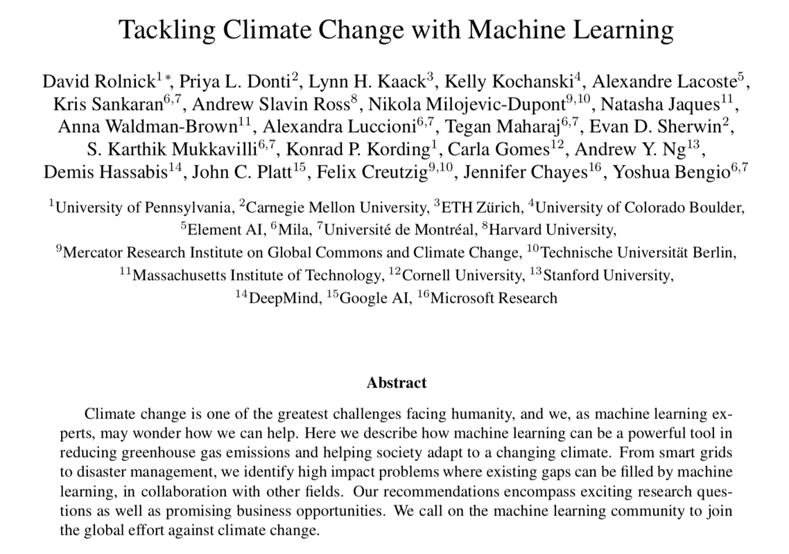

# WiDS Datathon 2022 Phase II（气候/健康研究型 datathon）轻量深读（Tier B）

> 赛事：Community（研究型 analytics，无排行榜）｜ 主题 science（气候变化 × 机器学习）｜ 0 队 / 提交制 ｜ 截止 2022-07-01（论文 6/30）
> 材料基础：`digests/phase-ii-widsdatathon2022.md`（6 篇正文：气候资源 312249 / 起步资源 311836 / 赛制说明 311833 / 组队 311837 / 法国燃气分析 311930 / CCAI notebook 缺失 313736；35 条主题索引）+ 3 张归档图
> 轻读时间：2026-10（Tier B B20）

## 1. 一句话重述与数字账

WiDS Datathon 的**第二阶段研究型赛道**：没有常规提交、**没有排行榜**，参赛者围绕气候变化（并延伸到健康/能源）做分析并提交**研究论文**（6/30 截止），由合作方（MIT Critical Data、EPA、CCAI）提供数据与 Office Hours，最终评"Excellence in Research Award"。归档材料证明这类比赛的入口不是调参而是"**读文献 + 讲好故事 + 按论文规范交付**"：最高票帖是气候 ML 综述与写作/叙事资源，赛制帖明确"团队可线下组、但提交时必须列出所有 collaborators"。

| 关键数字 | 值 | 来源 |
| --- | --- | --- |
| 赛制 | **无常规提交、无排行榜**；团队可线下组但提交须列全 collaborators；截止 2022-07-01；论文提交 6/30（两帖提醒） | 311833 / 333677 / 334299 |
| 合作方/赛道 | MIT Critical Data、EPA、CCAI（气候与能源）；各自有数据与 Office Hours（多场录制） | 索引 |
| 资源主线 | 《Tackling Climate Change with Machine Learning》（Andrew Ng 等）综述；MIT Tech Review / GLOBO 报道；ARIMA 时间序列、CO₂ EDA、NASA-GISS 数据 wrangling 三个 notebook；StatOil Iceberg 作为对照赛 | 312249 |
| 起步资源 | 叙事技巧（Kaggle 2021 Survey 冠军、Notebook flow、Analytics reporting 最佳实践）+ Kaggle Learn 特征工程/时间序列课程 + 相似赛（AQI India、ASHRAE） | 311836 |
| 过程支持 | Excellence in Research Award kick-off（5 票）；里程碑 Office Hours（MIT/EPA/CCAI 多场，均有录像）；"suggested research questions" 列表 | 313768 / 324852 / 322583 / 312011 |
| 常见问题 | `alt_prec` 含义（313830）；MIT starter dataset 疑问（312012）；CCAI 缺 `parsing-e-obs.ipynb`（313736）；页数限制（334287）；能否用 Tableau（321664）；提交按钮禁用（323936）；结果与颁奖（343163 / 347115） | 索引 |

## 2. 逐方案对照矩阵

| 维度 | 研究型 Phase II（本场） | 常规 Phase I datathon |
| --- | --- | --- |
| 交付 | 论文 + 分析 notebook | 排行榜提交 |
| 评审 | 合作方/奖项评审 | 指标排名 |
| 团队 | 线下组队、collaborators 列全 | 平台组队 |
| 核心能力 | 文献综述、故事线、可复现 | 建模调参 |

## 3. 共识、分歧与裁决

### 共识一：研究型 datathon 的交付标准是"可发表"，不是分数（311833 / 333677 / 334287；置信度高）

论文 6/30 截止、页数有限制、提交必须列全合作者。**裁决**：从第一天按论文结构（问题—数据—方法—结果—局限—引用）组织 notebook 与写作；预留排版与页数检查时间。置信度：高。

### 共识二：文献与叙事资源先行（312249 / 311836；置信度中高）

最高票帖是气候 ML 综述与写作指南（含 Kaggle 官方叙事最佳实践、相似赛 AQI/ASHRAE）。**裁决**：先读《Tackling Climate Change with ML》与相似赛的分析报告，再确定题目与可视化方案。置信度：中高。

### 事件一：多合作方数据需要先对齐字典（312012 / 313830 / 313736；置信度中）

MIT/EPA/CCAI 各自数据有 starter、缺 notebook、列名含义（`alt_prec`）等疑问。**裁决**：开赛第一周向对应 Office Hours 问清数据字典与缺失文件；不要基于猜测变量含义建模。置信度：中。

### 事件二：过程支持（Office Hours + 里程碑）是这类赛事的主要"教材"（313768 / 324852 / 322583 / 319340；置信度中高）

每场 Office Hours 都有录像，覆盖 kick-off、里程碑与各合作方专题。**裁决**：把全部录像当课程刷一遍，能显著降低选题与数据理解成本。置信度：中高。

### 事件三：结果与颁奖周期长（343163 / 347115；置信度中）

从 7/1 截止到"Excellence in Research Award Winners"公告之间隔了数月。**裁决**：把论文发表与引用价值当作主要回报，不把等待结果纳入短期计划。置信度：中。

## 4. 证据分级

| 断言 | 等级 | 说明 |
| --- | --- | --- |
| 无排行榜/论文交付/合作者要求 | 官方赛制帖（311833）+ 论文截止帖 | 高 |
| 气候 ML 资源清单 | 社区帖（312249） | 中高（文献可查） |
| 叙事/课程资源 | 社区帖（311836） | 中高 |
| Office Hours 与里程碑 | 官方帖（多场录像） | 高（存在性） |
| 数据字典疑问 | 多帖（312012 / 313830 / 313736） | 中 |
| 结果与颁奖 | 公告帖（343163 / 347115） | 中 |

## 5. 悬案与缺口（登记）

- 获奖论文正文与评审标准未归档（仅恭喜帖）；
- 各合作方数据集的最终版本与变量字典未归档；
- 页数限制、Tableau 可用性等答复未归档；
- 参与者规模无官方数字（0 队为平台字段）；
- **图证缺口**：归档 3 张图中仅 1 张有信息量（综述论文首页），其余 2 张为装饰图。

## 6. 图表证据

**图**（topic 312249）：社区推荐的《Tackling Climate Change with Machine Learning》论文首页（Rolnick、Donti、Kaack、Kochanski…Ng 等作者）——研究型 datathon 的领域入口文献。

（另 2 张为 Kaggle 毛衣与摄影装饰图，未内嵌。）

## 7. 出处

- 赛制说明（6 票 / 5 评论）：https://www.kaggle.com/competitions/phase-ii-widsdatathon2022/discussion/311833
- 起步资源（16 票 / 8 评论）：https://www.kaggle.com/competitions/phase-ii-widsdatathon2022/discussion/311836
- 气候资源（6 票 / 3 评论）：https://www.kaggle.com/competitions/phase-ii-widsdatathon2022/discussion/312249
- 论文截止提醒（3 票 / 3 评论）：https://www.kaggle.com/competitions/phase-ii-widsdatathon2022/discussion/333677
- CCAI 缺失 notebook（6 票 / 0 评论）：https://www.kaggle.com/competitions/phase-ii-widsdatathon2022/discussion/313736
- `alt_prec` 含义（3 票 / 0 评论）：https://www.kaggle.com/competitions/phase-ii-widsdatathon2022/discussion/313830
- 研究奖 kick-off 录像（5 票 / 0 评论）：https://www.kaggle.com/competitions/phase-ii-widsdatathon2022/discussion/313768
