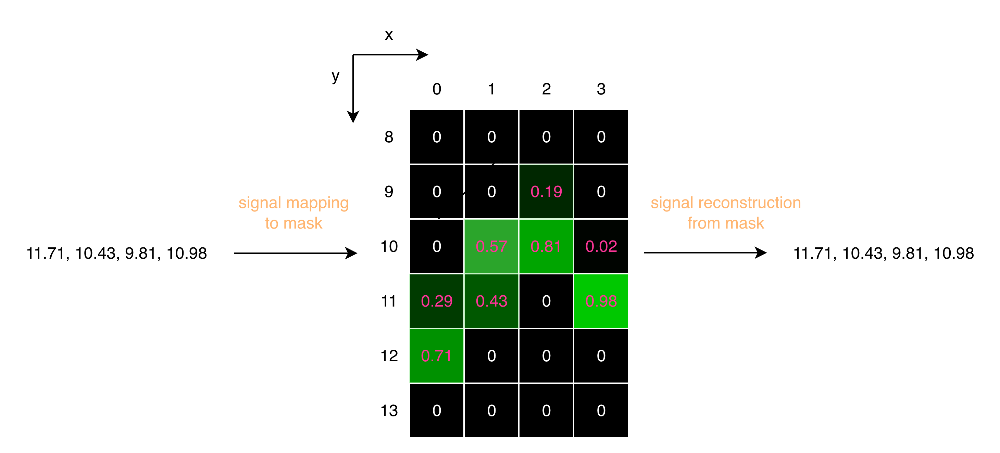
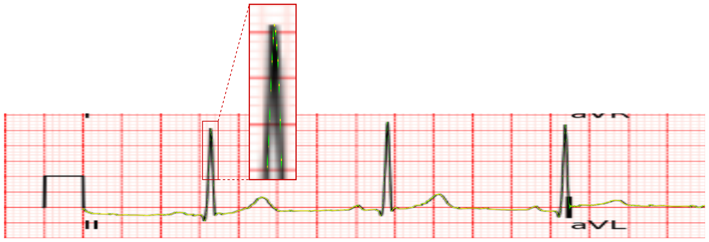
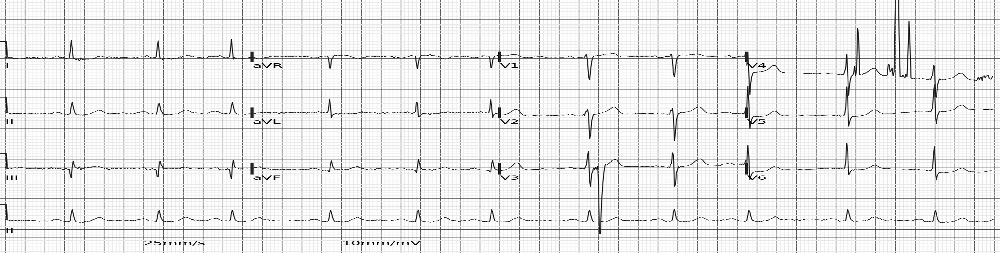

# PhysioNet ECG Image Digitization 轻量深读（Tier B）

> 赛事：Research ｜ 主题 cv（图像→信号数字化）｜ 1424 队 ｜ 代码赛 ｜ 指标：PhysioNet ECG Signal Extraction Metric（逐图 SNR，先在**线性域**平均再转 dB）
> 材料基础：`digests/physionet-ecg-image-digitization.md`（6 篇正文：1st 669584 / 2nd 669871 / 3rd 669668 / 6th 669562 / 7th 669548 / 设计贴 613540；80 条主题索引）+ 13 张图
> 轻读时间：2026-10（Tier B B05）

## 1. 一句话重述与数字账

从心电图扫描图重建数值波形，评测只看**重建信号 SNR**。真正的考点是**几何标定（校正/重映射）+ 坐标精度（子像素）+ 后处理（导联定律/重采样）**——模型只负责"轨道"，分数由管线两端决定。

| 关键数字 | 值 | 来源 |
| --- | --- | --- |
| 1st（669584，73 票） | 沿用社区 hengck23 的 stage0/1 校正管线；两条输入路径（高分辨 homography 重映射 / 直接从旋转图重映射）；**Fourier 域重采样**（scipy.signal.resample 优于线性插值）；灰度图 + 坐标特征通道；三种"按高度切 4 段、横向扩 4×"的解码策略；后处理：取中段 1–2 万点重采样 + **按 Einthoven 定律做软混合**（II=I+III、aVR+aVL+aVF=0）；**TTA +0.07、导联定律修正 +0.06**；10 模型集成（convnextv2_tiny/base、effnetv2_m），验证 30 图 | 1st |
| 2nd（669871，36 票） | **把竞赛信号换回 PTB-XL 原始 500Hz**（竞赛数据被 host 重采样成 250–1025Hz）→ 单折 LB **21.67→22.49 dB**；**稀疏掩码**（每列 ≤2 像素、按小数部分分给相邻两格、重建时加权平均，往返可精确复原，见图 1）；双模型：whole（timm+MyCoordUnetDecoder, 1280×5600）+ series（2.5D 四导联融合，conv2d 融合最佳）；BCE pos_weight=20；**指标洞察：线性域平均 ⇒ 优先提升中高分图**；6 模型集成 pub 23.37 / priv 23.27 | 2nd |
| 3rd（669668，31 票） | 低分辨率算几何、**放大后直接作用于原图**的高分辨校正；1 像素宽掩码 + 故意"过拟合"出细而高置信波形；尺寸实验：2200×1700 → **24.22 dB**，4400×1700 → **31.23 dB**（宽度翻倍 = 采样点翻倍，量化误差骤降）；抛物线亚像素细化 | 3rd |
| 6th（669562，30 票） | **直接回归导联信号**，绕过"分割+后处理"以消除累积误差；重采样基准（FFT 最优，中段密度越高保真越好：10250 > 5120 > 2560）；自写 `resample_torch` 把重采样放进训练 | 6th |
| 7th（669548，48 票） | 五段流水线：旋转分类（HGNet-V2，检出 69 张需旋转）→ 导联检测（ConvNeXt，检测头 ≥128 通道）→ 导联分割 → 数字化（maxxvit+1D UNet，5 通道输入）→ **OOD 检测用于集成筛选**；用 ECG-image-kit + DTD 纹理合成训练数据；轻模型全折验证、重模型 100 图验证 | 7th |

## 2. 逐方案对照矩阵

| 维度 | 1st | 2nd | 3rd | 6th | 7th |
| --- | --- | --- | --- | --- | --- |
| 目标形式 | 掩码/数值预测 + 后处理 | **稀疏掩码** + 加权重建 | 1px 掩码 + 亚像素 | **直接回归信号** | 分割 + 数字化 |
| 关键数据动作 | 高分辨重映射 | **换回 500Hz 原始信号** | 宽度 2200→4400 | 重采样基准 | 合成数据（ECG-image-kit） |
| 重采样 | Fourier | scipy.signal.resample | — | **FFT 验证 + torch 实现** | — |
| 导联关系 | **Einthoven 定律软混合 (+0.06)** | 2.5D 四导联特征融合 | — | — | 检测/分割 13 类导联 |
| TTA | gamma+裁剪/缩放 (+0.07) | 水平翻转 | — | — | — |
| priv | 1st | 23.27 | — | — | — |

## 3. 共识、分歧与裁决

### 共识一：几何校正与重映射是公共基座（1st/2nd/3rd/7th）

1st/2nd/3rd 都建立在 hengck23 的 stage0/1 校正管线上（1st/2nd 致谢中明确），7th 另起 lead detection/segmentation 但同样是"先几何后信号"。**裁决**：图像→数值任务的公共解法是"先标准化版面，再数字化"；高分辨重映射（3rd：低分辨算参数、原图执行）是避免细节损失的通用技巧。置信度：高。

### 共识二：子像素/采样密度直接换成 SNR（1st/2nd/3rd/6th）

2nd 的稀疏掩码把 y 坐标的小数部分编码进相邻两格（图 1 展示 11.71→11.71 的精确往返）；3rd 把宽度从 2200 拉到 4400（24.22→31.23 dB）；6th 证明中间重采样密度 10250>5120>2560。**裁决**：目标是"位置精度"，任何提高横向采样密度或亚像素编码的动作都是直接增益。置信度：高（三队独立 + 数字）。

### 共识三：FFT 域重采样优于线性插值（1st/2nd/6th）

1st 用 scipy.signal.resample；2nd 对比三种方法后选 scipy；6th 做了系统基准并移植到 torch。**裁决**：信号域重采样别用图像插值（torch.interpolate 等价于线性），FFT/polyphase 保真更高。置信度：高。

### 分歧一：掩码+后处理 vs 直接回归

1st/2nd/3rd/7th 走"分割（掩码）→重建/后处理"；6th 明确改为**直接回归导联信号**，理由是避免后处理阶段累积误差。**裁决**：直接回归少了可解释的几何中间量（也就少了导联定律类修正的抓手）；两条路都能进前列，取决于你更擅长哪一端。置信度：中高。

### 分歧二：掩码画多宽

3rd 用 1 像素宽并故意过拟合细线（加高斯模糊变宽反而无益）；2nd 用"每列 ≤2 像素"的稀疏软标签；1st 未如此处理。**裁决**：在"位置回归"语义下，细而确定的目标优于模糊粗线——但需要亚像素重建来兑现精度。置信度：中高。

### 事件：指标结构决定投入方向（2nd 的洞察）

2nd 分析出"先线性域平均再转 dB"意味着**中高 SNR 图数量多、改进空间大**，于是放弃最难的 0015 型皱褶图（只少量混入训练），主攻中等难度。**裁决**：读指标时要做"分数贡献分解"（哪类样本贡献多少分差），再分配算力。置信度：高。

## 4. 证据分级

| 断言 | 等级 | 说明 |
| --- | --- | --- |
| 2nd 的 500Hz 替换 +0.82 dB、稀疏掩码往返 | 自述 + 图 + 公开代码 | 高 |
| 1st 的 TTA +0.07 / 导联修正 +0.06 | 自述 + 模型表 | 中高 |
| 3rd 的宽度→SNR 表（24.22 vs 31.23） | 自述 + 图 + 公开代码 | 高 |
| 6th 的重采样基准 | 自述 + 图 + 公开代码 | 中高 |
| 7th 的检测头通道数/最小裁剪经验 | 自述（+0.2~3 的粗估） | 中 |

## 5. 悬案与缺口（登记）

- 4th/5th/13th 的 write-up 未入库；"from lb 0.16 to 0.20"（39 票）未细读；
- 1st 未公布完整集成权重与验证曲线；合成数据的独立增益未量化；
- 7th 的 OOD 集成筛选细节、13th 的方案均缺失；
- 归档 13 图中 7 张为方法图（1st 的输入裁剪、2nd 的掩码往返/预测/模型图、3rd 的掩码尺寸对照）。

## 6. 图表证据

**图 1**（topic 669871）：稀疏掩码的关键机制——把信号 y 坐标 11.71/10.43/9.81/10.98 按小数部分拆到相邻两格（如 10.43 → y=10 的 0.57 与 y=11 的 0.43），重建时加权平均可**精确复原**原值。这是"子像素精度可以编码进标签"的直接证据。

**图 2**（topic 669871）：模型预测（绿）与 GT（黄）在 aVR/aVL 导联上的叠加——细线目标下"位置正确"比"覆盖面积"重要，尖峰处两者仍逐像素咬合。

**图 3**（topic 669584）：校正+裁剪后的标准四行 ECG（去个人信息、保留 4 组导联数据）——"把各种拍摄样式先标准化再建模"的直观示例。

## 7. 出处

- 1st（73 票）：https://www.kaggle.com/competitions/physionet-ecg-image-digitization/discussion/669584
- 2nd（36 票）：https://www.kaggle.com/competitions/physionet-ecg-image-digitization/discussion/669871
- 3rd（31 票）：https://www.kaggle.com/competitions/physionet-ecg-image-digitization/discussion/669668
- 6th（30 票）：https://www.kaggle.com/competitions/physionet-ecg-image-digitization/discussion/669562
- 7th（48 票）：https://www.kaggle.com/competitions/physionet-ecg-image-digitization/discussion/669548
- 设计讨论（40 票）：https://www.kaggle.com/competitions/physionet-ecg-image-digitization/discussion/613540
- open→secret sauce（39 票）：https://www.kaggle.com/competitions/physionet-ecg-image-digitization/discussion/624054
