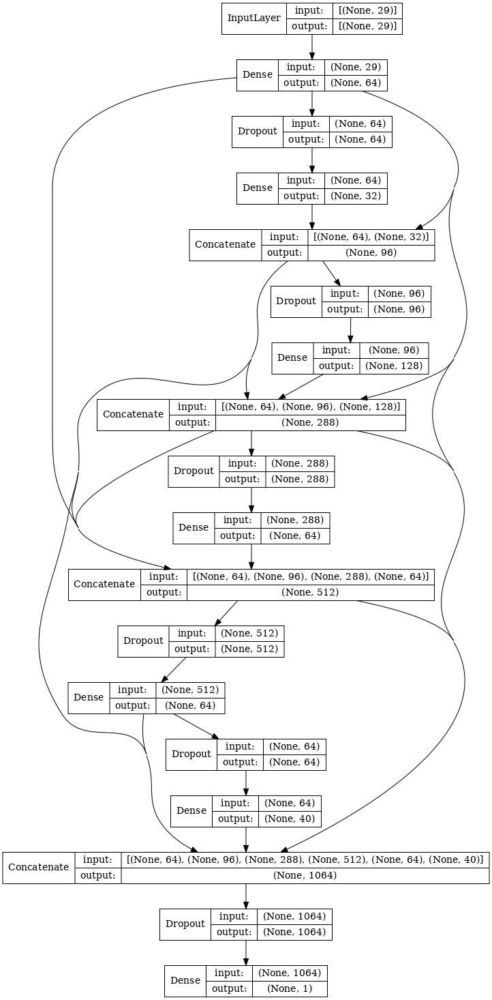

# Playground Series S3E1（加州房价）轻量深读（Tier B）

> 赛事：Playground ｜ 主题 tabular（地理回归，RMSE）｜ 689 队 ｜ 标准赛 ｜ 指标：RMSE
> 材料基础：`digests/playground-series-s3e1.md`（6 篇正文：1st 377137 / 2nd 377179 / 24th 377993 / 坐标 FE 清单 376210 / 官方写-up 帖 377040+377595；59 条主题索引）+ 1 张归档图
> 轻读时间：2026-10（Tier B B16）

## 1. 一句话重述与数字账

加州房价回归（RMSE）。本场是"**地理坐标特征工程 + 验证口径**"的教科书：几乎所有高分解法都围绕 lat/long 做距离/旋转/位置编码（1st 直接用了公开的坐标 notebook 再套 AutoGluon）；2nd 的关键洞察是**用原数据做 CV 拆分、把外部数据只加到训练集**，从而把验证强制落在竞赛数据上。1st 的 AutoGluon 方案 8 折 + 3 层 stacking，CV 0.5006；24th 靠"信任 CV"在私榜上升 24 位。

| 关键数字 | 值 | 来源 |
| --- | --- | --- |
| 1st（377137） | **AutoGluon Tabular** + 公开坐标 FE notebook；8 折；对 xgb/lgbm/catb/RF/NN 等架构做加权集成 + bootstrap bagging + **3 层 stacking**；最终 local CV **0.5006** | 377137 |
| 2nd（377179） | 集成公开方案与自研；**CV 在原数据上拆分，竞赛数据加进训练**（让验证落在竞赛数据上）；再用"在合并数据上拆分"的方法做多样性；Keras NN（keras_tuner）CV 仅 0.59 但显著增加集成多样性 | 377179 |
| 24th（377993） | XGB/LGBM/CatBoost 10 折集成（Optuna 只调 XGB）；FE：**到 50 万人口以上加州城市的距离、位置编码（transformer 式 sin/cos）、到海岸线距离、坐标 PCA、旋转坐标（15/30/45°）、极坐标**；CV = 80/20 且**排除原数据**；坚持 CV 使其私榜上升 24 位 | 377993 |
| 坐标 FE 清单（376210） | 汇总历届 lat/long 技巧：欧氏/曼哈顿/哈弗辛距离、KNN（地理近邻回归）、位置编码公式、reverse-geocode、到关键点距离、邻域聚合统计、**坐标旋转**（让树的单次分裂能切开斜向街区） | 376210 |
| 社区 | "一个简单特征 +0.002"（40 票 / 13 评论）；"注意 CV 分数（忽略原加州数据集）"（30 票 / 30 评论）vs "加入原数据大提升"（19 票 / 3 评论）——原数据用法存在分歧；"Clip Max +0.003"（21 票 / 9 评论，对目标上限截断）；"经纬度为何最重要"（25 票） | 索引 |

## 2. 逐方案对照矩阵

| 维度 | 1st | 2nd | 24th |
| --- | --- | --- | --- |
| 主体 | AutoGluon（8 折、3 层栈） | 公开+自研集成 + Keras NN | XGB/LGBM/CatBoost 10 折 |
| 坐标 FE | 公开 notebook | 坐标特征 | 距离城市/海岸线、位置编码、PCA、旋转、极坐标 |
| 原数据 | 公开方案派生 | **CV 拆原数据、外部数据只入训练** | 从 CV 排除原数据 |
| 验证 | AutoGluon 内部 | 双口径对照 | 80/20 排除原数据 |
| 结果 | CV 0.5006（1st） | 2nd | 24th（私榜 +24 位） |

## 3. 共识、分歧与裁决

### 共识一：地理坐标特征工程是本场的核心（1st/2nd/24th/376210；置信度高）

距离城市/海岸线、旋转坐标、位置编码、极坐标、地理 KNN 被反复使用；1st 直接复用公开坐标 notebook。**裁决**：地理回归先做"到关键点距离 + 坐标变换 + 邻域聚合"。置信度：高。

### 共识二：验证口径决定成败——CV 应落在竞赛数据上（2nd/24th/376709；置信度中高）

2nd 明确"在原数据上拆分、外部数据只进训练"；24th 从 CV 排除原数据；社区有"忽略原加州数据"的高评论帖。**裁决**：原数据可入训练，但不能让 CV 覆盖它。置信度：中高。

### 分歧：原数据到底加不加（375754 vs 376709；置信度中）

"加原数据大提升"（19 票）与"忽略原加州数据"（30 票 / 30 评论）并存；2nd 用双口径集成分散风险。**裁决**：先用对抗验证评估原数据与竞赛数据的分布差，再决定"加/不加/两种都做"。置信度：中。

### 事件：AutoML 强表现与"信任 CV"（1st、24th；置信度中高）

1st 的 AutoGluon 直接夺冠；24th 因坚持 CV 在私榜 +24 位。**裁决**：中等规模表格数据上 AutoML + 公开坐标 FE 是强力起手式；最终提交以 CV 为准。置信度：中高。

### 技巧：目标上限截断（376396；置信度中）

"Clip Max"帖报告 +0.003——该数据集目标有上限（约 5.00001，来自原数据的截断）。**裁决**：回归目标有物理/人工上界时，提交前做截断。置信度：中。

## 4. 证据分级

| 断言 | 等级 | 说明 |
| --- | --- | --- |
| 1st 的 AutoGluon 结构与 CV 0.5006 | 自述（简短）+ 框架引用 | 中 |
| 2nd 的验证口径洞察 | 自述（含 NN 结构图） | 中高 |
| 24th 的坐标 FE 清单与 +24 位 | 自述 + notebook | 中高 |
| 坐标 FE 技巧汇总 | 高票帖（46 票） | 中高 |
| Clip Max +0.003 | 帖 + 观察 | 中 |

## 5. 悬案与缺口（登记）

- 3rd–23rd、25th+ 方案未收录；
- "简单特征 +0.002"（40 票）具体内容未在 digest 中收录正文；
- 原数据的量化增益存在矛盾，未核对；
- **图证缺口**：无（1 张图，本深读内嵌 1 张）。

## 6. 图表证据

**图 1**（topic 377179，2nd）：Keras NN 结构——多尺度拼接（64/32→96→128→288→…→1064→1）；单模 CV 仅 0.59，但为集成提供显著多样性。

## 7. 出处

- 1st AutoGluon（69 票 / 46 评论）：https://www.kaggle.com/competitions/playground-series-s3e1/discussion/377137
- 2nd 验证口径（21 票 / 4 评论）：https://www.kaggle.com/competitions/playground-series-s3e1/discussion/377179
- 24th（15 票 / 5 评论）：https://www.kaggle.com/competitions/playground-series-s3e1/discussion/377993
- 坐标 FE 清单（46 票 / 8 评论）：https://www.kaggle.com/competitions/playground-series-s3e1/discussion/376210
- 简单特征 +0.002（40 票 / 13 评论）：https://www.kaggle.com/competitions/playground-series-s3e1/discussion/376043
- 注意 CV / 忽略原数据（30 票 / 30 评论）：https://www.kaggle.com/competitions/playground-series-s3e1/discussion/376709
- Clip Max（21 票 / 9 评论）：https://www.kaggle.com/competitions/playground-series-s3e1/discussion/376396
- 原数据大提升（19 票 / 3 评论）：https://www.kaggle.com/competitions/playground-series-s3e1/discussion/375754
- 经纬度为何重要（25 票 / 8 评论）：https://www.kaggle.com/competitions/playground-series-s3e1/discussion/376078
