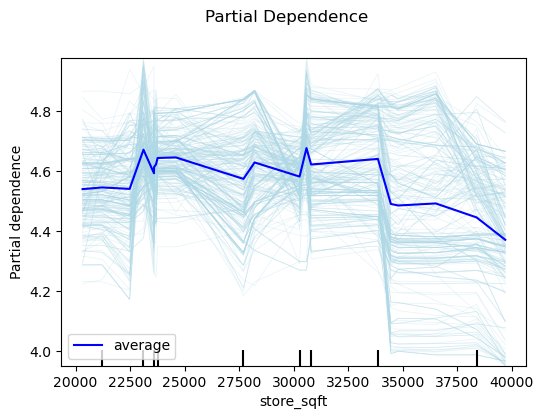
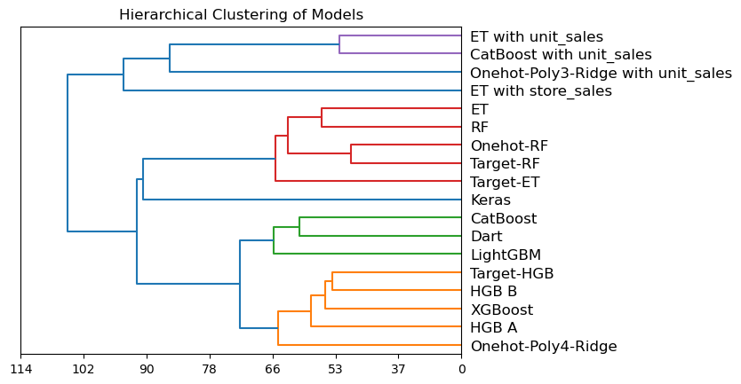
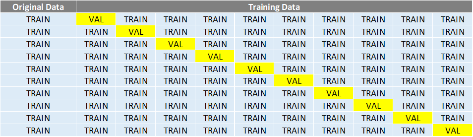

# Playground Series S3E11（门店成本预测）轻量深读（Tier B）

> 赛事：Playground ｜ 主题 tabular（零售门店回归，合成数据）｜ 952 队 ｜ 标准赛 ｜ 指标：RMSLE（MSLE）
> 材料基础：`digests/playground-series-s3e11.md`（6 篇正文：1st 399401 / 3rd 399571 / 4th 399489 / 17th 399393 / 回归冠军汇编 396123 / FE 合集 396291；79 条主题索引）+ 11 张归档图
> 轻读时间：2026-10（Tier B B13）

## 1. 一句话重述与数字账

预测门店成本（RMSLE）。本场的经验非常集中：**特征子集选择 + 少量强聚合特征**是主增益（4th 的 `store_score` / `store_score_ratio` 让单 LGBM 私榜 0.29326）；1st 则把"不确定哪些特征有用"变成策略——**为不同特征子集各建模型再 Ridge 加权**，并发现**去重分组能把 36 万行压到约 3000 组**、开发速度提升一个量级；`store_sqft` 只有 20 个取值、应作类别处理；目标统一 `log1p` 变换后再 `expm1` 还原。

| 关键数字 | 值 | 来源 |
| --- | --- | --- |
| 1st（399401） | 18 个模型的 Ridge 加权混合；核心观察：①只有部分特征有用且不确定是哪些 → 多子集建模再融合；②去重后可把 **36 万行压到约 3000 组**（开发周期数量级加速）；③加原始数据提分；④`store_sqft` 仅 20 个唯一值 → 当类别（PDP 呈阶梯状）；⑤统一 `log1p(cost)` 目标；用**树状图**分析多样性（4 簇：带 unit_sales/store_sales 的模型、RF/ET、NN、GBDT） | 399401 |
| 3rd（399571） | KS 检验（train/test 与 train+original/test）筛特征；**逐模型 LOFO 重要性**（LGB/XGB/CatBoost/HGB 用不同特征子集）；测试 stacking（未提升）→ 最终 **23 个模型 + Optuna 学习融合权重**；最后几小时加**伪标签**升到第 3；多样性来源：目标/boosting 类型、折数（5/7/10/15）、目标变换（log/log1p/box-cox）、频次编码 | 399571 |
| 4th（399489） | 5 模型（LGBM×2、XGB×2、CatBoost×1）；CV 用"原数据只入训练、只在校验合成数据"（原数据标 fold=-1）；`log(cost)` + RMSE；**最重要 FE**：`store_score = coffee_bar+video_store+salad_bar+prepared_food+florist` 与 `store_score_ratio = store_sqft/store_score`；单 LGBM 加这两特征即公 0.2926 / 私 **0.29326**（约 9–37 名区间）；新特征必须以类别传给 LGBM；XGB/CatBoost 改用加权和版；失败：多子集混合、stacking、按原数据清理不一致值 | 399489 |
| 17th（399393） | 三人团队各自独立方案后集成；自述手动调参胜过 Optuna；特征精简为 8 个 + 按 store 分组的均值特征（concat train+hold+test 后 groupby） | 399393 |
| 社区 | "去掉部分特征就有 0.2945"（34 票 / 9 评论）；FE 合集（57 票 / 42 评论）；数据详解（54 票 / 44 评论）；"人工数据没抓住重点"（26 票 / 12 评论）；目标如何计算（22 票）；回归赛用 StratifiedKFold（21 票）；RMSLE 吐槽（19 票） | 索引 |

## 2. 逐方案对照矩阵

| 维度 | 1st | 3rd | 4th | 17th |
| --- | --- | --- | --- | --- |
| 核心 | 多子集模型 Zoo + Ridge | KS+LOFO 逐模型选特征 + 伪标签 | store_score 聚合 + 5 模型 | 手工调参 + 分组均值 |
| 去重/加速 | **3000 组替代 36 万行** | — | — | — |
| 原数据 | 加入 | 部分模型加入 | 加入但只训练（fold=-1） | — |
| 目标 | log1p | log/log1p/box-cox 多版本 | log + RMSE | — |
| 融合 | Ridge 权重（18 模型） | Optuna 权重（23 模型） | Optuna 加权（5 模型） | 团队三方案集成 |
| 结果 | 1st | 3rd（伪标签抬升） | 私 0.29326（单 LGBM） | 17th |

## 3. 共识、分歧与裁决

### 共识一：特征子集问题要"多子集建模"而不是纠结唯一答案（1st、3rd、社区；置信度高）

1st 直接为不同子集各训模型再融合；3rd 用 KS 检验 + 逐模型 LOFO；社区帖"去掉部分特征就有 0.2945"（34 票）。**裁决**：当特征有用性不确定时，把不确定性变成集成多样性。置信度：高。

### 共识二：店铺属性聚合（store_score 类）是最大单点 FE（4th；置信度中高）

`store_score`（5 个门店设施求和）+ `store_score_ratio`（面积/设施得分）使单 LGBM 达到私榜 0.29326，且必须按类别传入 LGBM。**裁决**：把多个二元设施聚合成"门店档次分"是零售数据的高价值特征。置信度：中高（单队证据但幅度大、可复现）。

### 共识三：去重分组与 log1p 目标标准化（1st、4th；置信度中高）

1st 的 3000 组替代 36 万行极大加速迭代；4th 全程 `log(cost)` 目标。**裁决**：RMSLE 类目标统一对数变换；重复行先聚合再训练。置信度：中高。

### 分歧：stacking vs 加权混合（3rd/4th vs 1st/3rd 最终形态；置信度中）

3rd、4th 都报告 stacking 没有增益，最终都用权重优化（Optuna/Ridge）；3rd 的伪标签反而有效。**裁决**：本场用权重 blend 即可；伪标签可作为末期增益但需 CV 验证。置信度：中。

### 事件：对"人工数据真实性"的质疑（397431、396540；置信度中）

社区帖"Artificial data missed the point"（26 票）与"目标如何计算"（22 票）质疑合成数据的生成逻辑与目标定义。**裁决**：先理解目标公式与数据生成过程，再决定 FE 方向；这类质疑在本系列常见。置信度：中。

## 4. 证据分级

| 断言 | 等级 | 说明 |
| --- | --- | --- |
| 4th 的 store_score 与单模私榜 0.29326 | 自述（含分数与 CV 图） | 中高 |
| 1st 的去重分组/多子集/Zoo | 自述 + 3 张图 | 中高 |
| 3rd 的 23 模型与伪标签 | 自述（含 LOFO 图） | 中 |
| 17th 的团队集成方法 | 自述 | 中 |
| 社区 FE 合集 | 高票帖 | 中 |
| 目标定义质疑 | 讨论帖（未定论） | 低—中 |

## 5. 悬案与缺口（登记）

- 2nd、5th–16th 方案未收录；
- "Artificial data missed the point"的结论未细读；
- 伪标签的量化增益未给出；
- **图证缺口**：无（11 张图，本深读内嵌 3 张）。

## 6. 图表证据

**图 1**（topic 399401，1st）：`store_sqft` 的部分依赖呈明显阶梯——它只有 20 个取值，应按类别处理而非连续变量。

**图 2**（topic 399401，1st）：18 个模型的层次聚类——形成 4 个清晰簇（带 unit_sales/store_sales 的模型、RF/ET、NN、GBDT），是 Ridge 加权前的多样性诊断。

**图 3**（topic 399489，4th）：CV 示意——原始数据（黄色）只作为训练（fold=-1），验证永远只落在合成竞赛数据上。

## 7. 出处

- 1st A Zoo of Models（90 票 / 30 评论）：https://www.kaggle.com/competitions/playground-series-s3e11/discussion/399401
- 3rd KS+LOFO+伪标签（17 票）：https://www.kaggle.com/competitions/playground-series-s3e11/discussion/399571
- 4th FE 决定成败（20 票）：https://www.kaggle.com/competitions/playground-series-s3e11/discussion/399489
- 17th 手工调参（17 票）：https://www.kaggle.com/competitions/playground-series-s3e11/discussion/399393
- FE 合集（57 票 / 42 评论）：https://www.kaggle.com/competitions/playground-series-s3e11/discussion/396291
- 数据详解（54 票 / 44 评论）：https://www.kaggle.com/competitions/playground-series-s3e11/discussion/396153
- 去掉特征即 0.2945（34 票）：https://www.kaggle.com/competitions/playground-series-s3e11/discussion/396508
- 回归赛冠军汇编（19 票）：https://www.kaggle.com/competitions/playground-series-s3e11/discussion/396123
- 人工数据质疑（26 票）：https://www.kaggle.com/competitions/playground-series-s3e11/discussion/397431
