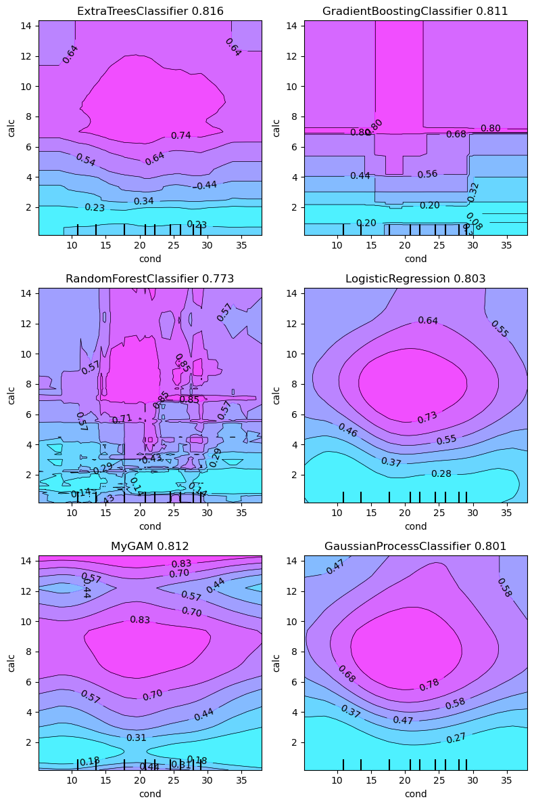
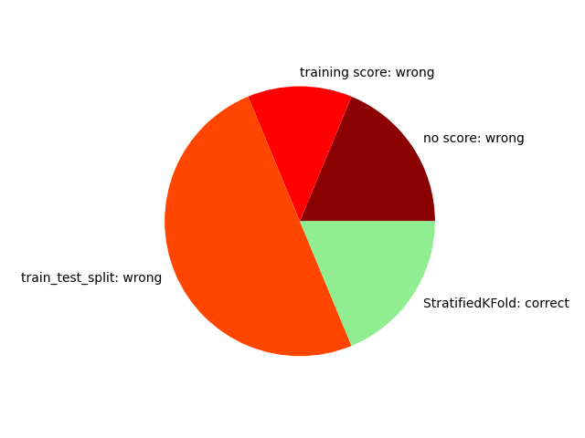

# Playground Series S3E12（极小数据分类）轻量深读（Tier B）

> 赛事：Playground ｜ 主题 tabular（极小样本二分类，AUC）｜ 1088 队 ｜ 标准赛 ｜ 指标：ROC AUC
> 材料基础：`digests/playground-series-s3e12.md`（6 篇正文：两特征 400152 / train_test_split 警告 401113 / #28 402347 / #14 402467 / #24 402398 / #8 402416；80 条主题索引）+ 4 张归档图
> 轻读时间：2026-10（Tier B B16）

## 1. 一句话重述与数字账

极小的医疗二分类数据集（测试集仅 276 条）。本场是**"复杂 ≠ 更好"的极端案例**：只保留 `cond` 与 `calc` 两个特征，ExtraTrees 的 1000 次重复 CV AUC 是 **0.817**，而用全部特征只有 **0.803**；社区的"为什么不能用 train_test_split"帖用 16 个公开 notebook 统计说明 **只有 3 个做了正确交叉验证**，并演示同一模型对在同一份数据上因随机种子不同可相差 **0.137 AUC**。于是本场的正确姿势是：**最少特征 + 重复分层 CV + 二维轮廓图诊断**。

| 关键数字 | 值 | 来源 |
| --- | --- | --- |
| 两特征就够（400152） | ExtraTrees（800 棵、min_samples_leaf=13、entropy）在 `[cond, calc]` 上的 `RepeatedStratifiedKFold(10×100)` CV = **0.817**；用全部特征 0.803；六个分类器的二维部分依赖轮廓图（ET 0.816 / GB 0.811 / RF 0.773 / LR 0.803 / GAM 0.812 / GP 0.801）可直接目视过拟合 | 400152 |
| train_test_split 警告（401113） | 16 个近期公开 notebook 中：**8 个用 train_test_split（错）**、2 个只报训练分、3 个不报分、**只有 3 个用 StratifiedKFold（对）**；同一对模型（LR vs RF）在 random_state=464/879 下差值从 **-0.080 变 +0.057**；若用单一 split 做 Optuna 目标，超参"完全随机" | 401113 |
| 其他方法论帖 | "十折不够，要多少折"（47 票 / 15 评论）；"别忘了 GAM"（43 票 / 15 评论）；"指标与 CV 入门提示"（53 票）；"你猜不到我的最佳单模"（38 票 / 40 评论）；"不同特征子集混合"（28 票 / 17 评论）；"测试集只有 276 条，如何避免作弊"（24 票 / 14 评论） | 索引 |
| #28（402347） | 公开 FE + hydration/osmo/calc 二值特征；**IQR 去离群（分位数 0.25/0.75 → 0.3/0.7 会改变名次）**；8 类模型的 Optuna 加权集成；10 折；做了 26 次提交；**最佳私榜版本未提交**（替换版本可第 16）；自述"FE 一动分数就掉（除离群处理）" | 402347 |
| #24（402398） | 竞赛数据 + 原数据不裁剪，仅缩放；8 折；LGBM/XGB/CAT + 类别权重平衡；**每折按验证集做 ROC 曲线校准**；后处理优化三模型权重与幂平均；按 CV 而非公榜选提交 | 402398 |
| #8（402416） | 两套特征工程数据集 → 两套 stacking（LR 为 L1）：Stack1 = LGBM/GB/CatBoost/RF，Stack2 = KNN/LR/XGB/AdaBoost/ET → 平均；建议"忽略公榜、只看 10 折 CV" | 402416 |

## 2. 逐方案对照矩阵

| 维度 | 两特征路线（400152） | #28 | #24 | #8 |
| --- | --- | --- | --- | --- |
| 特征 | 仅 cond + calc | 公开 FE + 三个二值状态 | 原数据不裁剪 + 缩放 | 两套 FE 数据集 |
| 验证 | RepeatedStratifiedKFold 10×100 | 10 折 | 8 折 + 校准 | 10 折 |
| 模型 | 单模型（ET/GAM 等） | 8 类模型加权集成 | LGBM/XGB/CAT + 权重/幂平均 | 两套 stacking |
| 离群 | — | IQR（分位数敏感） | — | — |
| 结论 | 少特征更强 | 最佳未提交 | 按 CV 选提交 | 公榜不可信 |

## 3. 共识、分歧与裁决

### 共识一：极小的数据上"特征越少越好"（400152、401188、#24；置信度高）

两特征 CV 0.817 > 全特征 0.803；#28 也说 FE 一动分数就掉。**裁决**：小样本任务先做特征删减（前向/后向选择 + 重复 CV），再考虑模型。置信度：高。

### 共识二：验证协议必须用重复分层 CV；train_test_split 会给出随机结论（401113、399412、399869；置信度高）

16 个 notebook 中 8 个犯了 train_test_split 错误；同模型对的差值可因种子反转 0.137。**裁决**：本场门槛是"用对验证"，而不是模型技巧；Optuna 目标函数更不能用单一 split。置信度：高。

### 共识三：二维可视化（轮廓图）是小型特征集的诊断利器（400152、400005；置信度中高）

六个分类器的部分依赖轮廓图直接暴露 RF 的锯齿式过拟合；GAM 平滑轮廓表现稳健（"别忘了 GAM"帖 43 票）。**裁决**：特征 ≤2 时画决策面；也适用于 GAM vs 树的对照。置信度：中高。

### 事件：离群处理与提交选择的名次杠杆（#28、#24；置信度中高）

#28 仅改 IQR 分位数就改变名次；26 次提交后最佳私榜未提交（替换版本可第 16）；#24 靠"按 CV 选"躲过公榜陷阱。**裁决**：小数据赛场，离群规则与提交选择常常比模型更重要。置信度：中高。

### 事件：公开 notebook 的验证质量普遍不达标（401113；置信度中高）

统计显示只有 3/16 做了正确 CV。**裁决**：复用公开方案前先审计其验证协议。置信度：中高。

## 4. 证据分级

| 断言 | 等级 | 说明 |
| --- | --- | --- |
| "两特征 > 全特征"（1000 次重复 CV） | 自述 + 可复现代码 | 高 |
| train_test_split 的 16-notebook 统计与种子实验 | 自述 + 截图/代码 | 高 |
| #28 的 IQR/提交选择细节 | 自述 | 中 |
| #24 的逐折校准 | 自述 | 中 |
| #8 的双栈结构 | 自述 | 中 |

## 5. 悬案与缺口（登记）

- 1st/2nd/3rd 方案未收录（前排名多以极简路线拿分）；
- "测试集仅 276 条是否可探榜"的讨论未定论；
- IQR 分位数的最优值未系统化；
- **图证缺口**：无（4 张图，本深读内嵌 2 张）。

## 6. 图表证据

**图 1**（topic 400152）：`cond × calc` 上的部分依赖轮廓（ET 0.816 / GB 0.811 / RF 0.773 / LR 0.803 / GAM 0.812 / GP 0.801）——RF 的碎片化决策面是过拟合的直观证据。

**图 2**（topic 401113）：16 个近期公开 notebook 的验证方式统计——8 个用 train_test_split（橙）、3 个不报分（深红）、2 个只报训练分（红）、只有 3 个 StratifiedKFold（绿）。

## 7. 出处

- 两特征足够 + 轮廓图（77 票 / 31 评论）：https://www.kaggle.com/competitions/playground-series-s3e12/discussion/400152
- 为什么不能用 train_test_split（78 票 / 51 评论）：https://www.kaggle.com/competitions/playground-series-s3e12/discussion/401113
- Metric 与 CV 入门（53 票 / 11 评论）：https://www.kaggle.com/competitions/playground-series-s3e12/discussion/399412
- 十折不够吗（47 票 / 15 评论）：https://www.kaggle.com/competitions/playground-series-s3e12/discussion/399869
- 别忘了 GAM（43 票 / 15 评论）：https://www.kaggle.com/competitions/playground-series-s3e12/discussion/400005
- #28（4 票）：https://www.kaggle.com/competitions/playground-series-s3e12/discussion/402347
- #14（3 票）：https://www.kaggle.com/competitions/playground-series-s3e12/discussion/402467
- #24（7 票）：https://www.kaggle.com/competitions/playground-series-s3e12/discussion/402398
- #8（11 票）：https://www.kaggle.com/competitions/playground-series-s3e12/discussion/402416
