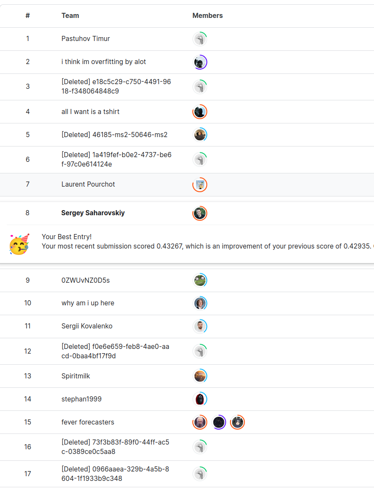
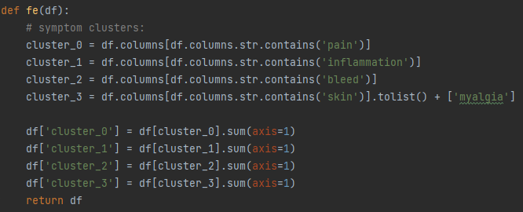
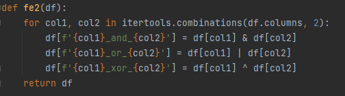

# Playground Series S3E13（媒介传播疾病分类）轻量深读（Tier B）

> 赛事：Playground ｜ 主题 tabular（11 类疾病分类，合成数据）｜ 934 队 ｜ 标准赛 ｜ 指标：MAP@3
> 材料基础：`digests/playground-series-s3e13.md`（6 篇正文：#2 407829 / #3 406409 / #5 406313 / #4 406812 / MAP@3 402411 / 探榜事件 405480；80 条主题索引）+ 3 张归档图
> 轻读时间：2026-10（Tier B B12）

## 1. 一句话重述与数字账

给症状 one-hot 特征预测 11 种媒介传播疾病、按 MAP@3 打分（命中越靠前分越高）。本场最鲜明的特征是**小测试集导致公/私榜剧烈位移**：榜单头名公榜 0.37196 → 私榜 0.53179；#5 用"纯合成数据"的提交公榜更低（0.41501）却在私榜反超混合数据版（0.51535 vs 0.500）；同时出现**机器人探榜**事件（截图中多个 [Deleted] 账号），社区公开质疑小测试集的公平性。

| 关键数字 | 值 | 来源 |
| --- | --- | --- |
| #1（406433，索引） | 公榜 0.37196 → 私榜 0.53179（"Surprisingly #1"） | 主题索引 |
| #2（407829） | 私榜 **0.52521**；XGB `multi:softprob / exact / colsample 0.6 / gamma 0.8 / lr 0.01 / depth 6 / min_child 3 / n_est 300`；4 折 StratifiedKFold（seed 42）；症状聚类 + **两两 AND/OR/XOR 生成 6000+ 特征**，再按 MAP@3 筛选（最终 17 个组合特征） | 407829 |
| #3（406409） | 私榜 **0.52302**（公榜 0.37089）；验证 = **RepeatedStratifiedKFold 10 折 × 10 次**；SVC 基线 0.367±0.025 → +kidney_failure 0.370 → +疼痛类求和 0.375 → 多项式对 `back_pain×yellow_skin` 0.3937 → 再加两对 0.3989；VarianceThreshold=0.1；XGB/SVC/BernoulliNB/NuSVC/LGBM 无权重集成 | 406409 |
| #4（406812） | 不用 CV：RandomForest + **OOB 评分** + Optuna；自述 OOB/公榜/私榜"完全相关" | 406812 |
| #5（406313） | 两份提交对照：混合数据（公 0.43598 / 私 0.500，约前 30）vs **纯合成数据（公 0.41501 / 私 0.51535，第 5）** | 406313 |
| 探榜事件（405480） | 47 票 / 53 评论：测试集小 → 机器人反复提交探榜；截图中出现多个 [Deleted] 账号；作者建议未来加大测试集 | 405480 |
| MAP@3（402411） | 每行第 1/2/3 位命中分别得 1 / 0.5 / 0.333 分，再对行取平均 | 402411 |
| 社区 | "DO NOT use medical knowledge"（35 票 / 24 评论）、LDA 基线 0.41501（21 票）、"Shakeup, scary!"（9 票 / 19 评论） | 索引 |

## 2. 逐方案对照矩阵

| 维度 | #2 | #3 | #4 | #5 |
| --- | --- | --- | --- | --- |
| 模型 | 单 XGB | 5 模型无权重集成 | RandomForest + Optuna | 集成（未公开细节） |
| 验证 | 4 折 StratifiedKFold | 10×10 RepeatedStratifiedKFold | 无 CV（OOB） | 双提交对照 |
| 特征工程 | 症状聚类 + 6000+ 成对逻辑特征 + MAP@3 选择 | 症状名分组求和 + 多项式对 + VarianceThreshold | — | 混合 vs 纯合成 |
| 数据 | 合成 | 合成 | 合成 | 混合 / 纯合成双轨 |
| 结果 | 私 0.52521（2nd） | 私 0.52302（3rd） | — | 私 0.51535（5th） |

## 3. 共识、分歧与裁决

### 共识一：公榜在本场几乎没有参考价值，必须用稳健 CV（#1 位移、#5、#3；置信度高）

头名公榜 0.37196 → 私榜 0.53179；#5 的纯合成版公榜更低但私榜更高；社区帖"Shakeup, scary!"与"Is that Private LB true?"都在讨论这件事。#3 用 10×10 重复分层 CV 来对抗噪声。**裁决**：小测试集 + MAP@k 的场景下，公榜差异是噪声；应把选择建立在重复 CV 上，并留出稳健提交。置信度：高。

### 共识二：小测试集引发探榜/机器人，是赛制层面的系统性风险（405480、405420、截图；置信度中高）

"Here we go, cheating"（47 票 / 53 评论）直指机器人探榜，截图里多名 [Deleted] 账号上榜；另有"Someone is trying so hard to improve his/her public lb score"。**裁决**：测试集规模决定榜分可信度；此类比赛应把"公榜不可信"作为前提，平台侧则应加大测试集。置信度：中高（帖子 + 截图，未见官方处理公告）。

### 共识三：症状 one-hot 的组合逻辑特征是主增益（#2、#3；置信度中高）

#2 用"两两 AND/OR/XOR"生成 6000+ 特征再筛；#3 用症状名分组求和 + 多项式特征对（`back_pain×yellow_skin` 等）。**裁决**：这类高维稀疏 one-hot 医疗症状数据，显式组合特征（逻辑运算/交互对）比换模型更有效。置信度：中高（两个独立方案 + CV 提升链条）。

### 分歧一：混合原始数据 vs 只用合成数据（#5、社区帖；置信度中）

#5 的双提交显示：纯合成版在私榜反超混合数据版（0.51535 vs 0.500）；社区也有"Concatenating the original dataset"与"Is the original dataset worth using"的讨论。**裁决**：合成分布与原始分布存在差异，本场"只用合成"在私榜更稳；是否拼接原始数据应以重复 CV 为准。置信度：中。

### 事件：领域知识在这份合成数据上会误导（35 票帖 + 34 票帖；置信度中）

"DO NOT use medical knowledge on this data!"（35 票 / 24 评论）与"Medical approach to FE"（34 票）形成对照；#2 自述不懂医学、只用简单逻辑组合反而拿到第 2。**裁决**：合成数据的标签机制优先于领域先验；先验证生成过程，再决定是否引入领域特征。置信度：中。

## 4. 证据分级

| 断言 | 等级 | 说明 |
| --- | --- | --- |
| #2 的 6000+ 组合特征与私榜 0.52521 | 自述（含参数/筛选清单）+ 2 图 | 中高 |
| #3 的 CV 提升链条（0.367→0.3989）与私榜 0.52302 | 自述 | 中高 |
| #5 的双提交公私榜对照 | 自述（有 notebook 链接） | 中 |
| #4 的 OOB/公私榜相关性 | 自述（"完全相关"） | 中（样本少） |
| 探榜/机器人 | 帖文 + 截图 | 中高 |
| MAP@3 计分细节 | 官方代码 + 解释帖 | 高 |

## 5. 悬案与缺口（登记）

- #1（406433）与"LDA 基线"（405435）、"#58"（406396）、"31th 用 NLP"（405616）等未收录正文；
- 原始数据拼接的真实增益无交叉验证证据；
- 探榜事件是否被官方处理、[Deleted] 账号的最终处置未知；
- 归档 3 图（截图 + 两段代码）均非分数/分布图；
- **图证缺口**：没有公私榜位移的可视化。

## 6. 图表证据

**图 1**（topic 405480）：榜单截图中多名 [Deleted] 账号——小测试集下机器人探榜的直接证据（"Here we go, cheating"，47 票 / 53 评论）。

**图 2**（topic 407829，#2）：按症状名聚类求和（pain / inflammation / bleed / skin + myalgia）生成 cluster_0–3 特征。

**图 3**（topic 407829，#2）：对全部特征两两做 AND / OR / XOR，生成 6000+ 个候选特征后再按 MAP@3 筛选。

## 7. 出处

- #2（13 票）：https://www.kaggle.com/competitions/playground-series-s3e13/discussion/407829
- #3（19 票）：https://www.kaggle.com/competitions/playground-series-s3e13/discussion/406409
- #5（36 票）：https://www.kaggle.com/competitions/playground-series-s3e13/discussion/406313
- #4（10 票）：https://www.kaggle.com/competitions/playground-series-s3e13/discussion/406812
- MAP@3 解释（47 票 / 15 评论）：https://www.kaggle.com/competitions/playground-series-s3e13/discussion/402411
- 探榜事件（47 票 / 53 评论）：https://www.kaggle.com/competitions/playground-series-s3e13/discussion/405480
- #1 公私榜位移（32 票）：https://www.kaggle.com/competitions/playground-series-s3e13/discussion/406433
- LDA 基线（21 票）：https://www.kaggle.com/competitions/playground-series-s3e13/discussion/405435
- 医疗知识警告（35 票 / 24 评论）：https://www.kaggle.com/competitions/playground-series-s3e13/discussion/403728
