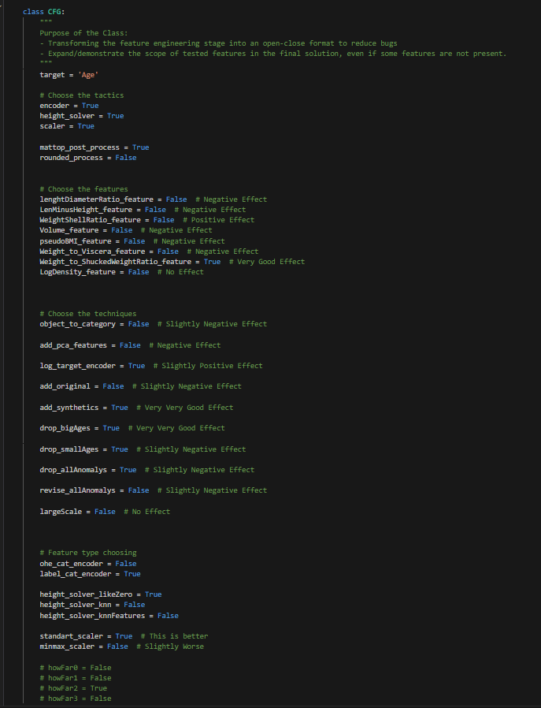

# Playground Series S3E16（鲍鱼年龄预测）轻量深读（Tier B）

> 赛事：Playground ｜ 主题 tabular（回归）｜ 1429 队 ｜ 标准赛 ｜ 指标：MAE（≈1.334）
> 材料基础：`digests/playground-series-s3e16.md`（6 篇正文：1st 416766 / 2nd 416903 / 3rd 416783 / 5th 416769 / 11th 416819 / 高票帖 413750；76 条主题索引）+ 2 张图
> 轻读时间：2026-10（Tier B B10）

## 1. 一句话重述与数字账

预测鲍鱼年龄（MAE）。真正的考点是**"合成数据的生成模型本身可以被逆向利用"**——冠军直接加载生成库里的语言模型做分类器；亚军用它的采样函数生成 20 万行补齐数据，并按测试域裁剪训练集；其余队伍则是"少量比率特征 + LAD 回归/暴力集成"。

| 关键数字 | 值 | 来源 |
| --- | --- | --- |
| 1st（416766） | 最终两份提交都是"安全型"集成：一份是**不同方法模型的简单平均**（防洗牌），另一份用 **Optuna 学权重**（MAE 1.33566）；数据侧尝试：① 自造 200 万+ 行合成数据（增益很小）② 研究竞赛的**数据生成模型**：用其缺失值填补函数（高温度太随机、低温对不上）③ 用其**采样函数**（把行转成随机排列的句子以 "Age is" 结尾，取下一个词预测）——跑了两天也接近不了目标 ④ 把生成模型装进 HuggingFace Transformers，对目标 token 的 logits 取平均后喂 PyTorch Tabular/TabTransformer/CatBoost（一般）⑤ **把生成模型微调成序列分类模型**——这其实是他**最好的提交（1.33383）**，但当时没敢信；CatBoost 一直最稳；后期一度用到 130 个特征 | 416766 |
| 2nd（416903） | 三条主线：① **把训练数据对齐到测试域**——测试集没有 >20 或 <4 岁的鲍鱼，于是**直接删掉年龄 >21 或 <3 的训练行**（留 1–2 年余量更好），"这是对结果影响最大的一步"；② **用竞赛公开的合成数据生成模型生成约 20 万行**，与 7.4 万训练行合并成约 27.4 万行，做 **5 折**使每折约 5.5 万≈测试集 5.6 万 → 提升 CV-LB 相关性；③ Optuna 调 XGB/LGBM/CatBoost/HGBR 并集成；其开源的配置清单（图 1）标注了每个选项的正负效果：**add_synthetics=True（很好）、drop_bigAges=True（很好）、weight_to_shuckedWeightRatio=True（很好）**、log 目标编码略正、标准缩放优于 minmax、类别用 label 编码等 | 416903 |
| 5th（416769） | 完全不预处理；只用 4 个**比率特征**（如 `[] / ([] + [])`、`[] / []` 等）；10 折 + 5 个模型（GradientBoosting 等）+ **LADRegression（最小绝对偏差回归）** 作为集成器——与 MAE 指标天然匹配 | 416769 |
| 11th（416819） | "什么有效、什么无效"的复盘帖（与 1st 的曲折过程呼应） | 416819 |
| 社区侧 | "**没有提交就解出来了。这只蟹有 11 年 Kaggle 经验**"（63 票，梗图/调侃帖）、"把 MAE 降到 1.33708 的特征工程"（48 票）、"数据集领域材料"（46 票）、"**四舍五入还是不四舍五入？**"（37 票）、"我见过最离奇的特征相关性"（21 票） | 社区 |

## 2. 逐方案对照矩阵

| 维度 | 1st | 2nd | 5th |
| --- | --- | --- | --- |
| 生成模型用法 | **装进 HF 后微调成序列分类器（最佳但未信）/logits 取平均** | 用其采样生成 ~20 万行补数据 | 不用 |
| 数据裁剪 | — | **删掉年龄 >21 或 <3 的行（对齐测试域）** | 无预处理 |
| 特征 | 一度 130 特征 | 比率特征 + log 目标编码 | **仅 4 个比率特征** |
| 模型/集成 | 简单平均 + Optuna 加权 | 4 个 GBDT + Optuna | 5 模型 + **LADRegression** |

## 3. 共识、分歧与裁决

### 共识一：本场的数据由"可获取的生成模型"合成 → 逆向它就是最强路线（1st/2nd + 社区）

竞赛数据由某开源库的合成器生成；1st 把生成模型微调成分类器拿到自己最好的分数（1.33383）；2nd 直接调用它生成 20 万行并明确"add_synthetics=True（很好）、drop_bigAges=True（很好）"（图 1）。**裁决**：合成数据赛要尽早确认"生成器是否公开/可调用"；能用生成器补数据或做目标域对齐，胜过调模型。置信度：高。

### 共识二：对齐"训练域→测试域"能显著提升（2nd，5th 的极简反证）

2nd 删掉测试集不可能出现的年龄区间（最大单点增益）；5th 只用 4 个比率特征也拿到第 5。**裁决**：先审计"测试集不可能出现的取值"，把训练数据裁到目标域；特征工程的收益上限并不高（4 个比率即可进前 5）。置信度：高。

### 共识三：集成器要对齐指标（5th 的 LAD；1st 的平均/加权）

MAE 指标下 5th 用 **LADRegression**（最小绝对偏差）作为集成器；1st 用简单平均与 Optuna 加权。**裁决**：集成器的损失应与评测指标一致（MAE → LAD/中位数型聚合）。置信度：中高。

### 分歧一：要不要信任"非主流"强模型

1st 的最佳提交（生成模型微调分类器，1.33383）因"不敢信"未入选；他最终选了两份"安全"集成。**裁决**：把非主流模型作为**第二提交**，与安全集成形成对冲——正是"两个提交"赛制该有的用法。置信度：中高。

### 事件：合成数据的随机性与"round or not"

1st 明确指出"部分数据有点随机"；社区讨论"是否四舍五入预测值"（37 票）与"最离奇的特征相关性"（21 票）。**裁决**：合成数据的离散化/取整结构要显式验证（可能影响 MAE 的舍入误差）。置信度：中。

## 4. 证据分级

| 断言 | 等级 | 说明 |
| --- | --- | --- |
| 1st 的生成模型三种用法与 1.33383 | 自述（含失败细节） | 中高 |
| 2nd 的域裁剪 + 20 万合成行 + 图 1 配置清单 | 自述 + 配置截图 | 高 |
| 5th 的 4 比率特征 + LADRegression | 自述 + 公开 notebook | 中高 |
| "round or not"的讨论 | 社区帖 | 中 |
| 生成器可获取 | 多队独立使用 | 高 |

## 5. 悬案与缺口（登记）

- 3rd/4th/6th–10th 的方案未细读；"MAE 1.33708 的特征工程"（48 票）与"领域材料"（46 票）未细读；
- 1st 的 130 特征清单与 Optuna 集成细节未展开；
- 生成模型的具体库名/版本未在材料中给出（社区帖标题有暗示）；
- 归档 2 图：2nd 的配置清单截图（图 1）为关键图证。

## 6. 图表证据

**图 1**（topic 416903）：2nd 的类配置清单，逐项标注效果——`add_synthetics=True`（Very Very Good Effect）、`drop_bigAges=True`（Very Very Good Effect）、`weight_to_shuckedWeightRatio_feature=True`（Very Good Effect）；`lengthDiameterRatio/LemMinusWeight/Volume` 等为负面效果；`log_target_encoder` 略正；`standard_scaler` 优于 minmax；类别用 label 编码。这是"合成器补数据 + 域裁剪 = 本场最大增益"的当事证据。

## 7. 出处

- 1st（24 票）：https://www.kaggle.com/competitions/playground-series-s3e16/discussion/416766
- 2nd（19 票）：https://www.kaggle.com/competitions/playground-series-s3e16/discussion/416903
- 5th（23 票）：https://www.kaggle.com/competitions/playground-series-s3e16/discussion/416769
- 11th（273 行处）：https://www.kaggle.com/competitions/playground-series-s3e16/discussion/416819
- 特征工程 1.33708（48 票）：https://www.kaggle.com/competitions/playground-series-s3e16/discussion/415721
- round or not（37 票）：https://www.kaggle.com/competitions/playground-series-s3e16/discussion/413971
