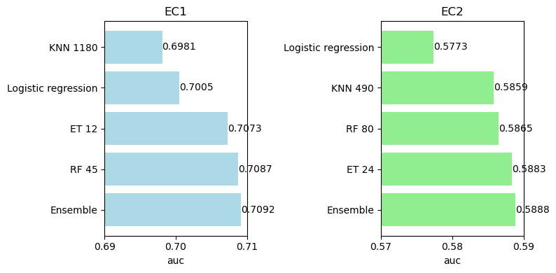

# Playground Series S3E18（酶底物 EC1/EC2 多标签）轻量深读（Tier B）

> 赛事：Playground ｜ 主题 tabular（分子多标签二分类，AUC）｜ 1047 队 ｜ 标准赛 ｜ 截止 2023-07-10
> 材料基础：`digests/playground-series-s3e18.md`（6 篇正文：中期总结 421462 / 领域知识 419646 / 起步资源 419645 / 1st 432011 / 11th 423642 / "不是多标签而是两场比赛" 420127；66 条主题索引）+ 1 张归档图
> 轻读时间：2026-10（Tier B B19）

## 1. 一句话重述与数字账

对分子（38 列分子描述符、14.8k 行）预测两个二分类标签 **EC1（氧化还原酶）与 EC2（转移酶）**，按两列 AUC 平均计分。本场的核心洞见来自 AmbrosM：**这不是一道多标签题，而是"两场比赛"**——EC1 上树模型最好而 EC2 上 Bagged KNN 最好，线性模型在 EC1 有竞争力、在 EC2 垫底；EC2 的天花板只有约 0.58–0.59（接近全 1 基线），前排甚至放弃在 EC2 上做集成。另一条主线是数据清洗：`-666` 错误值、重复行、`fr_COO2` 近常数、test 端 OOD 类别值。

| 关键数字 | 值 | 来源 |
| --- | --- | --- |
| 规模与数据 | **1047 队**；38 列 / **14.8k 行**；目标是 EC1/EC2（训练里还有 EC3–EC6，但测试里没有）；原始数据集 3 个 csv、每个 200–500 列 | 419646 / 419721 |
| "两场比赛"证据（图） | EC1：KNN(1180) 0.6981、LR 0.7005、ET(12) 0.7073、RF(45) 0.7087、Ensemble 0.7092；EC2：LR 0.5773、KNN(490) 0.5859、RF(80) 0.5865、ET(24) 0.5883、Ensemble 0.5888 | 420127 |
| EC2 最佳单模型 | **Bagged KNN**（KNN 套在 BaggingClassifier 里，log1p + StandardScaler + distance 权重）——30 票 / 24 评论专帖 | 420822 |
| 特征选择 | EC1 约 **19 个重要特征**，EC2 只有约 **7 个**；10 个高度相关特征（BertzCT/ExactMolWt/HeavyAtomMolWt/Chi 系列）可 PCA 合 1 | 421210 |
| 11th（423642） | 删 `HeavyAtomMolWt` 与 `fr_COO2`（99% 与 fr_COO 相同）、删 `FpDensityMorgan1 == -666` 记录、去重 → 训练 **15824 行**；EC1 CatBoost+LGBM+XGB（Optuna）OOF **0.71205**；EC2 约 0.58，集成无法超过 0.592，最终用公开方案预测；**私榜 0.66095 → 第 11** | 423642 |
| 1st（432011） | `MultiOutputClassifier` + XGBoost/LightGBM 双流水线；`RepeatedMultilabelStratifiedKFold`；groupby 组合特征；两模型预测取平均；**注：帖子提到的 `mixed_desc` 列不在本场数据字典中，疑为模板复用错误（登记）** | 432011 |
| 指标实现 | 正确口径是**每列 AUC 再平均**；把两列堆叠算 GINI 的实现会给出偏乐观分数（"Implementing the metric optimally" 23 票 / 8 评论） | 421149 |
| 清洗/异常清单 | `FpDensityMorgan1=-666`（"trains to hell"）；`fr_COO/fr_COO2` 出现 test 有 train 无的取值；`NumHeteroatoms` 40/48 两边都没有；负氢原子数；`HeavyAtomMolWt > ExactMolWt`；近完美相关特征 | 419692 / 419651 / 420455 / 421921 / 419914 |

## 2. 逐方案对照矩阵

| 维度 | 1st（多输出） | 11th（全拆两题） | AmbrosM 论证（420127/420822） |
| --- | --- | --- | --- |
| 目标处理 | MultiOutput 一次训两列 | EC1/EC2 完全分开 | 明确拆成两场比赛 |
| 模型 | XGB + LGBM 双流水线 | EC1 三模型 Optuna 集成；EC2 借公开方案 | EC1 树模型；EC2 Bagged KNN |
| 特征 | groupby 组合特征 | 删冗余列 + 删 -666 + 去重 | 每目标单独特征选择（19 vs 7） |
| CV | RepeatedMultilabelStratifiedKFold | 多折 OOF | 目标级调参对比 |
| 结果 | 冠军（无公开分数表） | 私榜 0.66095 / 第 11 | 方法学结论 |

## 3. 共识、分歧与裁决

### 共识一："多标签"是标题不是约束，两目标要分别验证（420127 / 420822 / 423642；置信度中高）

EC1/EC2 的最优模型族、邻居数、线性可分性都不同；11th 用"拆开 + EC2 借公开方案"进前 11。**裁决**：开赛先花一小时做"每目标各自小调参"实验；若最优模型不同，按两题建模并分别做特征选择。置信度：中高。

### 分歧：MultiOutput 也能赢（432011 vs 420127；置信度中）

1st 用多输出 XGB+LGBM 夺冠，说明重特征工程可以掩盖双目标的异质性。**裁决**：拆/合不是教条——先按"两场比赛"验证，但保留多输出作为对照；冠军配方里的关键其实是 groupby 组合特征与多层 CV。置信度：中。

### 共识二：EC2 天花板低，过度优化会过拟合（423642 / 420822 / 421210；置信度中高）

EC2 AUC 约 0.58–0.59，仅略好于全 1 分类器；11th 的集成无法超过 0.592，索性单模型。**裁决**：给 EC2 设定"够了就停"的预算（特征精简 + 简单模型），把算力投给 EC1。置信度：中高。

### 事件一：清洗三件套直接换分（423642 / 419692 / 419651；置信度中高）

删 `-666`、删重复行、删近常数冗余列是 11th 的显式前置；OOD 类别值可用**频率编码**（只告诉模型"这个值很稀有"，不暴露未见取值）。**裁决**：把这三项写进基线模板；test 端未见类别先做频率编码或裁剪，别让树模型随机外推。置信度：中高。

### 事件二：指标实现必须对齐定义（421149；置信度高）

每列 AUC 平均 vs 堆叠 GINI 的差异会让本地分数失真，影响提交选择。**裁决**：用官方定义的逐列平均实现本地 CV；公开 notebook 的分数口径先复核再参考。置信度：高。

### 事件三：原数据集可以并入（419685；置信度中）

有人用对抗验证确认原数据与竞赛数据同分布、可安全合并。**裁决**：并入前跑对抗验证；本场结论支持并入，但要用 CV 验证收益。置信度：中。

## 4. 证据分级

| 断言 | 等级 | 说明 |
| --- | --- | --- |
| "两场比赛"的模型对比 | 自述 + 双面板柱状图（420127） | 高（图与代码可复算） |
| EC2 最佳单模型 Bagged KNN | 高票帖 + 可运行代码（420822） | 中高 |
| 特征重要性 19 vs 7 | 社区帖 + 评论实验（421210 / 420438） | 中 |
| 11th 的清洗与分数 | 自述 + notebook（423642） | 中高 |
| 1st 的多输出配方 | 自述（含可疑列名，432011） | 中低（细节不足） |
| 指标实现差异 | 社区帖 + 代码（421149） | 中高 |

## 5. 悬案与缺口（登记）

- 1st 帖子提到的 `mixed_desc` 列与本场数据字典不符，疑似模板/复制错误，方法细节无法完全复核；
- 1st 未公开分数表与完整特征清单；
- EC2 的可学上限是否真的只有 ~0.59，无官方口径；
- 原始数据集的最优使用方式未统一（对抗验证只证明分布一致）；
- **图证缺口**：无（1 张图，已内嵌）。

## 6. 图表证据

**图**（topic 420127，AmbrosM）：左 EC1（KNN 1180/0.6981、LR 0.7005、ET 12/0.7073、RF 45/0.7087、Ensemble 0.7092）vs 右 EC2（LR 0.5773、KNN 490/0.5859、RF 80/0.5865、ET 24/0.5883、Ensemble 0.5888）——同一批模型在两个目标上的排序完全反转，"两场比赛"结论的直接证据。

## 7. 出处

- "不是多标签，而是两场比赛"（39 票 / 14 评论）：https://www.kaggle.com/competitions/playground-series-s3e18/discussion/420127
- EC2 最佳单模型 Bagged KNN（30 票 / 24 评论）：https://www.kaggle.com/competitions/playground-series-s3e18/discussion/420822
- 中期总结（41 票 / 2 评论）：https://www.kaggle.com/competitions/playground-series-s3e18/discussion/421462
- 指标最优实现（23 票 / 8 评论）：https://www.kaggle.com/competitions/playground-series-s3e18/discussion/421149
- EC2 少即是多（13 票 / 7 评论）：https://www.kaggle.com/competitions/playground-series-s3e18/discussion/421210
- 领域知识（48 票 / 20 评论）：https://www.kaggle.com/competitions/playground-series-s3e18/discussion/419646
- 起步资源（52 票 / 24 评论）：https://www.kaggle.com/competitions/playground-series-s3e18/discussion/419645
- 1st 方案（11 票 / 3 评论）：https://www.kaggle.com/competitions/playground-series-s3e18/discussion/432011
- 11th 方案（24 票 / 11 评论）：https://www.kaggle.com/competitions/playground-series-s3e18/discussion/423642
- `-666` 异常值（0 票 / 5 评论）：https://www.kaggle.com/competitions/playground-series-s3e18/discussion/419692
- OOD 类别值与频率编码（7 票 / 5 评论）：https://www.kaggle.com/competitions/playground-series-s3e18/discussion/419651
- 对抗验证原数据可用（8 票 / 5 评论）：https://www.kaggle.com/competitions/playground-series-s3e18/discussion/419685
