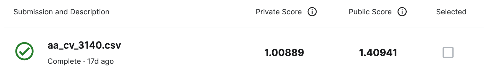

# Playground Series S3E21（Data-Centric：改进固定模型）轻量深读（Tier B）

> 赛事：Playground ｜ 主题 tabular（**只能改数据、不能改模型**）｜ 955 队 ｜ 标准赛 ｜ 指标：官方称 59109-datacentric-playground（赛中由 MAE 改为 RMSE）
> 材料基础：`digests/playground-series-s3e21.md`（6 篇正文：66th 438609 / 23rd 438824 / Missed 2nd 438635 / 4th 439142 / DCAI 综述 433516 / 资源 433491；80 条主题索引）+ 1 张归档图
> 轻读时间：2026-10（Tier B B15）

## 1. 一句话重述与数字账

Kaggle 罕见的赛制：**模型固定、只允许改数据**——用数据清洗/重标注来提升固定 RandomForest 的表现。本场因此是"数据质量"的实战演练，也是"清洗收益极不确定"的警告：66th 的作者自述**"原样提交原始竞赛数据的成绩是我的第二好"**；另有帖称未经修改的 `sample_submission.csv` 就能进私榜前 200。有效手段集中在异常值处理（IsolationForest 行/列过滤、物理范围截断 + 迭代插补、移除 top-N 误差样本）与主动学习/伪标签。

| 关键数字 | 值 | 来源 |
| --- | --- | --- |
| 66th（438609） | **物理范围截断（Censor）+ IterativeImputer + RF** 打包进 Pipeline，把"合理范围"当超参用 RandomizedSearchCV 搜：`O2_1` 的最优通过区间 4.5–14.3（与物理合理区间 0–20 的紧子集吻合）；自述"原样提交原始数据是第二好成绩" | 438609 |
| 23rd（438824） | IsolationForest 两法：Method #1 按行去异常（contamination=0.05，3500→**3325 行**，私榜 **1.01699 → 第 23**）；Method #2 **逐列**去异常后删含 NaN 行（3500→**2687 行**，私榜 **1.01535，估计第 12，未被选中**）；作者称该法"未来很多场景都有用" | 438824 |
| Missed 2nd（438635） | **主动学习**（active learning）方案：私榜 **1.00889** / 公榜 1.40941，**未选中**（截图）；代码计划后续公开 | 438635 |
| 4th（439142） | 关键词 = **Objective remove top-N errors**：移除模型误差最大的 top-N 样本；作者赛末才加入、跟着 MIT DCAI 课走，本想用 cleanlab 但回归任务不适用 | 439142 |
| DCAI 资源（433516、433491） | MIT DCAI 讲座系列（35 票）；Andrew Ng"数据一致性至上、固定模型改数据"；Google 研究：数据级联问题发生率 92% | 433516 / 433491 |
| 社区 | "伪标签有效"（32 票 / 15 评论）；"原始 train 数据可能有危险"（32 票 / 11 评论）；"单个样本的力量"（31 票 / 6 评论）；"评估 IsolationForest"（30 票 / 8 评论）；"从零构造提交"（25 票）；"现在不该信公榜"（20 票 / 27 评论）；MAE→RMSE 指标改动（20 票 / 3 评论）；"不要 clipping"（4 票）vs "clipping 真有帮助吗"（20 票 / 18 评论） | 索引 |

## 2. 逐方案对照矩阵

| 维度 | 66th | 23rd | 4th | Missed 2nd |
| --- | --- | --- | --- | --- |
| 清洗方法 | 物理范围截断 + 迭代插补 | IsolationForest（行/列两版） | 移除 top-N 误差样本 | 主动学习 |
| 超参化 | Censor 区间进 CV 搜索 | contamination | N | — |
| 结果 | 66th（原数据第 2 好） | 23rd（未选版估 12th） | 4th | 私 1.00889（未选） |

## 3. 共识、分歧与裁决

### 共识一：本场唯一可控的杠杆是"异常值/错误值处理"（66th、23rd、4th；置信度中高）

物理范围截断+插补、IsolationForest 行/列过滤、移除 top-N 误差样本——三种方法都刻意把"数据集本身"当模型来调。**裁决**：固定模型赛的核心动作 = 检测并修正脏样本；做法要参数化并放进 CV。置信度：中高。

### 事件一：数据清洗的收益高度不确定（66th、438597；置信度中高）

原样提交是 66th 作者的第二好；未修改的 sample_submission 进私榜前 200；"原始 train 数据可能有危险"（32 票）。**裁决**：本赛的清洗收益与风险都不对称——删错样本的代价可能与修正错误相当；必须用 CV 与多份提交对冲。置信度：中高。

### 事件二：主动学习/伪标签是另一条有效路线（Missed 2nd、433531；置信度中）

主动学习方案拿到私榜 1.00889（未选中）；"伪标签有效"帖 32 票。**裁决**：当"改数据"是唯一自由度时，用模型反馈主动选择/重标注样本是高价值方向。置信度：中。

### 事件三：赛制/指标变动与公榜不可信（434071、434376；置信度中高）

赛中把 MAE 改成 RMSE；"现在不该信公榜"帖 20 票 / 27 评论。**裁决**：赛制不稳定时更要靠 CV 与稳健提交，别追公榜。置信度：中高。

### 事件四：提交选择失血（23rd、Missed 2nd；置信度中高）

23rd 弃用了估计第 12 的逐列版本；Missed 2nd 的主动学习未选中。**裁决**：清洗类比赛候选提交之间的方差大，应按"清洗强度"分档提交。置信度：中高。

## 4. 证据分级

| 断言 | 等级 | 说明 |
| --- | --- | --- |
| 23rd 的两版 IsolationForest 与分数 | 自述 + notebook | 中高 |
| 66th 的 Censor+插补流程 | 自述（含代码） | 中高 |
| Missed 2nd 的私榜 1.00889 | 截图 | 中（无方法细节） |
| "原样提交第二好/前 200" | 自述 + 低票帖 | 中 |
| DCAI 理论资源 | MIT 课程/Andrew Ng 引用 | 中高（背景） |

## 5. 悬案与缺口（登记）

- 1st–3rd、5th–22nd 方案未收录（不少为低票 write-up）；
- 主动学习的实现细节未公开；
- 指标 MAE→RMSE 对排名的影响未量化；
- **图证缺口**：仅 1 张提交截图。

## 6. 图表证据

**图 1**（topic 438635，Missed 2nd）：`aa_cv_3140.csv` 私榜 1.00889 / 公榜 1.40941，未被勾选——"未选提交本可第 2"的直接证据。

## 7. 出处

- 66th 清洗流程（8 票）：https://www.kaggle.com/competitions/playground-series-s3e21/discussion/438609
- 23rd IsolationForest（10 票）：https://www.kaggle.com/competitions/playground-series-s3e21/discussion/438824
- Missed 2nd / 主动学习（9 票）：https://www.kaggle.com/competitions/playground-series-s3e21/discussion/438635
- 4th remove top-N errors（11 票）：https://www.kaggle.com/competitions/playground-series-s3e21/discussion/439142
- Data-centric 方法与理论（44 票 / 3 评论）：https://www.kaggle.com/competitions/playground-series-s3e21/discussion/433516
- DCAI 资源（35 票 / 16 评论）：https://www.kaggle.com/competitions/playground-series-s3e21/discussion/433491
- 伪标签有效（32 票 / 15 评论）：https://www.kaggle.com/competitions/playground-series-s3e21/discussion/433531
- 原始 train 数据可能有危险（32 票 / 11 评论）：https://www.kaggle.com/competitions/playground-series-s3e21/discussion/434969
- 不该信公榜（20 票 / 27 评论）：https://www.kaggle.com/competitions/playground-series-s3e21/discussion/434376
