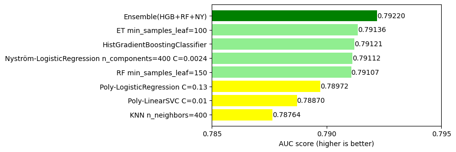
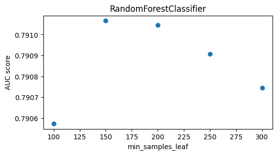

# Playground Series S3E23（软件缺陷预测）轻量深读（Tier B）

> 赛事：Playground ｜ 主题 tabular（软件缺陷二分类，ROC AUC）｜ 1702 队 ｜ 标准赛 ｜ 截止 2023-10-23
> 材料基础：`digests/playground-series-s3e23.md`（6 篇正文：爬山集成 444784 / 入门材料 444629 / McCabe-Halstead 指标 444685 / #2 八模型集成 450315 / 胜利说明书 445245 / 数据解释 444627；64 条主题索引）+ 6 张归档图
> 轻读时间：2026-10（Tier B B18）

## 1. 一句话重述与数字账

用静态代码度量（LOC / McCabe / Halstead）预测模块是否有缺陷（ROC AUC）。本场是**"流程 > 奇技淫巧"的教科书**：117 票的《Instructions for winning》给出七模型配方（6 树 + 1 非树）与"CV 决定一切、权重按 CV 调"的完整流程；#2 用 8 模型 + 爬山集成把 LB 从 0.7907 推到 0.79101，并留下一个未选用的版本私榜 0.79379。PCA/t-SNE/聚类全部无效——增益只来自**预处理、逐模型调参和多样性集成**。

| 关键数字 | 值 | 来源 |
| --- | --- | --- |
| 规模与规则 | **1702 队**；ROC AUC；3 周赛程、**每天 5 次提交**——"几百个模型只能靠 CV 评估" | 445245 / 索引 |
| 七模型配方（117 票） | RF / ET / HistGB / XGB / LGBM / CatBoost + **一个非树模型**（首选 Nyström 核近似 + LogisticRegression）；预处理与超参逐模型调优；集成权重只在 CV 上搜 | 445245 |
| 单模型 vs 集成（bar chart） | **Ensemble(HGB+RF+NY) 0.79220** > ET(leaf=100) 0.79136 > HistGB 0.79121 > Nyström-LR 0.79112 > RF(leaf=150) 0.79107 > Poly-LR 0.78972 > Poly-SVC 0.78870 > KNN 0.78764 | 445245 |
| #2 八模型集成 | 无变换基线 CV **0.793** / LB **0.790**；输入 log 变换后树模型小幅提升；6 树爬山集成 LB **0.7907**（该版本私榜 **0.79379**）→ +Nyström LR **0.79099** → +NN **0.79101**（最终还选了另一个 LB 略高的版本，上述版本未选用） | 450315 |
| 爬山集成（48 票） | 6 棵树的预测线性组合，**允许负权重**；每次加入使 CV AUC 提升的模型/权重，直到不再改善 | 444784 |
| 无效尝试 | PCA（10 主成分解释 >99% 方差但掉分）、t-SNE 可视化、聚类 + cluster 目标编码——均无提升 | 450315 |
| 数据背景 | 原始数据 22 属性：5 个 LOC 度量、3 个 McCabe（loc/v(g)/ev(g)/iv(g)）、4 个基础 + 8 个派生 Halstead、branchCount、defects 目标 | 444627 / 444685 |
| 数据审计线索 | 准重复观测（13 票）、完全相关特征、原始数据预处理（9 票）、"Important information regarding features"、"Sometimes more is better... well a bit better"——索引可见但正文未归档 | 444988 / 445099 / 444640 / 445196 / 446606 |

## 2. 逐方案对照矩阵

| 维度 | 胜利说明书 445245 | #2 八模型 450315 | 爬山教程 444784 |
| --- | --- | --- | --- |
| 模型 | 7 个（6 树 + 1 非树） | 6 树 + Nyström LR + NN = 8 | 6 棵树 |
| 预处理 | 逐模型实验（log/FE/选择/缩放） | 全特征 log 变换 | 未展开 |
| 集成 | 权重按 CV 调 | 先爬山，再与 LR/NN 二次融合 | 爬山（允许负权重） |
| 验证 | Stratified/Repeated KFold | 交叉验证 + OOF | 折内 OOF AUC |
| 结果 | 宣称可进前 10% | LB 0.7907→0.79101 | 教程 + 代码 |

## 3. 共识、分歧与裁决

### 共识一：CV 是唯一评估预算，"无 CV 的公开 notebook 直接忽略"（445245 + 450315；置信度中高）

每天 5 次提交、3 周要评估数百模型，公榜方差又大；攻略帖直接给出筛选纪律：无 CV 的公开 notebook 不看、CV 低的公开 notebook 不看。**裁决**：把 CV 当"评估预算"管理；所有提交选择、权重、预处理决策都在 CV 上做。置信度：中高。

### 共识二：集成必须跨家族，non-tree 成员是配方硬性要求（445245 + 450315 + 444784；置信度中高）

bar chart 里最好的 single 是 ET 0.79136，而 HGB+RF+NY 集成 0.79220；#2 加 Nyström LR（+0.00029）与 NN（+0.00002）虽增益很小但方向一致。**裁决**：先保证 6 类树模型的多样性，再强塞一个不同家族（核近似 LR / NN）做互补；不指望大树单模型。置信度：中高。

### 共识三：集成权重是超参数，且爬山法在 AUC 上简单有效（445245 + 444784 + 450315；置信度中高）

攻略帖明确"权重也要在 CV 上调，别调公榜"；爬山帖给出允许负权重的迭代实现，被 #2 直接复用。**裁决**：优先用 hill climbing / scipy 权重搜索，配合 OOF 预测保存，避免手拍权重。置信度：中高。

### 事件一：log 变换输入有小幅增益（445015 + 450315；置信度中）

27 票提示"log-transform the data!"（源自 ambrosm），#2 实测对多数树/提升模型有小幅提升。**裁决**：偏态度量特征先做 log 变换再进树模型；增益虽小，但在 0.79 的密集分带上值得拿。置信度：中。

### 事件二：复杂降维/聚类在本场无效（450315；置信度中）

PCA（10 成分 >99% 方差）掉分，t-SNE 无可分性，聚类 + target encoding 无提升。**裁决**：特征已是高相关代码度量的衍生集合时，优先"保留 + 变换"而不是降维；PCA 更适合压缩算力而非提分。置信度：中。

### 分歧：数据审计的必要性（444988 / 445099 / 444640 vs 主流程帖；置信度中低）

索引可见准重复、完全相关特征、原始数据预处理等审计帖，但攻略/方案正文未系统展开。**裁决**：开赛先做重复行与相关特征审计（同期 S3E9 的重复行目标分箱就是增益案例）；本场归档不足以量化其影响，保持中低置信度。置信度：中低。

## 4. 证据分级

| 断言 | 等级 | 说明 |
| --- | --- | --- |
| 七模型配方与 CV 论证 | 高票攻略（445245）+ bar chart | 中高（自述 + 图） |
| 单模型/集成分数对比 | 图（445245_img/01） | 中高 |
| #2 的 0.7907→0.79101 与私榜 0.79379 | 自述 + 4 张截图（450315） | 中高（LB 截图） |
| 爬山集成实现 | 代码帖（444784） | 中高 |
| log 变换增益 | 提示帖 + #2 自述（445015 / 450315） | 中 |
| 数据背景（22 属性） | 数据说明帖（444627 / 444685） | 高 |

## 5. 悬案与缺口（登记）

- #1 方案未归档；"Visualizing the shakeup"（27 票）与"Sometimes more is better"只有索引；
- "Important information regarding features" 正文未收录，特征生成细节缺失（445196）；
- 准重复观测与完全相关特征的影响未量化（444988 / 445099）；
- #2 最终选用的提交分数细节只剩截图，未给完整 CV 对照；
- **图证缺口**：无（6 张图，本深读内嵌 3 张）。

## 6. 图表证据

**图 1**（topic 445245）：AUC 对比——Ensemble(HGB+RF+NY) **0.79220** 高于最好单模型 ET 0.79136；Poly-LR/ SVC/ KNN 等非树单模型明显更弱，说明"非树成员"的价值在集成里而非单跑。

**图 2**（topic 445245）：RandomForestClassifier 的 min_samples_leaf 对 AUC 的影响（150–200 附近最优）——攻略帖"每个模型都要逐参调优"的例证。

**图 3**（topic 450315，#2）：Hill_Ensemble_stacker_submission_1.csv——public **0.7907** / private **0.79379**；该版本随后被 #2 与 Nyström LR、NN 继续融合。

## 7. 出处

- 胜利说明书（117 票 / 49 评论）：https://www.kaggle.com/competitions/playground-series-s3e23/discussion/445245
- #2 八模型集成（95 票 / 42 评论）：https://www.kaggle.com/competitions/playground-series-s3e23/discussion/450315
- 爬山集成教程（48 票 / 19 评论）：https://www.kaggle.com/competitions/playground-series-s3e23/discussion/444784
- 数据解释（49 票 / 16 评论）：https://www.kaggle.com/competitions/playground-series-s3e23/discussion/444627
- McCabe/Halstead 指标（32 票 / 11 评论）：https://www.kaggle.com/competitions/playground-series-s3e23/discussion/444685
- 入门材料（43 票 / 14 评论）：https://www.kaggle.com/competitions/playground-series-s3e23/discussion/444629
- log 变换提示（27 票 / 8 评论）：https://www.kaggle.com/competitions/playground-series-s3e23/discussion/445015
- 准重复观测（13 票 / 2 评论）：https://www.kaggle.com/competitions/playground-series-s3e23/discussion/444988
- 完全相关特征（7 票 / 1 评论）：https://www.kaggle.com/competitions/playground-series-s3e23/discussion/445099
- 原始数据预处理（9 票 / 6 评论）：https://www.kaggle.com/competitions/playground-series-s3e23/discussion/444640
