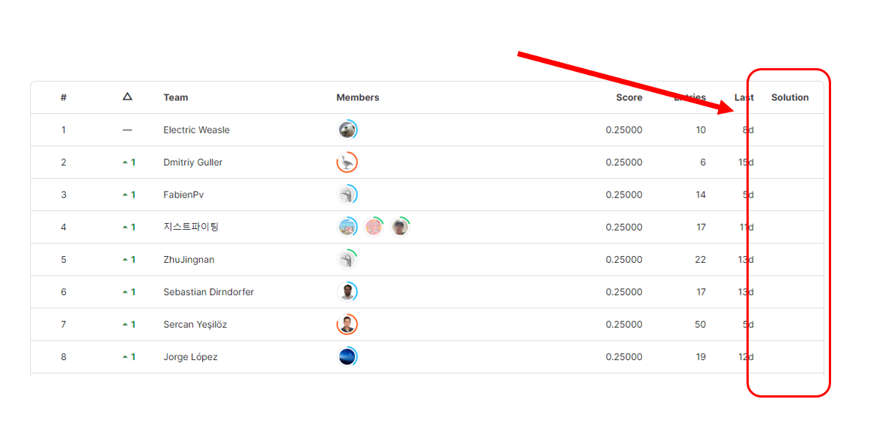

# Playground Series S3E25（莫氏硬度回归）轻量深读（Tier B）

> 赛事：Playground ｜ 主题 tabular（矿物莫氏硬度回归，MedAE）｜ 1632 队 ｜ 标准赛 ｜ 截止 2023-12-04
> 材料基础：`digests/playground-series-s3e25.md`（6 篇正文：起步参考 455241 / 样本权重 455888 / 数据分箱事实 457631 / 引用缺失抱怨 458154 / 树模型表现提问 456721 / 如何把 notebook 挂到 Solution 列 460423；74 条主题索引）+ 1 张归档图
> 轻读时间：2026-10（Tier B B19）

## 1. 一句话重述与数字账

预测矿物莫氏硬度（**MedAE**，中位绝对误差）。本场是把"指标数学结构"玩明白的教科书：74 票的样本权重帖指出 **MedAE 只取决于误差中位数那一个样本**——极容易和极难的样本几乎不影响分数，给它们 0.01 权重后 CV 直接 +0.03；54 票的分箱帖进一步发现训练集按 9 个硬度值分箱后 **89.5% 的样本落在 ±0.25 内**，理论上测试集只要"猜对 56% 的整数档"就能拿到 0.25。社区两极分化：NN 表现异常好、树模型徘徊在 0.49，很多提交堆在 0.25。

| 关键数字 | 值 | 来源 |
| --- | --- | --- |
| 规模与指标 | **1632 队**；MedAE；截止 2023-12-04；74 条讨论 | 索引 |
| 样本权重（74 票 / 35 评论） | 论证：若 10001 个样本里 5000 个误差 ≤0.4、其余 5000 个误差千万，分数仍是 0.4；因此只管"可能成为中位数"的样本。实现：对 `AE ≤ 0.06` 或 `≥ 0.7` 的样本给 **0.01 权重**，同一 LGBM 的 CV **+0.03** | 455888 |
| 数据分箱（54 票 / 42 评论） | 9 个档位（1.75/2.55/3.75/4.75/5.75/6.55/7.75/8.75/9.75）：**9533 个样本在 ±0.25 内、873 个在外（89.5%）**；若测试同分布，**猜对约 56% 即可 MedAE=0.25** | 457631 |
| 基线/分布 | LAD Stacker 基线 **LB 0.49737**；树模型（RF/GB/XGB/LGBM/HistGB 及集成）最低约 **0.49**；NN 被社区报告明显更强；**200+ 份提交卡在 0.25** | 455289 / 456721 / 459308 |
| 指标/做法讨论 | "MedAE 解释" 32 票；"Kaggle 硬度、莫氏与 MedAE" 30 票；"对 MedAE 的个人思考" 22 票；"什么是 baseline" 20 票；"零分可否达到" 25 评论；"分类反而更好" 9 评论 | 索引 |
| 数据/流程热帖 | 数据清洗与模型技巧 24 票；CV 策略提醒 26 票；准重复/边界样本警告 17 票；提交报错 36 评论；GANDALF 12 票；OpenFE 生成 375 特征；近邻特征；NN 收敛/过拟合讨论 | 455273 / 457338 / 455519 / 456076 |
| 社区文化事件 | 40 票帖投诉"几乎全部好分数 notebook 都抄自我的基线且不留引用"——Playground 无奖牌，但引用规范仍被强调 | 458154 |

## 2. 逐方案对照矩阵

| 维度 | 权重派（455888） | 分箱/分类派（457631 / 457465） | 模型派（456721 / 456417） |
| --- | --- | --- | --- |
| 核心 | 只拟合可能成为中位数的样本 | 离散到硬度档位，命中即 0 误差 | NN vs 树模型 |
| 手段 | 对易/难样本降权（0.01） | 9 档 + 分类/取整 | LAD/量化损失、特征选择 |
| 证据 | CV +0.03 | 89.5% 落在 ±0.25 | 树 ≈0.49；NN 更好 |
| 风险 | 权重阈值是经验值 | 依赖测试同分布 | NN 收敛/过拟合难控 |

## 3. 共识、分歧与裁决

### 共识一：MedAE 奖励"分布形状"而非平均精度（455888 / 457631；置信度高）

指标只看中位数误差：两端误差无关紧要；把 9 档中 56% 猜对就能到 0.25。**裁决**：先做"把预测值向训练分布的分位/档位塑形"的后处理与损失设计，再谈模型微调；这也是本场 200+ 提交卡在 0.25 的原因。置信度：高（数学直推 + 自述实验）。

### 共识二：对两端样本降权是低成本的直接增益（455888；置信度中高）

阈值（0.06 / 0.7）是拍出来的，但"只保留中位数附近样本"的逻辑与指标完全一致，作者实测 CV +0.03。**裁决**：用 CV 扫一遍阈值与权重；至少把"极端易/难"样本降权作为默认基线。置信度：中高。

### 分歧：回归 vs 分类（457631 / 457465 vs 树模型帖；置信度中）

离散化/分类能利用"命中即 0"的结构，但需要准确的档位概率；树回归最优约 0.49，NN 更好。**裁决**：两条路都做（回归输出塑形 + 档位分类概率），用 CV 的 **MedAE**（不是 RMSE/ACC）比较后再融合。置信度：中。

### 事件一：CV 必须复制 MedAE 的口径（457338 / 455289；置信度中高）

用 RMSE/MSE 早停会选到与 MedAE 不一致的模型；社区提醒建立可信 CV，并把 LAD/MAE 目标作为稳健基线。**裁决**：训练目标与早停指标都用 MAE/MedAE 类口径；CV 分折固定随机种子便于对比。置信度：中高。

### 事件二：准重复与边界值会放大指标方差（455519 / 455273；置信度中）

MedAE 只取单点，若测试含与训练重复的行，会直接决定分数。**裁决**：做跨 train/test 的近重复检查；对重复行做一致的预测处理，避免"随机猜中/猜错"主导结果。置信度：中。

### 事件三：引用文化是 Playground 的显性议题（458154；置信度中）

高票作者投诉基线被大量复制且不注明来源。**裁决**：复制公开基线时注明出处并给出增量；无奖牌赛事里声誉是主要回报。置信度：中。

## 4. 证据分级

| 断言 | 等级 | 说明 |
| --- | --- | --- |
| MedAE 只取决于中位数样本 | 数学事实 + 高票推导（455888） | 高 |
| 降权后 CV +0.03 | 作者自述 + 代码（455888） | 中高 |
| 9 档 ±0.25 覆盖 89.5% | 作者统计表（457631） | 中高（可复算） |
| LAD stacker 0.49737 / 树 ≈0.49 | 社区帖（455289 / 456721） | 中 |
| 200+ 提交卡 0.25 | 社区帖（459308） | 中 |
| NN 更强 | 多个讨论帖（456417 / 456885） | 中低（无统一对照） |

## 5. 悬案与缺口（登记）

- 本场没有头部选手的完整 write-up 归档（无 1st–10th 方案帖）；
- 权重阈值 0.06/0.7 缺系统扫描与多折稳定性数据；
- 分类/离散化路线与回归路线的正面 CV 对比缺失；
- 高分（0.25 附近）方案的具体实现未归档；
- **图证缺口**：无（1 张图，已内嵌）。

## 6. 图表证据

**图**（topic 460423）：排行榜前 8 名的分数全部是 **0.25000**，"Solution" 列被红框标出——本场分数高度聚集的直接证据（也解释了"如何把 notebook 挂到 Solution 列"这类元问题为何出现）。

## 7. 出处

- 样本权重调优（74 票 / 35 评论）：https://www.kaggle.com/competitions/playground-series-s3e25/discussion/455888
- 数据分箱事实（54 票 / 42 评论）：https://www.kaggle.com/competitions/playground-series-s3e25/discussion/457631
- 起步参考（43 票 / 13 评论）：https://www.kaggle.com/competitions/playground-series-s3e25/discussion/455241
- 引用缺失抱怨（40 票 / 19 评论）：https://www.kaggle.com/competitions/playground-series-s3e25/discussion/458154
- MedAE 解释（32 票 / 4 评论）：https://www.kaggle.com/competitions/playground-series-s3e25/discussion/455251
- CV 策略提醒（26 票 / 5 评论）：https://www.kaggle.com/competitions/playground-series-s3e25/discussion/457338
- 数据清洗与模型技巧（24 票 / 8 评论）：https://www.kaggle.com/competitions/playground-series-s3e25/discussion/455273
- 准重复/边界警告（17 票 / 1 评论）：https://www.kaggle.com/competitions/playground-series-s3e25/discussion/455519
- LAD Stacker 基线（17 票 / 9 评论）：https://www.kaggle.com/competitions/playground-series-s3e25/discussion/455289
- 200+ 提交 0.25（4 票 / 4 评论）：https://www.kaggle.com/competitions/playground-series-s3e25/discussion/459308
