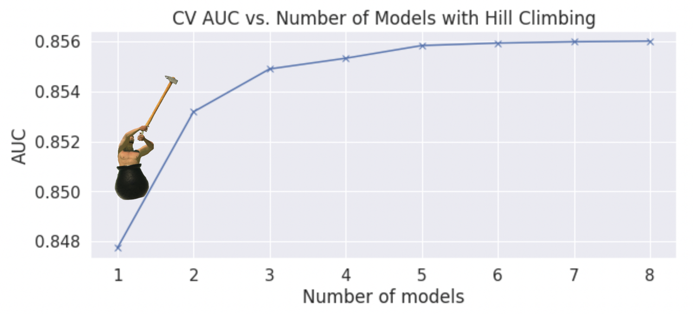
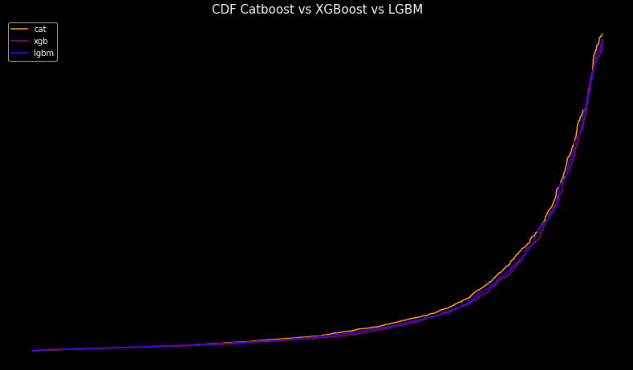
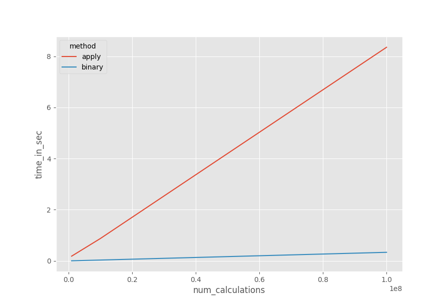

# Playground Series S3E3（员工流失预测）轻量深读（Tier B）

> 赛事：Playground ｜ 主题 tabular（HR 员工流失二分类，合成数据）｜ 665 队 ｜ 标准赛 ｜ 指标：ROC AUC
> 材料基础：`digests/playground-series-s3e3.md`（6 篇正文：1st 380920 / 8th 381052 / 14th 380757 / 54th 380744 / Hill Climbing 379690 / Avoid .apply() 379959；76 条主题索引）+ 3 张归档图
> 轻读时间：2026-10（Tier B B13）

## 1. 一句话重述与数字账

用 HR 属性预测员工离职（AUC），公榜只有 **34 个正例 / 189 个负例**——洗牌极大。本场的两个主线：①**"把原始数据加进训练、但不计入 CV"**是稳定增益（54th 用原数据 → 54 名，不用 → 约 407 名）；②**领域风险因子特征**是最大功臣（14th 的 `Number of Risk Factors` 在 CatBoost/XGB 中重要性第一；1st 只是在公开 notebook 上加了几个比值/阈值特征就意外夺冠）。单模与集成的老问题再次出现：54th 的最佳单模（私 0.8981）比他的 7 模型 blend（私 0.89706）更好，但没有提交。

| 关键数字 | 值 | 来源 |
| --- | --- | --- |
| 1st（380920） | 基于公开 notebook（XGB+LGBM+CatBoost）；唯一大改动 = 加 FE：两个比值特征、若干阈值布尔（如收入/年龄分段）、BusinessTravel 序数映射、以及 5 个风险因子求和；自述"没认真选提交"（公榜下滑时没预期能赢） | 380920 |
| 8th（381052） | XGBoost + "聚焦型 CV"（10 折，**只在合成数据上算 AUC**，原始数据加入训练但不参与评估）；FE：Winsorization（2 个极值）、BusinessTravel 序数编码、6 个类别 one-hot、连续变量中心化/标准化；TPOT 试跑 90% 选出 XGB/GB | 381052 |
| 14th（380757） | 编码 + 去极值；`is_generated` 标记（合成 vs 原始）；**Number of Risk Factors**（按收入/出差/部门/教育/满意度/加班等 15+ 条件计数）——CatBoost/XGB 中重要性遥遥第一、LGBM 仅第 13；原始数据不进入 CV 折；CatBoost `max_depth=1` 反而最好；加权 0.55/0.25/0.2 → 但 0.34/0.33/0.33 等权略好 0.00004 | 380757 |
| 54th（380744） | 自建框架造了 **2,385 个模型**（XGB/CatBoost/LGB/NN/Ridge），最终提交 = 7 模型秩融合（全部 LOO 编码，部分加 3 维 UMAP 特征）；local 0.870972 / 公 0.9393 / 私 **0.89706**；**最佳单模 XGB（LOO 编码，含原数据）私 0.8981（约第 40 名）却没被选中**；对照实验：含原数据 → 54 名，纯竞赛数据 → ~407 名 | 380744 |
| 技巧帖 | Hill Climbing（61 票）：允许负权重的迭代集成（CV +0.01）；Avoid .apply()（39 票）：向量化算子比 apply 快两个数量级（图 3） | 379690 / 379959 |
| 公榜与洗牌 | 公榜 = 34 正 / 189 负（28 票）；"别为洗牌难过"（15 票 / 15 评论）；ABNORMALITIES（23 票 / 25 评论）、类别分离差（22 票）、伪标签过拟合讨论（19 票 / 22 评论） | 索引 |

## 2. 逐方案对照矩阵

| 维度 | 1st | 8th | 14th | 54th |
| --- | --- | --- | --- | --- |
| 模型 | 公开三模型 + FE | XGBoost | CatBoost/XGB/LGBM | 7 模型秩融合（含单模备选） |
| 原始数据 | 用 | 加入训练、不计 CV | 不进入 CV 折 | 含原数据版显著更好 |
| 核心 FE | 比值 + 阈值 + 风险因子和 | Winsorize + 序数/one-hot | 风险因子 + is_generated | LOO 编码 + UMAP 特征 |
| 集成 | 基础 blend | — | 等权 0.34/0.33/0.33（略优） | 秩融合 |
| 私榜 | 1st | 8th | 14th | 0.89706（54th；最佳单模 0.8981） |

## 3. 共识、分歧与裁决

### 共识一：原始数据加入训练、但不计入 CV，是稳定增益（8th、14th、54th；置信度高）

54th 的直接对照（54 名 vs ~407 名）最有说服力；8th/14th 都把原始数据只用于训练。**裁决**：合成数据赛的标准做法是"训练合并、评估只算合成折"，避免原数据分布污染 CV。置信度：高。

### 共识二：领域风险因子特征是本场最大单点增益（14th、1st、社区；置信度中高）

14th 的 15+ 条件风险计数是 CatBoost/XGB 的首要特征；1st 只加了少量比值/阈值 + 风险因子和便从公开 notebook 夺冠；社区"Adding Risk Factors"（17 票）先于两人。**裁决**：小表格数据上，把领域判断编码成"风险计数/阈值交互"比换模型更有效。置信度：中高。

### 共识三：34 正例的公榜不可靠，洗牌与提交选择主导结果（54th、1st、社区；置信度高）

公榜仅 34 个正例；54th 的最佳单模未被提交；1st 甚至没认真挑提交就赢了。**裁决**：小公榜赛要把提交选择标准化（如"最佳单模 + 稳健集成"各一），不能凭公榜微差决策。置信度：高。

### 分歧/事件：单模 vs 集成（54th；置信度中）

54th 的单模 XGB（私 0.8981）优于其 7 模型秩融合（0.89706）。**裁决**：与 S4E2、S3E4 等场一致，小数据上单模常与集成打平或更好；最优提交应包含一个强单模。置信度：中。

### 技巧：Hill Climbing 与向量化工程（379690、379959；置信度中高）

HC 帖给出含负权重的伪代码与 CV 曲线（8 模型把 0.848 → 0.856）；向量化替代 apply 在大数据上快百倍。**裁决**：可直接纳入工具箱；HC 的负权重能力是关键。置信度：中高。

## 4. 证据分级

| 断言 | 等级 | 说明 |
| --- | --- | --- |
| 54th 的原数据对照（54 vs 407）与单模优于融合 | 自述（含分数明细） | 中高 |
| 14th 的风险因子重要性排序 | 自述（含代码） | 中高 |
| 1st 的 FE 清单 | 自述（简短） | 中 |
| 8th 的 CV 协议与 FE | 自述 | 中 |
| Hill Climbing/向量化 | 高票帖 + 图 | 中高 |
| 公榜 34 正例 | 社区统计帖 | 高 |

## 5. 悬案与缺口（登记）

- 2nd–7th、9th–13th 方案未收录；
- 风险因子清单的完整权重/顺序未逐条核对（代码在帖内）；
- 伪标签过拟合讨论（379347）未细读；
- **图证缺口**：无（3 张图已内嵌）。

## 6. 图表证据

**图 1**（topic 379690，61 票）：Hill Climbing 把 CV AUC 从 0.848 提升到 0.856——前 3 个模型贡献最大，之后边际递减。

**图 2**（topic 380757，14th）：CatBoost/XGBoost/LGBM 的预测 CDF 对比——用于可视化模型差异、判断混合收益。

**图 3**（topic 379959，39 票）：1 亿次计算下 `apply`（红）与向量化算子（蓝）的耗时对比——数量级差距。

## 7. 出处

- 1st 意外夺冠（36 票 / 14 评论）：https://www.kaggle.com/competitions/playground-series-s3e3/discussion/380920
- 8th 方案（13 票）：https://www.kaggle.com/competitions/playground-series-s3e3/discussion/381052
- 14th 方案（25 票 / 10 评论）：https://www.kaggle.com/competitions/playground-series-s3e3/discussion/380757
- 54th 复盘（13 票）：https://www.kaggle.com/competitions/playground-series-s3e3/discussion/380744
- Hill Climbing（61 票 / 39 评论）：https://www.kaggle.com/competitions/playground-series-s3e3/discussion/379690
- Avoid .apply()（39 票 / 19 评论）：https://www.kaggle.com/competitions/playground-series-s3e3/discussion/379959
- 公榜 34 正例（28 票）：https://www.kaggle.com/competitions/playground-series-s3e3/discussion/379492
- 风险因子（17 票）：https://www.kaggle.com/competitions/playground-series-s3e3/discussion/378994
- 洗牌讨论（15 票 / 15 评论）：https://www.kaggle.com/competitions/playground-series-s3e3/discussion/380729
