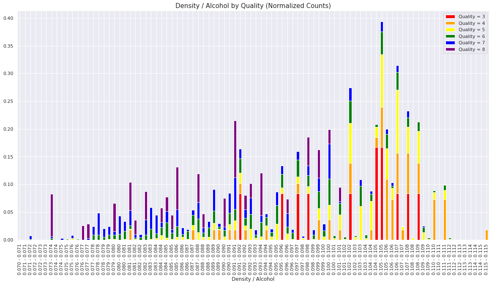
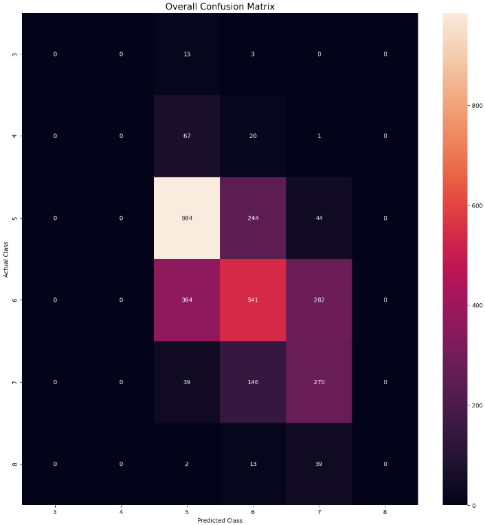

# Playground Series S3E5（葡萄酒质量评级）轻量深读（Tier B）

> 赛事：Playground ｜ 主题 tabular（有序多分类，回归化处理）｜ 901 队 ｜ 标准赛 ｜ 指标：Quadratic Weighted Kappa（QWK）
> 材料基础：`digests/playground-series-s3e5.md`（6 篇正文：1st 387882 / 4th 386645 / 3rd 386683 / 14th 386627 / FE 382698 / QWK 382421；80 条主题索引）+ 6 张归档图
> 轻读时间：2026-10（Tier B B14）

## 1. 一句话重述与数字账

预测葡萄酒质量等级（3–8，QWK 指标）。QWK 对"差得越远罚得越狠"，而 3/4/8 是稀有类——**保守预测（集中在 5–7）比冒险命中稀有类更划算**。本场的解法高度分化：1st 用**单模型 RAPIDS XGBoost + 回归 + OptimizedRounder 阈值**（Kaggle GPU），3rd 用"6 份公开 notebook 的加权众数"拿第 3，4th 造了 1,466 个模型最终用 25 个一级模型的 Ridge 栈——却把自己私榜第 1（0.60201）的 CatBoost 弃用了。

| 关键数字 | 值 | 来源 |
| --- | --- | --- |
| 1st（387882） | **单模型 RAPIDS XGBoost（GPU）**：`reg:squarederror` + `gpu_hist` + early stopping 50 + 1000 轮；StratifiedKFold（从 5 改 10）；**不用原始数据**（自述本地 CV 过拟合）；不做 FE；回归输出用 **OptimizedRounder**（paddykb 的 Regression_OptimiseClassCutoff）在每折验证预测上拟合阈值；Optuna 直接优化 QWK；只用本地 CV 选最终两份提交 | 387882 |
| 4th（386645） | 共 **1,466 个模型**；对抗验证 AUC **0.6321**（去重后）→ 训练混合原始+竞赛数据、**评估只用竞赛数据**；FE 以 Spearman 相关"分散评级"为核心（如 `density/alcohol` 把评级摊开到更多分箱）；最优 = 25 个一级模型的 Ridge 栈；**弃用的 CatBoost 私榜 0.60201（= 1st）**；混淆矩阵显示最优模型只预测 5/6/7、从不预测 4/8，而 NN 赌注预测 4/8 时因大量 5 被误判为 4 而重亏 | 386645 |
| 3rd（386683） | **6 份公开 notebook 的加权众数集成**（其中一份重复计双权重，另加类别权重）；一个 notebook 的版本差异导致分数略有出入；自述"简单集成策略既保住公榜也保住私榜"；选中的是私榜第二好的提交，**另一份本可第 1** | 386683 |
| 14th（386627） | NN 在大洗牌中活下来；CE 损失带类别权重 `[1.10,1.5,1,1,1.5,1.5]`；FE = 比值/log 等 | 386627 |
| 方法与讨论 | FE 帖（67 票）：总酸度、密度比、硫酸盐比等；QWK 帖（56 票）：`cohen_kappa_score(weights='quadratic')`；"这是彩票吗？"（36 票 / 15 评论）；"只用 4 个特征的 XGB 就有 LB 0.58267"（31 票 / 22 评论）；"当回归问题处理？"（29 票）；"用 Rounder 改造回归器"（34 票）；PDP 解释（36 票） | 索引 |

## 2. 逐方案对照矩阵

| 维度 | 1st | 3rd | 4th | 14th |
| --- | --- | --- | --- | --- |
| 模型 | 单 XGB（GPU） | 公开 notebook 众数 | 25 模型 Ridge 栈 | NN |
| 原始数据 | 不用 | 视 notebook 而定 | 混合训练、竞赛数据评估 | — |
| 阈值/取整 | **OptimizedRounder 每折拟合** | 众数天然离散 | Rounder/回归 | 类别权重 CE |
| 核心洞察 | 信本地 CV | 简单集成抗洗牌 | 保守预测 > 冒险 | 类别权重救 NN |
| 结果 | 1st | 3rd | 4th（弃用私榜第 1） | 14th |

## 3. 共识、分歧与裁决

### 共识一：把有序分类当回归 + 优化阈值/取整是最优形态（1st、4th、社区多帖；置信度高）

1st 全程回归 + OptimizedRounder；4th 也发现回归优于分类；"Treat as regression"（29 票）与"Transform Your Regressor with Rounder"（34 票）都在讲同一件事。**裁决**：QWK 类指标先把序数当连续回归，再用验证集拟合切分点。置信度：高。

### 共识二：保守预测（集中在中间评级）在稀有类 + QWK 下更稳（4th 的混淆矩阵对照；置信度中高）

最优模型从不预测 4/8 却把真实 4/8 放在近邻位置；激进 NN 命中 5 个 class-4 却把 34 个 class-5 误判为 4，净亏。**裁决**：QWK 下要按"期望扣分"而非"命中率"决策，稀有类预测需更高证据门槛。置信度：中高。

### 分歧：单模 vs 集成 vs 众数（1st vs 3rd vs 4th；置信度中）

单 XGB、公开 notebook 加权众数、25 模型 Ridge 栈分别拿到 1/3/4。**裁决**：本场没有普适最优；共同点是"信本地 CV + 保守决策"，结构差异不改变结论。置信度：中。

### 事件一：提交选择再次成为名次黑洞（4th、3rd；置信度高）

4th 的弃用模型私榜 0.60201（第 1）；3rd 的另一份提交本可第 1。**裁决**：在洗牌严重的比赛里，最终两份提交应包含"最强保守模型"与"结构不同的次强"两条线。置信度：高。

### 事件二：原始数据使用需对抗验证（4th vs 1st；置信度中高）

4th 的对抗 AUC 0.6321（有差异但不极端）→ 混合训练、竞赛评估；1st 干脆不用。**裁决**：与 S3E3/S4E1 同型——先用对抗验证定量差异，再决定是否并入。置信度：中高。

## 4. 证据分级

| 断言 | 等级 | 说明 |
| --- | --- | --- |
| 1st 的单模 + Rounder 流程 | 自述（含超参） | 中高 |
| 4th 的 1,466 模型、对抗 AUC、弃用第 1 模型 | 自述 + 混淆矩阵/FE 图 | 高 |
| 3rd 的加权众数与"本可第 1" | 自述 + 截图 | 中高 |
| 14th 的 NN 结构与类别权重 | 自述 | 中 |
| QWK 指标解释 | 高票帖 + sklearn 文档 | 高 |

## 5. 悬案与缺口（登记）

- 2nd、5th–13th 方案未收录；
- "彩票"讨论的统计细节未展开；
- 4/8 稀有类的处理策略（是否显式降权）未系统对比；
- **图证缺口**：无（6 张图，本深读内嵌 2 张）。

## 6. 图表证据

**图 1**（topic 386645，4th）：`density/alcohol` 分箱后的各评级归一化计数——相比单用 density，评级被"摊开"到更多分箱，利于树模型分辨。

**图 2**（topic 386645，4th）：最优模型混淆矩阵——预测全部落在 5/6/7，真实 4/8 被放在近邻类，而实际 4/8 被"冒险预测"的 NN 版本重罚。

## 7. 出处

- 1st 单模型 + 阈值优化（40 票 / 12 评论）：https://www.kaggle.com/competitions/playground-series-s3e5/discussion/387882
- 4th（48 票 / 18 评论）：https://www.kaggle.com/competitions/playground-series-s3e5/discussion/386645
- 3rd 众数集成（27 票 / 12 评论）：https://www.kaggle.com/competitions/playground-series-s3e5/discussion/386683
- 14th NN（21 票 / 9 评论）：https://www.kaggle.com/competitions/playground-series-s3e5/discussion/386627
- FE 合集（67 票 / 29 评论）：https://www.kaggle.com/competitions/playground-series-s3e5/discussion/382698
- QWK 指标理解（56 票 / 14 评论）：https://www.kaggle.com/competitions/playground-series-s3e5/discussion/382421
- 这是彩票吗（36 票 / 15 评论）：https://www.kaggle.com/competitions/playground-series-s3e5/discussion/383429
- 4 特征 XGB 0.58267（31 票 / 22 评论）：https://www.kaggle.com/competitions/playground-series-s3e5/discussion/383158
- 回归处理（29 票 / 9 评论）：https://www.kaggle.com/competitions/playground-series-s3e5/discussion/382525
- Rounder 集成（34 票 / 8 评论）：https://www.kaggle.com/competitions/playground-series-s3e5/discussion/382960
