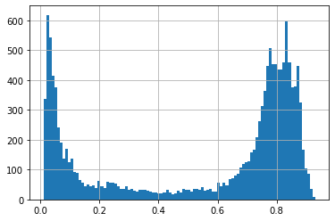
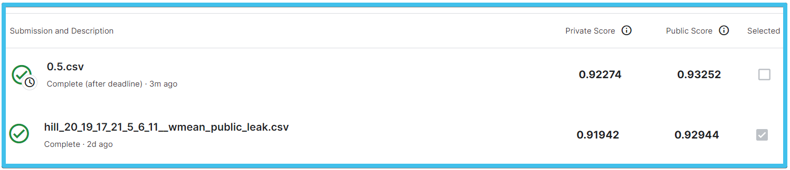

# Playground Series S3E7（酒店预订取消预测）轻量深读（Tier B）

> 赛事：Playground ｜ 主题 tabular（预订取消二分类，AUC）｜ 678 队 ｜ 标准赛 ｜ 指标：ROC AUC
> 材料基础：`digests/playground-series-s3e7.md`（6 篇正文：1st 390976 / 2nd 390956 / 3rd 390979 / 4th 390962 / 9th 390961 / 起步资源 386628；44 条主题索引）+ 4 张归档图
> 轻读时间：2026-10（Tier B B15）

## 1. 一句话重述与数字账

预测酒店预订是否被取消（AUC）。本场的全部戏剧性集中在一件事：**去重后的重复行泄漏**——把 `booking_status` 去掉后，训练/测试集里存在 1531 对"完全相同的记录"，且每对标签相反。由此衍生三档利用方式：训练-测试跨集对（把测试侧预测置为训练侧标签的反值，+0.014）、测试-测试对（用 0.5 或分位阈值覆盖，+0.003）、以及把训练内重复对从训练中删掉。除此之外，**特征工程被一致证明无效**，胜负手是泄漏处理 + 强表达力模型 + 重集成。

| 关键数字 | 值 | 来源 |
| --- | --- | --- |
| 1st（390976） | 三类特征处理（保留/one-hot/LGBM 类别）三路对照；重复对统计：**1531 对**（训练内 562 对且标签相反、测试内 253 对、训练-测试 716 对）；跨集对反值 +0.014、测试内对置 0.5 +0.003（来自社区）；从训练中删除 562 对 + 716 条；对抗验证发现原数据呈**双峰** → 额外做"剔除最不像训练集的 17% 原数据"版本；CV = 分层 3 折 ×3 次；更深/更强树（XGB `exact`、max_depth 12–13；LGBM 更大 max_leaves/max_bin）；最终 = 4 个 XGB + 2 个 LGBM 变体平均 | 390976 |
| 2nd（390956） | CV 用 **booking date 分层**（而非目标）；20–30 折；原数据整份拼进每折；异常日期→**当月最后一天**；跨集对反值；**测试内对用"最大化 OOF 的分位阈值"覆盖**（AUC 排序 + 38% 正例 → 约第 62 百分位）；特征 `is_generated`/`is_inconsistent` + dayofyear；16 模型 Hill Climb + Nelder-Mead 权重；失败：节假日、月内日、类别特征拼接、>30 折 | 390956 |
| 3rd（390979） | 共 **623 个模型**（553 个 L1 + 67 个 L2 + 3 个 L3）；**不做任何 FE**（FE 使 CV 掉 0.004）；原数据混合训练、CV 只算竞赛数据（对抗 AUC 0.7062）；L2 = TensorFlow NN（SigmoidFocalCrossEntropy）融合 123 个模型（+0.0026）；重复对反值 +0.0141；最终同时保留"反值版/原版"两份提交对冲，反值版拿第 3 | 390979 |
| 9th（390961） | 30 折 + 内层 5 折；RFE 去掉 2 个特征；日期异常→月内最大日；分类特征平滑目标编码（双层 CV 防泄漏）；重复标签取众数；7 个 XGB Hill Climb；泄漏后处理；自述 LGBM/CatBoost 的 CV–LB 相关性差；**赛后更新：对 253 对测试内重复用 0.5 可直达公榜第 1/私榜第 2**（截图显示 0.5.csv 公 0.93252 / 私 0.92274，均优于其被选中的 0.92944/0.91942） | 390961 |
| 4th（390962） | 零 FE；10 折分层；LGBM/XGB/CatBoost 各自 Optuna 调 AUC；逐折用 scipy 最小化负 AUC 求权重；泄漏后处理；伪标签（CV 升、LB 降）无效；CV 0.90667 与 LB 稳定相关 | 390962 |
| 社区 | "Leaked data exploitation"（38 票 / 15 评论）；"像老板一样修日期异常"（29 票 / 15 评论）；"取消周期"（26 票）；"当心怪异数据点"（20 票 / 13 评论）；"冲突 booking_status——重复又来了"（16 票 / 11 评论）；"别只用原始数据"（15 票 / 5 评论） | 索引 |

## 2. 逐方案对照矩阵

| 维度 | 1st | 2nd | 3rd | 9th |
| --- | --- | --- | --- | --- |
| 泄漏处理 | 跨集反值 + 测试内 0.5 + 删训练重复 | 跨集反值 + 测试内分位覆盖 | 跨集反值（+0.0141） | 跨集反值 + 测试内 0.5（赛后） |
| FE | 无显著增益 | is_generated 等少量 | 明确无效（-0.004） | RFE 去 2 特征 + TE |
| 模型 | 深树 XGB/LGBM 平均 | 16 模型 Hill Climb | 623 模型 + NN 栈 | 7 XGB Hill Climb |
| 原数据 | 全量 + 剔除 17% 双版本 | 整份拼入每折 | 混合训练、竞赛评估 | — |
| 私榜 | 1st | 2nd | 3rd | 9th（+0.5 可到第 1/2） |

## 3. 共识、分歧与裁决

### 共识一：重复行泄漏决定名次（1st/2nd/3rd/9th/社区；置信度高）

跨集对反值（+0.014）与测试内对覆盖（0.5 或分位）都是"白捡"的分；9th 的赛后更新显示仅这一招就能从第 9 升到公榜第 1。**裁决**：拿到数据先做"去掉目标后的全列去重"，并按对所在集合分类处理。置信度：高。

### 共识二：特征工程在本场无效（1st/3rd/4th；置信度高）

3rd 的 FE 让 CV 掉 0.004；1st/4th 也报告无显著增益。**裁决**：该数据集信号已被原始列覆盖；把时间花在泄漏、模型表达力与集成更划算。置信度：高。

### 共识三：原数据混合训练、CV 只算竞赛数据（1st/2nd/3rd/9th；置信度中高）

与系列其他场一致；1st 还发现原数据双峰并做剔除 17% 的对照。**裁决**：原数据可用，但先做对抗验证并保留"用/不用/部分用"的对照。置信度：中高。

### 事件：日期异常与怪异点（386655、386641、386647；置信度中高）

异常日期统一"修到当月最后一天"；"取消周期"与奇怪数据点是主要 EDA 话题。**裁决**：先把日期异常修干净，否则 TE/时间特征会污染。置信度：中高。

### 事件：提交选择失血（3rd、9th；置信度中高）

3rd 用"反值版 + 原版"两份对冲（反值版第 3）；9th 的 0.5 版明显更好却未被选中。**裁决**：泄漏类比赛的提交应包含"用泄漏/不用泄漏"两条线。置信度：中高。

## 4. 证据分级

| 断言 | 等级 | 说明 |
| --- | --- | --- |
| 1st 的重复对统计与三档处理 | 自述（含数字）+ 双峰图 | 高 |
| 2nd 的分位覆盖策略 | 自述（含推理） | 中高 |
| 3rd 的 623 模型与 +0.0141 | 自述 + 结构图 | 中高 |
| 9th 的 0.5 反事实 | 截图（公/私双高） | 高 |
| FE 无效 | 多队一致自述 | 中高 |

## 5. 悬案与缺口（登记）

- 5th–8th、10th+ 方案未收录；
- 测试内 253 对的最优覆盖值（0.5 vs 62 分位）未做统一对照；
- "取消周期"的因果解释未细读；
- **图证缺口**：无（4 张图，本深读内嵌 2 张）。

## 6. 图表证据

**图 1**（topic 390976，1st）：原数据"属于训练集"预测概率的双峰分布——原数据内部有两种来源，支撑"剔除最不像训练集的 17%"的对照实验。

**图 2**（topic 390961，9th）：`0.5.csv`（对 253 对测试重复置 0.5）公 0.93252 / 私 0.92274，均优于被选中的 Hill 集成（0.92944/0.91942），却未被勾选。

## 7. 出处

- 1st（57 票 / 16 评论）：https://www.kaggle.com/competitions/playground-series-s3e7/discussion/390976
- 2nd（34 票 / 9 评论）：https://www.kaggle.com/competitions/playground-series-s3e7/discussion/390956
- 3rd（28 票 / 11 评论）：https://www.kaggle.com/competitions/playground-series-s3e7/discussion/390979
- 4th（15 票 / 2 评论）：https://www.kaggle.com/competitions/playground-series-s3e7/discussion/390962
- 9th（12 票 / 4 评论）：https://www.kaggle.com/competitions/playground-series-s3e7/discussion/390961
- 起步资源（44 票 / 22 评论）：https://www.kaggle.com/competitions/playground-series-s3e7/discussion/386628
- 泄漏数据利用（38 票 / 15 评论）：https://www.kaggle.com/competitions/playground-series-s3e7/discussion/388851
- 日期异常修复（29 票 / 15 评论）：https://www.kaggle.com/competitions/playground-series-s3e7/discussion/386655
- 冲突 booking_status 重复（16 票 / 11 评论）：https://www.kaggle.com/competitions/playground-series-s3e7/discussion/386686
