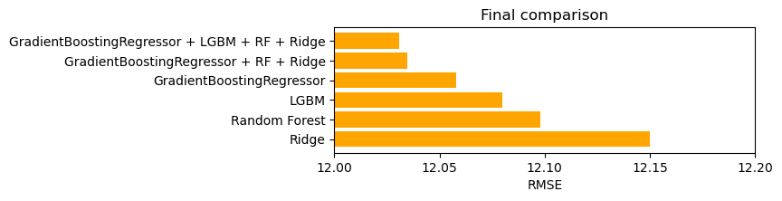
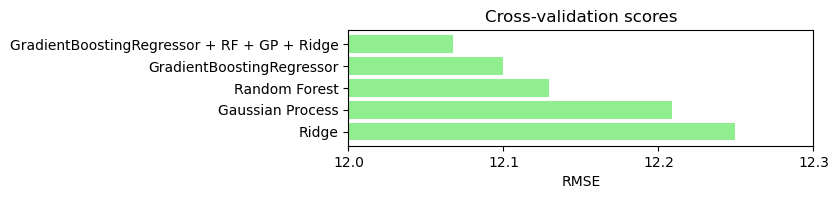

# Playground Series S3E9（混凝土强度预测）轻量深读（Tier B）

> 赛事：Playground ｜ 主题 tabular（混凝土抗压强度回归，RMSE）｜ 765 队 ｜ 标准赛 ｜ 截止 2023-03-13
> 材料基础：`digests/playground-series-s3e9.md`（6 篇正文：12th 六步流程 394600 / 1st 394592 / 44th 394641 / 结构工程师背景 391237 / 原数据集致谢 391013 / 模型组合 391644；45 条主题索引）+ 3 张归档图
> 轻读时间：2026-10（Tier B B17）

## 1. 一句话重述与数字账

预测混凝土抗压强度（RMSE）。本场留下两条最有价值的通用法则：① **CV 是测量、公开榜是随机变量**——CV 用 5407 个样本，公开榜只有 721 个，1st 因此只用 CV 选模型、并把提交压到 2 次以内；② **多样性优于缩小模型组合**——纯 GBDT 之外必须放进线性/核模型（1st 的 GB+RF+Ridge 对比图、391644 的 GB+RF+GP+Ridge 图都给出一致证据）。此外，本场"同特征不同目标"的重复行被 12th 转成目标分箱特征，线性模型 RMSE 从约 14 降到 12。

| 关键数字 | 值 | 来源 |
| --- | --- | --- |
| CV vs 公开榜 | CV **5407** 样本（一次测量）vs 公开榜 **721** 样本（随机变量）；作者用 7 次提交只是好奇，主张 **≤2 次** | 394592 |
| 1st 最终对比 | GB+RF+Ridge（含 LGBM 变体）≈ **12.03** 最好；单 Ridge ≈ **12.16**；GB 单独 ≈12.07；LGBM ≈12.09；RF ≈12.10（见 394592_img/01） | 394592 |
| 多样性对照 | GB+RF+GP+Ridge ≈ **12.06**；GB ≈12.10；RF ≈12.14；GP ≈12.21；Ridge ≈12.24（见 391644_img/01） | 391644 |
| 12th 重复行特征 | 按各列对重复行分组取目标均值作分箱标签 → 线性模型 **~14 → ~12 RMSE**（自述） | 394600 |
| 44th | 用 LinearRegression 的预测+系数统计量（intercept/min/max/mean/std）+ AgeInDays 目标编码喂 XGBoost；并公开两处 train/test 不一致 bug | 394641 |
| 数据特性 | 特征相同但目标不同的重复行是本质属性（391001/391011/393395）；AgeInDays 取值少、与目标非线性非单调 → 1st 做类别化+TE | 394592 / 索引 |
| 领域先验 | 水灰比（WaterComponent/CementComponent）决定强度与干速；减水剂昂贵→高强度才用；粗骨料增强、细骨料需更多水；粉煤灰/矿渣改变后期强度 | 391237 |

## 2. 逐方案对照矩阵

| 维度 | 1st（394592） | 12th（394600） | 44th（394641） | 391644（社区） |
| --- | --- | --- | --- | --- |
| 核心 | CV 优先 + 多样集成 | 六步通用流程 | 线性模型派生特征 | 反对"只 blend GBDT" |
| 特征 | 线性 FE + AgeInDays TE | 重复行目标统计分箱 | LR 系数统计量 | 线性/核模型自带 |
| 调参 | **手工**（Optuna 种子不稳） | 手工（不信任 Optuna） | Optuna + GPU | — |
| 模型 | LGBM + GradientBoosting + RF (+Ridge) | 多模型 + 嵌套 CV | XGBoost | GB+RF+GP+Ridge |
| 验证 | 普通 KFold + 只看 CV | 嵌套 CV + best-fold | 10 折 | CV 对比图 |

## 3. 共识、分歧与裁决

### 共识一：CV 样本量远大于公开榜时，公开榜不提供模型选择信息（394592；置信度高）

5407 vs 721（约 7.5 倍）的样本量差，使 LB 分数成为高方差随机变量；1st 明确"不看公开榜、不抄无 CV 证明的高分 notebook"。**裁决**：先算 CV/LB 样本量比；差距大时锁死 CV 口径、限制提交次数、拒绝用 LB 反推。置信度：高。

### 共识二：集成必须跨范式（394592 + 391644；置信度高）

两张独立 CV 对比图都显示"GB+RF+Ridge/GP"优于任何单模型，线性与核模型在好 FE 下贡献显著。**裁决**：Playground 表格赛的默认配方是 GBDT（多实现）+ 线性 + RF/GP 的异质集成，而不是 XGB/LGB/CAT 三胞胎。置信度：高。

### 共识三：重复行是信号而非噪声（394600 + 391011/393395；置信度中高）

"同特征不同目标"在混凝土数据里是真实材料差异；12th 把它转成目标均值分箱特征，线性模型直接 -2 RMSE。**裁决**：先量化重复行的目标方差，再决定去重/聚合/当特征；直接 drop_duplicates 会丢信息。置信度：中高。

### 分歧：Optuna 是否可信（394592 vs 394641；置信度中高）

1st 与 12th 都用"换 KFold 种子重跑"证明 Optuna 参数不稳健而改手工；44th 仍用 Optuna。**裁决**：调参后必须做种子稳定性检验；不稳定就把搜索空间/预算换成手调或强正则。置信度：中高。

### 事件：领域先验直接转化为特征（391237；置信度中）

结构工程师给出水灰比、减水剂、骨料、粉煤灰/矿渣的物理机制，且多条被社区用于 FE 讨论。**裁决**：有真实物理机制的表格题，先写机制清单再列特征，比盲目多项式更高效。置信度：中。

## 4. 证据分级

| 断言 | 等级 | 说明 |
| --- | --- | --- |
| CV/LB 样本量与提交纪律 | 1st 自述 + CV 对比图（394592） | 高（可复算） |
| 异质集成优于单模型 | 两张独立 CV 图（394592 / 391644） | 高 |
| 重复行目标分箱 14→12 | 12th 自述 + 代码片段（394600） | 中（无公开复核） |
| 44th 的 LR 特征与两处 bug | 自述 + notebook（394641） | 中 |
| 结构工程领域先验 | 工程师背景转述（391237） | 中（领域常识，非实验） |
| Optuna 种子不稳 | 1st/12th 自述 | 中高（方法可复现） |

## 5. 悬案与缺口（登记）

- #2–#9 及 10th 等前排方案未归档（仅索引可见标题）；
- 12th 的 14→12 是线性模型自述数字，缺 CV 细节与完整代码；
- 重复行的最优处理（去重 vs 聚合 vs 分箱特征）未被系统对比；
- 1st 的完整代码在站外（Kaggle notebook 链接），未随归档复制；
- **图证缺口**：无（3 张图，本深读内嵌 2 张）。

## 6. 图表证据

**图 1**（topic 394592，1st）：最终对比——"GradientBoostingRegressor + RF + Ridge"（含 LGBM 变体）约 12.03 最好，单 Ridge 约 12.16；直接支撑"跨范式集成 > 单模型"的裁决。

**图 2**（topic 391644）：Cross-validation scores——GB+RF+GP+Ridge（约 12.06）优于 GB（约 12.10）、RF（约 12.14）、GP（约 12.21）、Ridge（约 12.24），与 1st 结论互相印证。

## 7. 出处

- 1st：CV 与多样性赢（89 票 / 50 评论）：https://www.kaggle.com/competitions/playground-series-s3e9/discussion/394592
- 12th：六步流程（20 票 / 4 评论）：https://www.kaggle.com/competitions/playground-series-s3e9/discussion/394600
- 44th：LinearRegression 派生特征（8 票 / 0 评论）：https://www.kaggle.com/competitions/playground-series-s3e9/discussion/394641
- 结构工程师背景（43 票 / 9 评论）：https://www.kaggle.com/competitions/playground-series-s3e9/discussion/391237
- 原数据集致谢（33 票 / 12 评论）：https://www.kaggle.com/competitions/playground-series-s3e9/discussion/391013
- 别缩减模型组合（47 票 / 15 评论）：https://www.kaggle.com/competitions/playground-series-s3e9/discussion/391644
- 重复行讨论（32 票 / 9 评论）：https://www.kaggle.com/competitions/playground-series-s3e9/discussion/391011
