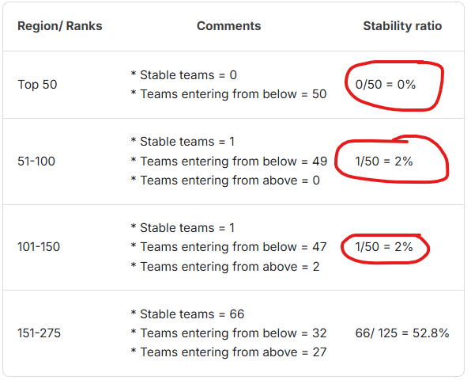

# Playground Series S4E11 轻量深读（Tier B）

> 赛事：Playground ｜ 主题 tabular（心理健康调查二分类）｜ 2685 队 ｜ 标准赛 ｜ 指标：Accuracy（硬标签）｜ 数据：合成 + 原数据
> 材料基础：`digests/playground-series-s4e11.md`（6 篇正文：1st 549160 / 13th 549155 / 24th 549147 / 25th 549194 / 4th 549197 / 公榜硬标签讨论 543929；80 条主题索引）+ 7 张图
> 轻读时间：2026-10（Tier B B06）

## 1. 一句话重述与数字账

心理健康调查二分类，指标是**硬标签 Accuracy**。真正的考点是**"在硬标签指标 + 榜面大洗牌下如何选择提交"**：本场 13th 有 16 个提交比最终选的两个更好（其中一个能到第 4），而 24th 靠"最朴素的不加权平均"上升 662 名。

| 关键数字 | 值 | 来源 |
| --- | --- | --- |
| 1st（549160） | 全月训 69 个模型，最终只用 **24 个**；无特征工程、不删列（忍住没删 Name）；XGBoost + 3 种 LightGBM × 4 条数据管线（两条含原数据）+ **两个 AutoGluon 模型（含/不含原数据，CV 最高、最重要）**；用 AutoGluon 做集成（自行定义 CV 防泄漏）；**CV 0.94173 / pub 0.94284 的那个"早期实验"夺冠**，而投入更多的另一版 CV 0.94150 / pub 0.94285；结论："模型更少、集成更简单反而更好" | 549160 |
| 13th（549155） | **7 个提交的私榜分数足以进前 10，但都没被选中；实际有 16 个提交优于最终选择**（OOF 数从 7 到 130 不等，集成器覆盖 Ridge/Lasso/HC/AutoGluon/LightAutoML）；最好的一个（42 OOF，22 天前做出）私榜 0.94180 本可第 4；用样本提交反推：公榜 20% 中 1 的比例 17.297% vs 训练 18.171%，私榜 80% 中 1 的比例 18.313%——**分布不一致是洗牌的结构性原因**；CatBoost 调参可到 CV 0.94184/pub 0.94355 但私榜只有 0.94140（≈35 名） | 549155 |
| 24th（549147，"up 662 places"） | 最终提交 = **20 个模型的朴素不加权平均**：6 LGBM（target/count/内置编码）+ 7 CatBoost（log-loss，原数据 0–6 份拷贝）+ 6 CatBoost（focal loss，4 份拷贝）+ 1 fastai NN（隐藏层 [10,5]、focal、Mish、wd=0.1、全类别化、40× seed 平均）+ 3 个全 one-hot 的逻辑回归；**刻意拒绝 Hill Climbing 的加权建议**（"我的 10 折 CV 已经在过拟合 OOF"）；GBDT 不用每折早停的迭代数，而是"多训后跨折统一定最优迭代数" | 549147 |
| 25th（549194） | 只用 3 个模型：CatBoost 0.9401/0.9433/0.9405、XGB 0.9400/0.9439/0.9400、NN(MLP) 0.9399/0.9427/0.9413（NN 单模≈私榜第 68）；集成 0.9406/0.9438/**0.9415**；**用 AUC 作为 Accuracy 的代理指标**（ACC 不平滑、方差大）；所有列转字符串类别、稀有值→"RARE"、nan→"NAN" | 549194 |
| 4th（549197） | 预处理：把不合理值置 NaN（如 City 列里出现 "Less than 5 hours"）；AutoGluon（2024 版 200 组超参）+ LightAutoML（lgb/cb/mlp/dense/denselight/resnet/snn/node/autoint/fttransformer 全套）等权混合；回顾上一场"盲混 → 私榜差"，本场坚持看 CV；指出 AutoGluon 的 CV 偏乐观 | 549197 |
| 公榜结构（45 票） | **硬标签指标下的稳定性统计：Top 50 稳定队伍 0/50；51–150 各只有 1/50 稳定；151–275 有 66/125 稳定**（图 1）——即前 150 名几乎完全被替换 | 543929 |

## 2. 逐方案对照矩阵

| 维度 | 1st | 13th | 24th | 25th | 4th |
| --- | --- | --- | --- | --- | --- |
| 规模 | 24 模型 + AG 集成 | 79 / 11 OOF 两版决赛 | 20 模型朴素平均 | 3 模型 | AutoGluon + LightAutoML |
| 特征工程 | 无 | 多样 | 编码策略多样 | 全列字符串化 | 不合理值→NaN |
| 指标处理 | 看 CV | 跟踪 CV-LB | 拒绝 OOF 加权 | **AUC 代理 ACC** | CV 优先 |
| 结局 | 第 1 | 第 13（16 个更优未选） | +662 名 | 第 25 | 第 4 |

## 3. 共识、分歧与裁决

### 共识一：Accuracy 是"硬标签"，其榜面方差极大（全员 + 45 票帖）

稳定性统计（Top 50 = 0/50 稳定）说明名次主要由少数样本的 0/1 翻转决定；1st 的夺冠版 CV 高于投入更多的一版，13th 有 16 个提交更优。**裁决**：硬标签指标的赛题里，"选提交"是与建模并列的独立问题；应准备多个风格的提交（不同池子大小/集成器），并优先与 CV 结构一致的版本。置信度：高。

### 共识二：用 AUC（或 log-loss）作为 Accuracy 的代理指标（25th/24th/13th）

25th 明确"ACC 不平滑、优化它不可靠，用 AUC 找最优 CV，再按 ACC 选集成"；13th/24th 也都强调不要被 OOF 的 ACC 微小差异牵着走。**裁决**：指标是 0/1 型时，训练与选择都换成 proper scoring rule/probability metric，最后一步再按 ACC 决策。置信度：高（与 S6E6 的加权 log-loss 结论互证）。

### 共识三：拒绝 OOF 加权/盲混，越朴素越稳（24th/25th/13th/4th）

24th 刻意忽略 Hill Climbing 的加权建议，用不加权平均拿下本场最佳私榜（相对其候选）；25th 三模型等权；13th 刻意不选盲混提交；4th 强调上一场盲混教训。**裁决**：合成数据 + 硬标签时，OOF 上的权重搜索会把噪声拟合进去；等权平均是稳健默认。置信度：高。

### 分歧一：AutoGluon 的 CV 是否可信

1st 靠 AutoGluon 集成夺冠（并自行定义 CV 防泄漏）；4th 指出"AutoGluon 的 CV 有时过于乐观"；13th 的 AutoGluon 版也进了前 13。**裁决**：AG 作为集成器有效，但其 CV 可能乐观；要用独立定义的 CV 复算（1st 正是这么做的）。置信度：中高。

### 事件：测试集正例比例漂移（13th 的量化）

13th 用样本提交反推公榜正例率 17.297% vs 训练 18.171%，私榜 80% 为 18.313%——**分布不一致直接制造洗牌**；1st/25th 的"信任 CV"之所以有效，是因为他们的 CV 结构恰好覆盖了漂移后的分布。**裁决**：硬标签赛要监控"提交的正例率"，必要时按比例约束预测的正例数。置信度：中高（单帖量化，但现象与榜单一致）。

### 事件：多训练一些、跨折统一定迭代数（24th）

24th 不用各折早停的迭代数，而是训练更多轮后跨折统一选择——防止在噪声指标上过早停止导致的过拟合选择。**裁决**：早停本身就是一种选择偏差；在噪声指标赛里应统一早停口径。置信度：中。

## 4. 证据分级

| 断言 | 等级 | 说明 |
| --- | --- | --- |
| 1st 的 24 模型 + AG 集成与"早期实验夺冠" | 自述 + 模型对比图 | 中高 |
| 13th 的 16 个更优提交与正例率反推 | 自述 + 详细数字 | 中高 |
| 24th 的 20 模型朴素平均（+662 名） | 自述 + CV 表 + 图 | 中高 |
| 25th 的 AUC 代理与 3 模型集成分数 | 自述 + 站内 notebook | 中高 |
| 硬标签公榜稳定性统计（0/50） | 自述 + 表（图 1） | 中高（口径清晰） |

## 5. 悬案与缺口（登记）

- 2nd/3rd/5th–12th 的方案未入库；"Fast GPU Hill Climbing using AUC and Log Odds"（41 票）、"如何选多样模型"（23 票）未细读；
- 测试集正例率漂移的成因（学生/职业分布？）未证实；
- 1st 的 24 模型清单与其 AG 集成配置只给了图，未逐项列出；
- 归档 7 图中 4 张来自公榜硬标签讨论帖（含稳定性统计表）、2 张来自 24th 的 CV 表、1 张 1st 的模型对比。

## 6. 图表证据

**图 1**（topic 543929）：Top 50 区间"稳定队伍 0/50"（50 名全部被榜外队伍替换）；51–100 与 101–150 各只剩 1/50 稳定；151–275 才有一半稳定（66/125）。这是"硬标签指标 + 小样本 → 榜面近乎完全重排"的量化证据。

## 7. 出处

- 1st（549160）：https://www.kaggle.com/competitions/playground-series-s4e11/discussion/549160
- 13th（549155）：https://www.kaggle.com/competitions/playground-series-s4e11/discussion/549155
- 24th（549147）：https://www.kaggle.com/competitions/playground-series-s4e11/discussion/549147
- 25th（37 票）：https://www.kaggle.com/competitions/playground-series-s4e11/discussion/549194
- 4th（27 票）：https://www.kaggle.com/competitions/playground-series-s4e11/discussion/549197
- 公榜硬标签讨论（45 票）：https://www.kaggle.com/competitions/playground-series-s4e11/discussion/543929
