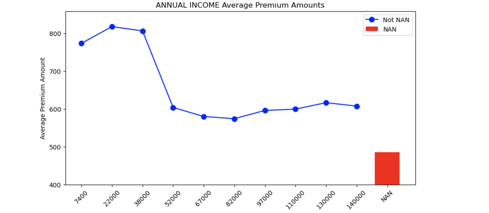

# Playground Series S4E12（保险保费预测）轻量深读（Tier B）

> 赛事：Playground ｜ 主题 tabular（回归，RMSLE）｜ 2390 队 ｜ 标准赛 ｜ 指标：RMSLE
> 材料基础：`digests/playground-series-s4e12.md`（5 篇正文：1st 554328 / 9th 554377 / 7th 554746 / NAN 与目标 552165 / Rank2 暴力集成 554505；80 条主题索引）+ 7 张图
> 轻读时间：2026-10（Tier B B11）

## 1. 一句话重述与数字账

预测保险保费（RMSLE）。真正的考点是**"类别型特征工程的系统化搜索"**：1st 用 611 个特征的单 XGBoost 夺冠，核心是把"原始类别列 → 多种编码 → 组合列 → 再编码"做成可自动搜索的空间，并用 **GPU cuDF-Pandas 连续几天轰炸式搜索**找出有效组合；同时 **NaN 本身是强信息**（不能随便填补）。

| 关键数字 | 值 | 来源 |
| --- | --- | --- |
| 1st（554328） | 单模型 XGBoost + **611 个特征**；编码体系：对每个类别列给出 **原始列 + 6 种表示**（label、TE mean、CE、TE median/min/max/nunique）；**组合生成新类别列**（2–6 列任意组合，如 `Occupation_Gender`），再对新列做 TE/CE；**把数值列也当类别列**（TE/CE 后可再组合）；把 Policy Start Date 分解成年/月/日/时等 → 23 个基础列；全组合空间达 **14.5 万列**，用 **GPU RAPIDS cuDF-Pandas 的嵌套折内 groupby 聚合**评估每个组合 → 连续跑数天，筛出 **170 个有效组合**（公开最佳 20 个）；完整版 CV **1.016**（611 特征、lr 0.001、2 万棵树、TE kfold=10、A100 约 6 小时），简化版 CV 1.019（229 特征、lr 0.01、2000 棵树、TE kfold=5、T4 约 2 小时） | 554328 |
| 社区：NaN 与目标（552165，126 票 / 87 评论） | 数据中**部分 NaN 与目标强相关**：以 Annual Income 为例，NaN 的平均保费 ≈485，**低于所有非 NaN 分箱（560–820）**（图 1）——"NaN 不能按均值填补，否则会抹掉信息"；三种处理法：① 交给能吃 NaN 的 GBDT（原样保留）② 填成从未出现的值（如 −1）③ **先加 `is_{c}_na` 指示列再填补**；文中还列举多个"NAN 的期望目标不在任何非 NAN 取值范围内"的例子 | 552165 |
| 7th（554746） | 10 模型集成 | 554746 |
| 9th（554377，29 票） | "With a little help from my (Kaggle) friends"——大量借鉴公开方案 | 554377 |
| Rank 2（554505，27 票） | **暴力集成：118 个 OOF** | 554505 |
| 其他高票帖 | "The Magic Middle - Median, Mean, or Exponented Mean Log 1p?"（62 票，RMSLE 的目标变换/聚合选择）、"你可能没意识到的竞争算法"（36 票）、"关于评测指标"（32 票）、"train 与 original 数据集的显著差异"（26 票） | 社区 |

## 2. 逐方案对照矩阵

| 维度 | 1st | Rank 2 | 7th |
| --- | --- | --- | --- |
| 形态 | **单模型（XGB）+ 611 特征** | 118 OOF 暴力集成 | 10 模型集成 |
| 特征工程 | 多编码 + 列组合 + 数值当类别 + GPU 搜索 | — | — |
| 关键机制 | cuDF 连续搜索出 170 个有效组合 | 大池集成 | 中池集成 |
| CV | 1.016（完整）/1.019（简化） | — | — |

## 3. 共识、分歧与裁决

### 共识一：类别型特征的"多表示"是 GBDT 的主要增益（1st + 社区）

1st 的核心方法论（每个类别列给 7 种表示、组合后再编码、数值当类别）与他 9 月/11 月 Playground 的经验形成对比（那两场 FE 无效）：本场 FE 有效，于是转为"单模型 + 深挖 FE"。**裁决**：类别基数大/交互强的数据里，把"编码"当成可组合的搜索空间，收益可能超过加模型。置信度：高。

### 共识二：NaN 是信息，不是缺失（552165 + 1st 的流程）

126 票帖量化了"NaN 的期望目标与任何非 NaN 都不同"；处理建议是"保留 NaN / 填特殊值 / 加指示列"。**裁决**：表格赛先做"NaN 与目标的联合分析"，再决定填补策略；对 GBDT 保留 NaN 往往最好。置信度：高。

### 共识三：RMSLE 的目标处理要专门讨论（62 票帖 + 32 票指标帖）

社区专帖讨论"中位数/均值/exp(mean(log1p)) 哪种聚合"；指标帖也在澄清 RMSLE 细节。**裁决**：RMSLE 赛要先确定"预测目标是原尺度还是 log 尺度、集成时在哪个尺度平均"。置信度：中高（与 S5E5 的 log 空间集成结论一致）。

### 分歧一：单模型深挖 vs 大规模集成

1st 单模型夺冠；Rank2 用 118 个 OOF、7th 用 10 个模型。**裁决**：本场当 FE 是主增益时，单模型 + 深 FE 的性价比高于大池；大池是稳健但增益有限的选择。置信度：中高。

### 事件：数据集差异与"magic middle"

社区帖指出 train 与 original 数据集存在显著差异（26 票）；"magic middle"帖讨论 RMSLE 下的取中策略。**裁决**：合成赛要审计原数据与合成数据的分布差；指标细节（如 log 空间的"中间值"）值得单独实验。置信度：中。

## 4. 证据分级

| 断言 | 等级 | 说明 |
| --- | --- | --- |
| 1st 的特征体系、611 特征与 CV 数字 | 自述 + 公开 notebook（含简化版） | 高 |
| NaN 与目标的关系（Annual Income 案例） | 图 + 数据（126 票帖） | 高 |
| Rank2 的 118 OOF 暴力集成 | 自述 | 中 |
| "magic middle"与 RMSLE 细节 | 社区帖（62 票） | 中 |
| train/original 数据差异 | 社区帖（26 票） | 中 |

## 5. 悬案与缺口（登记）

- 2nd–6th/8th 的方案未细读；"竞争算法"（36 票）与"关于评测指标"（32 票）未细读；
- 1st 的 170 个有效组合未全部公开（只给 20 个）；
- GPU 搜索的具体耗时/组合评分标准未量化；
- 归档 7 图：NaN-目标关系图（图 1）为关键图证。

## 6. 图表证据

**图 1**（topic 552165）：Annual Income 各分箱的平均保费（蓝线，560–820）与 **NaN 的平均保费（红柱 ≈485）**——NaN 的期望目标低于任何非 NaN 取值，证明"缺失本身携带信息"；这就是本场把 NaN 保留/特殊编码的原因。

## 7. 出处

- 1st（230 行处）：https://www.kaggle.com/competitions/playground-series-s4e12/discussion/554328
- NAN 与目标（126 票）：https://www.kaggle.com/competitions/playground-series-s4e12/discussion/552165
- Rank2 暴力集成（27 票）：https://www.kaggle.com/competitions/playground-series-s4e12/discussion/554505
- 7th（554746）：https://www.kaggle.com/competitions/playground-series-s4e12/discussion/554746
- 9th（29 票）：https://www.kaggle.com/competitions/playground-series-s4e12/discussion/554377
- Magic Middle（62 票）：https://www.kaggle.com/competitions/playground-series-s4e12/discussion/549909
