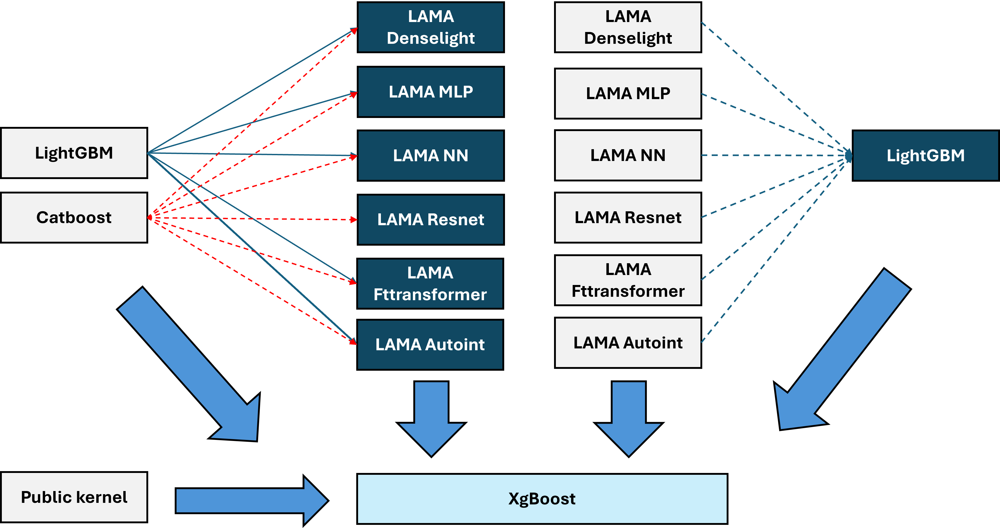
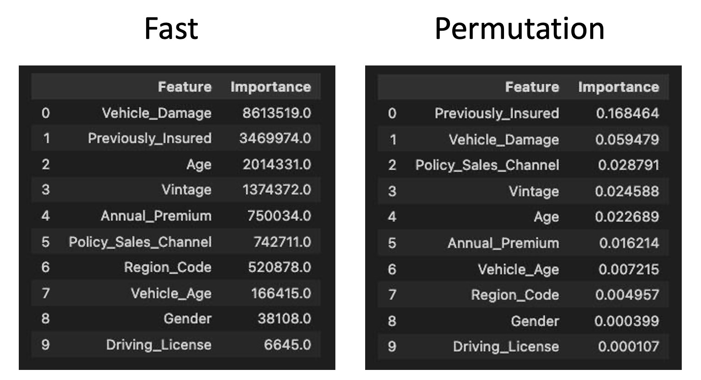

# Playground Series S4E7（AutoML Grand Prix 七月）轻量深读（Tier B）

> 赛事：Playground ｜ 主题 tabular（保险交叉销售，二分类）｜ 2234 队 ｜ 标准赛 ｜ 指标：ROC AUC ｜ 数据 1150 万行 ｜ 特殊赛制：24 小时 AutoML Grand Prix
> 材料基础：`digests/playground-series-s4e7.md`（6 篇正文：Cross Sellers 523404 / AGP 1st 516475 / 2nd 523489 / 3rd 516860 / 4th 516265 / 23rd 516413；80 条主题索引）+ 3 张图
> 轻读时间：2026-10（Tier B B05）

## 1. 一句话重述与数字账

1150 万行保险数据的二分类（AUC），叠加 24 小时限时 AutoML 赛制。真正的考点是**大数据的资源调度 + "单模调参 vs 堆叠"的取舍 + CatBoost 的 Newton 系 score_function 细节**。

| 关键数字 | 值 | 来源 |
| --- | --- | --- |
| Cross Sellers（132 票，最高票） | 判断本场"CV-LB 近乎完美一致、数据量足以免疫过拟合"；**三种数据策略**中"把补充数据整份加进每个折"取得最高 CV；固定 `StratifiedKFold(5, shuffle, 42)`；**12 版特征库（feature store）**；**三段式训练**：stage1/2 训 LGBM/LAMA-lgb/CatBoost/DenseLight+MLP/Tab-ResNet/Tab-Transformer/AutoInt（并按 `Previously_Insured`、`Vehicle_Damage` 及其组合做分段建模）→ **stage3 用 XGBoost 对 OOF 堆叠**（"树叠 NN、NN 叠树"）；自评"XGB 末级堆叠对 CV-LB 最有效" | 523404 |
| AGP 1st（54 票，Don't Die Just DAI） | **一个 CatBoost，零特征工程**（只用原始特征 + 少量原始交互）；先小样本快速迭代、后全量训练（"更多数据总是更好"）；GPU 全量 > CPU 小样本；notebook 5 折 CV 0.89505 / LB 0.89586；更多折仅小幅提升 | 516475 |
| 2nd（45 票） | 四轮迭代：XGB 0.88448 → 调参 XGB 0.89387（CV 0.89113）；LGBM（TPU 分布式调参）0.89344（0.89302）；SnapML 放弃、TabNet/GANDALF ~0.8910 但太贵；最终单 CatBoost：50 轮 HPO（3 机 ~10h，CPU/GPU 无 pruner）、**Newton 系 score_function（NewtonCosine/NewtonL2）+ leaf_estimation_iterations=12**、lr 0.085、10000 迭代、去重（contrasting duplicates）、Age/Premium 分箱、4 折（单模型 ~48GB RAM）。LB 0.89720 → 用社区技巧 0.89780 → 终版 0.89788（私榜 0.89753） | 523489 |
| 3rd（43 票，LightAutoML testers） | 24 小时：先跑 TabularAutoML 摸清重要特征（两种重要性口径都指向 `Previously_Insured`、`Vehicle_Damage`）→ **9 个 LGBM 分段组合**（全量 / PI 两段 / VD 两段 / PI×VD 四段）→ 7 个 NN（DenseLight×3、ResNet×2、AutoInt、FT-Transformer；单 DenseLight 0.89232）→ 4 个 NN 的 OOF 作特征再训 9 个 LGBM → 加权混合得 **0.89375** | 516860 |
| 4th（48 票，AutoGluon） | 核心发现：大数据下 XGBoost 的 `max_bin` 默认 255 太小，**调到 2^18−1=262143** 在 30 万子样本上验证有效；随后 192 vCPU 全量单模 XGB（60 分钟上限、早停在第 30770 轮）→ 0.89262；自省"应先看单模型超参，而不是先堆多层集成" | 516265 |
| 23rd（35 票） | 主题是**资源与时间管理**（限时赛中与建模同等重要） | 516413 |

## 2. 逐方案对照矩阵

| 维度 | Cross Sellers | AGP 1st | 2nd | 3rd | 4th |
| --- | --- | --- | --- | --- | --- |
| 形态 | 3 段堆叠（~30+ 模型） | **单 CatBoost** | 单 CatBoost | 9 LGBM 分段 + 7 NN + 二段堆叠 | 单 XGB（大 max_bin） |
| 特征工程 | 12 版特征库 | **无** | 少量（去重、分箱） | 分段 + OOF 堆叠 | 无 |
| 关键调参 | XGB 堆叠器 | CatBoost 全量 GPU | **Newton score_function + 12 leaf_estimation_iterations** | 分段建模 | **max_bin=2^18−1** |
| 数据策略 | 补充数据整份进每折（最优） | 全量训练（越多越好） | 竞赛+原始合并、去重 | 竞赛+补充 | 只用竞赛数据 |
| 结果 | 最高票方案 | AGP 1st（0.89586） | 0.89788/0.89753 | 0.89375 | 0.89262 |

## 3. 共识、分歧与裁决

### 共识一：本场 CV-LB 高度一致，数据量足够大（Cross Sellers/2nd/3rd）

Cross Sellers 明确"近乎完美的 CV-LB 关系、几乎免疫过拟合"；2nd 的 4 折 CV 与 LB 差异在 0.0003 内；3rd 的分段方案直接从特征重要性推出。**裁决**：大数据赛先验证 CV-LB 关系——一致时可以用 CV 做所有决策，不必怕榜面。置信度：高（多队 + 分数表）。

### 共识二：CatBoost 是大数据 GBDT 的默认最优（1st/2nd）

AGP 1st：CatBoost"明显胜过 LGBM/XGB/线性/AutoML"，无 FE 即 0.895+；2nd 用尽算力后发现"单 CatBoost 调好就行"。**裁决**：默认类别处理 + 有序提升在大数据上省去大量特征工程；但需要 GPU 全量训练与具体超参（Newton 系 score_function）。置信度：高。

### 共识三：分段建模/特征重要性指导结构（3rd/Cross Sellers）

两个最重要特征都是二值（`Previously_Insured`、`Vehicle_Damage`），3rd 按它们的组合训 9 个 LGBM；Cross Sellers 同样按这两个特征做 1/2/2/4 分段。**裁决**：低基数但高重要性的特征，显式分段比让模型自己学更划算。置信度：中高。

### 分歧一：单模调参 vs 多层堆叠

AGP 1st 用一个 CatBoost 夺冠（AGP 赛道）；4th 复盘"应先调单模型超参（max_bin），而不是先堆集成"；而 Cross Sellers 与 2nd/3rd 都用多模型/多段堆叠。**裁决**：24 小时限时下，**先榨干单模超参（尤其大数据专属超参），再考虑堆叠**；堆叠的边际收益需要时间预算支撑。置信度：中高。

### 分歧二：补充（原始）数据怎么用

Cross Sellers 的三种策略里"补充数据整份加进每个折"最好；2nd 合并原始数据并去重（contrasting duplicates）后小增益；4th 完全不用；AGP 1st 只谈竞赛数据。**裁决**：原始数据的价值取决于去重与折内泄漏控制；"整份进每折"提升 CV 的做法要警惕折间泄漏风险。置信度：中。

### 事件：限时赛的资源管理（23rd/Cross Sellers/4th）

23rd 的方案主题即"资源与时间管理"；Cross Sellers 强调文件/实验命名规范、特征库与 GitHub 仓库；4th 用 192 vCPU 单跑 60 分钟。**裁决**：24 小时赛制的胜负一半在管线工程（数据一次加载、特征库复用、可并行的 HPO）。置信度：高。

## 4. 证据分级

| 断言 | 等级 | 说明 |
| --- | --- | --- |
| 2nd 的 Newton score_function 提升（CV→0.8960） | 自述 + 参数 + 分数表 | 中高 |
| AGP 1st 的单 CatBoost 0.89505/0.89586 | 自述 + 公开 notebook | 高 |
| 3rd 的分段+堆叠 0.89375 | 自述 + schema/重要性图 + 公开代码/OOF 数据集 | 高 |
| 4th 的 max_bin 发现 | 自述（30 万子样本实验） | 中 |
| Cross Sellers 的"补充数据整份进每折最优" | 自述（未给三策略分数字） | 中低 |

## 5. 悬案与缺口（登记）

- 2nd 提到的"@paddykb 的 trick"（LB +0.0006）具体内容未在材料中说明；
- 材料混入了两条赛道（主榜 vs AutoML Grand Prix）：Cross Sellers 的"Winning approach"（132 票）与 AGP 1st 排名口径不同，最终名次对应关系未澄清；
- 1st 未公布最终全量 10/15 折分数；Cross Sellers 只给了相对结论；
- "Run your code 4x faster with GPU"（53 票）、"You don't need all the samples!"（38 票）未细读。

## 6. 图表证据

**图 1**（topic 523404）：Cross Sellers 的堆叠结构——LGBM/CatBoost 与 LAMA 系 NN（DenseLight/MLP/NN/ResNet/FT-Transformer/AutoInt）互相作为特征源，末级用 XGBoost 汇总，并把公开 kernel 输出并入。

**图 2**（topic 516860）：两种重要性口径（split 计数 vs permutation）都指向 `Previously_Insured`、`Vehicle_Damage` 为前二，且都是二值特征——这是"按这两个特征分段训 9 个 LGBM"的直接依据。

## 7. 出处

- Cross Sellers（132 票）：https://www.kaggle.com/competitions/playground-series-s4e7/discussion/523404
- AGP 1st（54 票）：https://www.kaggle.com/competitions/playground-series-s4e7/discussion/516475
- 2nd（45 票）：https://www.kaggle.com/competitions/playground-series-s4e7/discussion/523489
- 3rd（43 票）：https://www.kaggle.com/competitions/playground-series-s4e7/discussion/516860
- 4th（48 票）：https://www.kaggle.com/competitions/playground-series-s4e7/discussion/516265
- 23rd（35 票）：https://www.kaggle.com/competitions/playground-series-s4e7/discussion/516413
