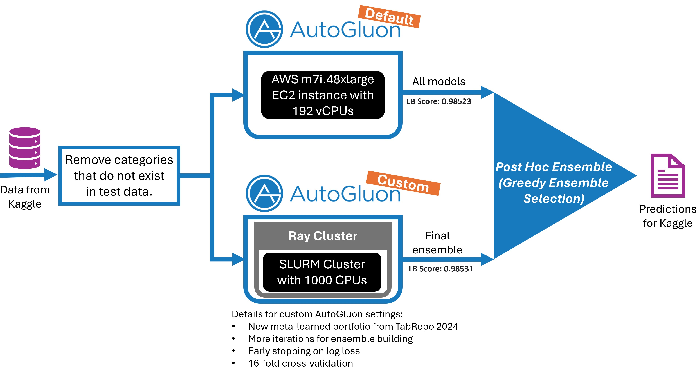

# Playground S4E8（蘑菇可食性）轻量深读（Tier B）

> 赛事：Playground ｜ 主题 tabular（近确定性二分类）｜ 2422 队 ｜ 标准赛 + AutoML Grand Prix（并行 24h 赛道）｜ 指标：Matthews Correlation Coefficient（~0.9855 上限）
> 材料基础：`digests/playground-series-s4e8.md`（6 篇正文：主赛 1st 531823 / AGP 1st 523656 / AGP 4th 523837 / 主赛 #4 531343 / AGP 3rd KAN 524709 / 缺失特征帖 523474；80 条主题索引）+ 8 张图
> 轻读时间：2026-10（Tier B B03）

## 1. 一句话重述与数字账

蘑菇可食性二分类（MCC，任务近确定性，原始 UCI 数据可"精确解"）。真正的考点是**噪声/类别清洗 + 原始数据信号利用 + 巨量 OOF 集成（Ridge/爬山/AutoGluon 后处理）**，且名次在第 5 位小数上竞争。

| 关键数字 | 值 | 来源 |
| --- | --- | --- |
| 主赛 1st（531823） | 收集 **~80 OOF，实际用 72**；Ridge/爬山/AutoGluon；把 siukeitin 的"原始数据精确解"概率当特征；单模 CV 0.97844–0.98494、集成 CV 0.985087；**31 个 ≥0.98512（私）提交**；最好私 0.98517（50-50 混合）；公榜最高 0.98537（私仅 0.98513）；CV-LB 差 0.0001–0.0002；"盲 blend 也能让人在百万级数据上过拟合"（大 shakeup） | 1st |
| AGP 1st（523656） | AutoGluon **分布式**（SLURM+Ray，**1000 CPUs**）+ TabRepo 零样本 HPO 组合 + 16 折 CV + 多层 stacking + log loss 早停 + 100 次后处理集成；清洗"测试中不存在的类别"→ NaN；把 AutoGluon 的舍入精度从 6 位调到 **8 位**做 tiebreak；缓存全部预测概率做 post-hoc → 0.98533（图 1） | AGP 1st |
| AGP 4th / 主赛 #4 / AGP 3rd | "Kitchen Sink"；"so close yet so far"；Team Oxygen 用 **KAN** | 材料 |
| 社区发现 | 缺失率高的特征仍有价值（69 票）；"Green is GO and Red is NO!"（53 票）；"真正的原始数据集"（49 票） | 主题索引 |

## 2. 逐方案对照矩阵

| 维度 | 主赛 1st | AGP 1st |
| --- | --- | --- |
| 数据 | 类别清洗、原始数据精确解概率特征 | 清除测试不存在的类别→NaN |
| 模型 | 大量单模 + AutoGluon + Ridge/爬山 | AutoGluon 默认 1h + 定制 4h |
| 集成 | 72 OOF（Ridge 为主） | 贪婪后处理集成（缓存全部概率） |
| 算力 | Kaggle 12h/GPU 配额受限 | AWS 192 vCPU + SLURM 1000 CPU |
| 细节 | "自信分歧覆盖"、50-50 对冲 | 8 位小数 tiebreak、log loss 早停、TabRepo 组合 |
| 结果 | 主赛 1st（私 0.98517 最佳） | AGP 1st（0.98533） |

## 3. 共识、分歧与裁决

### 共识一：数据"精确解/原始信号"是隐藏王牌（1st + 社区帖）

siukeitin 给出原始 UCI 数据的精确解；1st 把"有毒概率"当特征，效果与直接拼原始数据相近；"真正的原始数据集"帖（49 票）说明合成数据中残留原始信号。**裁决**：Playground 合成数据要查找原始数据源；即使标签不可得，模型输出的"原始概率"也是强特征/多样性来源。置信度：高。

### 共识二：巨量 OOF + 简单 meta（Ridge/爬山）是主赛标准（1st/AGP）

1st 用 72 OOF；AGP 用 AutoGluon 多层 stacking + 100 次后处理。**裁决**：在近确定性任务上，边际来自"更多样的弱模型 + 稳健线性 meta"，而非更强单模。置信度：高。

### 共识三：第 5 位小数的工程（精度/舍入/早停）决定名次（AGP 1st + 主赛 1st）

AGP 把舍入从 6→8 位做 tiebreak；主赛 1st 记录 0.0001–0.0002 的 CV-LB 偏移；31 个提交都在 0.98512+。**裁决**：当模型差距小于评测精度时，**集成器精度与提交选择**成为独立竞争力。置信度：高。

### 共识四：缺失率高 ≠ 无用（69 票帖 + 1st 的 AutoGluon 观察）

缺失模式本身是信号；1st 的 AG 最优集成几乎只剩 GBM+XT。**裁决**：不要按缺失率阈值暴力删列；让模型/集成决定。置信度：中高。

### 分歧/张力：盲 blend 的收益与反噬

1st 承认用"盲 blend/自信分歧覆盖"冲公榜（0.98535 公榜、私 0.98506 的教训），最终回归 CV 与稳健集成；同时社区大量 blender 在私榜大 shakeup（也有 jumps of 50–200 名）。**裁决**：百万级样本不保证私榜稳定（噪声处理差异会放大）；以 CV 为锚，盲 blend 只做保险而非主策略。置信度：高（1st 亲身教训）。

### AGP 赛道的意义

24 小时 AutoML 专项把"AutoGluon 分布式 + TabRepo 组合 + 后处理集成"推到 0.98533，与主赛 1st 同水平。**裁决**：结构化 AutoML 在这种近确定性大数据上已能与人肉集成打平，"人"的增量在数据理解与提交策略。置信度：中高。

## 4. 证据分级

| 断言 | 等级 | 说明 |
| --- | --- | --- |
| 主赛 1st 的 OOF/提交/分数链 | 自述（细节丰富） | 中高 |
| AGP 1st 的分布式/设置/分数 | 自述 + 图 + 代码 | 中高 |
| 原始数据精确解特征有效 | 多队 + 1st 实践 | 中高 |
| 缺失特征仍有价值 | 69 票帖（方法可复现） | 中 |
| 盲 blend 反噬 | 1st 经历 + 榜单起伏 | 中高 |

## 5. 悬案与缺口（登记）

- 主赛 2nd/3rd 与 AGP 2nd 方案未收录；"真正的原始数据集"（49 票）与 KAN 细节（524709）未细读。
- 31 个 ≥0.98512 提交的选择逻辑（哪些留最终）只部分说明。
- 盲 blend 造成 shakeup 的具体机制（噪声处理差异）未量化。

## 6. 图表证据

**图 1**（topic 523656）：数据清洗 → 默认 AutoGluon（AWS 192 vCPU，0.98523）与定制 AutoGluon（Ray+SLURM 1000 CPUs、TabRepo 组合、16 折、log loss 早停，0.98531）→ 贪婪后处理集成 → 提交。**AutoML 分布式 + 后处理集成的完整范式**。

## 7. 出处

- 主赛 1st（531823）：https://www.kaggle.com/competitions/playground-series-s4e8/discussion/531823
- AGP 1st（523656）：https://www.kaggle.com/competitions/playground-series-s4e8/discussion/523656
- AGP 4th（523837）：https://www.kaggle.com/competitions/playground-series-s4e8/discussion/523837
- 主赛 #4（531343）：https://www.kaggle.com/competitions/playground-series-s4e8/discussion/531343
- AGP 3rd KAN（524709）：https://www.kaggle.com/competitions/playground-series-s4e8/discussion/524709
- 缺失特征（523474）：https://www.kaggle.com/competitions/playground-series-s4e8/discussion/523474
