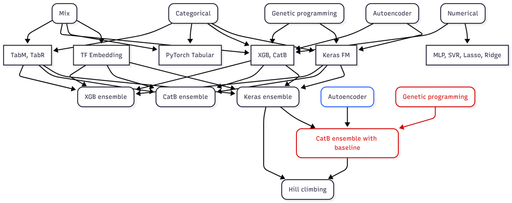

# Playground Series S5E10（道路事故风险）轻量深读（Tier B）

> 赛事：Playground ｜ 主题 tabular（合成数据回归）｜ 4082 队 ｜ 标准赛 ｜ 指标：MSE（RMSE ≈0.0556）
> 材料基础：`digests/playground-series-s5e10.md`（6 篇正文：1st 614086 / 5th 614079 / 8th 614207 / 14th 614089 / 3rd 614114 / 残差提升 610828；75 条主题索引）+ 3 张图
> 轻读时间：2026-10（Tier B B08）

## 1. 一句话重述与数字账

预测道路事故风险（合成数据，RMSE≈0.0556）。真正的考点是**在"分数已饱和到小数点后第 5 位"的极端拥挤赛里榨取 1e-5 级增益**：前 4 名同分 0.05563、其后约 200 队同分 0.05564；1st 的关键动作是"**残差提升 + GP 特征 + 用 CatBoost 以强模型为 baseline 二次集成**"。

| 关键数字 | 值 | 来源 |
| --- | --- | --- |
| 1st（614086） | "我想是遗传编程的功劳"：榜面极端拥挤（**前 4 同分 0.05563、之后 ~200 队同分 0.05564**）；纯数值表示"按 Kaggle 标准不算成功"（Lasso CV 0.058）；用 **Lasso 系数反推出数据生成公式**（`0.3046*curvature + 0.0706*lighting_2 + …` 与官方生成式几乎一致）；多表示 × 多模型（TabM/TabR、TF embedding、PyTorch Tabular、XGB/CatB、Keras FM、MLP/SVR/Lasso/Ridge）；**AE 与 GP 特征单独不具竞争力**，但"**在集成阶段加入 11 个 GP 特征**"带来 **+0.00001**；**用 CatBoost 以 Keras 集成为 baseline 做二次集成（等价于自动残差提升）→ +0.00002**；最终对 4 个一级集成做爬山（二级集成）；自述"前 12 个提交在 5 位小数上完全一样" | 614086 |
| 5th（614079） | **"一百折"**：只造 2 个强模型（XGB 与 TabM）的大量变体；TabM 转成"预测相对原始生成函数的残差"；**TabM 与 XGB 都用 100 折**（NN 受益于多份数据/多 seed），XGB 用 TabM 的 OOF 作特征做 stacking；7 模型爬山；**伪标签**：用 7 模型集成标测试集后重训 TabM，再做新集成；一份提交与最佳公开 notebook **50/50 混合** | 614079 |
| 8th（614207） | 少而精：Optuna 调的多个"Boosting over Residuals" XGB（5–55 折）+ 3 个 TabM（2 个转残差）+ HistGBM/LGBM + Keras MLP + AutoGluon；**元特征筛选**：去低方差/高 RMSE → 去 |ρ|>0.9995 的重复列 → **Greedy NNLS + LassoCV 选 4–6 列** stacking | 614207 |
| 14th（614089） | 3 个 HC 集成（合计 ~100 模型）+ 1 个 Ridge 集成；有 70+ 个 HC 变体，CV 0.055822–0.055833 全部对应私榜 0.05562/0.05563；**更低 CV 来自"30+ 模型 + 负权重（-0.30~+0.65）的激进 HC"，在 1e-7 容差上修正相关误差**；最后选择更保守的版本——"更低的 CV 不一定更好，要评估过拟合风险" | 614089 |
| 社区 | "**XGB 残差提升（CV 0.05595）**"（67 票）成为全场公共起点；"高事故风险值被系统性低估"（46 票）；"很难造出多样的模型"（40 票）；"单 TabM 就到 0.05592/0.05546"（25 票）；"微小的 OOF/LB 差异会延续到私榜吗"（22 票）；"XGB 3.1+ 类别自动重编码"（21 票） | 社区 |

## 2. 逐方案对照矩阵

| 维度 | 1st | 5th | 8th | 14th |
| --- | --- | --- | --- | --- |
| 基础模型 | 多表示 × 多族（含 Keras FM/TabM） | 仅 XGB + TabM 变体 | XGB/TabM/GBM/NN/AutoGluon | ~100 模型 |
| 残差技巧 | CatBoost 以 Keras 集成为 baseline | TabM/XGB 预测生成函数残差 | XGB/TabM 残差版 | HC 负权重修正 |
| 折数 | — | **100 折** | 5–55 折 | — |
| 关键增益 | GP 特征 +0.00001、CatB baseline +0.00002 | 伪标签 + 100 折 stacking | 元特征精选到 4–6 列 | 保守 vs 激进 HC 的选择 |
| 结果 | 第 1（与 2–4 同分） | 5th | 8th | 14th |

## 3. 共识、分歧与裁决

### 共识一：分数饱和后的增益只有 1e-5 级，且靠"结构"而非"更强模型"（1st/5th/8th）

1st 的 GP 特征 +0.00001、CatB baseline +0.00002；5th 靠 100 折 + 伪标签；8th 靠元特征精选。**裁决**：饱和赛的可行操作是"改变误差结构"（残差提升、以强模型为 baseline、精选互补元特征），再加模型只会增加相关性。置信度：高。

### 共识二：残差提升（Boosting over Residuals）是本场公共起点（社区 67 票帖 + 1st/5th/8th）

用原始生成函数（或强模型预测）当 baseline，模型只学残差——1st 用 CatBoost 自动实现（即以 Keras 集成为 baseline）；5th/8th 的 XGB/TabM 都改造成残差版。**裁决**：合成数据赛里，"先复现生成函数，再学残差"是最稳的骨架。置信度：高。

### 共识三：NN 受益于多折/多 seed，值得重训（5th/1st）

5th 把 TabM 全部重训成 100 折；1st 用 40–50 个 NN 做集成（1–2 小时）。**裁决**：在极小差距赛里，NN 的种子/折数集成是性价比高的稳定性来源。置信度：中高。

### 分歧一：激进 HC（含负权重）还是保守提交

14th 发现更激进的 HC（负权重、1e-7 容差）CV 更低，但最终选择更保守的版本（"更低的 CV 不一定更好"）；1st/5th 也都在最后用爬山但强调"前 12 个提交 5 位小数相同"。**裁决**：饱和赛里选择提交要按"风险"而非"最低 CV"；保留多个同分方案并优先选结构更稳的。置信度：中高。

### 分歧二：公开 notebook 混不混

5th 有一份提交与最佳公开 notebook 50/50 混合；1st 未提及混公开；14th 用自建 HC。**裁决**：可用但要作为独立分支登记（与 S4E11/S6E6 的结论一致：公开 artifact 必须过本地验证，但本场同分意味着差异可能只是噪声）。置信度：中。

### 事件：从 Lasso 反推生成函数（1st）

1st 用 Lasso 系数恢复出与官方生成式几乎一致的线性组合（curvature/lighting/speed_limit/num_reported_accidents 等）。**裁决**：合成数据赛先做"生成式逆向"（Lasso/浅树/符号回归），它既提供 baseline 也解释特征贡献。置信度：高。

## 4. 证据分级

| 断言 | 等级 | 说明 |
| --- | --- | --- |
| 1st 的流程图、GP 特征 +0.00001、CatB baseline +0.00002 | 自述 + 流程图 + 公开 notebook | 中高 |
| 5th 的 100 折与伪标签流程 | 自述 + 公开 notebook | 中高 |
| 8th 的元特征筛选（NNLS/LassoCV 到 4–6 列） | 自述 | 中高 |
| 14th 的激进/保守 HC 与 1e-7 容差 | 自述 + 提交截图 | 中 |
| 残差提升为公共起点 | 社区 67 票帖 + 多队采用 | 高 |

## 5. 悬案与缺口（登记）

- 2nd–4th/6th–7th/9th–13th 的方案未入库；"高值被系统性低估"（46 票）与"关键 CV 策略"（106 票）未细读；
- 1st 的 11 个 GP 特征具体公式只在 notebook 中，材料仅给了一例难读公式；
- 100 折对 XGB 的收益未单独量化；
- 归档 3 图：1st 的集成流程图（图 1）与 Lasso 系数图、14th 的提交截图。

## 6. 图表证据

**图 1**（topic 614086）：1st 的多层管线——五种输入表示（Mix/类别/GP/自编码器/数值）分别喂给 TabM/TabR、TF Embedding、PyTorch Tabular、XGB/CatB、Keras FM、MLP/SVR/Lasso/Ridge；产出 XGB/CatB/Keras 三个一级集成，其中 **CatB ensemble with baseline（红色）以 Keras 集成为 baseline 再吸收 GP 特征**，最后统一进爬山（二级集成）。

## 7. 出处

- 1st（614086）：https://www.kaggle.com/competitions/playground-series-s5e10/discussion/614086
- 5th（58 票）：https://www.kaggle.com/competitions/playground-series-s5e10/discussion/614079
- 8th（614207）：https://www.kaggle.com/competitions/playground-series-s5e10/discussion/614207
- 14th（614089）：https://www.kaggle.com/competitions/playground-series-s5e10/discussion/614089
- XGB 残差提升（67 票）：https://www.kaggle.com/competitions/playground-series-s5e10/discussion/610828
- 高值被低估（46 票）：https://www.kaggle.com/competitions/playground-series-s5e10/discussion/610422
