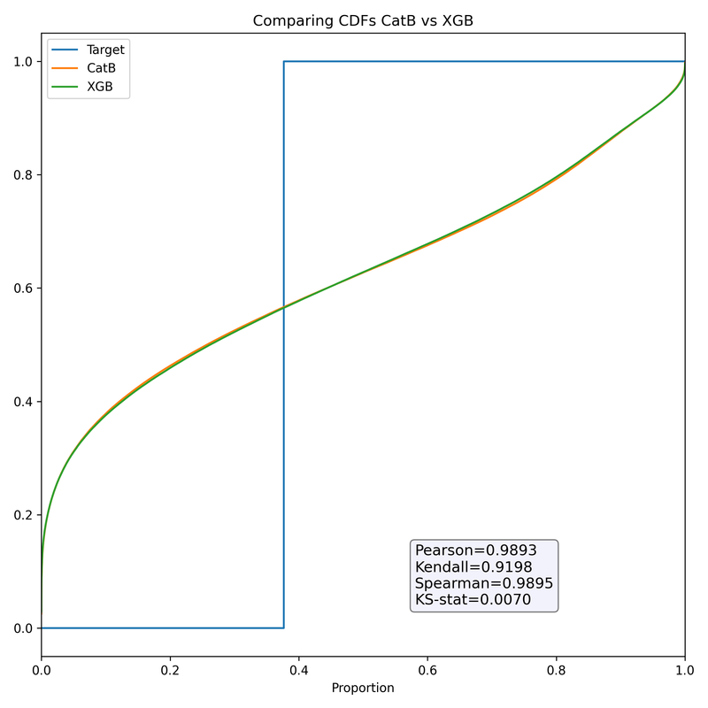
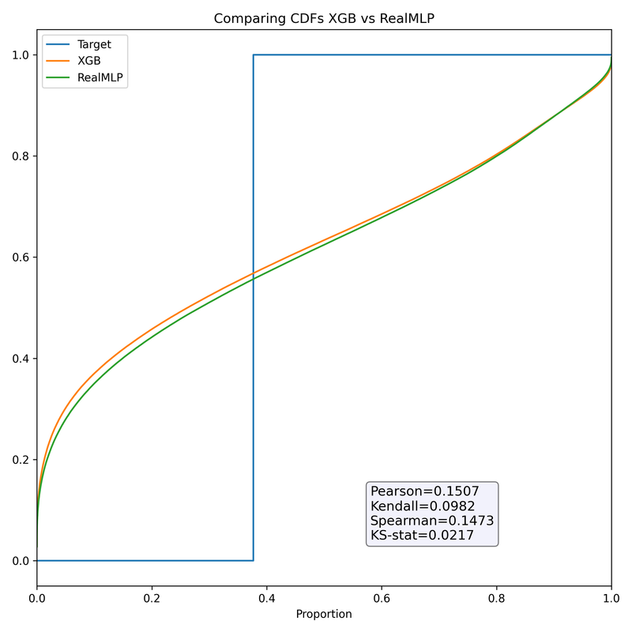

# 深读：S5E12 糖尿病预测（ID 位移 + 概念漂移 —— "被故意破坏的数据"）

> 素材：现有 6 篇正文 + 59 条主题索引。
> 本篇亮点：把"ID 位移 / 概念漂移 / 原数据能不能用 / 伪标签是否有效"四条争议逐一裁决，并用两场冠军的**数字台账**对照。

## 0. 一句话重述：这道题真正在考什么

合成数据被"刻意破坏"（删除 HbA1c 等决定性特征、扭曲分布），同时生成顺序带来 **ID 位移**（训练集尾部 ≈ 测试分布）。

→ 任务降解为：**① 找到"像测试集"的可信子集（tail）重建验证；② 在协变量漂移之外识别并处理概念漂移；③ 把"原数据的生成逻辑"以正确形式注入（加权/TE/统计映射），而不是原样拼接。**

## 1. 材料与角色

| 帖子 | 角色 | 关键信息 |
| --- | --- | --- |
| 2nd：ID Shift Analysis（665385） | 方法论核心 | 对抗验证定分界；cutoff CV；**概念漂移量化表**；加权 16/8/1；15 个单模的 cutoff-AUC 台账；Bagged HC 集成 |
| 1st（665432） | 冠军 | HC → Ridge 两阶段（top-36, α=10）；post-cutoff CV–LB gap 监控；平台期后换正则化 |
| 数据被破坏（652262） | 数据审计 | 强特征被删；原数据上 XGB/LGB/CatB CV AUC **0.9998/0.9998/0.9999**；"原数据不应使用"的强烈主张 |
| EDA→Baseline（648186） | 反方实践 | 原数据**只做统计参考特征**（mean/count 映射）；Selective TE（nunique>2，折内计算） |
| 盲融addicts（651787） | 集成诊断 | **CDF + KS-stat 预判集成收益**；两对模型的定量对照 |
| 路线图（650676） | 新手向 | 月赛时间管理 |

## 2. 逐方案对照矩阵

| 维度 | 1st | 2nd | EDA 起点（社区） |
| --- | --- | --- | --- |
| 验证 | post-cutoff CV（0.70860 Ridge / 0.70886 HC）+ gap 监控 | Cutoff AUC（id≥678260，约末 3%）；对抗验证 head/tail | 折内 TE；未见 cutoff 细节 |
| 原数据用法 | 未在帖内展开 | 作为训练行但**加权 8×**（tail 16×、head 1×）+ tail/orig 的 TE | **仅作统计参考特征**（不改训练分布） |
| 建模 | 大量异构基模 → HC 选模 → **Ridge 二阶段** | 15 个单模（含加权/TE/伪标签/残差/NN 栈）→ **Bagged HC**（50 bags×2000 iter） | XGB + 选择性 TE |
| 关键数字 | CV 0.70860→LB 0.70739，gap 0.00121 | Bagged HC 0.70771 > Ridge(pos) 0.70751；最强单模 nn_stacking 0.70616 | — |

## 3. 共识与分歧（含裁决）

**共识**：ID 位移真实存在；必须以"尾部/截止点"为验证核心；原数据不能原样混入训练而不做任何处理。

**分歧与裁决**：

| 争议 | 观点 A | 观点 B | 裁决（依据与置信度） |
| --- | --- | --- | --- |
| 原数据要不要用 | "不应使用"（652262） | 加权 8× 用（2nd）；仅作统计参考（EDA） | **三者可统一**：禁用"原样拼接"，但"生成逻辑"（统计/TE/加权）可用——2nd 用它拿亚军、EDA 用它做起点；置信度高 |
| 概念漂移下删特征 | 删"有毒"特征更安全（2nd 的 lgb_safe 假设） | 保留 + 加权/重建 | **反例成立**：lgb_safe 仅 0.67464，远低于 baseline 0.70435——直接删特征伤信号；置信度高（同表内对照） |
| 伪标签是否有效 | 普遍认知"伪标签涨分" | — | **本场单模负结果**：lgb_pseudo 0.70081 < lgb 0.70435；xgb_pl_soft 0.70231 < xgb 0.70335——伪标签单模不如基线（是否进集成另论）；置信度高（同表对照） |
| 融合同分模型才有效？ | 盲融格言"分数相近才值得融" | KS/CDF 判据 | **证伪**：XGB(0.73097)+RealMLP(0.72846) 低相关（Pearson 0.151）却 +0.00069，弱模型拿 ~40% 权重；同分对（CatB/XGB，KS 0.0070）只 +0.00016；置信度高（两对定量对照） |

## 4. 增量数字账（全部来自帖内可复算表）

| 动作 | 数字 | 备注 |
| --- | --- | --- |
| 2nd 加权 + tail-TE 的 CatBoost | 0.70489（cutoff AUC） | 与交互版并列其单模最佳 |
| NN 栈（OOF 输入） | 0.70616 | 最强单模 |
| Bagged HC 集成 | **0.70771** | vs Ridge(pos) 0.70751 |
| 1st HC / Ridge 二阶段 | 0.70886 / 0.70860 | 最终选 Ridge（LB 更好） |
| 原数据"可分离度" | AUC 0.9998–0.9999 | 说明决定性特征被抽走 |
| 集成诊断两对 | +0.00016 vs +0.00069 | KS 0.0070 vs 0.0217 |

## 5. 机制推演

1. **ID 位移的来源**：生成器按顺序产出数据，分布随生成进度漂移 → 训练集**尾部**与测试同分布。2nd 用对抗验证（head vs tail）找分界（tail 约 2.3 万行 / 全量 ~3%），并规定 cutoff 验证（id≥678260）。
2. **概念漂移的定量证据**（2nd 表）：把 head 按"与 tail 的相似度"分 10 箱，目标率从 0.6436 单调降到 **0.5214**，而 tail 真值 0.6214 —— "长得像测试集的样本，标签率反而更低"。这不是协变量漂移能解释的，**标签函数本身在漂移**；因此单纯重加权不够，需要 orig 逻辑注入（TE/加权）与 tail 专训（tail-only LR/GAM 0.70345/0.69325）。
3. **为什么删特征失败**：物理活动等"高概念漂移"特征同时承载 head 子群的有效信号；删除=对子群盲视。**漂移应对应在样本/目标空间做，而不是在特征空间做外科手术**（本条可迁移）。
4. **Ridge 二阶段为何胜**（1st）：HC 选模后平台期；Ridge 正则化换取泛化，且以 CV–LB gap（0.00121）作为接受阈值——与 2nd 的 Bagged HC 殊途同归（都在"防过拟合的选择层"）。
5. **KS/CDF 的集成预测力**（盲融帖）：把"预测分布差异"当作互补性度量；CDF 分离（KS 大）+ 低相关 → 增益大。这个判据同时解释了"弱模型为何能拿 40% 权重"。

## 6. 证据分级

| 断言 | 等级 | 说明 |
| --- | --- | --- |
| cutoff/加权/TE 的 15 模型台账与集成数字 | **可复算（帖内表格）** | 数字完整 |
| 概念漂移分箱表（0.6436→0.5214，tail 0.6214） | **可复算（帖内输出）** | 图+表 |
| 原数据 AUC 0.9998 级 | **自述（可复现需数据）** | 强证据但未附代码 |
| "Kaggle 故意破坏" | **强推断** | 删除特征列表 + 分布图 |
| lgb_safe/伪标签负结果 | **可复算对照** | 同表内基线可比 |
| 1st 的 top-36/α=10 选择过程 | **自述（弱）** | 无搜索细节 |

## 7. 边界条件与反事实

- **ID 位移依赖顺序结构**：无顺序/无生成漂移的数据不存在此打法。
- **概念漂移方向可变**：本场"越像测试集标签率越低"；若方向相反，加权可能反向放大偏差——**先分箱测量，再决定加权方向**。
- **cutoff CV 近似而非等价**：tail 只是"像"测试；1st 的 gap 监控是对此的补救。
- **反事实**：若不做 cutoff 验证，用常规 CV（0.73 级）决策 → 本场大洗牌中必被清洗（2nd 从公开 344 到私榜前列一类的名次跃迁即证据）。

## 8. 悬案与失败学

- 悬案 1：16/8/1 的权重从何而来（未给推导/搜索）；
- 悬案 2：1st 的特征工程与基模清单未公开（只有 HC/Ridge 框架）；
- 悬案 3："原数据不应使用"与"加权使用"的边界（什么条件下加权也救不了）；
- 失败学：lgb_safe 删特征（0.6746）；单模伪标签两例均低于基线；盲融"同分才能融"被证伪。

## 9. 图表证据

**图 1：CatB vs XGB 的 CDF**（来源：盲融诊断帖 topic 651787；本地 `intel/playground-series-s5e12/bodies/651787_img/01.png`）

*读图结论*：两模型 CDF 几乎重合（Pearson=0.9893，KS-stat=0.0070），接近目标阶梯线但整体形态一致 → 集成增益预测很小，实际仅 +0.00016。低 KS 与低增益的对应关系在此验证。

**图 2：XGB vs RealMLP 的 CDF**（来源同上；本地 `.../651787_img/02.png`）

*读图结论*：两条曲线明显分离（Pearson=0.1507，KS-stat=0.0217）：RealMLP 在左半（零类）更贴近目标阶梯，XGB 在右半（正类）更贴近 → 互补性强，实际增益 +0.00069 且弱模获 ~40% 权重。**图中数字（Pearson/KS）就是"该不该融、怎么融"的预测量。**

> 另：数据破坏帖（652262）的图片经核对与上述 CDF 图重复（同作者复用），不再重复内嵌。

## 10. 对既有笔记/playbook 的修订点

1. 笔记升级：补 2nd 的 cutoff 台账与概念漂移分箱表、1st/2nd 数字对照、伪标签与删特征负结果、KS/CDF 诊断法；内嵌两张 CDF 图。
2. `playbook/tabular.md` 新增："ID 位移处理协议"（对抗验证定界→cutoff 验证→按相似度分箱测概念漂移→决定加权方向）与"漂移应对优先样本空间，勿删特征"。
3. `playbook/00-通用方法论.md` 增补："集成前先做 CDF/KS 互补性诊断"与"负结果台账（伪标签/删特征）"。

## 11. 出处

- 2nd（ID Shift）：https://www.kaggle.com/competitions/playground-series-s5e12/discussion/665385
- 1st（HC+Ridge）：https://www.kaggle.com/competitions/playground-series-s5e12/discussion/665432
- 数据被破坏：https://www.kaggle.com/competitions/playground-series-s5e12/discussion/652262
- 盲融诊断（CDF/KS）：https://www.kaggle.com/competitions/playground-series-s5e12/discussion/651787
- EDA→Baseline：https://www.kaggle.com/competitions/playground-series-s5e12/discussion/648186
- 新手路线图：https://www.kaggle.com/competitions/playground-series-s5e12/discussion/650676
