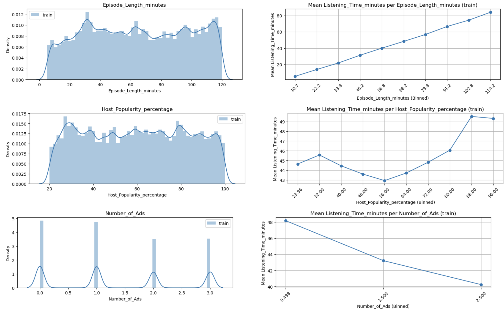
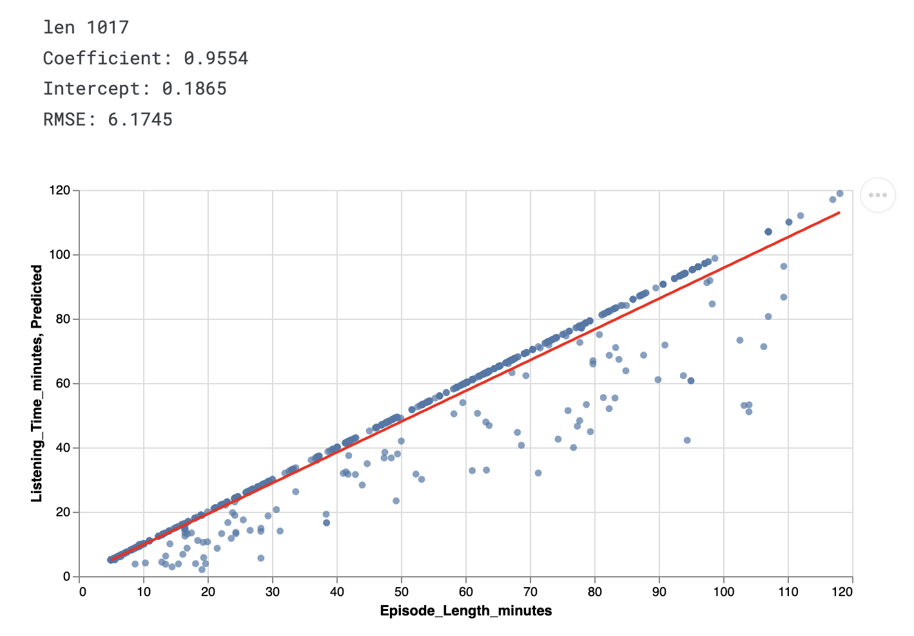
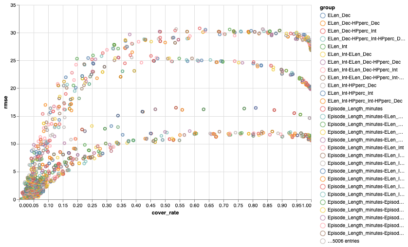
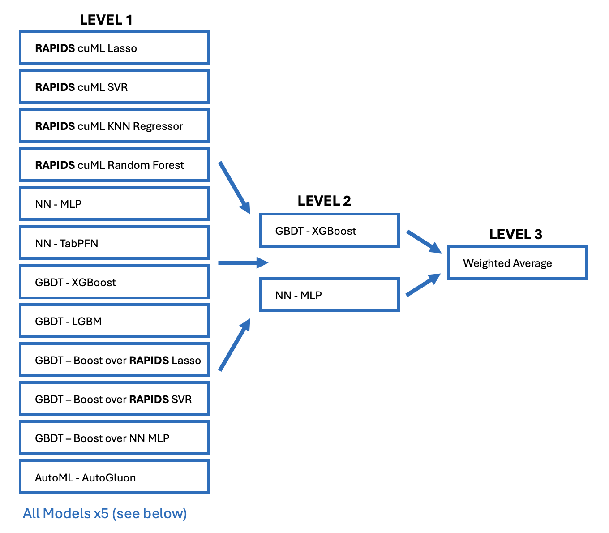

# Playground Series S5E4（播客收听时长）轻量深读（Tier B）

> 赛事：Playground ｜ 主题 tabular（合成数据回归）｜ 3310 队 ｜ 标准赛 ｜ 指标：RMSE
> 材料基础：`digests/playground-series-s5e4.md`（6 篇正文：1st 575784 / 2nd 575840 / 3rd 575862 / 5th 575839 / 6th 575783 / EDA 571549；80 条主题索引）+ 10 张归档图
> 轻读时间：2026-10（Tier B B11）

## 1. 一句话重述与数字账

预测播客单集的收听时长。数据主结构 `Listening_Time ≈ 0.72 × Episode_Length_minutes（ELM）`：ELM 承载 90%+ 信号但 **11.6% 缺失**，于是数据天然分成"有 ELM / 无 ELM"两个情景。1st 由此论证：**线性 Level-2（爬山/Ridge）不够，必须用非线性深栈**（75 个模型、3 级），最终 private 11.44 夺冠；2nd 则用"单 LightGBM + 1552 个目标编码特征"在 CPU 上跑出亚军——两条路线把"栈的深度"与"特征工程的厚度"推到两个极端。

| 关键数字 | 值 | 来源 |
| --- | --- | --- |
| 1st（575784） | RAPIDS cuML **3 级栈、75 个模型**（L1 的 12 类模型 × 约 6 种变体）；CV **11.54** / public 11.51 / private **11.44**；赛后对照：爬山（linear L2）private 11.503，深栈 private 11.448；3×A100，每天约造一打新模型，只留提升栈的 | 575784 |
| 1st 的分层分数 | L1：Lasso/SVR（6000 特征）CV 13.2、KNN 12.8、RF 12.1、MLP 12.0、XGB/LGBM 11.8、三个"对残差再boost"11.9、AutoGluon 12.4；L2：XGB/MLP 用 73 个 L1 预测 → 11.56；L3：加权平均（50/50）→ 11.54 | 575784 |
| 2nd（575840） | **单 LightGBM + 目标编码**：1552 特征、794,868 行；`n_iter=12000, max_depth=15, lr=0.008, num_leaves=480, colsample=0.25`；5 seeds；靠 dtype 转换与避免拷贝在 **Kaggle CPU 上约 4 小时**训完；TE 覆盖 12 列 × pair_size 1–6 + 统计量 | 575840 |
| 3rd（575862） | TE + 3 级：L1 = 10 LGBM / 5 XGB / 4 CatBoost / 2 RF / 1 ET / 4 HGBR；首次尝试 stacking 即 11.66 → **11.62** CV；最终 80% stacking + 20% 爬山；最好单模 LGBM CV 11.79；top 模型约 **270 个 TE 特征**（2–7 元组合） | 575862 |
| 6th（575783） | 单 LGBM 5 折 public 11.70 / private **11.63**；三处"数据泄漏式"结构：ELM 小数位 >2 的 1017 行（单特征拟合系数 **0.9554**、RMSE 6.17）、`Number_of_Ads>3` 的 7 行（×1.0588）、相同特征组合组均值；**1000+ 次实验**（WandB + 自动 commit） | 575783 |
| 5th（575839） | 100 个 OOF + Ridge 系集成；最强单模（30 折 XGB + median 编码）public 11.75387 / private 11.67004（≈34 名）；**未做 clipping 的提交 private 暴涨到 177.25179**（若不是另一份提交救回几乎崩盘；clip 后本可第 4） | 575839 |
| 社区 | "特征与目标强相关" 149 票 / 137 评论；"强特征交互" 142 票 / 85 评论；"直接 vs 间接关系" 60 票；"原始数据里的重复行" 49 票；"小数位模式" 27 票；"极端离群可毁私榜，建议 cap" 11 票 | 索引 |

## 2. 逐方案对照矩阵

| 维度 | 1st | 2nd | 3rd | 6th |
| --- | --- | --- | --- | --- |
| 主结构 | 75 模型 3 级栈（GPU/RAPIDS） | 单 LightGBM + 1552 特征 | 26 模型 3 级集成 | 单 LGBM + 泄漏修正 |
| Level-2 形态 | 非线性（XGB/MLP） | — | stacking + 爬山 | — |
| 情景处理 | 专门训练"删 ELM"模型 + ratio 模型 + ELM 预测模型 | TE 让树自行分裂 | TE + is_original 标记 | 小数位/Ads 结构定向修正 |
| 数据利用 | 伪标签、train+test 预测 ELM | 原始数据拼接 | 原始数据行拼接（CV 忽略） | 原始数据作新行 + 组均值覆盖 |
| 算力 | 3×A100 + cuDF/cuML | Kaggle CPU × 4h × 5 seeds | 本地标准硬件 | — |
| 结果 | 私榜 **11.44**（1st） | 2nd | 3rd | 11.63（6th） |

## 3. 共识、分歧与裁决

### 共识一：ELM 是主特征，其"缺失结构"决定集成器形态（1st、3rd、EDG 帖；置信度高）

ELM 占 90%+ 信号、缺失 11.6%，使"有/无 ELM"成为两个情景。1st 明确论证：线性 L2 只能做全局加权平均，非线性栈可按情景选用不同模型的预测；3rd 也观察到 stacking 在本场立竿见影（11.66→11.62），并推测原因正是"主特征高缺失"。**裁决**：当最强特征有结构性缺失时，优先用非线性 L2 + 专门针对缺失情景的模型，而不是一味加大集成权重搜索。置信度：高。

### 共识二：目标编码（TE）是本场的特征工程骨架（2nd、3rd、6th；置信度高）

2nd 的 1552 个特征绝大多数来自 TE（12 列 × pair_size 1–6 + 统计量）；3rd 的 top 模型约 270 个 TE 特征；6th 直接用"组合的组内 RMSE"筛选有效特征组合。**裁决**：类别型/离散化特征的组合目标编码是本届提分主线；但必须折内计算以避免泄漏（1st 反复强调 remove all leaks）。置信度：高。

### 共识三：合成数据的"生成痕迹"就是捷径（6th、3rd、社区多帖；置信度中高）

小数位数 >2 的 ELM 与目标强相关（1017 行、系数 0.9554）；`Number_of_Ads>3` 仅 7 行却贴近目标；相同特征组合的组均值可直接覆盖预测；原始数据的重复行、原始数据作新行/新列都是提分手段。**裁决**：合成数据赛先做"生成器指纹"分析，能以极低成本拿到可观分数；但这类修正必须在折内验证，避免过拟合到训练集结构。置信度：中高（多帖互证，方法自述）。

### 分歧一：深栈 vs 单模（1st/3rd vs 2nd；置信度高）

1st 表示单模型与爬山都赢不了本场（交互+双情景太复杂），3rd 也称 stacking 首次尝试即提升；而 2nd 用单个 LightGBM 拿下亚军，说明"特征工程足够厚"时单模也能站上领奖台。**裁决**：本场顶部竞争的形态取决于"情景差异是否被特征工程消化"——TE 足够厚可让单模逼近，但稳定夺冠需要深栈的覆盖能力。置信度：高（名次证据双侧）。

### 事件：不 clipping 的代价（5th、社区两帖；置信度高）

5th 未裁剪的提交 private RMSE 达 **177.25**；社区另有"两个极端离群就能毁掉私榜，建议 cap"与"不 clip 杀死了我最好的提交"两帖。**裁决**：回归赛提交前必须对预测做合理截断（上界/下界），并至少保留一份保守提交——这是本届最贵的单点教训。置信度：高。

## 4. 证据分级

| 断言 | 等级 | 说明 |
| --- | --- | --- |
| 1st 的 3 级栈结构、分层 CV 与三种结果（CV/公/私） | 自述 + 结构图 + 分数表 | 高 |
| 2nd 的单 LGBM 结构、特征数与超参 | 自述 + 公开 notebook | 高 |
| 3rd 的 TE 细节与"stacking 首次即提升" | 自述 | 中高 |
| 6th 的三处数据泄漏与修正系数 | 自述 + EDA 图 | 中高 |
| 5th 的 177.25 私榜事故 | 自述（含具体分数） | 高（自曝） |
| 社区 EDA（相关性/交互/重复行） | 高票帖 + 图 | 中高 |

## 5. 悬案与缺口（登记）

- 4th（575782，53 票"大量特征 + 简单模型 + ridge blend"）与 19th/18th、6 模型集成帖（575951）未收录正文；
- WarpGBM 系列（GPU 梯度提升）与 "AutoGluon Grand Prix" 等工具帖未细读；
- 原始数据集的具体来源与重复行结构未逐条核对；
- 归档 10 图，本深读内嵌 4 张；其余（实验管理、TE 搜索细节等）留待图像层 OCR；
- **图证缺口**：无（10 张归档图）。

## 6. 图表证据

**图 1**（topic 571549，149 票）：ELM 与目标近似线性（约 0.72×），`Number_of_Ads` 与目标负相关，Host Popularity 呈非线性——"特征与目标强相关"的原始证据。

**图 2**（topic 575783，6th）：ELM 小数位 >2 的 1017 行——单特征线性拟合 Listening_Time ≈ 0.9554×ELM + 0.1865（RMSE 6.17），这些行几乎被目标"泄露"。

**图 3**（topic 575783，6th）：按组均值预测的 RMSE 与覆盖率散点（5006 个特征组合）——系统化筛选 TE 组合的依据。

**图 4**（topic 575784，1st）：Level 1 的 12 类模型（Lasso/SVR/KNN/RF/MLP/TabPFN/GBDT/残差 boost/AutoGluon，各 ×5+ 变体 = 75 个）→ Level 2 非线性（XGB + MLP）→ Level 3 加权平均。

## 7. 出处

- 1st：RAPIDS cuML 三级栈（234 票 / 152 评论）：https://www.kaggle.com/competitions/playground-series-s5e4/discussion/575784
- 2nd：单 LightGBM + 目标编码（78 票）：https://www.kaggle.com/competitions/playground-series-s5e4/discussion/575840
- 3rd：目标编码与三级结构（28 票）：https://www.kaggle.com/competitions/playground-series-s5e4/discussion/575862
- 5th：100 OOFs 与未裁剪事故（12 票）：https://www.kaggle.com/competitions/playground-series-s5e4/discussion/575839
- 6th：特征组合选择与数据泄漏（27 票）：https://www.kaggle.com/competitions/playground-series-s5e4/discussion/575783
- 强相关 EDA（149 票 / 137 评论）：https://www.kaggle.com/competitions/playground-series-s5e4/discussion/571549
- 强特征交互（142 票）：https://www.kaggle.com/competitions/playground-series-s5e4/discussion/573002
- 直接 vs 间接关系（60 票）：https://www.kaggle.com/competitions/playground-series-s5e4/discussion/574249
- 原始数据重复行警示（49 票）：https://www.kaggle.com/competitions/playground-series-s5e4/discussion/571035
- 小数位模式（27 票）：https://www.kaggle.com/competitions/playground-series-s5e4/discussion/574925
- 极端离群与 cap 建议（11 票）：https://www.kaggle.com/competitions/playground-series-s5e4/discussion/571827
