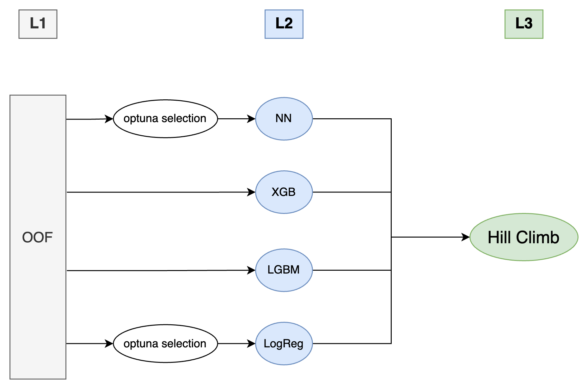

# Playground Series S5E6（最优化肥推荐）轻量深读（Tier B）

> 赛事：Playground ｜ 主题 tabular（多分类，MAP@3）｜ 2648 队 ｜ 标准赛 ｜ 指标：MAP@{K}（top-3）
> 材料基础：`digests/playground-series-s5e6.md`（5 篇正文：1st 587393 / 2nd 587398 / 3rd 587464 / 5th 587392 / 信号分析 583189；80 条主题索引）+ 4 张图
> 轻读时间：2026-10（Tier B B10）

## 1. 一句话重述与数字账

从土壤/作物/气候与养分数据推荐最优化肥（7 类，MAP@3）。真正的考点是**"低相关数据里找比率/交互信号 + 大 OOF 池 + 稳健（Ridge）集成器"**：最强的 EDA 结论是氮磷钾**比率与（土壤×作物）组合**才是信号；而 3rd 的标题直接点题——"**Ridge 和 CV 就是全部**"。

| 关键数字 | 值 | 来源 |
| --- | --- | --- |
| 1st（587393） | 主题是"**用 RAPIDS cuDF/cuML 做快速 GPU 实验**"：把过去半年 Playground 的技巧打包复用——cuDF 特征工程、**boosting over residuals**、使用原始数据、cuML 堆叠；核心是**把实验迭代速度**变成竞争力（GPU 端到端） | 587393 |
| 2nd（587398） | **三层集成**（图 1）：**100 个 OOF（5 折 SKF）→ L2（XGB/LGBM/LogReg/NN，部分先 Optuna 选参）→ L3 爬山**；L1 模型动物园：多组 XGB（不同类别特征组合；有的只用原始数据，有的 train+原始且**原始数据权重 4.0**；先在原始数据预训练再微调；加入分箱/聚类/目标编码；加入**监督自编码器隐特征**；以 auc/merror 为 eval_metric 的变体）、ExtraTrees/RandomForest/NN（**以 XGB 预测为特征**）、多组 LGBM、LogReg、TabTransformer；全部在 Kaggle Notebook 完成 | 587398 |
| 3rd（587464，"Ridge and CV are all you need"） | 60+ 模型；**集成器演进**：HC（加模型常掉 CV）→ 遗传算法（>20 个模型后同样失效）→ **Ridge**（60 OOF 约 1 分钟，加模型几乎总能提升 CV）；细节：**OOF 堆成 (n_samples, n_models×7)，目标 one-hot 后做多目标回归**（把分类转成回归）；少数 XGB/NN 直接用 MSE 多目标回归；"XGB + 乘积特征 + 标签编码"意外提分 +0.0001；理念=**模型族的多样性（XGB vs NN）优于同族不同 FE**；"Trust CV" | 587464 |
| 5th（587392） | 53 个 OOF 的集成 | 587392 |
| 信号分析（583189，68 票） | EDA 结论：7 类目标分布均衡（12–16%）；**(Soil Type, Crop Type) 有强联合模式**（如 Clayey–Millets→28-28）；数值列在物理边界内近似均匀、**Spearman 相关几乎为 0（|ρ|<0.01）**，但每类的养分中位数有数单位的位移 → **需要"比率/交互特征"而非原始值**；(温度, 湿度, 水分) 的三元联合分布携带类别信号 | 583189 |
| 社区侧 | "尿素肥料 10:26:26"（53 票）、"**只用逻辑回归会怎样**"（49 票）、"**原始数据集可能只是噪声**"（46 票）、"MAP@3 的实现"（34 票 / 23 条评论的指标帖）、"公榜目标分布揭示"（28 票）、"请在结束前 3 天停止公开分享"（33 票） | 社区 |

## 2. 逐方案对照矩阵

| 维度 | 1st | 2nd | 3rd |
| --- | --- | --- | --- |
| 核心策略 | GPU 加速实验迭代 | 100 OOF 三层堆叠 | 60+ 模型 + Ridge |
| 模型族 | cuML + GBDT/NN | XGB/LGBM/NN/LogReg/ET/RF/TabTransformer | XGB/NN 等多族 |
| 集成 | cuML 堆叠 | **L2 多样 + L3 爬山** | **Ridge（多目标、one-hot 堆叠）** |
| 数据 | 原始数据纳入 | 原始数据权重 4.0 | 乘积特征 + 标签编码 |

## 3. 共识、分歧与裁决

### 共识一：信号在"比率/交互"而非原始数值（583189 + 2nd/3rd 的特征选择）

EDA 帖指出数值列近乎无相关、但按类别有中位数位移 → 比率/交互特征；2nd 的模型 Zoo 大量加入聚类/分箱/目标编码与乘积；3rd 的"乘积特征 + 标签编码"+0.0001。**裁决**：低相关表格数据的常规出路是"域内比率 + 类别交互 + 目标编码"。置信度：高。

### 共识二：集成器要选"加模型就涨"的那种（3rd + 2nd）

3rd 明确 HC/GA 在模型数变多后出现"加模型掉 CV"，改用 Ridge 后几乎单调提升；2nd 用 L2 多样 + L3 爬山。**裁决**：大 OOF 池上优先用带正则的线性集成（Ridge/LogReg），爬山只在最后小范围使用。置信度：高。

### 共识三：MAP@3 要专门实现与验证（34/23 票帖 + 全员）

社区有专门的指标实现帖；3rd 把分类转成 one-hot 多目标回归以适配 Ridge。**裁决**：多标签/排序指标在集成层要保留 top-3 语义（不能只用单标签 log-loss 代替）。置信度：中高。

### 分歧一：原始数据是信号还是噪声

2nd 给原始数据权重 4.0 并做"先预训练再微调"；社区 46 票帖认为"原始数据集可能只是噪声"。**裁决**：合成赛里原始数据的价值要单独消融（本场 2nd 的正向使用与社区质疑并存）；登记为分歧。置信度：中。

### 事件：公开分享与竞争伦理（33 票帖）

有人建议"结束前 3 天停止公开分享"，另有"揭示公榜目标分布"帖（28 票）。**裁决**：Playground 生态里公开分享与榜面信息互动的边界持续被讨论；登记为现象。置信度：中。

## 4. 证据分级

| 断言 | 等级 | 说明 |
| --- | --- | --- |
| 2nd 的三层集成与模型 Zoo | 自述 + 两张流程图 | 高 |
| 3rd 的 Ridge 结论与多目标堆叠 | 自述 + 公开 notebook | 高 |
| 1st 的 GPU 加速工具箱 | 自述 + 历史方案链接表 | 中高 |
| N/P/K 比率与（土壤×作物）信号 | EDA 帖（68 票） | 中高 |
| 原始数据是噪声 | 社区帖（46 票，未定论） | 中 |

## 5. 悬案与缺口（登记）

- 4th/6th–10th 的方案未细读；"只用逻辑回归"（49 票）与"公榜目标分布"（28 票）未细读；
- 1st 的具体模型清单与 cuML 堆叠细节未展开；
- 原始数据的真实贡献无定论；
- 归档 4 图：2nd 的 L1/L2/L3 流程图（图 1）为关键图证。

## 6. 图表证据

**图 1**（topic 587398）：L1 = 100 个 OOF（5 折 SKF）；L2 = 四个二级模型（NN 与 LogReg 先经 Optuna 选参、XGB、LGBM）；L3 = 爬山。展示了本场主流打法"大 OOF 池 + 二级多样模型 + 轻量三级融合"。

## 7. 出处

- 1st（587393）：https://www.kaggle.com/competitions/playground-series-s5e6/discussion/587393
- 2nd（61 票）：https://www.kaggle.com/competitions/playground-series-s5e6/discussion/587398
- 3rd（587464）：https://www.kaggle.com/competitions/playground-series-s5e6/discussion/587464
- 5th（24 票）：https://www.kaggle.com/competitions/playground-series-s5e6/discussion/587392
- N/P/K 比率信号（68 票）：https://www.kaggle.com/competitions/playground-series-s5e6/discussion/583189
- 原始数据噪声质疑（46 票）：https://www.kaggle.com/competitions/playground-series-s5e6/discussion/582632
