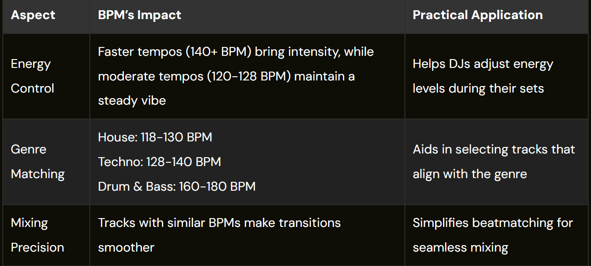
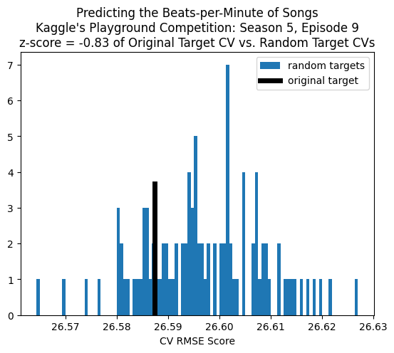
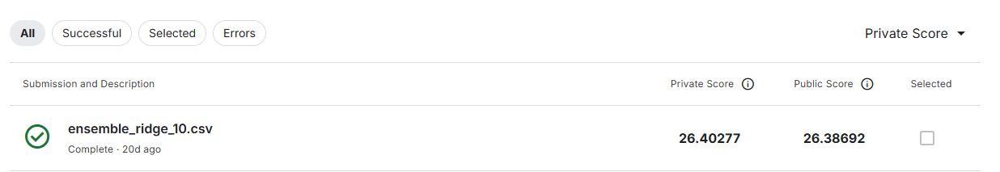

# Playground Series S5E9（歌曲 BPM 预测）轻量深读（Tier B）

> 赛事：Playground ｜ 主题 tabular（歌曲 BPM 回归，MSE/RMSE）｜ 2581 队 ｜ 标准赛 ｜ 截止 2025-09-30
> 材料基础：`digests/playground-series-s5e9.md`（6 篇正文：MIR 领域背景 603307 / 573rd 复盘 610016 / 随机目标检验 604028 / 26th 方案 610264 / Potential first place 609999 / No solutions 610185；52 条主题索引）+ 8 张归档图
> 轻读时间：2026-10（Tier B B17）

## 1. 一句话重述与数字账

预测歌曲 BPM（RMSE）。本场真正的"主题"不是音乐而是**合成数据有没有信号**：64 票的随机目标检验发现原始数据集的目标近似随机（z=-0.83），最近 6 场 Playground 回归里 3 场如此；同时榜首分数带极窄（约 26.38–26.41），排名很大程度由噪声决定。可迁移的两条：**入场用"打乱目标"对照 XGB 测信号**；无信号场次的收益来自生成痕迹 + 集成工程（伪标签、残差、几何平均）。

| 关键数字 | 值 | 来源 |
| --- | --- | --- |
| 规模与指标 | **2581 队**；MSE（RMSE）；榜首约 **26.38–26.41**（归档材料未给出公开榜样本量） | 索引 / 609999 |
| 随机目标检验 | 原目标 XGB vs **100 个打乱目标** XGB，z∈[-2,2] 判"随机"；近 6 场回归 **3/6 随机**：S4E12 保险、S5E2 背包、S5E9 BPM；S4E9 二手车、S5E4 播客、S5E5 卡路里有信号；**S5E9 z=-0.83** | 604028 |
| 重要补充 | 原数据随机 ≠ 比赛是彩票：**合成生成过程本身会引入可挖结构**；但题材没有真实规律 | 604028 |
| 26th（610264） | 54 特征（XGB/LGB/Cat 重要性 + permutation + SHAP）；**18 个模型**（6 XGB-Optuna、4 LGBM、3 HistGBR、2 YDF、Ridge、ElasticNet、NN）；从测试残差取 30 分位以下样本 → **约 92,804 条伪标签（≈30% 测试集）**；残差 stacking；终版 **0.5·∛(sub1·sub2·sub3) + 0.5·own** | 610264 |
| 573rd（610016） | 10 折 LGBM（lr 0.008 / 10000 树 / leaves 64 / depth 8），折间 RMSE **3.04–3.15**，private **26.40632**，预测裁剪 60–200 BPM；**注：折间 RMSE 3.1 与 LB 26.4 不同量纲，帖内未解释 → 悬案** | 610016 |
| 领先者悬念 | 作者 3 周未参赛，发现一个**未选用**的提交 private **26.40277** / public **26.38692**，"会大幅击败当前第一"；截图见 609999 | 609999 |
| 领域背景 | MIR 节拍估计：biped LSTM + comb filter（Böck）、CNN beat activation（Carayannis）、2015 后 bi-LSTM 为 SOTA；DJ 用途：house 118–130 / techno 128–140 / DnB 160–180 BPM 接歌 | 603307 |
| 社区争议 | XGB starter CV 26.4572（604292）；"26.38 真比 26.39 好吗"（608579）；CV-LB 关系楼 44 评论（603432）；"No solutions"质问获奖者为何不发方案（610185） | 索引 |

## 2. 逐方案对照矩阵

| 维度 | 26th（610264） | 573rd（610016） | 社区侦查（604028 / 603307） |
| --- | --- | --- | --- |
| 定位 | 前排工程化集成 | 低名次自述复盘 | 赛前/赛中元分析 |
| 特征 | 54 特征 + 统计/音乐理论衍生 | 20 特征 + Yeo-Johnson + RobustScaler | 随机目标 z 检验 |
| 训练 | 18 模型 + 30% 伪标签 + 残差 stacking | 单 LGBM 10 折 | 100 次打乱目标对照 |
| 集成 | 几何平均混公开方案 | 无 | — |
| 结论 | 低信号下靠多样性/伪标签 | 数字口径可疑 | 原数据为随机数，题材不可学 |

## 3. 共识、分歧与裁决

### 共识一：先测"目标是否随机"，再决定投入方向（604028，被 610264/610016 的工程路线侧证；置信度高）

随机目标 z 检验（100 次打乱对照、z∈±2）只需一次 XGB 训练；本场 z=-0.83，落进随机分布。**裁决**：合成数据赛入场先做该检验；判为随机后，把预算从"领域建模"转向"生成痕迹 + 集成工程"，并下调期望。置信度：高。

### 共识二：极窄分数带下，LB 排名近似噪声（609999 / 608579 / 603432；置信度中高）

26.40277 与 26.38692 的差距在小样本公开榜上无统计意义（同 s3e9 的 5407 vs 721 样本论点）。**裁决**：以 CV 为唯一模型选择依据，LB 只做 sanity check；不要用 LB 反推"26.38 一定优于 26.39"。置信度：中高。

### 分歧：伪标签/残差是否真实增益（610264 自述 vs 610016 口径矛盾；置信度中）

26th 报告 30% 伪标签 + 残差 + 几何平均"略微提升"，但未给 CV/LB 对照；573rd 的折间 RMSE 3.1 与 LB 26.4 不同量纲，说明其流程/口径存在未解释的断层。**裁决**：低信号场次伪标签必须做同折 CV 对照（加/不加、只加 30% vs 全量），否则无法区分真实增益与噪声；本场两条证据都不足以证明伪标签普遍有效。置信度：中。

### 分歧：MIR 领域方法是否值得深挖（603307 vs 604028；置信度中高）

MIR 帖提供了节拍估计文献与 DJ 用途，但随机目标检验表明原始数据无真实映射。**裁决**：领域知识只用于"特征直觉与命名"，不要指望学出真实声学规律；把它当对照基线而非主线。置信度：中高。

### 事件：前排方案未公开（610185；置信度中）

截至归档时 1st 等获奖方案未发布，26th 已是可读的最高名次复盘。**裁决**：低信号场次的学习价值集中在"如何侦查 + 如何做稳集成"，而非可复制的冠军配方。置信度：中。

## 4. 证据分级

| 断言 | 等级 | 说明 |
| --- | --- | --- |
| 随机目标检验方法与 S5E9 判定 | 自述 + 6 张对照图（604028） | 中高（可复现） |
| 26th 的 18 模型/伪标签/几何平均 | 自述（610264） | 中（无 CV 对照数字） |
| 573rd 的 LGBM 配置与 LB | 自述（610016） | 低（量纲矛盾） |
| 未选用提交的分数 | 截图（609999） | 中（仅自述截图） |
| MIR/DJ 领域背景 | 文献 + 外部链接（603307） | 中高（领域事实），与本题信号无关 |
| 获奖方案缺失 | 讨论帖（610185） | 中 |

## 5. 悬案与缺口（登记）

- 1st–25th 方案未发布（610185），无法验证前排实践；
- 伪标签/残差缺少 CV 对照，真实增益未知；
- 610016 的折间 RMSE 3.1 vs LB 26.4 量纲矛盾未解释；
- 公开榜样本量与 CV 折数未在官方口径中确认（借自 s3e9 的类比论证）；
- **图证缺口**：无（8 张图，本深读内嵌 3 张）。

## 6. 图表证据

**图 1**（topic 603307）：BPM 对 DJ 的三类影响（能量控制 / 曲风匹配 BPM 区间 / 接歌精度）——MIR 背景帖提供的唯一结构化领域信息，用于理解目标语义。

**图 2**（topic 604028）：S5E9 的随机目标检验直方图——蓝柱为 100 次打乱目标的 CV RMSE 分布，黑线为原始目标 CV，**z=-0.83**，落在随机分布内部，判定原数据近似随机。

**图 3**（topic 609999）：作者提交列表截图——未选用方案 `ensemble_ridge_10.csv` private **26.40277** / public **26.38692**；佐证榜首分数带极窄、LB 排名噪声大。

## 7. 出处

- 随机目标检验（64 票 / 29 评论）：https://www.kaggle.com/competitions/playground-series-s5e9/discussion/604028
- MIR 领域背景（28 票 / 4 评论）：https://www.kaggle.com/competitions/playground-series-s5e9/discussion/603307
- 26th FE+伪标签+残差（16 票 / 10 评论）：https://www.kaggle.com/competitions/playground-series-s5e9/discussion/610264
- 573rd 复盘（0 票 / 4 评论）：https://www.kaggle.com/competitions/playground-series-s5e9/discussion/610016
- Potential first place（8 票 / 15 评论）：https://www.kaggle.com/competitions/playground-series-s5e9/discussion/609999
- No solutions（1 票 / 0 评论）：https://www.kaggle.com/competitions/playground-series-s5e9/discussion/610185
- XGBoost Starter（25 票 / 13 评论）：https://www.kaggle.com/competitions/playground-series-s5e9/discussion/604292
- CV-LB relation thread（20 票 / 44 评论）：https://www.kaggle.com/competitions/playground-series-s5e9/discussion/603432
- 26.38 vs 26.39（2 票 / 6 评论）：https://www.kaggle.com/competitions/playground-series-s5e9/discussion/608579
