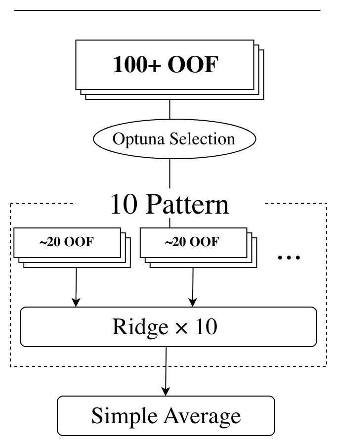
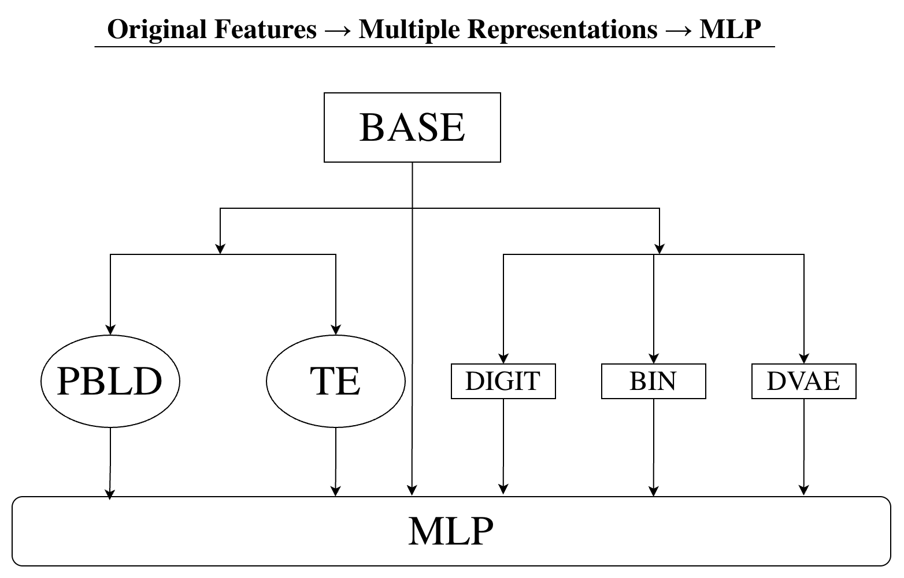
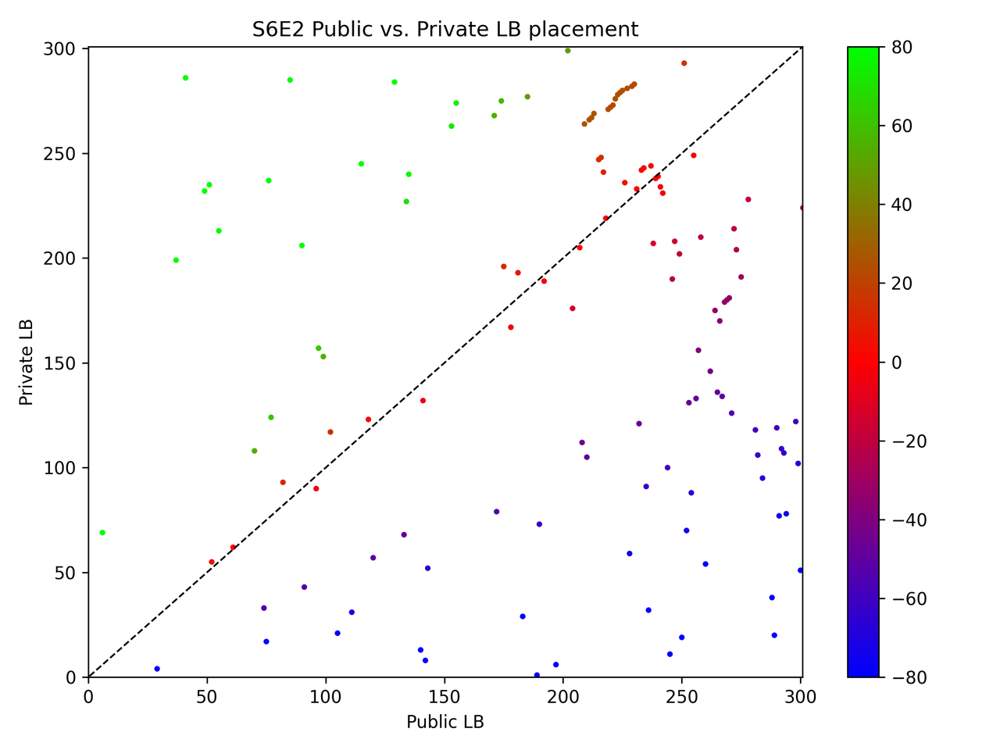

# Playground S6E2（心脏病预测）轻量深读（Tier B）

> 赛事：Playground ｜ 主题 tabular（合成二分类）｜ 4370 队 ｜ 标准赛 ｜ 指标：ROC AUC
> 材料基础：`digests/playground-series-s6e2.md`（6 篇正文：1st 202 / MLP 嵌入 64 / 22nd 19 / 4th 13 / 3rd 14 / 69th 27；80 条主题索引）+ 4 张图
> 轻读时间：2026-10（Tier B B01）

## 1. 一句话重述与数字账

合成心脏病数据（源自 UCI 原始集）的二分类：**信号近线性 + 合成噪声惩罚过工程**。真正考的是"**多样性 × 选择 × 简单融合**"与"**信任 CV-LB 关系而不是最高 CV**"。

| 关键数字 | 值 | 来源 |
| --- | --- | --- |
| 1st | CV 0.9557801 / 公 0.95396 / 私 **0.95535**；最高 CV 0.955865 被主动放弃（怀疑 split overfitting） | 1st |
| 1st 流程 | ~150 OOF → Optuna 2500 trials 选子集（约 1/10 常被选中）→ 10 组 pattern × Ridge → 简单平均；GBDT/RGF 全量重训 20 seed、n_estimators=1.25×CV 最优均值 | 1st+图 1 |
| 4th | LogisticRegression+OHE（449 维）CV 0.95550/公 0.95371；对抗验证 train/test AUC **0.501**；私 0.95534 | 4th |
| 22nd | RealMLP 0.955747/私 0.95531；TabM 0.955742；XGB 0.955647；**无特征工程的 Keras FM 仅低 0.00009** | 22nd |
| MLP 嵌入实验 | 3 折：标量基线 0.953078 → Linear 0.953104（+0.000027）→ **Periodic +0.001309** | MLP 帖 |

## 2. 逐方案对照矩阵

| 维度 | 1st | 4th | 3rd | 22nd |
| --- | --- | --- | --- | --- |
| 核心策略 | 多特征表示 × 150 OOF × Optuna 选择 × Ridge×10 | "Raw is Law"：LR 打底 + stumps + 周期嵌入 MLP + rank 集成 | 两套特征集 × 多目标模型 + rank + GPU hill climbing | 多 NN/GBM 单模 + 3 种集成；强调别盲 blend |
| 特征 | BIN/DIGIT/全类别化/FREQ/GP/原始集统计(TE,WoE,entropy)/DVAE | 原始 13 特征；树加 OOF TE+频率（+0.00028）；NN 只用原始集聚合统计当 anchor | 全类别 vs 混合（<10 类为类别）；原始集只用于 TE | 几乎无 FE（FM 验证） |
| 模型 | XGB/LGBM/CatBoost/RealMLP/RGF/TabICL/AutoGluon | 逻辑回归 + GBDT stumps(depth≤2)+OHE + 周期嵌入 MLP + RealMLP | RealMLP/CatBoost-ordered/XGB(depth3)/伪标 XGB/残差 XGB/HGB/LGBM/LR | RealMLP/TabM/CatB/XGB/Keras-FM/xLearn-FFM |
| 元模型 | Optuna 选子集 + Ridge（非线性 meta 过拟合） | rank 集成 | rank + hill climbing | hill climbing / NN 集成 / CatB 集成 |
| 公开榜态度 | 主动放弃最高 CV、拒绝公榜爬分 | 对抗验证 0.501 确认无漂移 | 严格信 CV | 公榜盲 blend 大量暴跌（图 3） |

## 3. 共识、分歧与裁决

### 共识一：信号近线性，复杂特征工程被合成噪声惩罚

LR+OHE 即 0.95550（4th）；无 FE 的 FM 只差 0.00009（22nd）；4th 的 800+ 多项式交互"crash CV"；1st 的 GP/DVAE 等表示主要用于**多样性**而非单模提升。**裁决**：先验证信号的线性度（简单模型基线），再决定是否值得复杂表示。置信度：高。

### 共识二：原始数据集主要作为"统计锚"而不是训练行

4th：树可加原始数据行有效、NN 直接加行"完全混乱"，只能用其聚合统计（mean/std/skew）当 anchor；3rd：原始集只用于 target encoding。**裁决**：外部原始集的价值按架构分化——树吃行/统计，NN 吃统计锚；不可一刀切。置信度：中高。

### 共识三：多样性与选择 > 单模强度

1st 的 150 OOF + 选择性融合；22nd"模型类型多样但预测相关性高，仍需多准则筛选"；3rd 两类特征集 + 多目标。**裁决**：在 5 位小数差的名次区间里，**选择（selection）与元模型稳健性**是主要自由度；Ridge/rank+爬山优于非线性 stack。置信度：高。

### 共识四：公榜盲 blend 是陷阱，CV 也要设"信任上限"

22nd 的 public-vs-private 散点显示前 300 名大量暴跌（图 3）；1st 发现 CV>0.95578 后 CV-LB 关系恶化，主动选择 0.95578–0.95580 区间的提交而非最高 CV。**裁决**：把 CV 当"关系"而非"标量"——监控 CV-LB 一致性区间，超过拐点后更高 CV 更像 fold 过拟合。置信度：高（两位独立观察 + 图证）。

### 分歧一：NN vs GBM

22nd："NN 再次优于 GBM"（RealMLP/TabM 居首）；3rd："RealMLP 最强单模 0.95576，CatBoost-ordered 0.95575 紧随"；1st 以树+NN 混合。**裁决**：差距在 5 位小数内，实质是"用 NN 补充多样性"；周期嵌入（+0.0013）是 NN 侧最可复用的单点。置信度：中高。

### 分歧二：伪标签是否有效

3rd 用了伪标 XGB 变体；1st 明确"soft/hard 伪标均无提升"。**裁决**：本场伪标签收益不稳定，默认不用或只作为集成候选之一。置信度：中。

## 4. 证据分级

| 断言 | 等级 | 说明 |
| --- | --- | --- |
| 1st 的分数/流程/拒绝最高 CV | 自述 + 2 张流程图 | 中高 |
| 4th 的对抗验证 0.501、+0.00028 | 自述 | 中 |
| 22nd 的单模表与 public-private 散点 | 自述 + 图证 | 中高 |
| 周期嵌入 +0.0013 | 可控 3 折实验（可复现） | 高（相对比较） |
| 3rd 的模型表 | 自述 | 中 |
| 公榜盲 blend 暴跌 | 22nd 图 + 社区多帖 | 中高 |

## 5. 悬案与缺口（登记）

- 2nd/5th–21st 方案未收录；"The Flipped Label Trap"（673079，32 票）与 shake-up（679364，20 票）未收录——标签翻转与最终震荡的关系未厘清。
- "Trust Your CV"（673774，39 票）与 10 submissions/day 政策（671274）未收录。
- 1st 的 10 组 pattern 具体定义、Optuna 目标细节仅见流程图；DVAE/GP 的边际贡献无消融。

## 6. 图表证据

**图 1**（topic 679376）：100+ OOF → Optuna 选择 → 10 组 pattern（每组 ~20 OOF）→ Ridge×10 → 简单平均。**"生成—选择—稳健融合"的完整链路。**

**图 2**（topic 679376）：原始特征 → 多表示（BASE/PBLD/TE/DIGIT/BIN/DVAE）→ MLP。**多样性来自表示层，而不是单模调参。**

**图 3**（topic 679389）：前 300 名的公榜排名 vs 私榜排名，大量点远低于对角线（公榜高私榜低）。**"盲 blend 陷阱"的直接证据**；色标为名次变化。

## 7. 出处

- 1st（202 票）：https://www.kaggle.com/competitions/playground-series-s6e2/discussion/679376
- MLP 数值嵌入（64 票）：https://www.kaggle.com/competitions/playground-series-s6e2/discussion/671783
- 4th（13 票）：https://www.kaggle.com/competitions/playground-series-s6e2/discussion/679414
- 22nd（19 票）：https://www.kaggle.com/competitions/playground-series-s6e2/discussion/679389
- 3rd（14 票）：https://www.kaggle.com/competitions/playground-series-s6e2/discussion/679428
- 69th（27 票）：https://www.kaggle.com/competitions/playground-series-s6e2/discussion/679367
- 缺口登记：673079、673774、671274、673762、679364
