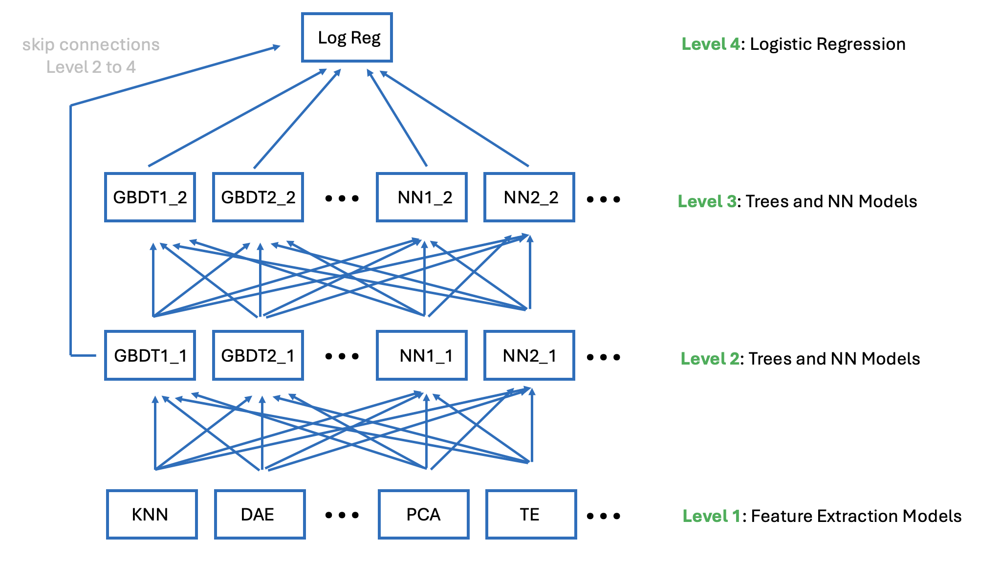

# Playground Series S6E3（电信客户流失）轻量深读（Tier B）

> 赛事：Playground ｜ 主题 tabular（二分类，AUC ≈0.917）｜ 4142 队 ｜ 标准赛 ｜ 指标：ROC AUC ｜ 合成数据源于 IBM Telco 原始小数据集
> 材料基础：`digests/playground-series-s6e3.md`（4 篇正文：1st 686686 / 3rd 686834 / 16th 1057 行处 / 5th 1267 行处；80 条主题索引）+ 4 张图
> 轻读时间：2026-10（Tier B B11）

## 1. 一句话重述与数字账

预测电信客户流失（AUC）。真正的考点是**"从合成浮点数里把生成器的痕迹抠出来"**：1st 的核心 FE 是"把每个合成值**吸附（snap）到原始 IBM 数据集中最近的取值**（差值 = 生成噪声）"与"**逐位小数位提取**"；再把 850 个候选模型压成 150 个，组成 **4 层堆叠**（特征抽取模型 → GBDT/NN → GBDT/NN → 逻辑回归）。

| 关键数字 | 值 | 来源 |
| --- | --- | --- |
| 1st（686686，173 行处） | 遵循 **KGMON Playbook 2026 for Tabular Data**（EDA → 基线 → GPU FE → GPU 爬山 → 堆叠 → 伪标签 → 额外训练）；**代码全部由 LLM 写**（GPT5.4 / Gemini3.1 / ClaudeOpus4.6，一个月 60 万行代码、50 个 EDA 脚本），在 4×A100 上训练 **850 个模型**；最终 **4 层堆叠**（图 1）：L1 = 特征抽取模型（cuML KNN、PyTorch 去噪自编码器、PCA 聚类、cuML 目标编码等，把其他行的信息聚合进当前行）→ L2 = 多 GBDT/NN（用 L1 的 5×5 嵌套 OOF）→ L3 = 多 GBDT/NN（用 L2 的嵌套 OOF）→ **L4 = cuML 逻辑回归（吃 L3+带跳连的 L2）**；从 850 个候选里选 **150 个**进最终集成（90 个树模型，覆盖 XGB/LGBM/CatBoost/YDF/cuML-RF 五个库） | 686686 |
| 1st 的核心 FE | **① Snap 特征（全员通用）**：`MC_snap = 原始 IBM 数据中最近的 MonthlyCharges`、`TC_snap` 同理，**差值与吸附值本身都作为特征**（差值=生成器扰动幅度）；② **数字/小数位提取（约 60 个模型）**：`d1=floor(frac*10)`、`d2=floor(frac*100)%10`、`frac100`、`mod10`、`mod100`，并对吸附值再做一遍；还有常见分母（1/2、1/4、1/5、1/10）的分数残差、`is_round` 标志、数字对组成的类别串；③ **嵌套/无泄漏目标编码（约 90 个模型）**（含以 `(MC_snap, tenure)` 为锚点的 TE）；④ TF-IDF 字符 n-gram（捕捉循环小数模式）、**Benford 定律偏离度**、漂移比 `log1p(train_freq/orig_freq)`；⑤ 投影/流形特征（在原始 IBM 上拟合 PCA 12 维与高斯随机投影 12 维，把合成行投影进去） | 686686 |
| 3rd（686834，38 票） | **100 个 OOF 的集成**（自己的模型 + 公开 kernel 派生），逐日记录新想法；以 CUDF 版单 XGB + 伪标签的公开 notebook 为骨架，写多个特征组合/树参数变体增加多样性；公开了模型清单图 | 686834 |
| 16th（1057 行处）/5th（1267 行处） | 16th 用 Ridge 集成；5th 是"**149 模型 → 6 元模型 → 3 混合**"的三级结构；社区另有"YDF 默认参数就有好 CV"（31 票）、"GNN starter CV 0.9155"（36 票）、"Bartz starter 0.916401"（24 票） | 1057/1267/679983 |
| 社区侧 | "**高级 EDA 技巧**"（112 票 / 72 评论）、"如何进 Top10（最后一周）"（45 票）、"**Et tu, blendicus maximus?**"（39 票，盲混之争）、"我的 CV 是 0.91655，你的呢？"（23 票 / 51 评论）、"Rank 38 方法"（24 票） | 社区 |

## 2. 逐方案对照矩阵

| 维度 | 1st | 3rd | 5th |
| --- | --- | --- | --- |
| 形态 | 850→150 模型 + **4 层堆叠** | 100 OOF 集成 | 149 模型 → 6 元模型 → 3 混合 |
| 核心 FE | **Snap + 小数位提取 + 锚点 TE + 投影** | 公开 notebook 派生 + 变体 | — |
| 工具 | KGMON Playbook + LLM 写码 + 4×A100 | CUDF XGB + 伪标签 | — |
| AUC 档 | 1st | 3rd | 5th |

## 3. 共识、分歧与裁决

### 共识一：合成赛的胜负在"回到原始数据"（1st + 全场的原始 IBM 7k 行）

1st 的 snap 特征把合成值映射回原始数据集的最近取值（差值=噪声），并用原数据做锚点 TE、投影、自监督辅助预测（用 7,032 行原数据训模型预测各列，检验合成行与原始分布的一致性）。**裁决**：合成数据赛要拿原始数据当"坐标系"——吸附/残差/投影是最高性价比的特征族（与 S6E1 的"恢复生成式"同源）。置信度：高。

### 共识二：小数位/数值伪影是生成器指纹（1st 的 60 个模型）

逐位提取小数位、mod、分数残差、TF-IDF 字符 n-gram、Benford 偏离、漂移比——都是"从浮点表示里读生成器行为"。**裁决**：LLM/工具生成的合成表常有数值伪影；把"数值的十进制结构"当特征在本场是主增益之一。置信度：中高。

### 共识三：大规模异构堆叠仍有效，但要先"扩池再选"（1st/3rd/5th）

1st 850→150（90 个树模型跨 5 个库）；5th 149→6→3；3rd 100 OOF。**裁决**：本场 AUC 的边际很小，靠"先造大量多样模型、再用嵌套 OOF 筛"来榨分；跨库（XGB/LGBM/CatBoost/YDF/cuML-RF）的树实现差异本身就是多样性。置信度：中高。

### 分歧一：LLM 写码的边界（1st vs 社区）

1st 明说"全部代码由 LLM 写"（60 万行、850 模型），社区仍有"盲混/伦理"之争（"Et tu, blendicus maximus?" 39 票）。**裁决**：LLM 已能承担"按 playbook 执行 + 大规模实验"的角色；但复现性依赖 playbook/流程的显式化（本场的 KGMON Playbook）。置信度：中高。

### 事件：公开 kernel 的派生与榜面（3rd/社区）

3rd 的 100 个 OOF 明确包含公开 kernel 派生模型；社区对"盲混"持续争论。**裁决**：公开 artifact 作为特征/模型来源需过本地验证并登记来源（与既往各场一致）。置信度：中。

## 4. 证据分级

| 断言 | 等级 | 说明 |
| --- | --- | --- |
| 1st 的 4 层堆叠、850→150、Snap/小数位 FE | 自述 + 堆叠图 + 公开 playbook 链接 | 高 |
| 1st 的"60 万行 LLM 代码" | 自述（无第三方核实） | 中 |
| 3rd 的 100 OOF 与来源 | 自述 + 模型图 + 公开 kernel 引用 | 中高 |
| 5th 的 149→6→3 | 自述 | 中 |
| 高级 EDA 技巧（112 票） | 社区帖 | 中高 |

## 5. 悬案与缺口（登记）

- 2nd/4th/6th–15th 的方案未细读；"高级 EDA 技巧"（112 票）与"YDF/GNN/Bartz starter"未细读；
- 1st 的 150 个模型清单未逐一列出；
- LLM 生成代码的可复现性（版本/提示）只有链接，未归档到本仓库；
- 归档 4 图：4 层堆叠图（图 1）与 3rd 的模型清单图为关键图证。

## 6. 图表证据

**图 1**（topic 686686）：**Level 1** 特征抽取模型（KNN / 去噪自编码器 / PCA / 目标编码）→ **Level 2** 树与 NN → **Level 3** 树与 NN → **Level 4** 逻辑回归；并画出 **Level 2 到 Level 4 的跳连**。每层用上一层 5×5 嵌套 OOF 作为输入，这是"用嵌套 OOF 防泄漏地把堆叠做深"的清晰示例。

## 7. 出处

- 1st（686686）：https://www.kaggle.com/competitions/playground-series-s6e3/discussion/686686
- 3rd（38 票）：https://www.kaggle.com/competitions/playground-series-s6e3/discussion/686834
- 高级 EDA 技巧（112 票）：https://www.kaggle.com/competitions/playground-series-s6e3/discussion/680290
- 盲混之争（39 票）：https://www.kaggle.com/competitions/playground-series-s6e3/discussion/679672
- YDF 默认参数（31 票）：https://www.kaggle.com/competitions/playground-series-s6e3/discussion/679983
- GNN starter（36 票）：https://www.kaggle.com/competitions/playground-series-s6e3/discussion/680622
