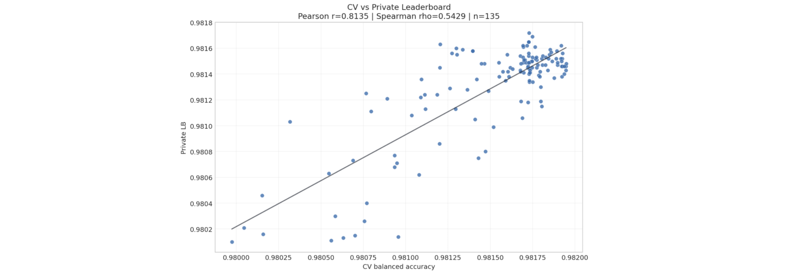
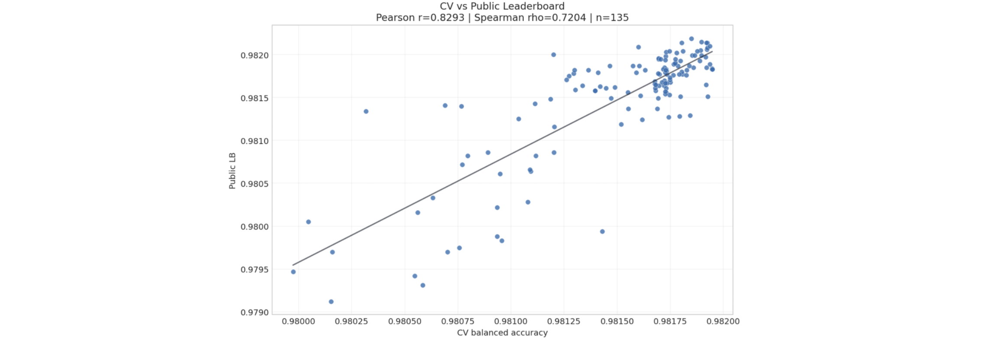

# Playground Series S6E4（灌溉需求三分类）轻量深读（Tier B）

> 赛事：Playground ｜ 主题 tabular（灌溉需求 Low/Medium/High 三分类，合成数据）｜ 4315 队 ｜ 标准赛 ｜ 指标：Balanced Accuracy
> 材料基础：`digests/playground-series-s6e4.md`（6 篇正文：原数据公式 687460 / 1st 696040 / 2nd 696169 / 4th 696054 / 200 模型堆叠 696104 / 24th 696016；55 条主题索引）+ 5 张归档图
> 轻读时间：2026-10（Tier B B13）

## 1. 一句话重述与数字账

三分类灌溉需求（High 只占 3.3%，指标是平衡准确率）。本场有两个里程碑：①社区**逆向出了原始数据的精确生成公式**（三个类别的 logit 线性公式在原始 1 万行上平衡准确率 = 1.0，115 票）；②**LLM Agent 迁移往届方案成为一等竞争力**——2nd 让 Claude Code 一天内把 3 月 churn 赛的 150 个脚本改写成 4 月版本，第 3 天就拿到私榜第一（0.98160），最终提交是"Claude 集成 + Codex 集成"的混合。技术侧，1st 利用"模型几乎从不混淆 Low 与 High"这一观察，把三分类拆成两个二分类器再做概率分解与阈值贪心搜索。

| 关键数字 | 值 | 来源 |
| --- | --- | --- |
| 原数据公式（687460） | 10 个特征（土壤湿度<25、温度>30、降雨<300、风速>10、作物阶段 one-hot、覆盖物）× 三类别 logit；在原始 10k 行上**完全分离、Balanced Accuracy = 1.0**；简化为 "High 分 vs Low 分" 的加减法规则（≤0 Low / 0–3 Medium / >3 High） | 687460 |
| 1st（696040） | 关键观察（来自 690677）：模型**几乎从不混淆 Low 与 High** → 两个二分类器：①Low vs Rest（全量）；②Medium vs High（用①的预测标签训练，OOF 全量生成）；概率分解 `P(Low)=p1`、`P(Med)=(1−p1)(1−p2)`、`P(High)=(1−p1)p2`；XGB/RealMLP 各自 CV 0.9805；融合 = logits + LogisticRegressionCV（5 折），CV **0.98155**；61 个 OOF（17 XGB/11 LGBM/10 CatBoost/9 RealMLP/3 TabM/2 LR…）；两次基于 OOF 平衡准确率的贪心阈值搜索 | 696040 |
| 2nd（696169） | Claude Code 一天内把 3 月方案的 **150 个脚本**改写成 4 月版；周末跑完并集成 → 第 3 天私榜第 1（私 0.98160 / 公 0.98182 / CV 0.98130）；最终提交 = Claude 集成 + Codex 集成的混合（私 0.98151 / 公 0.98195 / CV 0.98170）；关键组件 = **PyTorch GPU 多分类逻辑回归**（类别权重 + 只对权重做 weight decay 模拟 L2）；CV–私榜相关性弱（CV 0.98175 的多个提交私榜 0.98130–0.98170） | 696169 |
| 4th（696054） | "集成器比模型多"：11 个 L1 集成器 + 4 个 L2（Rank Average、MLP、LGB、Ridge、LogReg+logits、差分进化、Hill Climbing、Top-K 平均）；High 3.3% 让分数对"能否押中 High"极度敏感 → 彩票效应；最佳私榜 **0.98148 只用了 9 个模型**；自己最终两份提交落在私榜 15–20 名之外 | 696054 |
| 200 模型堆叠（696104） | 203 个模型 / 16 个族（XGB 28、TabM 49、LR 21、CatBoost 19、LGBM 16、SVC 15、RF/ET、GNN 10…）；核心主张 = **误差多样性**：每个基模型输出 3 类概率（N×3 特征）供元模型使用；也大规模复用公开 OOF | 696104 |
| 24th（696016） | 166 个 OOF；神经元模型（RealMLP/TabFPN/TabTransformer）；29 个 XGB 变体；发现**离散化（uniform/quantile/kmeans 分箱）极强**（v8 CV 0.97375 vs v0 0.97243）；自述提交选择失误损失约 13 名 | 696016 |
| 社区 | 平衡准确率处理（45 票）、有效特征数（45 票）、类别权重（26 票）、原数据漂移警告（25 票）、公榜仅 1800 个 High（23 票）、阈值调优（19 票）、NN 与 GBDT 并强（20 票）、"Medium 才是焦点"（11 票） | 索引 |

## 2. 逐方案对照矩阵

| 维度 | 1st | 2nd | 4th | 200 模型堆叠 | 24th |
| --- | --- | --- | --- | --- | --- |
| 核心 | 2 个二分类 + 概率分解 | 往届方案 Agent 迁移 | 多集成器投票 | 203 模型误差多样性 | 166 OOF + 神经元模型 |
| 类别处理 | Low/High 不混淆的前提 | GPU 多分类 LogReg（类别权重） | L1/L2 投票 | N×3 概率特征 | 离散化 + 神经堆叠 |
| 阈值 | 两次贪心搜索 | — | 投票 | — | — |
| 融合 | LogRegCV on logits | Claude+Codex 双集成 | 11 L1 + 4 L2 | 单一/多级元模型 | RealMLP/TabFPN 元模型 |
| 结果 | 1st | 私 0.98151 | 4th（最佳未选 0.98148） | — | 24th |

## 3. 共识、分歧与裁决

### 共识一：Balanced Accuracy + 3.3% High → 阈值/类别权重是独立增益（1st、社区帖、4th；置信度高）

1st 用两次贪心阈值搜索；社区"class-weighting may help"（26 票）与"记得最后调阈值"（19 票）；4th 观察到押中 High 与否直接决定名次。**裁决**：不平衡指标赛要把"概率 → 类别"的决策层当独立模块优化（阈值/权重/投票）。置信度：高。

### 共识二：Low/High 几乎不混淆是本题的结构性捷径（1st、690677、696104 的误差分析；置信度中高）

1st 据此把三分类拆成两个二分类并拿到 CV 0.98155；200 模型帖也以误差多样性为核心。**裁决**：先做类别混淆矩阵分析，再决定 one-vs-rest / 层级分类结构。置信度：中高。

### 事件一：原始数据存在精确生成公式（687460；置信度高）

三类别 logit 公式在原始数据上 100% 分离；简化规则同样可解释。**裁决**：合成 Playground 的尽头是"逆向生成器"；社区公式对参赛者既是捷径也是对其"合成数据赛"性质的提醒。置信度：高。

### 事件二：Agent 迁移方案的效率成为竞争力（2nd、4th；置信度中高）

2nd 的 Claude Code 一天转换 150 个脚本、第 3 天登顶；4th 也长期使用 Claude（但抱怨过早放弃/token 限制）。**裁决**：与 S6E5/S6E8 一致，2026 年起 top 方案的生产流程已包含 LLM agent；人的价值转向方向选择与提交决策。置信度：中高。

### 事件三：提交选择在噪声指标下持续失血（4th、24th、2nd；置信度中高）

4th 最终两份提交落在私榜 15–20 名外；24th 自述损失约 13 名；2nd 多跑后期反而降了 1e-4。**裁决**：CV–私榜 Spearman 仅 0.54（2nd 实测），提交要按"稳健 + 多样"组合而非单一 CV 排序。置信度：中高。

## 4. 证据分级

| 断言 | 等级 | 说明 |
| --- | --- | --- |
| 原数据公式（BA=1.0） | 自述 + 可复现 notebook | 高 |
| 1st 的 OVR 分解与阈值搜索 | 自述（含概率公式与模型清单） | 高 |
| 2nd 的 Agent 迁移与 GPU LogReg | 自述 + 相关性图 | 中高 |
| 4th 的彩票效应与最佳未选提交 | 自述（含分数） | 中 |
| 200 模型/166 OOF 的重堆叠 | 自述 | 中 |
| 社区 metric/漂移/阈值帖 | 高票帖 | 中高 |

## 5. 悬案与缺口（登记）

- 3rd、5th–23th 方案未收录；
- 原数据公式如何被自动发现（starter notebook）未细读；
- 200 模型堆叠的最终分数未给出；
- **图证缺口**：无（5 张图，本深读内嵌 2 张）。

## 6. 图表证据

**图 1**（topic 696169，2nd）：135 个提交的 CV–私榜散点（Pearson 0.8135 / Spearman 0.5429）——排序相关性弱，是"提交选择失血"的量化证据。

**图 2**（topic 696169，2nd）：CV–公榜散点（Pearson 0.8293 / Spearman 0.7204）——公榜相关性略好但仍不足以支撑微差决策。

## 7. 出处

- 原数据精确公式（115 票 / 30 评论）：https://www.kaggle.com/competitions/playground-series-s6e4/discussion/687460
- 1st OVR + 多分类（56 票 / 23 评论）：https://www.kaggle.com/competitions/playground-series-s6e4/discussion/696040
- 2nd Claude Code + Codex + GPU LogReg（44 票 / 14 评论）：https://www.kaggle.com/competitions/playground-series-s6e4/discussion/696169
- 4th 集成器比模型多（24 票 / 13 评论）：https://www.kaggle.com/competitions/playground-series-s6e4/discussion/696054
- 200 模型误差多样性（14 票）：https://www.kaggle.com/competitions/playground-series-s6e4/discussion/696104
- 24th 166 OOF 神经堆叠（12 票）：https://www.kaggle.com/competitions/playground-series-s6e4/discussion/696016
- 平衡准确率处理（45 票）：https://www.kaggle.com/competitions/playground-series-s6e4/discussion/686709
- 类别权重（26 票）：https://www.kaggle.com/competitions/playground-series-s6e4/discussion/686754
- 原数据漂移警告（25 票）：https://www.kaggle.com/competitions/playground-series-s6e4/discussion/686722
- 公榜只有 1800 个 High（23 票）：https://www.kaggle.com/competitions/playground-series-s6e4/discussion/687069
- 阈值调优（19 票）：https://www.kaggle.com/competitions/playground-series-s6e4/discussion/687082
