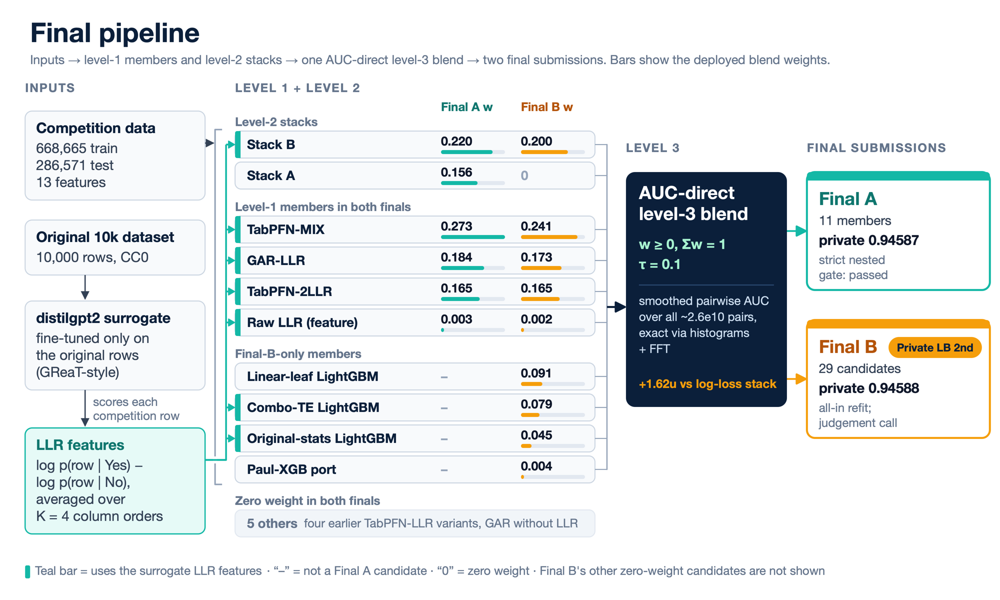

# Playground Series S6E9（电动车购买预测）轻量深读（Tier B）

> 赛事：Playground ｜ 主题 tabular（合成数据二分类，AUC≈0.946）｜ 3575 队 ｜ 标准赛 ｜ 指标：ROC AUC
> 材料基础：`digests/playground-series-s6e9.md`（6 篇正文：1st 745013 / 2nd 744815 / 3rd 744848 / 8th 744923 / 9th、10th 等节；79 条主题索引）+ 18 张图
> 轻读时间：2026-10（Tier B B09）

## 1. 一句话重述与数字账

预测个人是否购买电动车（AUC，规模 66.8 万训练 / 28.7 万测试行、13 列特征、17.5% 正例、**训练/测试无分布漂移**（对抗 AUC 0.50006））。真正的考点分两层：**技术上**——原始 1 万行数据可反推出生成公式、且合成行带有 LLM 生成痕迹（数字以 token 形式输出）；**协作上**——本场冠军是"人类教练 + 5 个 AI agent 接力"的案例。

| 关键数字 | 值 | 来源 |
| --- | --- | --- |
| 1st（745013，"The AI Relay"） | **1 人类 + 5 个 AI agent，三代接力**（GPT-5.6 Sol+Fable5 → GPT-6-Astra+Fable5.1 → Opus 5.5）；公榜第 3、私榜第 1（**0.94602**，领先第 2 名仅 0.00014）；每腿 CV：0.94637 → 0.94656 → 0.94683 → 0.94697；**"接力棒是代码与笔记"**：继承前几个月 100 万+ 行代码与 600+ 篇笔记，两条腿又加了约 80 万行、700 篇；关键笔记文件：`plan.md`（下一步做什么）、`progress.md`（做了什么/分数）、`discoveries.md`（学到什么/为什么）、**"closed ideas" 清单**（别再试什么）、历史 cookbook；Opus 5.5 上任第一天就派 **13 个 helper agent** 分头读历史 + 6 个审代码，当天合并成计划开工；**隐藏分数**：把预测 p→1−p 后 AUC 变 1−AUC（真实 0.947 显示成 0.053），避免激励对手 | 745013 |
| 2nd（744815，私榜 0.94588） | 本场方法论最严谨的一篇：固定 5 折 + **13.4 万行密封 holdout**（永不用于选择，仅最终全量重训与 TabPFN 上下文）+ 5 万行一次性筛选子集；**预注册**（9 月 28 日起 54 条候选先登记后看结果）；门槛 = 常规 ≥+1.0u 且 ≥2 fold-SE，决赛轮 ≥+1.5u 且 ≥2.5 fold-SE；**嵌套增益对私榜的 Spearman=0.991，而公榜只有 0.793**；技术：**TabPFN-3.5 全量上下文**（每折约 42.8 万行，无子采样，AUC 随上下文翻倍约 +18.6u 且未饱和）、**label-free 代理特征**（只在原始 1 万行上微调 distilgpt2 得到 Yes/No 对数似然比 LLR）、**AUC-direct 三级融合**（~2.6×10^10 对样本的平滑成对 AUC 代理，用直方图+FFT 精确计算，比 log-loss 堆叠 +1.62u）；反面教材：**故意拟合公榜的文件公榜 0.94945（第 1）但私榜只有 0.94313**；生成痕迹：多数最强成员用 **GPT-2 BPE token 特征**（对 income/commute 的原始 CSV 字符串分词）；Chris Deotte 的 EDA 复原购买公式（`1.2·income/100k + 0.6·concern + 2·subsidy − [Medium anxiety] − 3·[High anxiety] + noise > 5.5`，单独 AUC 0.9377） | 744815 |
| 3rd（744848） | 用**逻辑回归堆叠 115 个预测列**（clip → logit → L2 LR，C 从 0.003 到决赛 0.3，仅在 meta-train 行上拟合缩放）；特征工程核心是**目标编码**：只用 13 原始列 CV 0.943113 → 精确值 TE + income 取整到 0.945371 → 多级取整+平滑+两轮调参 0.945840；**income 的多个取整层级**（粗分组在样本少时补足精确值）；commute/age/类别列也做"值级编码"；所有有监督编码**按折外计算**（验证行自身目标被排除）；原始数据的行加入训练无益，但**原始数据的统计量**（组级目标统计、取值是否出现）有用；公开 9th 上升到第 3 | 744848 |
| 8th/9th/10th | 另有数支队伍分享方案（8th 744923、9th、10th 744826）——本场公开生态异常活跃 | 744923 等 |
| 社区侧 | "Fable 5.1 的 EDA：原始数据洞察"（33 票）、"一个小小的辛普森悖论"（31 票）、"EV 购买决策的 Coyote 优化算法"（26 票）、"**诚实模型目录与 OOF Hub（跟踪 28+ 模型）**"（17 票）、"逻辑回归在原始数据上击败高级模型"（16 票） | 社区 |

## 2. 逐方案对照矩阵

| 维度 | 1st | 2nd | 3rd |
| --- | --- | --- | --- |
| 组织方式 | **AI agent 接力 + 人类教练** | 人类团队 + 严格统计流程 | 人类团队（M & M） |
| 模型 | 多代 agent 迭代（细节散落在笔记） | **TabPFN-3.5 全量上下文** + GAR/LLR + LightGBM 系列 | 115 列逻辑回归堆叠 |
| 验证 | 每腿 CV 增量 | **嵌套 CV + 密封 holdout + 预注册 + 门槛** | 折外目标编码 + 5 折 |
| 特色 | 笔记接力、隐藏分数（p→1−p） | **AUC-direct 融合（FFT 精确成对 AUC）**、GPT-2 token 特征 | income 多级取整 TE |

## 3. 共识、分歧与裁决

### 共识一：原始数据是"生成器钥匙"（2nd/3rd/社区）

2nd 引用 Chris Deotte 复原的购买公式（单独 AUC 0.9377）并指出合成行带 LLM token 痕迹（GPT-2 BPE 特征有效）；3rd 用原始数据的统计量（而非直接加行）提升；社区帖"逻辑回归在原始数据上击败高级模型"。**裁决**：合成回归/分类赛要先吃透原始小数据（生成式、取值分布、token 化痕迹），它们比多加模型更值钱。置信度：高。

### 共识二：折外监督编码 + 逻辑回归堆叠是稳健骨架（3rd/2nd）

3rd 的 115 列 LR 堆叠 + 折外目标编码（0.9431→0.9458）；2nd 的三级融合同样以 rank-logits 为基础。**裁决**：高基数类别（income）用多级目标编码；stacking 用 L2 逻辑回归（clip→logit）而非复杂元模型。置信度：高。

### 共识三：验证纪律决定"选哪个提交"（2nd 的极端示范）

2nd 的嵌套增益与私榜 Spearman=0.991（公榜仅 0.793）；预注册 + 双门槛 + 密封 holdout；公榜只为"噪声守卫"。**裁决**：当私榜与公榜脱钩时，唯有严格的嵌套验证能指导选择；把"公榜拟合"作为独立实验并明确拒绝其入选。置信度：高（有 0.94945/0.94313 的对照）。

### 分歧一：AI agent 团队 vs 人类团队

1st 是"1 人 + 5 agent 的三代接力"，靠笔记/代码继承与 helper agent 阅读历史；2nd/3rd 是人类团队但用上了高度工程化的流程（预注册、OOF Hub）。**裁决**：agent 团队的关键不是模型能力，而是**上下文继承机制**（笔记、closed ideas、cookbook、代码库）；人类团队的优势在纪律与统计判断。置信度：中高（1st 自述，缺第三方复现）。

### 事件：隐藏分数与"榜面博弈"（1st）

1st 用 p→1−p 把真实 0.947 显示为 0.053，避免给对手"追赶动机"。**裁决**：榜单是博弈场，提交策略（何时揭示、揭示什么）本身是一类技巧；登记为策略而非方法论。置信度：中（单队自述）。

### 事件：辛普森悖论与生成伪影（社区）

"A small Simpson's paradox"（31 票）与"生成器伪影"（token 化数字）说明合成数据的统计陷阱需要专门审计。**裁决**：合成赛要做"伪影审计"（token 化、取整、局部统计反转）。置信度：中高。

## 4. 证据分级

| 断言 | 等级 | 说明 |
| --- | --- | --- |
| 1st 的 agent 接力、笔记体系与分数链 | 自述 + 大量配图 | 中（单队自述，方法自洽） |
| 2nd 的嵌套 CV/预注册/门槛与 Spearman 0.991 | 自述 + 管线图 + 明确数字 | 高 |
| 2nd 的 AUC-direct 融合 +1.62u | 自述（计算方法清晰） | 中高 |
| 3rd 的 TE 阶梯（0.9431→0.9458） | 自述 + 实验阶梯图 | 中高 |
| 生成器公式复原（AUC 0.9377） | 社区 EDA（可复算） | 高 |

## 5. 悬案与缺口（登记）

- 4th–7th 与 9th/10th 的方案未细读；"诚实模型目录与 OOF Hub"（17 票）与"Simpson 悖论"（31 票）未细读；
- 1st 的具体模型清单与其三腿的技术差异未在材料中展开（细节在其笔记体系中）；
- 2nd 的 Final B 是"判断性选择"（未过严格门槛），其风险未复盘；
- 归档 18 图：2nd 的最终管线图（图 1）与 1st 的接力插图为关键图证。

## 6. 图表证据

**图 1**（topic 744815）：输入（竞赛数据 / 原始 1 万行 / distilgpt2 代理 LLR）→ 一级模型与二级堆叠（TabPFN-MIX 0.273、GAR-LLR 0.184、TabPFN-2LLR 0.165…）→ **AUC-direct 三级融合**（w≥0、Σw=1、τ=0.1；对 ~2.6e10 对样本用直方图+FFT 精确计算平滑 AUC，比 log-loss 堆叠 +1.62u）→ 两份最终提交（Final A 通过严格嵌套门槛、私榜 0.94587；Final B 私榜 0.94588 但为判断性选择）。

**图 2**（topic 745013，示意插画）：1st 描述的 agent 接力机制——100 万+ 行代码与 `plan.md / progress.md / discoveries.md / closed ideas` 等笔记在 agent 之间传递；"Agent 会遗忘，笔记不会"。

## 7. 出处

- 1st（41 票）：https://www.kaggle.com/competitions/playground-series-s6e9/discussion/745013
- 2nd：https://www.kaggle.com/competitions/playground-series-s6e9/discussion/744815
- 3rd（32 票）：https://www.kaggle.com/competitions/playground-series-s6e9/discussion/744848
- 8th：https://www.kaggle.com/competitions/playground-series-s6e9/discussion/744923
- 10th（19 票）：https://www.kaggle.com/competitions/playground-series-s6e9/discussion/744826
- Simpson 悖论（31 票）：https://www.kaggle.com/competitions/playground-series-s6e9/discussion/738991
