# Pokémon TCG AI Battle Challenge 深读：自对弈生态 × 专家分工 × 匹配制评估

> 赛事：Featured（The Pokémon Company × HEROZ）｜ 主题 sim-agent（游戏 agent）｜ 6807 队 ｜ 标准赛（提交 agent，平台持续匹配）｜ 指标：cabt_bo1（对局评分/rating）
> 材料基础：`digests/pokemon-tcg-ai-battle.md`（8 篇正文：引擎裁定 103 / 引擎源码 127 / 分享时机 16 / 24th 39 / 15th 44 / 27th 32 / 213tubo 57 / Team Magist 37；120 条主题索引）+ 13 张图
> 深读时间：2026-10（Tier A #58）

## 0. 一句话重述：这道题真正在考什么

题面是"提交一个宝可梦 TCG AI，在平台上与其它 agent 持续对战拿 rating"——真正的考题是**建设一套"训练—评估—元游戏"闭环，而不是训练一个模型**。四件事：

1. **仿真吞吐决定一切**：RL 的瓶颈是 games/sec。社区先为"能否反编译引擎/自建引擎"争论（103 票帖），主办方 2026-07-01 直接**开源官方引擎**（127 票帖）；此后几乎所有强队都在 C++ 向量化环境里跑自对弈——24th 的 C++/OpenBLAS/AVX2 把 1M 参数 Transformer 推到 1 ms/32 tokens（15× 于标量实现）、32 worker 84 对局/秒；27th 在 3090 上 30 对局/秒；15th 用 CPU actor + 单 GPU learner 跑了 **55 亿决策**。
2. **专家分工 + 牌组/策略协同**：没有任何一队用"一个通用模型打所有牌组"——15th 分别训练 Slowking/Dragapult 专家；27th 三段课程（多牌组→原型→单牌组）；213tubo 先行为克隆再按原型 PPO、蒸馏到大模型、再做牌组 PPO；24th 从基座派生 6–7 个 matchup Expert，按对手暴露的关键卡在运行时路由。
3. **评估系统是第二主战场**：匹配制 rating 有**非传递性**（A>B>C>A）、匹配样本不平衡、重复变体刷分、最终评估期随机性——24th 用贝叶斯 Bradley–Terry + 自适应配对 + 胜率画像聚类管理 320 个 agent / 220 万局；15th 用同牌组、换座位的配对离线赛；27th 只能盯着 LB 曲线"祈祷匹配"。
4. **隐藏信息与推理策略**：24th 显式建模"信念"（自己的牌库/奖赏卡估计）而不是虚构对手手牌；Magist 用蒙特卡洛采样（如 Judge）让价值头平均随机结果；15th 用循环记忆 + 纯终局奖励；而 15th 实测"推理期额外搜索变体反而更差"，坚持直接 argmax——推理期搜索的价值在强队间并无共识。

一句话：**这是一场"系统战"**——引擎速度、对手池、评估数学、专家路由、元游戏判断缺一不可；单模型强度只是其中一环。

## 1. 材料与角色

| 帖子 | 作者 | 票数 | 角色与独有信息 |
| --- | --- | --- | --- |
| [711737](https://www.kaggle.com/competitions/pokemon-tcg-ai-battle/discussion/711737) 引擎源码裁定请求 | c-number | 103 | 社区合规转折点：要求 host 明确"是否开源引擎/能否反编译/能否公开协作重建"；提前警告"否则比赛会变成逆向工程竞赛"；host 回复正在讨论 |
| [717141](https://www.kaggle.com/competitions/pokemon-tcg-ai-battle/discussion/717141) Game Engine Source Code | Addison Howard | 127 | 官方发布 `ptcg_engine.zip`：仅限本赛使用/本地测试与训练；禁止利用实现 bug；修改版/衍生版可用但有边界（如训练的模型不得使用 Pokémon Elements 数据）；含日文注释 |
| [735867](https://www.kaggle.com/competitions/pokemon-tcg-ai-battle/discussion/735867) 213tubo（14th） | 213tubo | 57 | 完整训练管线图：高 rating（≥1050）回放筛选 → 16M 小模型 BC → 原型 PPO（共享 expert 池、对手从中采样、专家提升即更新池）→ 蒸馏 117M 大模型 → 牌组 PPO；提交策略"能斩杀先斩杀，否则 PPO argmax"；两套牌组（Slowking / Crushing Hammer Dragapult） |
| [739241](https://www.kaggle.com/competitions/pokemon-tcg-ai-battle/discussion/739241) 15th | ntumlnoob | 44 | 7.5M 循环 actor-critic；分布式群体自对弈；**no BC/无人类示范**；只给终局奖励（不给伤害/奖赏卡 shaping）；CPU actor + 单 4090 learner、55 亿决策 ≈ 5 GPU-days；Slowking 从 Dragapult 血脉 warm-start；配对换座位离线评估；推理期搜索实测更差 → 直接 argmax |
| [740956](https://www.kaggle.com/competitions/pokemon-tcg-ai-battle/discussion/740956) 24th 生态 | ymg_aq | 39 | **最完整的系统工程叙事**：GBDT 教师（100–1000 回放）→ 生成 15K–30K 局 → 蒸馏 980,916 参数 Transformer → 群体 PPO（20–40 对手、5000 局/周期、131,072 决策/更新、KL≈0.004）→ 6–7 Experts 按暴露卡路由；C++/OpenBLAS/AVX2 推理 15×；贝叶斯 Bradley–Terry 评估 320 agents/2.2M 局；GitHub CI/CD 20 分钟出评估 |
| [735593](https://www.kaggle.com/competitions/pokemon-tcg-ai-battle/discussion/735593) Team Magist | WOOSUNG YOON | 37 | **宝可梦 Pattern DB**（受 Waltheri 围棋棋谱检索启发）：以双方 Active 为主键、伤害/板凳/能量为副键检索相似局面，输出动作频率与胜率；T96 Transformer（2 层 4 头，Action/Pass/Value 三头）+ 三类监督数据；启发式战术变体；牌组遗传搜索（结果不如跟随顶级榜牌组稳定）；蒙特卡洛采样评估随机动作 |
| [738158](https://www.kaggle.com/competitions/pokemon-tcg-ai-battle/discussion/738158) 27th | rick | 32 | 纯自对弈 PPO + 三段课程（多牌组→原型固定→单牌组固定）；12M Entity Transformer；C++ 向量化环境 30 局/秒（3090+16 核）；Slowking 最佳 rating 1132（8-30 05:00），预期 1100–1160；"只能祈祷最后几局匹配" |
| [733137](https://www.kaggle.com/competitions/pokemon-tcg-ai-battle/discussion/733137) 分享时机 | KaizaburoChubachi | 16 | 与黑客松重叠的分享伦理/时间线；官方裁定"仿真赛结束后即可分享"，并刻意让仿真赛先结束 |

**材料缺口（受"仅 ≤3 篇场次定点补采"约束，登记备查）**：本场收录 8 篇但**无 1st–13th 的方案**；关键机制帖未收录——[712621](https://www.kaggle.com/competitions/pokemon-tcg-ai-battle/discussion/712621) 榜单评分不一致（79 票）、[724362](https://www.kaggle.com/competitions/pokemon-tcg-ai-battle/discussion/724362) 三万局揭示顶级选手方法（76 票）、[709160](https://www.kaggle.com/competitions/pokemon-tcg-ai-battle/discussion/709160) 每日顶级对局数据集（79 票）、[729926](https://www.kaggle.com/competitions/pokemon-tcg-ai-battle/discussion/729926) 六周元游戏追踪（57 票）、[735822](https://www.kaggle.com/competitions/pokemon-tcg-ai-battle/discussion/735822)/[736361](https://www.kaggle.com/competitions/pokemon-tcg-ai-battle/discussion/736361)/[735123](https://www.kaggle.com/competitions/pokemon-tcg-ai-battle/discussion/735123) 匹配频率与最终周末（49/33/33 票）、[717697](https://www.kaggle.com/competitions/pokemon-tcg-ai-battle/discussion/717697) RL 旅程（41 票）、[716045](https://www.kaggle.com/competitions/pokemon-tcg-ai-battle/discussion/716045) 6-30 环境更新（41 票）、[708586](https://www.kaggle.com/competitions/pokemon-tcg-ai-battle/discussion/708586) 模拟器与官方规则差异（39 票）。

## 2. 逐方案对照矩阵

| 维度 | 24th（生态） | 15th | 213tubo（14th） | 27th | Magist |
| --- | --- | --- | --- | --- | --- |
| 训练范式 | GBDT 教师 → 蒸馏 → 群体 PPO | 纯自对弈 PPO（无 BC） | BC → 原型 PPO → 蒸馏 → 牌组 PPO | 纯自对弈 PPO + 三段课程 | 监督 T96 + 启发式变体 + Pattern DB |
| 模型规模 | 980,916 参数 Transformer | 7.5M 循环 actor-critic | 16M 小模型 → 117M 大模型 | 12M Entity Transformer | T96 2 层 4 头 Transformer |
| 专家/路由 | 6–7 个 matchup Experts，按对手暴露关键卡路由 | Slowking/Dragapult 双专家 | 原型专家池 → 牌组专家 | 多牌组→原型→单牌组课程 | 牌组由 GA 搜索，最终跟随顶级榜牌组 |
| 对手池 | 20–40 类，按遭遇频率/强度/难点加权 | 冻结历史策略种群、防遗忘防剥削 | 共享原型 expert 池，专家提升即更新 | 牌组池随机采样 | 三类监督数据（榜上对局/启发式/联赛） |
| 评估 | 贝叶斯 Bradley–Terry + 自适应配对 + 胜率聚类（320 agents/2.2M 局） | 同牌组换座位配对离线赛 | 未详述 | LB rating 跟踪（1132 → 预期 1100–1160） | 未详述（Pattern DB 统计） |
| 推理 | 基座/专家直接 argmax（无树搜索） | 直接 argmax（搜索变体更差） | 斩杀检查 + argmax | 未详述 | 蒙特卡洛采样（Judge 等随机动作） |
| 工程 | C++/OpenBLAS/AVX2 15×；32 worker 84 局/秒 | CPU actor + 单 4090 learner；55 亿决策 ≈5 GPU-days | 未详述 | C++ 向量化环境 30 局/秒 | 未详述 |

## 3. 共识、分歧与裁决

### 共识一：自对弈 + 群体/历史策略池是当前游戏 agent 的标准骨架（4/4）

24th：20–40 对手 + 历史检查点；15th：冻结历史策略种群"减少遗忘、防止只剥削最新对手"；27th：牌组池随机采样；213tubo：共享 expert 池。**裁决**：单一自对弈会退化/坍塌；训练分布必须持续注入多样性与历史强度。置信度：高。

### 共识二：牌组/原型/对局的专业化不可避免（4/4）

Slowking 的攻击复制、Dragapult 的伤害分配是"不同决策模式"（15th）；一个策略无法覆盖所有对局（24th 从基座派生 Experts；27th 课程收敛到单牌组；213tubo 每原型一个 expert）。**裁决**：卡牌游戏中"牌组 × 对局"是天然的分层结构；专家分工 + 廉价路由（看揭示卡）是性价比最高的规模化方式。置信度：高。

### 共识三：仿真速度是 RL 的硬约束（4/4）

官方引擎开源（717141）是全场基础设施事件；24th 的 C++ 推理 15×（1 ms/32 tokens）、32 worker 84 局/秒；27th 30 局/秒；15th 5.5B 决策。**裁决**：在这类"决策多、单步便宜、总量巨大"的任务里，吞吐量比单模型容量更值钱（24th 明说选 1M 参数是为了多跑对局）。置信度：高（多队独立 + 官方开源背书）。

### 共识四：终局奖励 + PPO/GAE 是默认选择（3/4 明确）

15th："只给最终胜负，伤害和奖赏卡不作为奖励"（避免局部指标替代长期价值）；24th：PPO/GAE、gamma=1.0、GAE=0.99、KL 校准更新幅度；213tubo/27th 同为 PPO 系。**裁决**：牌类游戏奖励塑形风险高（一个"高伤害但输局"的序列会污染），terminal-only 是稳健默认。置信度：中高。

### 分歧一：是否用行为克隆/教师冷启动

213tubo：BC 于 rating≥1050 回放；24th：GBDT 教师 + 蒸馏（教师约低 200 分，但把达到 RL 里程碑的时间缩短 50–80%）；15th：**明确不用 BC/人类示范，从随机初始化开始**。**裁决**：两条路都能到前排——模仿提供"可达的初始策略 + 更短冷启动"，纯 RL 提供"不被教师偏见锁死"；有高质量回放时模仿是加速器，无则纯 RL 依然可行。置信度：中高（各有一队成功案例，缺受控对照）。

### 分歧二：推理期要不要搜索

15th 实测"推理期评估变体表现更差 → 直接 argmax"；Magist 用蒙特卡洛采样处理随机/隐信息（价值头平均）；24th 只把价值头当 critic、提交时不展开搜索树。**裁决**：在训练充分的策略上，额外搜索在时间预算内往往不划算或被训练分布外的误差反噬；但对"随机性动作"（洗牌/抓牌）做期望值采样是另一个维度，可与 argmax 组合。置信度：中（材料不足以定论）。

### 分歧三：模型规模

24th：1M（换取迭代速度）；15th：7.5M；27th：12M；213tubo：16M→117M。**裁决**：规模是"经验量 vs 表征力"的调配旋钮；在自对弈数据可无限生成的设定下，小模型 + 大经验是明显被低估的组合（24th 的核心主张），但大模型在同一经验量下的天花板更高（213tubo 的 117M 蒸馏）。置信度：中高。

### 分歧四：牌组来源——跟随顶级榜 vs 遗传搜索

Magist：GA 生成"不寻常牌组"但**不稳定**，最终跟随顶级榜牌组；24th：从榜上趋势出发，用内部对阵表评估卡位替换，还主动开发"牌库耗尽"等非主流策略（Hop's Phantump、Comfey deck-out）；15th：固定专家牌组；213tubo：两套成熟牌组。**裁决**：meta 稳定的牌组优先（榜上有数据）；新策略的收益不确定但能改变环境（24th 的 deck-out 后来变多）。置信度：中。

### 争议（合规）：反编译/自建引擎

711737 把问题摆上台面：若不开源，逆向能力=竞争优势，比赛会变味；host 最终开源（7/1），但在 license 上限定"仅本赛、本地测试/训练、不得利用 bug、衍生代码可用但受规则约束"。**裁决**：这是"技术可行 ≠ 规则允许"的又一案例；对参赛者而言，早期要暴露规则模糊点、逼出官方裁定，而不是赌默许。置信度：高。

## 4. 增量数字账

| 动作 | 数字 | 来源 |
| --- | --- | --- |
| 引擎开源 | 2026-07-01 发布 `ptcg_engine.zip`；裁定请求帖 103 票、源码帖 127 票 | 717141/711737 |
| 24th 模型 | 980,916 参数；120 tokens（1 global + 12 board + 6 zone + 100 option + 1 STOP）；6 层/4 头/128d/FFN 256 | 740956+图 2 |
| 24th 教师链 | 100–1,000 局回放 → GBDT（~5,000 维稀疏特征、LambdaRank）→ 15K–30K 教师局 → 1.0–2.5M 位置；95:5 划分、5 epochs、batch 256 | 740956 |
| 24th PPO | 5,000 局/周期；batch 1,024；128 次更新；131,072 决策；gamma 1.0/GAE 0.99；KL≈0.004（0.003–0.005）；LR 3e-5–4e-5；GPU 更新 10–15 秒 | 740956+图 3 |
| 24th 规模 | base 300–2,500 周期（1.5M–12.5M 局）；Expert 每个 +300 周期/+1.5M 局；累计约 1.5B 位置 | 740956 |
| 24th 推理/吞吐 | 32 tokens 0.978 ms（15.27× 标量）、112 tokens 3.981 ms（14.78×）；1 worker 9.12 局/秒 vs 32 worker 84.04 局/秒（9.21×）；5,000 局 548s→59.5s | 740956+图 3 |
| 24th 评估 | 320 agents / 2.2M 局；Bradley–Terry ±5–6 rating；重复变体校正（胜率收缩 16 局先验、密度权重 1/3–3、单对上限 500 局）；聚类阈值 0.08（同牌组 0.32、Jaccard 0.55）；CI/CD ~20 分钟 | 740956+图 5/6/7 |
| 15th 规模 | 7.5M 参数；约 55 亿决策；≈5 GPU-days（单 4090）；无 BC；只给终局奖励 | 739241 |
| 213tubo 规模 | 16.7M 小模型 1.35 亿 env steps；117M 大模型 16.8 亿 env steps；BC 数据 rating≥1050；最终（评论披露）14th | 735867+评论 |
| 27th 规模 | 12M Entity Transformer；C++ env 30 局/秒（3090+16 核）；Slowking rating 1132、预期 1100–1160 | 738158+图 2 |
| Magist Pattern DB | 主键=双方 Active；副键=伤害 5 点量化/板凳/能量；示例动作频率 58%/17%/13%/12% 与对应胜率 | 735593+图 2 |
| 赛事 | 6807 队；120 帖；提交截止后进入最终评估期（27th 曲线显示 8-17 截止、8-30 仍在评分）；仿真赛结束后才开放分享（与黑客松刻意错开） | 元数据+733137+738158 |

**结构校验（3 处吻合）**

1. 24th 的 84.04/9.12 ≈ 9.2×，与其"32 worker 约 9 倍吞吐"表述一致，且 5,000 局 548s→59.5s ≈ 9.2× ✓；
2. 24th 的参数量分项（Transformer 794,880 + stems 129,024 + 其余 ≈57k）合计 980,916 ✓（图 2），与正文一致；
3. 15th 的 55 亿决策 / 5 GPU-days ≈ 每天 11 亿决策，与其"多 CPU actor 持续采样 + 单 GPU"的系统描述量级自洽 ✓。

## 5. 机制推演

**M1｜为什么匹配制 rating 让"评估系统"成为一等公民**：固定测试集下模型质量可直接测量；匹配制下你的分数取决于**被匹配到谁**——对手池在演化、牌组间关系非传递（A>B>C>A）、热门牌组占样本多数。若不建内部评估（可控对手、足量样本、不确定性），你无法区分"策略变强"与"匹配变好"。24th 的贝叶斯 BT + 自适应配对正是把"测量"变成可优化对象（优先测量不确定的对抗）。

**M2｜重复变体与相似性偏差**：注册大量同族检查点会让该族在总体强度估计中权重过大；24th 的解法不是删除原始记录，而是**在似然上做密度校正**（胜率画像距离 + 反密度权重 + 单对上限），同时保留原始 W/D/L 供明细查询。这是"聚合统计要防样本相关"的经典问题。

**M3｜为什么小模型 + 大经验在本任务占优**：RL 的样本来自对局，单步推理成本直接乘进总成本；1M 参数 + C++ 优化把单步压到 1ms，使 5,000 局/周期 ~1 分钟可采集。若模型大 100 倍，同样经验量需要 100 倍算力——在"经验质量 > 表征力"的阶段，小模型是更优投资。Note：这不是普适定律——当经验足够多、且需要长程表征时，大模型（213tubo 117M）重新占优。

**M4｜GBDT 教师→蒸馏的机制**：小回放集上直接训 Transformer 会过拟合"见过的状态"（24th 观察）；GBDT 用显式特征（卡牌交互、可攻击、KO、检索目标）把少量人类决策泛化到未见状态，替 RL 提供"能打的初始策略"，再由终局奖励纠正教师的系统性弱点。教师分数低 ~200 分，但节省 50–80% 冷启动时间——**教师的价值是覆盖率，不是强度**。

**M5｜专家路由为什么廉价有效**：对手牌组可凭"暴露的关键卡"（Abra/Kadabra/Alakazam）在线识别；一旦识别即整套策略切换，无需在每层混合专家，推理时只跑一个检查点。代价是混合牌组/科技卡会误分类——24th 明确承认边界。对比 15th/27th 的固定牌组专家：路由点不同，本质相同（把"对局分布"切成可管理的子问题）。

**M6｜隐藏信息的处理谱系**：(a) 24th 的 belief（自己的牌库/奖赏卡按观测估计，对手手牌不虚构）；(b) Magist 的 MC 采样 + 价值平均（对洗牌类动作枚举结果）；(c) 15th 的循环记忆 + 纯策略。三种都在"不假设全知"的前提下工作；共同禁忌是把观众视角的完全信息喂给模型（24th 强调"用行动者当时可见的信息"，否则训练/推理分布不一致）。

**M7｜最终评估期的方差机制**：提交截止后仍持续随机匹配若干天，rating 是**随机过程的一条样本路径**（27th 的曲线波动 ±50 分）。这意味着：(a) 排名与策略真实强度的相关性在评估期被噪声稀释；(b) 牌组/策略的"抗匹配方差"（对广泛对手都不太差）有独立价值；(c) 社区关于"最终几天关闭随机匹配"的争论本质是"要不要把比赛从抽签改成测量"（736361）。

**M8｜元游戏是动态博弈而不是静态优化**：24th 主动开发非主流 deck-out 策略并观察到其"之后变多"；729926 追踪 3,057 队六周换牌组但"总是太晚"；当新策略出现时，旧策略价值改变 → 必须持续重训/重估。**推论**：在这类比赛里，开发节奏（发现—验证—提交）与策略质量同等重要。

## 6. 证据分级

| 断言 | 等级 | 说明 |
| --- | --- | --- |
| 引擎开源与使用边界 | 官方帖（Addison Howard/shige） | 高 |
| 24th 的全部架构/数字/流程 | 自述 + 7 张图 + 公开 GitHub 仓库 | 高 |
| 15th 的规模/训练/评估设计 | 自述（细节具体，无代码） | 中高 |
| 213tubo 管线/规模/14th | 自述 + 管线图 + 评论区补充 | 中高 |
| 27th 课程/吞吐/rating | 自述 + 2 张图（含 LB 曲线） | 中高 |
| Magist 的 Pattern DB/T96/GA | 自述 + 示意图（Waltheri 截图为第三方） | 中（无结果数字） |
| 匹配制评估的困难（非传递、刷分、最终方差） | 多队独立观察 + 主题索引（712621/736361/729926/735123） | 高 |
| 1st–13th 方法 | 未收录 | —（缺口） |

## 7. 边界条件与反事实

- **反事实 1（官方不开源引擎）**：c-number 警告的"逆向工程竞赛"会成真——少数有逆向能力的队伍获得系统性优势，且公开协作合法性不明；开源把基础设施拉回同一起跑线（但先发队伍仍有 6 周先发优势）。
- **反事实 2（不做 C++/矢量化）**：24th 的 1M 参数方案依赖 15× 推理加速与 9× 多 worker 扩展；用朴素推理（15ms/步）则 5,000 局要 2+ 小时而非 1 分钟，PPO 迭代数直接少一个量级。
- **反事实 3（无群体/历史池）**：只对最新策略自对弈 → 策略坍塌/互相过拟合；15th/24th 都把历史策略池列为必要组件。
- **反事实 4（单模型通吃牌组）**：Slowking 与 Dragapult 的决策模式差异使单策略两端都做不好（15th 的实证）；专家分工是"用结构先验换样本效率"。
- **反事实 5（最终评估期采取不同匹配策略）**：若最终几天改确定性匹配/冻结对手池，rating 方差下降、排名更接近真实强度——这正是社区请愿（736361）的动机；未采纳意味着最终名次含可观随机成分。

## 8. 悬案与失败学

**悬案**

1. **1st–13th 方案全部缺失**：无法回答"最强系统长什么样"（更多专家？更大模型？更强的评估数学？）。
2. **榜单评分不一致（712621，79 票）**：症状、原因、官方处置均未收录——直接影响"评估系统能否信任"的结论强度。
3. **三万局方法揭示（724362，76 票）**：客观回放分析 vs 自述的交叉验证缺失。
4. **最终评估期匹配机制与方差**：73xx 系列请愿帖未收录；27th 的 1132 是"截至 8-30"的中间值，最终名次未在材料中闭合。
5. **策略赛道（hackathon）的完整 write-up**：27th 等队伍把详细版发在另一个比赛；本深读未纳入（留给后续按需处理）。
6. **Magist 的 T96 与 Pattern DB 的实际贡献**：无消融/结果数字，无法判断"检索式对手建模"的边际价值。

**失败学（跨队合集）**

- 213tubo：早期尝试的其它路线在评论中未展开；最终保留"能斩杀先斩杀"的硬规则兜底。
- 15th：推理期搜索变体（更差）；接口/观测编码错误导致"难以解释的决策"（多版本修正）；不做卡牌特例补丁，坚持改表征与训练。
- 24th：小回放直接训 Transformer（过拟合状态、对其他 agent 表现差）→ 必须先 GBDT 教师；简单堆特征不保证提升（需审计"特征是否编码领域知识/推理时可见"）；Value 分布不能当校准的置信区间；对手手牌不做重建。
- 27th：无细节失败项；"祈祷匹配"道出最终评估期不可控。
- Magist：牌组 GA 生成的"不寻常变体"不稳定，最终回归榜上成熟牌组；Pattern DB 有匹配偏差（类似局面统计 ≠ 因果价值）。

## 9. 图表证据

> 路径相对本文件（`analysis/deep/`）：`../../intel/pokemon-tcg-ai-battle/bodies/<topic>_img/NN.ext`

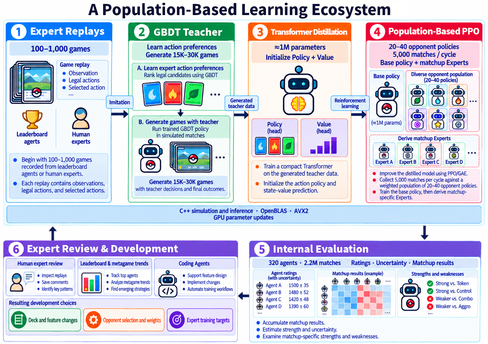

**图 1：24th 的六段式生态**（topic 740956）——专家回放(100–1,000 局) → GBDT 教师(15K–30K 教师局) → Transformer 蒸馏(~1M) → 群体 PPO(20–40 对手、5,000 局/周期) → 内部评估(320 agents/2.2M 局) → 专家复盘与开发选择。**本场"系统战"的全景图**。

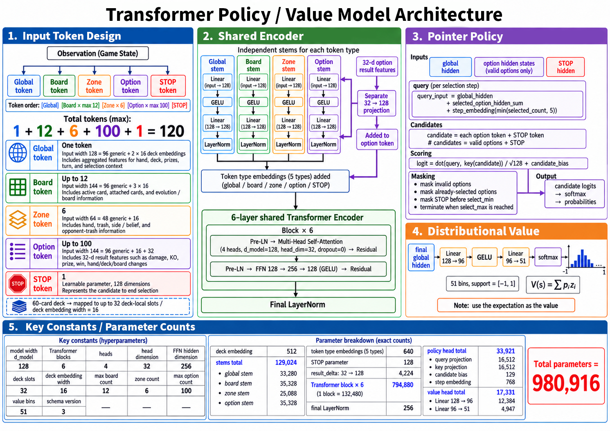

**图 2：980,916 参数 Transformer**（topic 740956）——120 tokens（1+12+6+100+1）、6 层/4 头/128d、指针式策略头 + 51 bin 价值分布头；分项参数量与总参数精确对上。

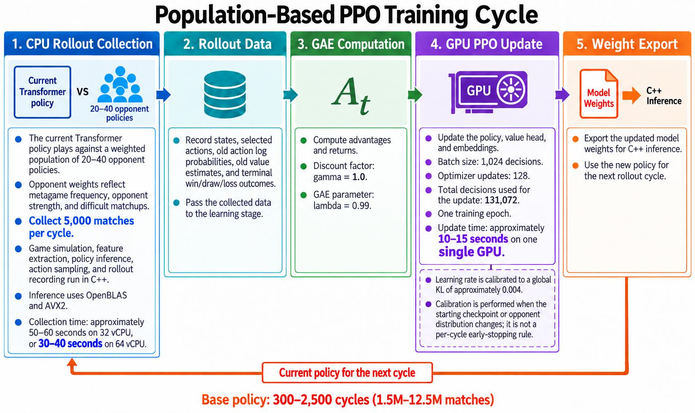

**图 3：PPO 周期与吞吐**（topic 740956）——5,000 局采集（32 vCPU 50–60s / 64 vCPU 30–40s）+ 131,072 决策更新（10–15s GPU）；base 300–2,500 周期。

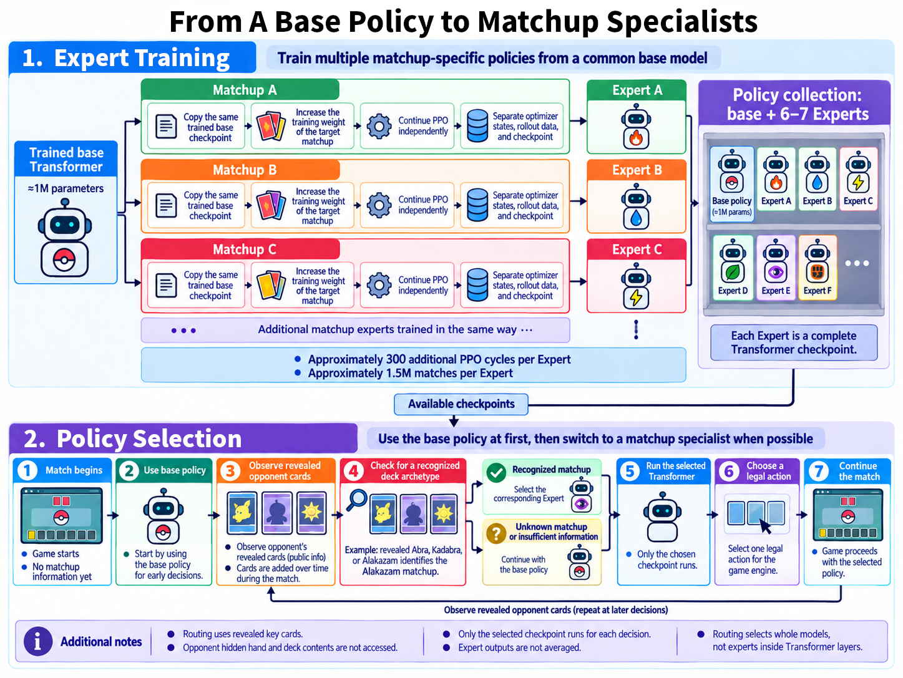

**图 4：基座 → Experts → 运行时路由**（topic 740956）——每个 Expert +300 周期/+1.5M 局；按对手暴露卡（示例 Alakazam）选择检查点，未知对局回退基座。

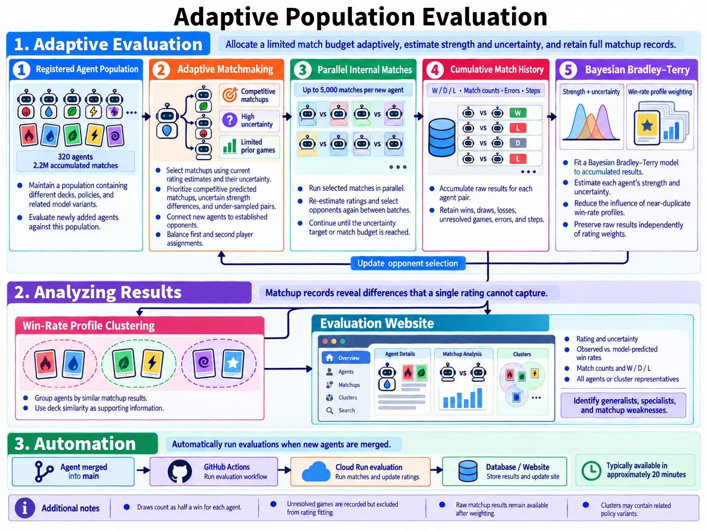

**图 5：自适应群体评估**（topic 740956）——320 agents/2.2M 局；贝叶斯 Bradley–Terry 强度+不确定性；胜率画像聚类；GitHub Actions→Cloud Run 自动评估（~20 分钟）。

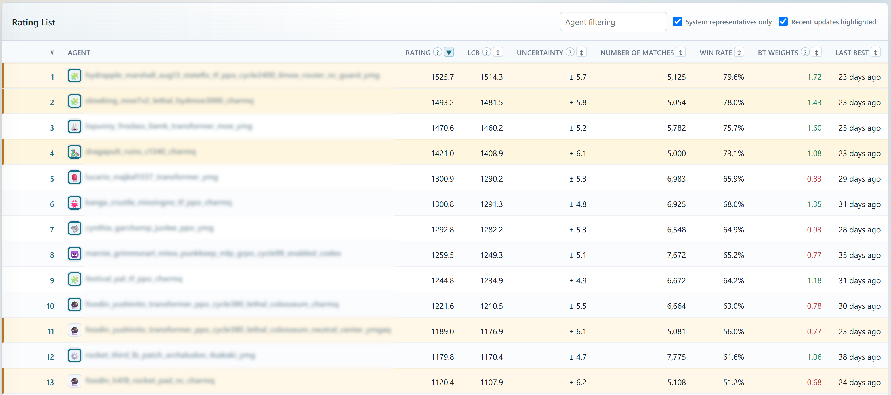

**图 6：评级列表（代表代理）**（topic 740956）——Hydrapple 1525.7±5.7、Slowking 1493.2±5.8、Ogerpon 1470.6±5.2、Dragapult 1421.0±6.1；列含 LCB、局数、胜率、BT 权重、更新时间。

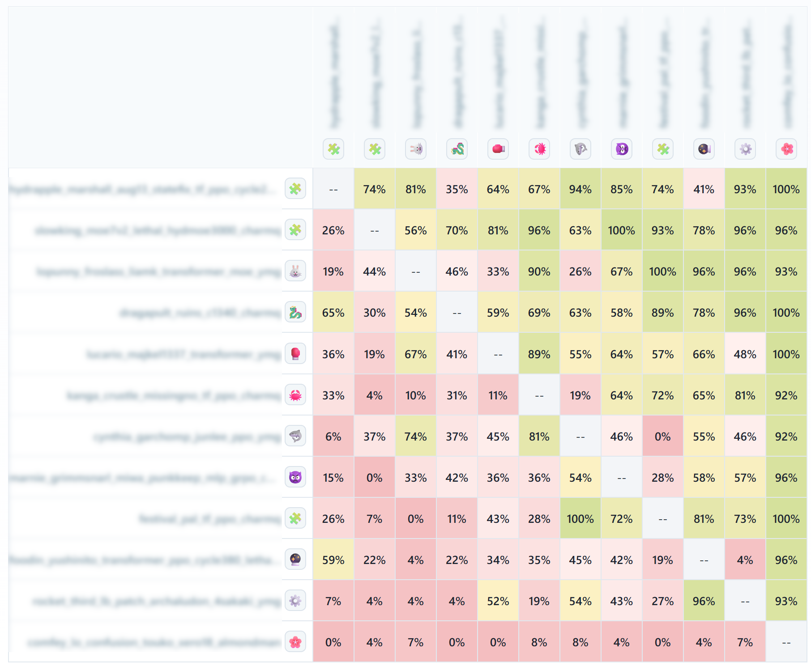

**图 7：对阵矩阵**（topic 740956）——大量非传递/极端对位（如某对 100%、反向 0%），证明"单一 rating 无法表达 matchup 结构"。

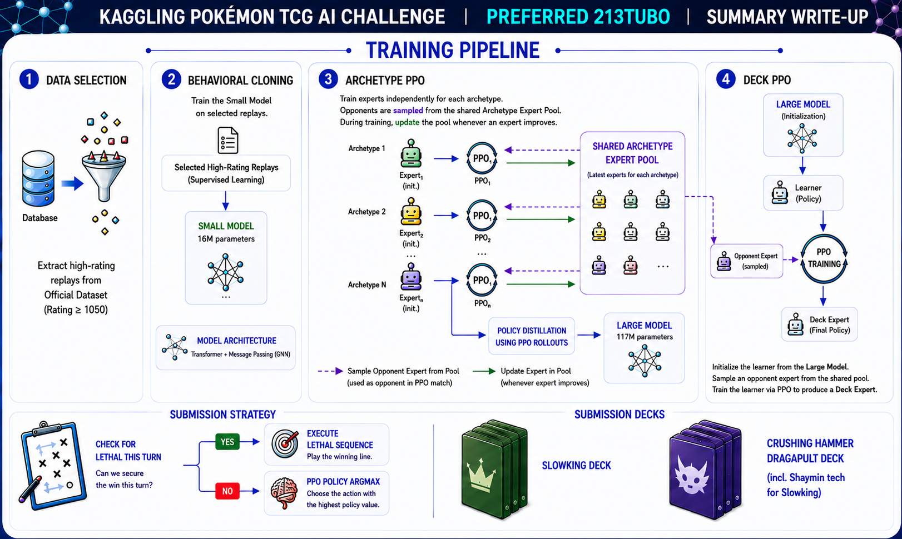

**图 8：213tubo 的四段训练管线**（topic 735867）——数据筛选(rating≥1050) → BC 16M → 原型 PPO（共享 expert 池）→ 蒸馏 117M → 牌组 PPO；提交策略"斩杀检查 → PPO argmax"。

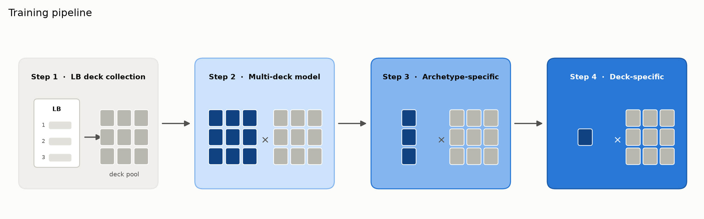

**图 9：27th 的课程训练**（topic 738158）——LB 牌组池 → 多牌组模型 → 原型固定（我方固定、对手随机）→ 单牌组固定。

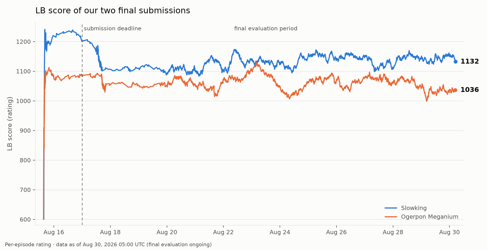

**图 10：最终评估期的 rating 波动**（topic 738158）——提交截止后仍持续评分；Slowking 最终 1132、Ogerpon+Meganium 1036，曲线波动 ±50 分。**"最终名次含随机成分"的直接证据**。

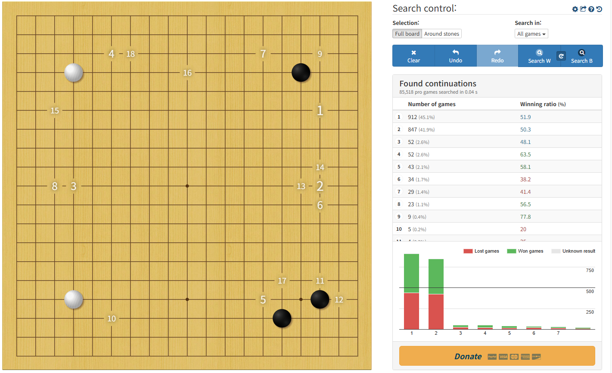

**图 11：Pattern DB 的灵感来源**（topic 735593）——Waltheri 的围棋局面检索：85,518 局职业棋谱中 0.04 秒找到相似局面与后续胜率。

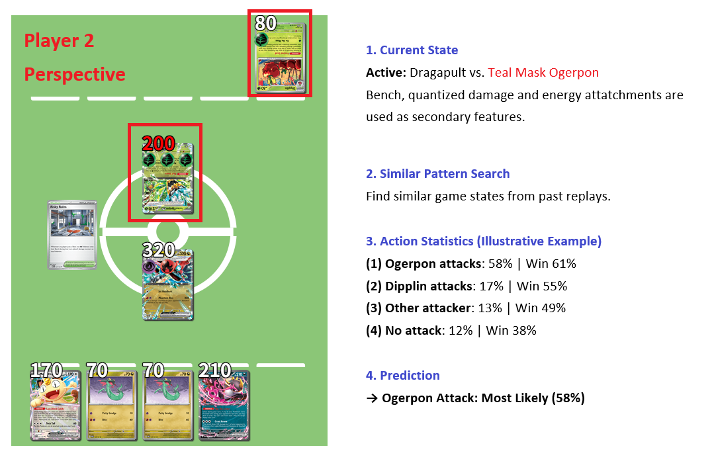

**图 12：Pattern DB 的动作统计**（topic 735593）——当前主动方 Dragapult vs Teal Mask Ogerpon；相似局面统计：Ogerpon 攻击 58%（胜 61%）、Dipplin 17%（55%）、其他 13%（49%）、不攻击 12%（38%）。

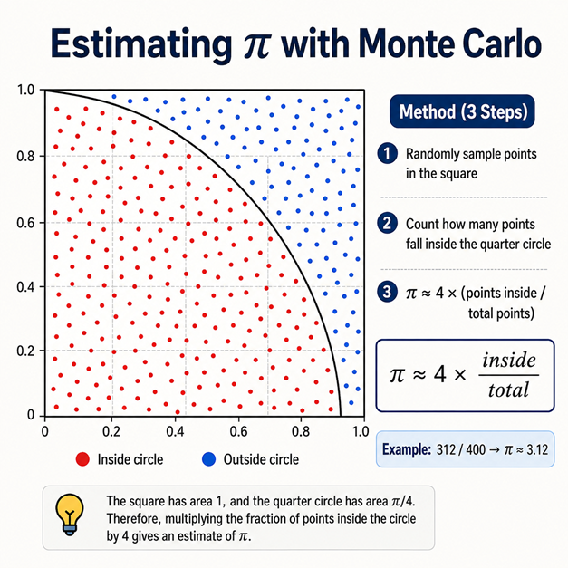

**图 13：MC 采样概念示意**（topic 735593）——用随机采样估计期望（Magist 用它评估 Judge 等随机动作后的局面价值）。

## 10. 对既有笔记/playbook 的修订点

1. `notes/sim-agent/pokemon-tcg-ai-battle.md` 升级：补 8 篇角色表、5 队 × 8 维对照、数字账（980,916/15×/84 局秒/55 亿决策/2.2M 评估局/1132）、机制 M1–M8、13 张图证与失败清单；修正"8 篇 write-up"表述（其中 2 篇为合规/分享帖）。
2. `playbook/sim-agent.md`（游戏 agent 节）增补：
   - **仿真吞吐优先**：C++/矢量化环境 + 批量推理是 RL 的第一基础设施；小模型 + 大经验是明确可选策略；
   - **群体/历史池**：对手分布设计（遭遇频率 × 难度 × 强度）+ 冻结历史防坍塌；
   - **分层专业化**：牌组→原型→对局专家 + 廉价路由（暴露卡识别）；
   - **评估系统**：贝叶斯 BT/不确定性 + 自适应配对 + 重复变体密度校正 + 胜率画像聚类；保留原始 W/D/L；
   - **教师冷启动**：小回放 → 特征模型（GBDT）→ 生成数据 → 蒸馏神经策略 → RL；教师价值在覆盖率；
   - **隐藏信息**：belief 表征/MC 采样；绝不喂观众视角信息；
   - **奖励**：terminal-only 默认，慎用中间塑形；
   - **规则前置**：引擎/逆向/协作的合法性要在开赛初期逼出官方裁定。
3. `playbook/00-通用方法论.md` 增补：**"匹配制比赛的排名 = 策略强度 × 匹配方差；评估系统与策略同等重要"**；**"技术可行 ≠ 规则允许：基础设施类问题要在早期寻求官方裁定"**。
4. `analysis/THEORY.md`（Batch 6 末汇总 v0.6）候选：
   - **L102｜匹配制评估优先律**（对手分布是环境的一部分；需内部 BT/配对系统；证据 = 24th 生态 + 15th 配对评估 + 712621/736361）；
   - **L103｜群体/历史池防坍塌律**（自对弈必须混合历史与多样对手；证据 = 15th/24th/27th/213tubo）；
   - **L104｜仿真吞吐换经验律**（小模型 + 高吞吐 > 大模型 + 低吞吐，在经验不足阶段；证据 = 24th 1M/1ms/84 局秒 vs 213tubo 117M）；
   - **L105｜专家分工 × 廉价路由律**（牌组/原型/对局分层 + 暴露卡路由；证据 = 15th/24th/27th/213tubo）；
   - **L106｜教师覆盖率优先律**（小回放冷启动用特征教师+蒸馏，教师低 ~200 分但省 50–80% 时间；证据 = 24th；反例边界 = 无回放时纯 RL 可行，15th）。

## 11. 出处

- 引擎裁定请求（103 票）：https://www.kaggle.com/competitions/pokemon-tcg-ai-battle/discussion/711737
- 引擎源码发布（127 票）：https://www.kaggle.com/competitions/pokemon-tcg-ai-battle/discussion/717141
- 分享时机（16 票）：https://www.kaggle.com/competitions/pokemon-tcg-ai-battle/discussion/733137
- 213tubo（57 票）：https://www.kaggle.com/competitions/pokemon-tcg-ai-battle/discussion/735867
- 15th（44 票）：https://www.kaggle.com/competitions/pokemon-tcg-ai-battle/discussion/739241
- 24th（39 票）：https://www.kaggle.com/competitions/pokemon-tcg-ai-battle/discussion/740956
- Team Magist（37 票）：https://www.kaggle.com/competitions/pokemon-tcg-ai-battle/discussion/735593
- 27th（32 票）：https://www.kaggle.com/competitions/pokemon-tcg-ai-battle/discussion/738158
- 未收录正文的关键讨论（真实 topic id，供后续定点补采/图片层参考）：712621、724362、709160、729926、735822、736361、735123、717697、716045、708586
