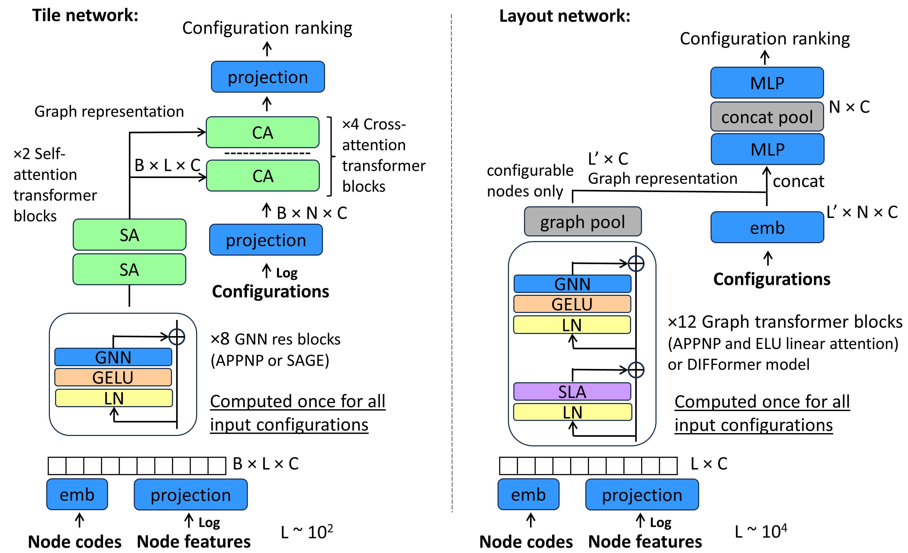

# Predict AI Model Runtime 轻量深读（Tier B）

> 赛事：Research ｜ 主题 other（systems，ML for Systems）｜ 616 队 ｜ 标准赛 ｜ 指标：`58266_TpuGraphsEval`
> （tile=top-5 slowdown 越小越好 ≈0.19–0.20；layout=Kendall tau 越大越好 ≈0.70–0.74，两子任务合并评分）
> 材料基础：`digests/predict-ai-model-runtime.md`（6 篇正文：1st 456343 / 10th 456129 / 6th 456084 / 11th 456092 / 4th 456462 / 科普帖 435631；80 条主题索引）+ 6 张图
> 轻读时间：2026-10（Tier B B04）

## 1. 一句话重述与数字账

给 TPU 编译器（XLA）预测配置优劣：**tile** 子任务给融合子图挑 tile 尺寸（按 top-5 slowdown 排序），**layout** 子任务给张量维度排布挑 layout 配置（按 Kendall tau 排序）。真正的考点是**大图（10^4 节点）× 海量候选配置（1000+/图）的排序学习 + 内存/显存压缩 + 极小评测集下的抗震**。

| 关键数字 | 值 | 来源 |
| --- | --- | --- |
| 1st（68 票） | 图剪枝（只留可配置节点及其邻居）→ vRAM ÷4、训练快 5×；base-7 压缩 node_config_feat；-1 padding 统一嵌入；SAGEConv + SelfChannelAttention + **CrossConfigAttention**；PairwiseHingeLoss；**推理 batch 内配对 → 10 次置换 TTA 平均**。单模 0.748 pub / 0.714 priv；5–10 模型平均 0.757/0.736（**未选为最终提交**） | 1st |
| 10th（25 票） | **中级融合**（intermediate fusion）；layout 用线性注意力图 Transformer（12 块、APPNP/ELU+1、4090 可跑）；tile 用 cross-attention 融合；**ListMLE + 每批 ~1000 配置**；tile-only 0.197/0.196；最终选公榜最佳 sub → 0.721 pub / 0.703 priv；"最幸运私榜"另一 sub 0.706/0.715 → 自认抽奖 | 10th |
| 6th（28 票） | layout 用**5 跳邻居子图**（只保留与 cluster 节点相关的"差异节点"）+ 梯度累积；GraphNorm；4 层残差 SAGEConv（tile 上 GAT 更好）；layout 用 pairwise ranking、tile 用 ListMLE；2×48GB 工作站 | 6th |
| 11th（27 票） | **纯 LightGBM**：手工图特征（节点类型计数/拷贝次数/minor 维度分桶/填充和/配置出现率——遗传搜索下出现越频繁越可能快）；pointwise 归一化排名 MAE = 0.715/0.680；**pairwise 二分类 → 1000² 全配对求和的排序** = 0.728 pub / 0.701 priv；tile-only 0.198/0.195 | 11th |
| 事件 | 官方中途数据更新要求重训（33 票）；测试采样泄漏帖（13 票）；CV/LB 讨论（14 票）；公榜/私榜大洗牌（10th 自述"lottery"） | 社区 |

## 2. 逐方案对照矩阵

| 维度 | 1st | 10th | 6th | 11th | 4th |
| --- | --- | --- | --- | --- | --- |
| 模型族 | GNN（SAGEConv+双注意力） | 图 Transformer（线性注意力/APPNP） | GNN（SAGE/GIN，tile 用 GAT） | LightGBM | 简单 MLP |
| 配置融合 | 早期（拼接输入） | **中级融合**（性价比最优解） | 早期（子图内配对） | 特征聚合（无需图结构） | 均值池化后点积 |
| 图规模处理 | 剪枝 + 去重 + base-7 压缩 | 分块按时加载（JIT）+ 线性注意力 | 5 跳邻域子图 + 梯度累积 | 手工统计特征降维 | node_feat 手动索引子集 |
| 损失 | PairwiseHinge | **ListMLE（1000 配置/批）** | pairwise（layout）/ListMLE（tile） | MAE / 二分类 | 排名目标 |
| 抗 shakeup | 5–10 模型平均（最终却选了单模） | 10–20 组配置混合 | — | — | — |
| 分数（pub/priv） | 0.748/0.714（单模） | 0.721/0.703（选定 sub） | — | 0.728/0.701（layout pairwise） | — |

## 3. 共识、分歧与裁决

### 共识一：内存/显存工程是头号瓶颈（四队共同）

1st 剪枝+去重+压缩；10th 只驻留图特征、配置按需分块加载；6th 用 5 跳子图+梯度累积；11th 干脆降维成表格特征。**裁决**：本赛的"建模能力"上限被工程管线决定——先让数据装得下、跑得动，再谈结构。置信度：高。

### 共识二：任务是"排序"而不是"回归"（3/4 队）

1st PairwiseHinge；10th/6th ListMLE；11th 的 pairwise 版比 pointwise 高 +0.013 pub / +0.021 priv。**裁决**：tile/layout 的评价只看相对排名（top-5 / Kendall tau），pointwise 拟合绝对值是次优归纳偏置。置信度：高（11th 有同管线对照）。

### 共识三：评测集太小 → 排名噪声主导（1st/10th/11th）

10th 明说"重跑同设置换种子差异不显著"，被迫做 11 折才勉强分辨；11th 因无法做更好 CV 而被 shake down；1st 的最终选择与最佳集成差 0.021 priv。**裁决**：单赛分数不可全信，多配置混合/多重 TTA 是对冲手段。置信度：高（多人独立自述 + 榜面证据）。

### 分歧一：图结构 vs 手工特征

1st/10th/6th 都押 GNN/图 Transformer；11th 用 LightGBM + 手工图统计拿到 0.728 pub（**高于 1st 的单模公榜分**），且明说"假设运行时≈各节点运行时之和，聚合统计足够"。**裁决**：GNN 非必需——当可解释特征能覆盖主要方差时，表格模型在同分带内更省算力；但最终金牌归属仍需图模型。置信度：中高。

### 分歧二：注意力该用在图边还是别处

1st 明确说 GAT 类边注意力无用（"TPU 图的连接都是真连接"），但**通道注意力 + 跨配置注意力**巨大增益；10th/6th 也在配置轴上做注意力/配对。**裁决**："该在哪里做注意力"由噪声来源决定——本赛噪声在配置间比较，不在边权重。这是"先定位不确定性来源，再选归纳偏置"的范例。置信度：中高（1st 自述 + 架构图）。

### 分歧三：融合时点

早期融合（1st/6th）计算重复但表达力强；晚期融合省算力但丢失节点级对应；10th 论证中级融合是 Pareto 解。**裁决**：中级融合在"图大 × 配置多"时是最佳工程折中。置信度：中高。

### 事件：官方数据更新与测试采样泄漏

第 33 票帖要求全量重训；13 票帖指出测试采样泄漏——说明本题数据管线本身有坑。**裁决**：ML for Systems 赛要额外审计数据版本（host 可能中途换数据）。置信度：中。

## 4. 证据分级

| 断言 | 等级 | 说明 |
| --- | --- | --- |
| 1st 的剪枝/压缩/注意力/TTA 链条 | 自述 + 架构图 + 公开代码 | 高 |
| 10th 的 unstable eval 与 11 折方案 | 自述（具体数字） | 中高 |
| 6th 的 5 跳子图与 GraphNorm | 自述 + 代码 + 图 | 中高 |
| 11th 的 LightGBM 分数与特征清单 | 自述（同管线对照 pointwise/pairwise） | 中高 |
| 公榜/私榜大洗牌 | 多队自述 + 榜面 | 高（现象） |
| 官方数据更新的影响范围 | 单帖（33 票） | 中 |

## 5. 悬案与缺口（登记）

- 2nd（456365）/3rd（456377）/5th/8th/9th/19th 的 write-up 未入库，中位数解法分布不完整；
- "测试采样泄漏"（456090）与 "Something Interesting About Test Data"（456083）未细读，泄漏的实际影响未量化；
- 1st 提到"最佳集成未选"——若选它是否夺冠，无法验证（事后不可反证）；
- 官方评测集到底几张图、每子任务权重如何合并（`58266_TpuGraphsEval` 细则）未在材料中展开。

## 6. 图表证据

**图 1**（topic 456343）：1st 的双注意力结构——输入 (nb_configs, nb_nodes, 134+4×24+16)→Linear→2×[InstanceNorm→SAGEConv→SelfChannelAttention→CrossConfigAttention→残差→GELU]→全局平均池化→线性输出 logits。注意特征分叉：`node_feat[:134]` 走 StandardScaler，`node_feat[134:]` 与 `node_config_feat` 共享 4 通道嵌入、opcode 单独 16 通道——这正是 base-7 压缩与 -1 padding 统一嵌入的落点。

**图 2**（topic 456129）：10th 的中级融合示意——tile（左，L≈10²）用 8 个 GNN 残差块 + 2 个自注意力块 + 4 个 cross-attention 块；layout（右，L≈10⁴）用 12 个图 Transformer 块（APPNP + ELU 线性注意力）。两侧都标注"Computed once for all input configurations"（图表示只算一次、配置各自融合）——中级融合的算力优势来源。

## 7. 出处

- 1st（68 票）：https://www.kaggle.com/competitions/predict-ai-model-runtime/discussion/456343
- 10th（25 票）：https://www.kaggle.com/competitions/predict-ai-model-runtime/discussion/456129
- 6th（28 票）：https://www.kaggle.com/competitions/predict-ai-model-runtime/discussion/456084
- 11th（27 票）：https://www.kaggle.com/competitions/predict-ai-model-runtime/discussion/456092
- 4th（25 票）：https://www.kaggle.com/competitions/predict-ai-model-runtime/discussion/456462
- 科普（101 票，layout/tile 定义）：https://www.kaggle.com/competitions/predict-ai-model-runtime/discussion/435631
- 数据更新（33 票）：https://www.kaggle.com/competitions/predict-ai-model-runtime/discussion/443581
- 测试采样泄漏（13 票）：https://www.kaggle.com/competitions/predict-ai-model-runtime/discussion/456090
