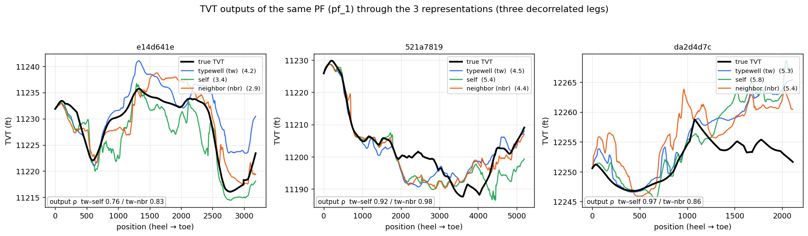
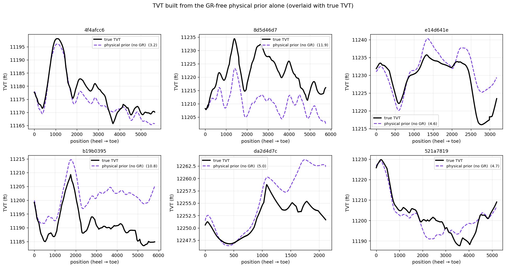
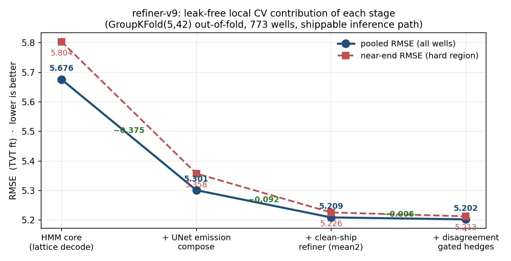
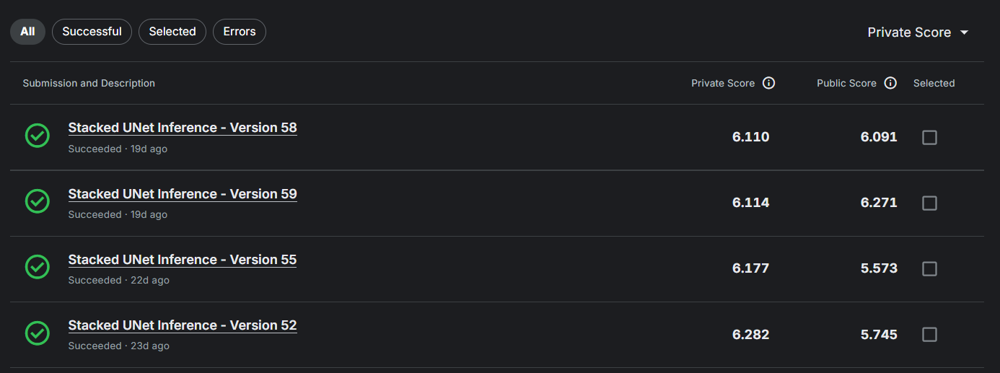

# ROGII Wellbore Geology 深读：多模态对齐 × 验证纪律

> 赛事：Featured ｜ 主题 science（地球科学）｜ 6125 队 ｜ 代码赛 ｜ 指标 pooled RMSE（2026-08-05 截止）
> 材料基础：`digests/rogii-wellbore-geology-prediction.md`（9 篇正文：1st/2nd/3rd/6th/7th/26th/36th + 工作笔记奖 + 问题图示）；图片资产 24 张
> 深读时间：2026-10（Tier A #8，Batch 1 收官）

## 0. 一句话重述：这道题真正在考什么

题面是"预测钻头在岩层柱中的高度 TVT（一条隐藏曲线）"，本质是**在重复地层导致的 GR 匹配多模态下做状态估计**。降解为 6 步：

1. **识别多模态本质**：同一 GR 图案在不同深度反复出现 → 后验是多峰的；任何"逐行回归"都会坍缩到多峰的均值——一条不存在的地层线。全体前排方案的解法最终都归结为"路径级 / 分布级输出"（概率图、候选曲线、HMM 状态序列）；
2. **物理恒等式降维**（2nd）：`dTVT = dz_layer − dz`，其中 dz（井轨迹垂直分量）测试时已知 → 模型只需估"结构面斜率 dz_layer"这个近分段常数台阶，问题难度被砍掉大半；
3. **物理先验注入**：粒子滤波/HMM 提供可行路径先验 + 无 GR 的地层倾角先验（6th/1st 的邻井），是 CV↔LB 转移性（榜单不震荡）的关键；
4. **候选多样性**：后期唯一有效的增量来自"错误方向不同"的候选（残差自相关≈1.0；与现有候选 0.99 相关的新候选毫无价值）；
5. **鲁棒验证**：pooled RMSE 被极少数灾难井主导；只信"对主导井不敏感"的泄漏-free 本井级 CV（2nd 的 LCO 检验；6th 的 fold 方差最小化；7th 的三把尺子反转故事）；
6. **工程存活**：9 小时推理墙 + 隐藏集远大于本地 stub → 秒/井是约束，提交是"工程存活问题"（7th 用 numba、1-flip、CPU/GPU 流水线与镜像加载优化硬撑过墙）。

一句话：**这是一道"验证科学"比赛**——模型（U-Net/CNN/PF/HMM）是手段；真正区分名次的是"如何保留多模态、如何证明一个改进是真的、如何让改进转移到私榜"。

## 1. 材料与角色

| 帖子 | 作者 | 票数 | 角色与独有信息 |
| --- | --- | --- | --- |
| [733220](https://www.kaggle.com/competitions/rogii-wellbore-geology-prediction/discussion/733220)（1st） | Ruby | 184 | **2D 对齐重构**：ConvNeXt U-Net、交叉熵主损失；PF 特征被逐步淘汰、XY 邻井特征"CV 涨 0.3 但公开榜跌"的裁决；代码主要由 Codex/GPT-5.5/5.6 写 |
| [733432](https://www.kaggle.com/competitions/rogii-wellbore-geology-prediction/discussion/733432)（2nd） | Bilzard | 44 | **概率路径建模**：AnchorCNN 预测条件分布 P(dTVT｜TVT)、DP 精确期望解码；物理一致的合成井管线；**LCO 鲁棒选模**；物理恒等式 |
| [733319](https://www.kaggle.com/competitions/rogii-wellbore-geology-prediction/discussion/733319)（3rd） | tereka | 40 | **五候选 + SoftMax 门控**：HMM/PF/两个 NN/1D SDF；5 split × 5 fold = 25 ckpt/族；fold-safe 定义最完整；私榜洞察（参考 GR 质量 > 模型复杂度） |
| [733226](https://www.kaggle.com/competitions/rogii-wellbore-geology-prediction/discussion/733226)（6th） | k256.dev | 60 | **PF 候选群 + 行级 bagging**：91 条候选（16 参数组 × 5 参考 GR × 平滑 × 先验）；公开 20 → 私榜 6；CV/Public/Private 转移机制分析最深入 |
| [733154](https://www.kaggle.com/competitions/rogii-wellbore-geology-prediction/discussion/733154)（7th） | Gaopeng Ren（+ejixxx） | 40 | **HMM + UNet 精修器**：用"人造错误"预训练精修器；**三把尺子（CV/公开/私榜）完全反转**的实证；9 小时墙的工程存活术 |
| [733136](https://www.kaggle.com/competitions/rogii-wellbore-geology-prediction/discussion/733136)（26th） | Tucker Arrants | 74 | **井即图像**：堆叠 UNet（EffNetV2 L/XL/L2，最高 ~1B 参数）+ 合成井预训练 + 自回喂 k=3；**退役空间先验=生涯最佳**的反直觉教训 |
| [733181](https://www.kaggle.com/competitions/rogii-wellbore-geology-prediction/discussion/733181)（36th） | **Chris Deotte** | 53 | **全 agent 流水线**：codex --yolo 连续两周 + 2×L4；粗到细（父路径 → 18 层证据图 → 2D ResNet → persistent-datum HMM → 真实 GR 全局微调）；agent 使用教训 |
| [727171](https://www.kaggle.com/competitions/rogii-wellbore-geology-prediction/discussion/727171)（工作笔记奖） | Igor Kuvaev（主办） | 48 | 获奖两篇：验证纪律（打乱/空操作/留空间对照）与可辨识性分解（"高频晃动免费，误差全在低频趋势"） |
| [697418](https://www.kaggle.com/competitions/rogii-wellbore-geology-prediction/discussion/697418)（问题图示，177 票） | Zacchaeus | 177 | 赛题物理结构的最佳可视化（索引级掌握） |

**材料缺口（未扩采，登记备查）**：主题索引另有约 25 条 write-up 未收录，含 [4th（733480）](https://www.kaggle.com/competitions/rogii-wellbore-geology-prediction/discussion/733480)、[5th（733522）](https://www.kaggle.com/competitions/rogii-wellbore-geology-prediction/discussion/733522)、[8th "PF ranker + Synthetic-Pretrained U-Net"（733281）](https://www.kaggle.com/competitions/rogii-wellbore-geology-prediction/discussion/733281)、[9th（733150）](https://www.kaggle.com/competitions/rogii-wellbore-geology-prediction/discussion/733150)、[10th "A Compass, Not a Map"（733315）](https://www.kaggle.com/competitions/rogii-wellbore-geology-prediction/discussion/733315)、[34th 纯物理（733182）](https://www.kaggle.com/competitions/rogii-wellbore-geology-prediction/discussion/733182)、[48→407 失败复盘的教训帖（733307）](https://www.kaggle.com/competitions/rogii-wellbore-geology-prediction/discussion/733307) 等；两篇获奖工作笔记原文也未直接收录（仅经主办总结转述）。

## 2. 逐方案对照矩阵

| 维度 | 1st Ruby | 2nd Bilzard | 3rd tereka | 6th k256.dev | 7th Gaopeng Ren | 26th Tucker | 36th Chris Deotte |
| --- | --- | --- | --- | --- | --- | --- | --- |
| 核心范式 | 2D 对齐（井×TVT 网格） | 条件概率场 + DP 解码 | 物理+神经五候选 + 门控 | 91 条 PF 候选 + bagging | HMM 核心 + 神经精修 | 井图像分类（UNet） | 粗到细 + HMM + 真实 GR 校验 |
| 输出表示 | 归一化概率图 → 期望路径 | P(dTVT｜TVT) 21 类 × DP 边缘化 | 五候选逐行 SoftMax 加权 | 任选条候选曲线逐行软平均 | HMM 全局分支 + 局部平滑 | 每列深度行 softmax → 期望值 | 证据图 → HMM 分支 + 全局位移 |
| 物理组件 | PF 特征（后期退居多样性）、XY 邻井地层面 | 地层恒等式 + z_layer 内部表示 | 三族 HMM + PF + 物理先验 PF | 无 GR 倾角先验 + 平滑器 | persistent-datum HMM | dZ 通道；空间先验（退役但最强） | XY 邻井 + HMM |
| 神经组件 | ConvNeXt-small U-Net（BN 替代 LN，需 BF16） | EfficientNet-B0 + FPN → 21×128×336 状态网格 | 双 TCN 交叉编码 + CNN/BiLSTM 门 | 注意力融合器（Conv1d×3 + candidate 轴注意力） | 2D 残差 CNN（18+18+2 通道） + UNet 精修 | SMP UNet（EffNetV2 L/XL/L2），解码通道加倍 | 2D 残差网络（38 输入通道，膨胀 1→16） |
| 训练数据 | 真实 + 增强（Z 位移、GR 仿射 a·x+b） | **每 epoch 混 2,048 条合成井**（层饼模型 + 真实残差库） | 真实；合成未提 | 真实（PF 生成候选） | 真实 + **6,000 条人造错误井**预训练精修器 | 合成预训练（比真实更难地质、更干净信号）→ 真实微调 | 真实 + 合成端点/曲率扰动 |
| 验证纪律 | GroupKFold + 3 seeds；用 CV 对抗公开榜 | **LCO（留最大贡献井）检验** + 评分对齐 148 井 | 5 split × 5 fold（ARI≈0 独立性校验）+ 全链路 OOF | fold 方差最小化（重抽 split std≈0.015） | 7×5 折 + "哪把尺子说真话"复盘 | 分层 GroupKFold（按 TVT 跨度） | 五折 + 事后完整 OOF 评分 |
| 私榜成绩 | 5.639（5.980 公开） | 5.802（6.146 公开） | 5.836（6.043 公开） | 5.984（5.626 公开） | 6.057（5.518 公开） | 6.60（CV 5.038） | 6.8（CV 5.706） |
| 独门技巧 | GR 校准 + 增强族；XY 特征可信 CV 裁决 | dz 恒等式 + 合成数据 54 组"母井"体系 | 参考 GR 家族化（sibling/self-prefix）；门控权重非负约束 | de-shrink 全局增益 a≈1.03；全区间平滑 | 用"人造错误"保住精修器的信任校准 | 堆叠 + 自回喂 k=3；空间先验（虽被退役） | persistent-datum HMM（49 条全局轨道）；只用真实 GR 做最终位移 |

## 3. 共识、分歧与裁决

### 共识一：多模态是本质，逐行回归必败（全员，置信度最高）

- 2nd：单路径回归"坍缩到多峰均值——一条不对应任何假设的路径"；其解法是显式条件分布 + DP 边缘化；
- 6th：对强 PF 输出的残差**自相关≈1.000**，误差不是逐行噪声而是"整段坐在哪个解上"的二选一——"tabular 不是不好，是逐行回归的框架错了"；
- 36th：软平均不同地层 = "不可能的中间层"，必须硬分支承诺；
- 26th/1st/3rd：全部改为逐列分布 / 候选 / 状态序列。

**裁决**：这道题的第一性原理是"GR 是 TVT 的多峰函数"；任何在行维度独立的输出头（点回归）都有不可修复的系统偏差。置信度：高。

### 共识二：物理先验 = CV↔LB 转移性的保险（6th 提供了机制证据）

6th 的转移表是本场最重要的实证：纯 GR 匹配的方法 CV 7.5 → 公开 6.7（公开比 CV 好 0.8，是"宽松"假象），加物理先验后三者对齐（6.50/6.43/6.67）。其解释：GR-only 方法把公开榜的随机友好当成了信号；物理约束把偏差拉回。
1st 的 XY 邻井特征（CV −0.3、公开榜变差）最终在私榜上被证明**CV 是对的**（XY 系模型私榜 5.78–5.94 vs 默认系 5.88–6.13）；3rd 的私榜最大增量全部来自"哪一种参考 GR/更稳的初速估计"这类物理决策。

**裁决**：含物理约束的模型在**非平稳榜单**上更稳；但物理先验必须 fold-safe 构造（6th §3-3：任何验证井信息泄入倾角场/校准 → CV 虚好、私榜崩），置信度高。

### 共识三：候选多样性是后期唯一增量（6th 的定量表述）

- 6th：与现有候选 0.99 相关的新候选"什么都没加"；晚期每一步增益都来自"错误方向不同"的候选（自评/邻井 GR、无先验/有先验、平滑/不平滑、MD 抽取）；最后加 5 条"无先验无发射"的 PF 反而最大（Submission A 主杠杆）；
- 3rd：Local-DTW HMM 单体不强但误差相关性低，进融合后把 HMM 混合从 6.0492 → 5.9703；
- 26th：因为"井图像"推理快，直接堆 4 种骨干 × 7 seeds × 5 folds。

### 分歧一：软平均 vs 硬分支选择

6th：候选曲线做**软平均**最优，"限制 top-k 反而伤害"——因为在连续候选族上强制选择等于丢信息；
36th/7th：对**离散地层二解**必须硬承诺（+8 ft 和 −8 ft 的平均 0 ft 是空白）；2nd 的 DP 是"在正确模态内软平均"（teacher forcing 保证不跨模态）。

**裁决**：两条路线并不矛盾，取决于解的**离散性**：同一连续候选族（不同参数/参考的 PF）→ 软平均/bagging；离散的多假设（上/下地层、命名分支）→ 先硬选分支，再分支内平滑。置信度：中高（来自 3 家正反证据的合取）。

### 分歧二：合成数据——有人靠它进前 2，有人完全失败

- 2nd：层饼假设 `GR = f(TVT) + r` 的函数性让"任意 TVT 轨迹 → 无限数据"成立；真实残差库保留井间差异；
- 26th："合成数据不要模仿真实数据"——地质用"比真实更难"、匹配信号用"比真实更干净"的课程；且按 fold 生成，防止预训练泄漏；
- 1st：联合训练（合成+真实混合）优于两阶段预训练；
- 6th：合成预训练失败（自述可能是生成质量差）。

**裁决**：合成数据的价值不在"逼近真实分布"，而在**教技能**（2nd 保结构、26th 保难度）；评价合成管线是否合格的标准是"在合成上训出的模型在真实 OOF 上持续增益"。置信度中。

## 4. 增量数字账

**6th 的完整阶梯（CV / 公开 / 私榜，数字账最全的一份）**

| 步骤 | CV | 公开 | 私榜 | 要点 |
| --- | --- | --- | --- | --- |
| 1 输入 | 8.64 | 7.862 | 8.163 | Optuna 调参后仍过度拟合公开榜 |
| 3 输入 | 7.90 | 7.189 | 7.729 | 多组 PF 参数拼接 |
| 5 输入+平滑 | 7.50 | 6.724 | 7.404 | 固定滞后 192 平滑器（CV −0.3/LB −0.4） |
| +selfGR+nbrGR | 6.98 | 6.026 | 7.112 | 三种参考 GR 去相关 |
| +物理先验 | 6.50 | 6.43 | 6.67 | **首次 CV≈LB≈私榜**（转折点） |
| +91 候选融合器 | 5.94 | 6.17 | 6.382 | 未调参 PF 全部喂入 |
| +特征合并重训 | 5.75 | 5.707 | 6.166 | "combine > blend"约 2.6× |
| +全区间平滑 | 5.70 | 5.652 | 6.097 | — |
| +5 条无先验 PF（A） | 5.587 | **5.458** | 5.997 | 主杠杆 |
| +dec10/tw-affine（B） | **5.4577** | 5.626 | **5.984** | 公开榜说 A 好，CV/私榜说 B 好 |

**其余各家的关键数字**

| 方案 | 数字 |
| --- | --- |
| 1st | 单模 CV 4.80–5.53；加权集成 CV 4.627 / 公开 5.980 / **私榜 5.639**；ConvNeXt 的 LN→BN+"BF16 防 NaN"；平均池化优于可学习上下采样 |
| 2nd | sub076（dz 头 + TTA8 + 16ft 网格）OOF **5.140** / 公开 6.146 / 私榜 **5.802**；TTA8 把 OOF 5.624→5.417 但公开反而 5.780→5.820；15 ckpt × DP × T4 推理 40 分钟/200 井 |
| 3rd | 最终 CV 5.2884 / 私榜 5.836；HMM 5.9703→HMMPF 5.6155；5 split 比 3 split 私榜 −0.067；BiLSTM 门控 5.2797 vs 无约束精修器 5.4023（5 折全输）；sibling GR 加权换法私榜 −0.126 |
| 6th | 单 PF 候选 RMSE 10.0–7.8；GPU 化 ~200×；平滑器 4.5→4.9 min（lag16）→13 min（lag192）；全流程 CV 5.4577→私榜 5.984（公开 20 → 私榜 6） |
| 7th | 阶段梯：HMM 5.676 → +神经发射 5.301（−0.375）→ +精修器 5.209（−0.092）→ +门控对冲 5.202（−0.006）；精修器病理：自井 3.20 vs 留出 9.34；6,000 合成错误井、60+8 epoch、单变体重训 10 分钟；numba 解码 25→12 s；T4 stub 5m54s、~50–65 s/井 |
| 26th | CV 5.038 / 私榜 6.60；EffNetV2 XL 单体 5.136；空间先验单体 CV **5.027**（全场最佳单体）却被退役——截图显示该系提交私榜 6.110，优于最终选择的 6.60 |
| 36th | 完整 OOF 5.7588 → 5.7064（真实 GR 全局位移 −0.052）；18 通道证据 = 3 参考 × 6 指标；256 位置 × 65 位移；HMM 49 条全局轨道（−24…+24 ft）+局部 −2…+2 摆动 |

**可复算校验（4 处独立算术吻合）**

1. 1st 的网格：水平 345 列 = (1,024 可见 + 10,000 目标) / 32 下采样 ✓；typewell 400 行 = ±100 ft / 0.5 ft ✓；
2. 2nd 的输入张量：512 行 = 256 ft / 0.5 ft ✓；336 列 × 32 ft ≈ 1.08 万 ft 评估区 ✓；
3. 数据拆分：隐藏测试 200 井 = 公开 52 + 私榜 148（2nd 的 LCO "52 井≈公开规模" 与 26th "148 井私榜" 互证）✓；
4. 3rd 的规模：5 split × 5 fold = 25 ckpt/族 ✓（文中表逐族列 25）。

## 5. 机制推演

**M1｜恒等式为什么砍掉大半难度**（2nd）：定义 `z_layer := TVT + z − b_well`（z_layer 为地层界面深度），则 `dz_layer = dTVT + dz`，即 `dTVT = dz_layer − dz`。dz 由井轨迹在测试时完全已知；真实数据里 dz_layer/dMD 是**楼梯状**（约 90% 列恒定、10% 列跳变）。于是"预测 TVT 增量"退化为"估一个近分段常数的结构斜率"，且跳变点集中在少数列——这就是为什么把 dz 作为输入后，"网络的工作量只剩平滑的结构斜率"。

**M2｜多模态的统计根源**：层饼模型下 GR 只是 TVT 的函数（+井间残差），重复地层让 `P(TVT|GR)` 多峰。多峰的均值是无意义的：±8 ft 两峰平均 0 ft。所有前排方案的输出层形态（概率图/条件分布/候选曲线/HMM 状态）都是"拒绝在输出端求单峰均值"的不同实现。26th 的自回喂（k=3）本质是让模型在概率场上多轮"再对齐"，逐步消掉跨模态质量。

**M3｜为什么"错误去相关"是唯一晚期杠杆**：对强基线（91 候选融合）残差自相关≈1.0 意味着单模型路线的信息已榨干；一个新候选的价值 = 它与现有候选的**误差方向夹角**，而非自身强度。这也是物理先验（无 GR）珍贵的第二重原因：它与一切 GR 类候选天然去相关。6th 的融合器把"候选轴"做注意力 softmax（而不是在时间轴），正是对"选哪条曲线"这一不可观测变量的边际化。

**M4｜LCO 检验的统计学**：pooled RMSE ∝ ΣSSE，148 井中少数灾难井（单井 RMSE 可达 34 ft，见 6th 图）能吞掉 0.3+ 的均值。2nd 的 leave-largest-contribution-out：把两模型逐井 SSE 差按 |g_w| 从大到小剔除，若改进在剔到 k* 就消失，则改进"押注在少数井的运气上"→ 拒绝。实例：橙线 −0.28 → 8 井后归零（拒），蓝线衰减平缓、删 52 井（≈公开规模）仍在（收）。这是"把统计显著性检查降维成一条曲线"的廉价而有效做法。

**M5｜精修器的信任校准病理**（7th）：第二遍精修器把第一遍预测作为输入通道。用真实井微调时，**模型对训练井解码 RMSE 3.20、留出井 9.34**——训练分布里输入通道几乎总是"对的"，网络学会复制而非纠正。修复：合成 6,000 条井并**伪造输入错误**（低通随机游走，幅度 ~log-normal(中位 2.9, σ=0.68)，另加 15% "好船"井 0.3–1.0），先训 60 epoch 再真实微调 8 epoch。教训一般化：**任何"修正上一阶段"的模型，其训练输入必须包含真实形态的错误**，否则它学不到"何时不该信输入"。

**M6｜推理墙的工程学**（7th）：隐藏集远大于本地 3 井 stub，绑定约束是"秒/井"而非 stub 总时。手段：banded 三对角转移核的 numba 前向-后向（25→12 s，与 numpy 输出一致到 4e-14）、1-flip 解码（主动牺牲精度换速度）、CPU 预热/GPU 解码流水线、fp16 + NaN 守卫、gc.disable。结果 T4 ~50–65 s/井、硬撑过 9 小时墙——而"更花哨的版本"全部撞墙得零分。**先有能提交的版本，再有更准的版本**。

**M7｜三把尺子反转的机理**（7th）：公开=隐藏集的一个小子集（约 52 井），本地 CV=773 井。小样本下，两个模型真实差距 0.05 时，公开排序可以完全反转（该队 5 个版本的公开排序与 CV 排序恰好镜像）；对自家 773 井做配对 bootstrap 得到"公开反转只有 1.75% 概率是抽样噪声"——但这个统计量测的是自家井分布，不是公开子集的分布，因此论证有逻辑漏洞。私榜最终证实 CV 排序正确。**可迁移规则：小公开榜的排序是噪声、其绝对水平（常数偏移 ≈ +0.31）才是信号。**

## 6. 证据分级

| 断言 | 等级 | 说明 |
| --- | --- | --- |
| `dTVT = dz_layer − dz` 恒等式 | **可复算（定义推导）** | 由 z_layer 定义直接得出；图中 dTVT 与 −dz 平行关系可见 |
| 1st / 2nd 网格尺寸算术 | **可复算** | 345=(1024+10000)/32；400=200/0.5；512=256/0.5 |
| 200 = 52 + 148 井拆分 | **可复算（跨帖互证）** | 2nd 的 LCO 说明 + 26th 的私榜井数 |
| 6th 的 CV/LB/私榜转移表 | **可读取（帖内表）** | 每步三列数字齐全；但步骤级增益是顺序执行、非独立消融 |
| 7th 阶段梯（5.676→5.202） | **可读取（图）** | GroupKFold(5,42) OOF、可发货推理路径；标注清晰 |
| 7th "三把尺子反转" | **可读取（图）** | 5 版本 × 3 尺子全部排序可见；但私榜差距仅 0.048 |
| 2nd LCO 曲线 | **可读取（图）** | 8 井 vs 52 井的对比明确 |
| 6th "残差自相关≈1.000 / 0.99 相关候选无用" | **自述（强）** | 无散点图；与 3rd/26th 的经验一致 |
| 26th "空间先验私榜更强" | **半可验证（截图）** | 截图显示该系私榜 6.110 vs 最终 6.60；版本≠同模型，归因不完全干净 |
| "agent 两周跑出 CV 5.706"（36th） | **自述** | 无法核验无人工干预程度 |
| working note 两篇的结论 | **二手转述（主办总结）** | 原文未收录 |

## 7. 边界条件与反事实

- **数据规模是根约束**：773 训练井 / 52 公开 / 148 私榜。158 井量级的随机划分使"排序测量"的置信区间宽到能容纳整个名次带；这是本场榜单大洗牌（6th 公开 20→私榜 6）的统计背景，而不是某一家过拟合的独特罪行。
- **"公开榜友好"是一种可迁移的过拟合信号**：6th 的 `Δ(公开−CV) < 0` 越大（公开显著好于 CV），私榜跌得越狠（−0.78 → 私榜 7.404 对 CV 7.50）；物理先验把 Δ 拉回 0 附近后私榜稳定。**规则：公开比 CV 好很多时，要怀疑不是进步而是分布红利。**
- **反事实 1（26th）**：若不退役空间先验，私榜候选为 6.110 而不是 6.60——"不敢信 CV"的代价约 0.5 RMSE。教训：当特征在 CV 与私榜都合理（1st 的 XY 特征同样情形）时，"标签不一致"的解释需要证据，而不是直觉。
- **反事实 2（7th）**：若按本地 CV 选 v18（5.083）而非公开选的 v9（5.203），私榜为 6.011 而非 6.057——差距小、名次不变；但若在更大差距的场次照抄"信公开"的习惯，会真实丢名次。
- **反事实 3（6th）**：若不把未调参的"废"PF 全部喂入融合器（30 候选 → 91），会停在 CV 6.5，无缘前 10；"留下看起来没用的候选"在本场是决定性动作。
- **推理墙是隐藏约束**：任何上限估计错误的方案（隐藏集扩大 2 倍、CPU 更慢）都会零分——本场把"能否提交"直接变成了名次的一部分（7th 的五个版本里，只有工程加固的 v9 全部成功）。

## 8. 悬案与失败学

**悬案**

1. **datum（全局偏移）的可辨识性**：单井 GR 无法确定"坐在哪一层"（工作笔记奖题名"高频晃动免费，误差全在低频趋势"）；6th 的最差井（RMSE 34.29）正是所有候选都没包住真值——天花板由外部信息（邻井/地震/标签一致性）决定，而非模型容量。
2. **标签不一致的规模未知**：1st 认为 CV 与公开榜的分歧源于标签不一致；26th 删"视觉坏标签井"却无稳定增益。标签噪声的方差贡献没有定量结论。
3. **最优评分/选择流程未收敛**：LCO（2nd）、fold 方差（6th）、5×5 split（3rd）、多尺子复盘（7th）是四种并存的"防洗牌"协议，没有对照实验说明哪种严格最优。

**失败学（负面清单精选）**

| 失败 | 来源 | 教训 |
| --- | --- | --- |
| 逐行 tabular 回归 | 6th | 残差是整段模态选择，不是逐行噪声；框架错，特征无限加也无用 |
| 朴素平均多解 PF | 6th | 平均掉两个解 = 不存在的中间路径 |
| selfGR 直接当输出融合腿 | 6th | 与后处理重复计数；只能当特征 |
| 物理先验"单飞"或密度过高 | 6th | 单独 CV 10.1；密度越高转移越差 |
| 井级常数平移后处理 | 6th | OOF −0.075 → 公开 +0.184（不转移） |
| 融合器 top-k / 强化选择 | 6th/2nd | 选择器过拟合评估数据；软平均/DP 期望更稳 |
| 无 PF 的 2D 图像 CNN | 6th | 单模 CV 好、公开崩到 9.46（纯 GR 匹配陷阱） |
| 全局 MAP/Viterbi 硬解 | 6th/2nd | GR 无法指认分支；Viterbi 一致差于期望 |
| 元学习融合权重 | 6th | 输给手调固定权重（小数据） |
| 倒序数据增强 | 6th | 弱引擎时有效，强引擎时反向（−0.16 → +0.2） |
| 路径包 reranker / GRPO | 2nd | 选择器过拟合评估数据；DP 边缘化胜出 |
| 显式地层面建模 | 2nd | 抓得住大势，救不了灾难井（标签是相对 GR 判断） |
| 空间先验被直觉退役 | 26th | 最强单模（5.027）被弃，私榜付出 ~0.5 |
| 非 EffNet 骨干、Huber、后处理 | 26th | 全部无增益或有害 |
| 软混地层 / 信任神经分支概率 | 36th | 产生中间层；原始 GR 对齐概率比网络概率更可信 |
| 中值滤波/二次修正场/自回归局部跟踪 | 36th | 各有明确失败模式（冻死后变差/曲率不可辨识/误差累积） |
| Transformer 骨干、两阶段仿真预训练、花式损失权重、放大模型/分辨率（1st 视角） | 1st | 在这条对齐路线上均无收益 |
| agent 数据泄漏（借用公开 bundle 而划分不同） | 7th | 本地提升是假的；需反复审计 |
| 9 小时墙前才发现 | 7th | 工程预算必须先于精度竞赛 |

## 9. 图表证据

> 路径相对本文件（`analysis/deep/`）：`../../intel/rogii-wellbore-geology-prediction/bodies/<topic>_img/NN.ext`

**图 1：滤波 vs 平滑（6th 的平滑器机制证据）**（topic 733226）——`../../intel/rogii-wellbore-geology-prediction/bodies/733226_img/02.png`

*读图结论*（正文只有"平均改良、极少数变差"）：左井 0dc5e64d 7.57 → 5.08（修正早期过冲）；中井 1a518997 1.16 → 0.77（稳定小幅改良）；右井 504c8b08 4.97 → 5.05（少见的轻微变差）。**双侧 GR 上下文平均是单侧滤波收益的量化来源**。

**图 2：同一 PF 经三种参考 GR 得到三条去相关腿**（6th）——`../../intel/rogii-wellbore-geology-prediction/bodies/733226_img/04.png`

*读图结论*（正文未给逐井数字）：e14d641e：tw 4.2 / self 3.4 / nbr 2.9（ρ 0.76/0.83）；521a7819：4.5/5.4/4.4（ρ 0.92/0.98）；da2d4d7c：5.3/5.8/5.4（ρ 0.97/0.86）。**同一真值下三腿误差方向不同，且 ρ 随井波动**——去相关的收益是逐井概率性的，不是全局恒定的。

**图 3：无 GR 的物理先验单独能走多远**（6th）——`../../intel/rogii-wellbore-geology-prediction/bodies/733226_img/05.png`

*读图结论*：6 口示例井 RMSE 分别为 3.2 / 11.9 / 4.6 / 10.8 / 5.0 / 4.7——**大尺度起伏跟得住（3–5 ft），地层倾角/分支错时崩到 >10 ft**。这解释了为何它单独 CV 10.1，却是让 CV↔LB 对齐的关键注入。

**图 4：96 条候选曲线 vs 真值——多模态墙的可视化**（6th）——`../../intel/rogii-wellbore-geology-prediction/bodies/733226_img/07.png`

*读图结论*：最差井 86454a6f 真值**在所有候选之上**（全部押错分支，RMSE 34.29）——融合器无法越过候选包络，这就是"datum 墙"；另外两井（b4f37e6e 0.46；47222616 4.00）候选包住真值时，软平均贴得很准。**天花板 = 候选多样性是否覆盖真值**。

**图 5：3rd 的五候选 + 门控全景**（topic 733319）——`../../intel/rogii-wellbore-geology-prediction/bodies/733319_img/01.png`

*读图结论*（正文未列门控权重）：BiLSTM 门控对五候选的部署权重约 0.26/0.21/0.19/0.17/0.17（HMM/PF/Last-PS NN/Delta NN/SDF 顺序按图）；CNN 门控全 0（部署权重=0）；5 GroupKFold 模式 × 5 折取平均；终值 CV 5.2884 / 公开 6.043 / 私榜 5.836。**"门控权重普遍均匀"说明候选互补性 > 选择能力**。

**图 6：2nd 的物理恒等式证据**（topic 733432）——`../../intel/rogii-wellbore-geology-prediction/bodies/733432_img/01.png`

*读图结论*：dTVT（蓝）与 −dz（灰虚线）高度平行；残差 dz_layer（橙）呈**近分段常数台阶**，跳变集中在少数列（井 389ae58f，32 ft 列）。这是"把网络任务缩小为估结构斜率"的直接依据。

**图 7：LCO 稳健选模曲线**（2nd）——`../../intel/rogii-wellbore-geology-prediction/bodies/733432_img/07.png`

*读图结论*：橙色单体候选表面改进 −0.28，但**剔除 8/773 井后增益消失 → 拒绝**；蓝色集成候选增益在剔除 52 井（≈公开规模）后仍在 → 采纳。**"改进是否只是几口井的运气"被形式化为一条可审计曲线**。

**图 8：7th 的阶段阶梯（可发货路径 OOF）**（topic 733154）——`../../intel/rogii-wellbore-geology-prediction/bodies/733154_img/02.png`

*读图结论*：HMM 核心 5.676 → +神经发射 5.301（−0.375，主增量）→ +干净精修器 5.209（−0.092）→ +门控对冲 5.202（−0.006）；近端难区（虚线）5.804→5.358→5.226→5.213。**后续增益递减但方向一致；门控对冲几乎免费**。

**图 9：三把尺子、三种排序**（7th）——`../../intel/rogii-wellbore-geology-prediction/bodies/733154_img/03.png`

*读图结论*：本地 CV 排序 v18→…→v9（5.0828…5.2025）；公开排序完全镜像（v9 5.518 最好）；私榜又回到 CV 一侧（v15 6.009 / v9 6.057）。**公开与 CV 的排序相关系数为负是本场最直观的"别信小公开榜"教材**。

**图 10：26th 的空间先验提交记录（被退役系反而更好）**（topic 733136）——`../../intel/rogii-wellbore-geology-prediction/bodies/733136_img/01.png`

*读图结论*：四个"Stacked UNet Inference"版本私榜 6.110 / 6.114 / 6.177 / 6.282，均优于其最终选择的 6.60；公开 6.091 / 6.271 / 5.573 / 5.745 与私榜无稳定相关。**"不敢信 CV"的代价被截图钉死**。

## 10. 对既有笔记/playbook 的修订点

1. `notes/science/rogii-wellbore-geology-prediction.md` 升级：材料表补作者/票数/9 篇构成与缺口；方案谱系扩为 7 方案对照矩阵；新增物理恒等式、LCO 检验、合成数据三态、三把尺子反转、失败学与图证节；修正"9th 已收录"的错误出处（改为缺口）。
2. `playbook/science.md` 增补：
   - **"对齐/状态估计优先"**：回归 → 多模态分布/路径建模的转换清单（概率图/条件分布/候选/HMM）；
   - **"物理先验是转移性保险"**：注入方式（似然/特征/后处理）与 fold-safe 构造；
   - **"候选多样性 > 单模强度"**：用"与现有候选的误差相关性"评估新特征/模型；
   - **"合成数据 = 教技能"**：比真实更难的地质、更干净的信号；现实残差库；fold 内生成。
3. `playbook/00-通用方法论.md` 增补：
   - **LCO / 留最大贡献样本检验**（把"改进是否押注少数样本"形式化）；
   - **小公开榜排序不可信、只看绝对水平**；fold 方差最小化与多 split 平均；
   - **"精修器的信任校准"法则**：第二阶段模型的训练输入必须包含真实形态的错误（否则必复制输入）；
   - **推理墙工程清单**：秒/样本预算、CPU 热路径（numba/编译核）、预热流水线、精度换生存。

## 11. 出处

- 1st（Ruby）：https://www.kaggle.com/competitions/rogii-wellbore-geology-prediction/discussion/733220
- 2nd（Bilzard）：https://www.kaggle.com/competitions/rogii-wellbore-geology-prediction/discussion/733432
- 3rd（tereka）：https://www.kaggle.com/competitions/rogii-wellbore-geology-prediction/discussion/733319
- 6th（k256.dev）：https://www.kaggle.com/competitions/rogii-wellbore-geology-prediction/discussion/733226
- 7th（Gaopeng Ren）：https://www.kaggle.com/competitions/rogii-wellbore-geology-prediction/discussion/733154
- 26th（Tucker Arrants）：https://www.kaggle.com/competitions/rogii-wellbore-geology-prediction/discussion/733136
- 36th（Chris Deotte）：https://www.kaggle.com/competitions/rogii-wellbore-geology-prediction/discussion/733181
- 工作笔记奖（Igor Kuvaev）：https://www.kaggle.com/competitions/rogii-wellbore-geology-prediction/discussion/727171
- 问题图示（Zacchaeus）：https://www.kaggle.com/competitions/rogii-wellbore-geology-prediction/discussion/697418
- 未收录缺口（登记备查）：733480（4th）｜733522（5th）｜733281（8th）｜733150（9th）｜733315（10th）｜733182（34th）｜733307（48→407 复盘）等
