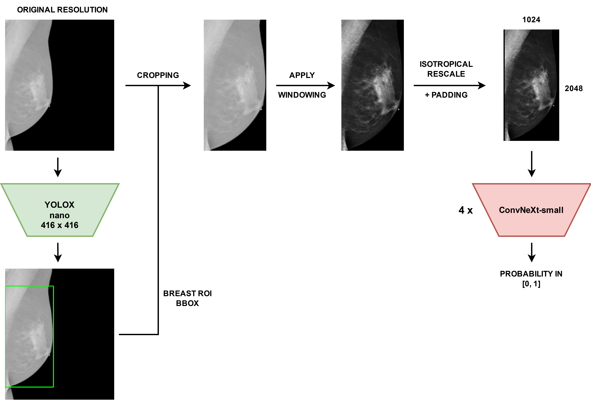
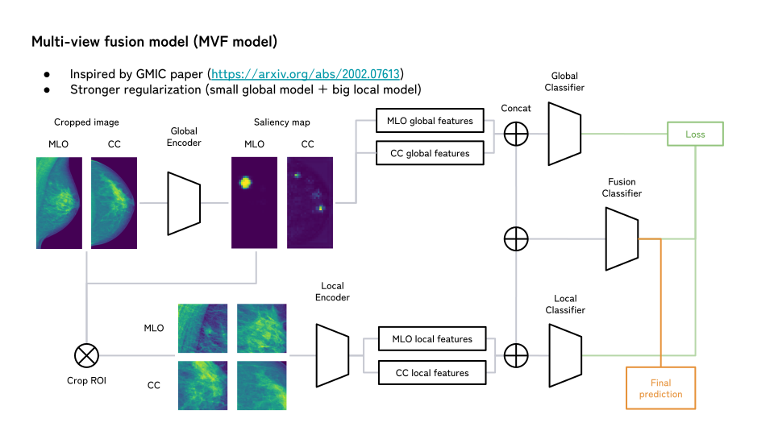
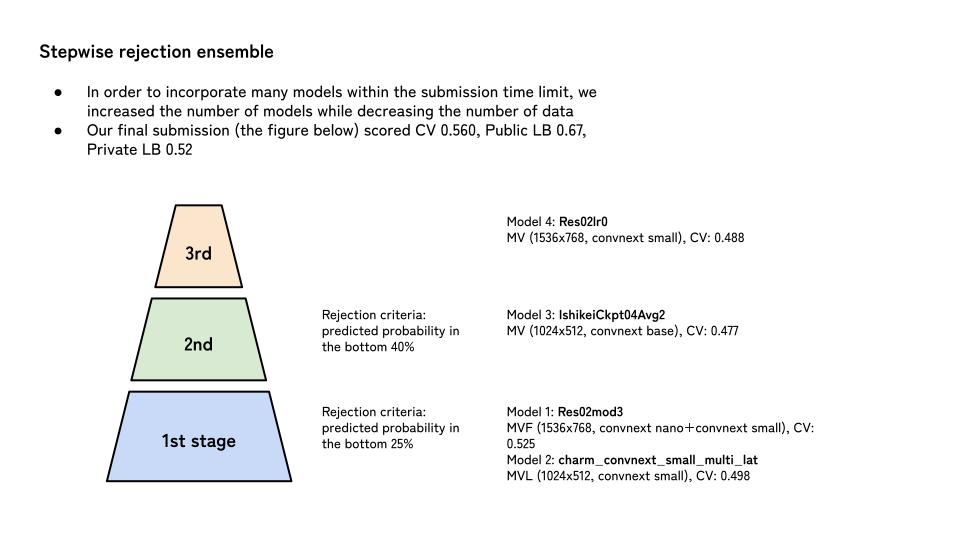

# RSNA 乳腺 X 光筛查深读：不确定指标下的选择游戏

> 赛事：Featured ｜ 主题 cv（医疗影像）｜ 1687 队 ｜ 代码赛 ｜ 指标 Probabilistic F-Score Beta（micro）（2023-02-27 截止）
> 材料基础：`digests/rsna-breast-cancer-detection.md`（8 节：1st/2nd/4th/6th/9th + 乳腺影像入门 + 往届 RSNA 索引 + 硬件实验帖）+ 19 张图（含 3 张 SVG 结构图）
> 深读时间：2026-10（Tier A #17）

## 0. 一句话重述：这道题真正在考什么

题面是"由乳腺 X 光预测癌症"，实际被考的是**在极端不平衡 + 不稳定的概率化指标下，把"数据侧工程 + 阈值/选择"做对**。降解为 5 步：

1. **数据侧工程决定天花板**：DICOM 窗宽窗位 → ROI 裁剪（YOLOX/Faster R-CNN/cv2）→ 分辨率与重采样方法（PIL-Lanczos）→ 多视角/多侧位组织；分辨率与外部正样本是两张大牌；
2. **极不平衡的训练配方**：正样本上采样/平衡采样（众数做法 1:7~1:8、保证每批 ≥1 正样本）+ BCE/EQL 损失 + drop 0.5~0.9 + EMA/大 batch；
3. **外部数据（正样本库）**：1st 用 5 个公开数据集把阳性率从 ~0.5% 拉到 7.38%，F1 +0.02；但 4th/6th 报告"无清晰收益"——用法（预训练 vs 混训）与数据质量决定成败；
4. **pF1 不稳定 → 用代理指标管实验**：PR_AUC/AUCPR/ROC/阈值曲线并行跟踪；损失用 AUCPR/EQL 等不平衡友好目标；
5. **最终选择游戏**：阈值网格（1st 的 0.27–0.40）、模型 vs 集成的取舍（2nd 选高分辨率单模、6th 把私榜最好方案留在场外）、稳 vs 高的取舍（9th 用投票版换稳定性）——**最后一次提交的决策与模型训练同样值钱**。

一句话：**这是一场"数据清洗 + 阈值选择"的比赛**——冠军自己说"简单流水线 + 简单决策 + 运气"，而四个落选的更好方案（2nd 的集成、4th 的 ROI 模型、6th 的私榜 0.53、9th 的高 LB 版）告诉后来者：**在这个指标下，选择纪律比模型上限更能决定名次**。

## 1. 材料与角色

| 帖子 | 作者 | 票数（索引级） | 角色与独有信息 |
| --- | --- | --- | --- |
| [392449](https://www.kaggle.com/competitions/rsna-breast-cancer-detection/discussion/392449)（1st） | Đăng Nguyễn Hồng | 高票 | **外部数据 +0.02 的消融**；YOLOX ROI 全流程与 AP 表；soft positive label 实验；4 折+外部数据训练；阈值 0.27–0.40 网格（600 名→22 名的一天） |
| [391676](https://www.kaggle.com/competitions/rsna-breast-cancer-detection/discussion/391676)（2nd） | sakaku | — | **分阶段分辨率**（1280 外部预训练→1536 无外部微调→多视角）；EQL loss + 辅助头；"分辨率 > 集成"的最终选择；Faster R-CNN 裁到不含乳头的紧框 |
| [391208](https://www.kaggle.com/competitions/rsna-breast-cancer-detection/discussion/391208)（4th） | Dieter | — | **重采样方法学**（PIL-Lanczos）；乳腺级 1D-CNN 组合 + 患者级多视角 Transformer（2 个输出头）；"最后几天才融合，没被公开榜带偏" |
| [390974](https://www.kaggle.com/competitions/rsna-breast-cancer-detection/discussion/390974)（6th） | RabotniKuma 队 | — | MV/MVF/MVL 模型族对照表；AUCPR 代理指标 + AUCPRLoss；**最佳私榜 0.53 因 CV/公开低而未被选** |
| [390966](https://www.kaggle.com/competitions/rsna-breast-cancer-detection/discussion/390966)（9th） | Remek & Andrij | — | 全负面清单最全（约 20 项）；"better than median"集成；投票版换稳定；TTA hflip +0.03；无外部数据 LB 0.63（私榜 0.47/0.50） |
| [369262](https://www.kaggle.com/competitions/rsna-breast-cancer-detection/discussion/369262)（乳腺影像入门） | — | — | BI-RADS 0/1/2 与筛查流程：解释"数据集为何只有 3 类"与标签语义 |
| [369103](https://www.kaggle.com/competitions/rsna-breast-cancer-detection/discussion/369103)（往届 RSNA 索引） | Radek Osmulski | — | 5 场 RSNA 系列赛冠军帖汇总——医学影像赛的横向弹药库 |
| [370333](https://www.kaggle.com/competitions/rsna-breast-cancer-detection/discussion/370333)（硬件帖） | hengck23 相关 | — | "2×A6000 48GB 让设计模型不用怕 OOM"——本场实验规模的硬件注脚 |

**材料缺口（登记备查）**：3rd/5th/7th/8th 等方案未收录（本仓只取高票与代表性方案）；`369262`、`370333` 的正文镜像文件不在本机 `bodies/`（内容经 digest 保留）。

## 2. 逐方案对照矩阵

| 维度 | 1st Đăng | 2nd sakaku | 4th Dieter | 6th RabotniKuma | 9th Remek&Andrij |
| --- | --- | --- | --- | --- | --- |
| 外部数据 | **5 个数据集混训**（9,135 患者/34,341 样本/4,691 阳性=13.66%） | 仅 1 阶段预训练（1280），2 阶段不用 | DDSM/VinDr **预训练无效** | 预训练/伪标签"无清晰提升" | **完全不用** |
| ROI | YOLOX-nano 416（Remek 472 框→自扩 571 图）；Otsu 兜底；全图兜底 | Faster R-CNN 紧框（去乳头）；**最终提交不裁** | 粗 CNN min-filter 去噪裁边 | 训练用 YOLOX 框（更小防过拟合）、推理用规则裁剪省时 | cv2.connectedComponents 裁框 |
| 分辨率流程 | ROI 后各向同性缩放+padding → 2048×1024 | 1280 → 1536（分阶段） | 全图压到 1152；训练随机裁 1024 | 2048 方形 → 2:1（1024×512/1536×768） | 1536×768 |
| 模型 | 4×ConvNeXt-small（4 折+外部） | ConvNeXtV1-small（mmcls）；单视角→双视角→多侧位 | EffNet B3-B5/V2S/V2M + 1D-CNN；SE-ResNeXt/ConvNeXt-tiny + DeiT（患者级） | ConvNeXt（MV/MVF/MVL 变体） | 3×ConvNeXt-small（avg/GEM 池化） |
| 损失/采样 | BCE + soft positive label（0.8/0.9）；正样本上采样 1/7，每批≥1 正 | **EQL loss** + 5 个辅助头（BIRADS/Density/困难负例/View/Invasive） | 辅助分割损失（YOLOv7/CBIS 掩码）+ 辅助分类 | AUCPRLoss + 辅助损失（age/biopsy） | BCE pos_weight 1.0–1.25；Balancer 采样 1:8 |
| 关键成绩 | OOF 最优组合 pF1 0.5187；最终阈值 0.31：LB 0.61 / 私榜 0.55 | 单视角 0.58/0.53；双视角 0.57/0.52 | 两版最高公开＝最高 CV；未披露名次 | 最佳私榜 0.53 未被选 | 集成 LB 0.63 / 私榜 0.47；投票版 0.62 / 0.50 |

## 3. 共识、分歧与裁决

### 共识一：正样本稀缺是首要矛盾，采样与损失必须围绕它设计（全员）

1st：每 epoch 上采样正样本到 pos/neg=1/7，并**保证每批至少 1 个正样本**（"0.5 个/批时训练极不稳定"）；9th：Balancer 采样器（1:8）；2nd：EQL 损失（专为极端不平衡设计）；6th：AUCPRLoss + 平滑代理；4th：辅助损失加速收敛。**没有一家用朴素 BCE + 原始采样直接训**。

**裁决**：医学影像低阳性率场景，"每个 batch 见到正样本"是训练稳定性的底线。置信度高。

### 共识二：pF1 不可直接跟踪，必须用代理指标组合（4/5 家显式）

1st：并行跟踪 PR_AUC（稳定但对先验敏感）/ROC_AUC（稳定但乐观）/best_PF1/最佳阈值；6th：AUCPR 作代理 + AUCPRLoss；9th：probf1/ROC/精确率/召回/MCC 多指标 + 可视化误判；2nd：fold 0 的 pF1 与 CV/LB 强相关后只跑 fold 0。

**裁决**：概率化 F 指标（阈值敏感 + 类别极端不平衡）的实验管理必须靠"多代理指标 + 曲线"而非单一数字；否则每天都会在噪声里做决策。置信度高。

### 共识三：ROI 裁剪是标配，但"怎么裁"分歧巨大

1st：YOLOX-nano（小框、比例稳定），证明 DL 检测器优于规则；6th：训练用 YOLOX 小框（防过拟合），推理用规则（省时）；2nd：Faster R-CNN 紧到不含乳头；9th：cv2 连通域（因许可证从 YOLOv5 换掉）；**反方**：2nd 最终提交放弃裁剪（"乳腺大小本身是信号"，全图微涨且稳定）、4th"ROI-focused 训练无效"。

**裁决**：裁剪对训练效率与早期收益明确（省算力、聚焦纹理），但在足够大的输入下"整图/半整图"可能保留尺寸信号；是否裁剪应作为最终提交的对照实验。置信度中高。

### 分歧一：外部数据到底有没有用？

- 正方：1st 的消融（唯一严格对照）：同流水线同超参，外部数据 **OOF 与私榜都 +0.02**；2nd 用外部预训练把单视角私榜从 0.51→0.53；
- 反方：4th（DDSM/VinDr 预训练无效）、6th（伪标签/外部预训练无清晰提升）、9th（不用外部仍拿 LB 0.63）。

**裁决**：外部数据的收益取决于**用法与质量**——"混训 + 正样本丰富的病理库"（1st 的 5 库 4,691 阳性）有实证增益；"单库预训练"或"标签噪声大的库"收益不稳定。4th/6th 的负面与 1st 的正面并不矛盾（数据组合与阶段不同）。置信度中。

### 分歧二：分辨率 vs 集成

2nd 的最终选择：**放弃集成、押分辨率**（"resolution plays a crucial role"）；4th：更高分辨率"相似或更差 + 推理更慢"；6th：1536×768（MVF）私榜 0.48 vs 1024×512（MV）0.46——分辨率略优；1st：2048×1024 高分辨率 + 4 模型。

**裁决**：分辨率的收益是任务相关的（病灶像素占比极小 → 分辨率即信息量），但受限于显存/推理预算；在算力允许时"高分辨率单模 ≥ 低分辨率集成"（2nd 的明确偏好）。置信度中高。

### 分歧三：平衡采样在"强模型"上失效？

6th 明确指出："正样本加权/过采样/加权采样器……在弱模型上有效，但模型足够好后就不再有用"；1st/9th 仍把平衡采样作为配方核心；2nd 用损失层（EQL）替代采样。

**裁决**：采样与损失是同一问题的两种杠杆；当模型容量/数据质量足够时，收益从"采样"转移到"损失/后处理/阈值"。存在"弱模型靠采样、强模型靠校准"的阶段迁移。置信度中。

## 4. 增量数字账

| 动作 | 数字 | 来源 |
| --- | --- | --- |
| 外部数据消融（唯一严格对照） | 无外部：OOF 0.4921/0.4853、LB 0.60、PL 0.53；有外部：OOF 0.5161/0.5182、LB 0.58–0.61、**PL 0.55–0.56**（+0.02） | 1st |
| 外部数据规模 | 9,135 患者 / 34,341 样本 / 4,691 阳性（13.66%） | 1st 表 |
| 训练集阳性率 | 3 折竞品 + 全部外部 ≈ 5,560/75,400 = 7.38% | 1st |
| soft positive label vs label smoothing | 无清晰优劣（消融表 4 行对照） | 1st |
| 阈值网格（同模型 5 个阈值） | 0.27–0.40：OOF 0.4877→0.5187（0.34 峰）；LB 峰在 0.31（0.61）；PL 0.31/0.34 都为 0.55/0.53 | 1st |
| 组合选择（每折 3–7 ckpt） | 3×5×7×5 = 525 组合；OOF 最优 0.5187 vs 最差 0.4951（同一权重的选择带 = 0.024） | 1st |
| ROI 检测器对照 | YOLOX-nano 416 LINEAR：新 val AP 96.26 / Remek val 94.21（最佳权衡） | 1st |
| 分阶段分辨率（2nd） | 单视角：无外部 0.57/0.51 → 有外部 0.58/0.53；双视角 0.57/0.52；多侧位 0.52/0.53 | 2nd |
| 4th 重采样结论 | PIL-Lanczos/TF-antialias > cv2 系；全图 1152 + 训练随机裁 1024 | 4th |
| 6th 模型族对照 | MVF 1536×768 CV 0.525/公开 0.63；MV 1024×512 CV 0.493/公开 0.64；MVL 私榜 0.50（未选方案私榜 0.53） | 6th |
| 9th TTA/集成 | hflip 加权 TTA +0.03；集成 0.63/0.47；投票版 0.62/**0.50**（更稳） | 9th |

**可复算校验（1 处全链吻合）**：1st 的外部数据表逐项可加：
- 患者 5,000+1,952+1,775+326+82 = **9,135** ✓
- 样本 20,000+7,808+5,202+1,003+328 = **34,341** ✓
- 阳性 226+1,480+2,632+331+22 = **4,691** ✓；4,691/34,341 = **13.66%** ✓

## 5. 机制推演

**M1｜为什么 pF1 是"选择敏感"指标**：pF1 由概率化 TP/FP/FN 定义，对阈值与概率分布形状极敏感；病灶像素占比 <1% 时，模型轻微的过度自信（sharp distribution）就足以改变最优阈值（1st 的"阈值 0.25 vs 0.34"、分布图与 pos_smooth 图）。**推论：任何"只看 OOF 数字"的选模都会在该指标上放大噪声；必须同时看阈值-曲线与分布形状。**

**M2｜外部数据为何能 +0.02**：任务阳性率 ~0.5%，一个 epoch 内模型见到的正样本极少；混入 4,691 个阳性（13.66%）把有效正样本提升一个量级，且跨库多样性提升纹理不变性（1st 的 5 库覆盖 DM/CESM/活检/不同设备）。**边界**：如果外部库标签口径与任务不同（如 BIRADS 4 视为阴性/阳性之争），噪声会抵消收益——1st 自评"BIRADS-4 当阴性可能是错误"。

**M3｜ROI 裁剪的两面性**：裁掉背景让同样显存下的有效分辨率更高（信息密度），且小框抑制"水印/标尺"等 shortcut（6th 明确"更小的框防过拟合"）；但裁框损失"乳腺大小/形状"这一全局信号（2nd 的最终全图微涨），且规则裁剪的稳定性与许可证问题（9th 弃 YOLOv5、1st 用 YOLOX + 兜底）都是工程考量。

**M4｜为什么"每批 ≥1 正样本"稳定训练**：极端不平衡下，若一个 batch 无正样本，梯度全部来自负样本，会把预测压向全负；正样本上采样 + 平衡采样器保证每个梯度步都有正类方向，等价于对正样本做"时间上的均匀回报"（1st：0.5 正/批 → 不稳定；≥1 → 稳定）。

**M5｜阈值选择=第二场比赛**：1st 的阈值表显示 OOF 最优（0.34）与 LB 最优（0.31）不一致，私榜最优（0.55）在 0.31；他靠"提交 4 个阈值"覆盖不确定性。**机制**：阈值映射的概率分布随数据/模型/预处理漂移，OOF 的最优阈值不是 LB 的稳定估计；多提交 + 保守网格是低成本对冲。

**M6｜"更好的模型没被选"是系统性现象**：6th 的私榜 0.53 方案因 CV/公开低被弃；2nd 弃集成押单模；9th 弃高 LB 押稳定版；4th 公开最高的融合也是 CV 最高。**在 pF1 这种噪声指标上，最终名次 ≈ 选择决策的质量 × 运气**；作者们的共同建议是"用 CV 纪律约束选择，别被公开榜带偏"。

## 6. 证据分级

| 断言 | 等级 | 说明 |
| --- | --- | --- |
| 外部数据 +0.02（同流水线对照） | **自述（强）** | 唯一严格消融；4 行表 OOF/LB/PL 齐全 |
| 外部数据表加总 | **可复算** | 患者/样本/阳性三项加总全部吻合 |
| 阈值表与 525 组合选择带 | **可读取（帖内表）** | 同模型多阈值完整 |
| 6th 的 MV/MVF/MVL 对照 | **可读取（表）** | CV/公开/私榜三列 |
| 9th 的 TTA +0.03、集成/投票对照 | **自述** | 无重复实验 |
| 4th 的"重采样研究" | **二手文献 + 自述** | 引用论文结论 + 自家对比 |
| 2nd"分辨率 > 集成" | **自述（决策记录）** | 无消融数字 |
| 4th/6th 的外部数据无效 | **自述（负面）** | 与 1st 正面不矛盾（用法不同） |

## 7. 边界条件与反事实

- **指标驱动一切**：换 AUC 类指标，本场的"阈值选择""pF1 代理"两大主线都会消失；换阳性率更高的数据（如诊断而非筛查），采样与外部数据收益都会下降（6th 的"强模型上采样失效"）。
- **反事实（6th）**：若选私榜 0.53 的方案，名次会更好——**选择规则（CV+公开双高）在噪声指标下会系统性丢弃高私榜方案**；这是幸存者偏差的反面案例。
- **反事实（2nd）**：若用集成+低分辨率（其团队直觉中的另一条路），私榜大概率低于 0.53——"分辨率 > 集成"的押注被结果支持。
- **反事实（1st）**：若只提交 OOF 最优阈值 0.34（LB 0.58），名次会显著下降；多阈值网格（覆盖 0.27–0.40）是他 600→22 的直接原因。**在指标噪声大于模型差异时，提交策略本身就是分数。**
- **工程边界**：数据量（DICOM 数千张 3000×5000）+ 显存（2×A6000/A100）+ 时间（1st 最后一天完成训练）共同约束方案；9th 甚至要在推理窗口内做两段式（j2k/非 j2k）处理与删文件。

## 8. 悬案与失败学

**悬案**

1. **外部数据的收益边界**：1st 的 +0.02 是特定 5 库组合；4th/6th 的负面说明其条件性（库组合/阶段/标签口径）——没有系统消融；
2. **多视角/多侧位到底值多少**：2nd 的双视角略降公开（0.57）、多侧位私榜持平（0.53）；4th 的患者级 Transformer 与 6th 的 MVL 都没有决定性优势——"视角关系建模"的收益不稳定；
3. **阈值迁移的规律**：OOF 最优阈值与 LB 最优阈值系统性偏差方向未定论（1st 猜 LB 阈值更高，结果错在另一侧）。

**失败学（负面清单精选）**

| 失败 | 来源 | 教训 |
| --- | --- | --- |
| 正样本加权/过采样/加权采样器（强模型阶段） | 6th | 采样收益随模型变强而消失；弱模型配方不能惯性沿用 |
| Focal loss / label smoothing | 6th/9th | 分散了有效信号；vanilla BCE 够用 |
| Mixup | 2nd/6th | 影像任务无效 |
| 外部预训练（DDSM/VinDr 单库） | 4th/6th | 单库预训练收益不稳定 |
| 训练"聚焦 ROI"的模型 | 4th | 丢失乳腺整体信息；整图反而更稳 |
| 更高分辨率（无 ROI 支撑） | 4th | 相似或更差 + 更慢；分辨率收益需要 ROI/重采样配套 |
| 规则裁剪（cv2）替代检测器 | 2nd | 效果差于学习式裁剪（但推理可用作兜底） |
| 多侧位/双视角训练 | 2nd | 公开分略降；关系建模未成熟 |
| SWA/EMA、AdamW/SGD/NAdam/Lion/Lamb、层冻结、PatchGD、配对训练、元模型、伪标签、>2 视角选择…… | 9th（约 20 项） | 医学影像的"技术清单"大部分在本任务上无效；简单 CNN+TTA+集成就到 0.63 |

## 9. 图表证据

> 路径相对本文件（`analysis/deep/`）：`../../intel/rsna-breast-cancer-detection/bodies/<topic>_img/NN.ext`

**图 1：1st 的 ROI 与预处理全流程**（topic 392449）——`../../intel/rsna-breast-cancer-detection/bodies/392449_img/01.jpg`

*读图结论*：原图（3000×5000 级）→ YOLOX-nano 416 检测乳腺框 → 裁剪 → 窗宽窗位 → 各向同性缩放 + padding 到 1024×2048 → 4×ConvNeXt-small → 概率。**"检测器给的是更紧、比例更稳的框"是 1st 弃规则方法的原因。**

**图 2：1st 的 GPU 推理流水线**（topic 392449）——`../../intel/rsna-breast-cancer-detection/bodies/392449_img/02.png`

*读图结论*：DALI 解码 → uint16/float32（GPU）→ 归一化 → interpolate 到 416 → GPU YOLOX（失败时 CPU Otsu 兜底）→ crop/windowing（torch，GPU）→ interpolate + padding → 8-bit PNG 落盘。**把大数组运算全部留在 GPU，是"最后一天跑完 4 折训练 + 5 次提交"的工程底座。**

**图 3：1st 的 PR 曲线与预测分布（阈值选择证据）**（topic 392449）——`../../intel/rsna-breast-cancer-detection/bodies/392449_img/07.png`

*读图结论*：标题即结论——**MAX f1=0.5182 @ th=0.34**（prec 0.6099 / recall 0.4512 / pr-auc 0.4912）；左图按 site_id 分色（两个站点的 PR 曲线形态不同，提示站点分布差异），右图为 neg/pos 预测分布（阴性集中在 0 附近、阳性长尾）。这解释了为何阈值在站点间不可直接迁移。

**图 4：2nd 的单视角模型（辅助头设计）**（topic 391676）——`../../intel/rsna-breast-cancer-detection/bodies/391676_img/01.png`

*读图结论*：图像 → backbone → features → 癌症头 + 辅助头（BIRADS/Density/困难负例/View/Invasive 等，权重 0.1）。辅助损失是其"更多训练 epoch + 更快收敛"的关键。

**图 5：2nd 的多侧位双视角模型（4 图输入）**（topic 391676）——`../../intel/rsna-breast-cancer-detection/bodies/391676_img/03.png`

*读图结论*：L_CC/R_CC 特征拼接→FC；L_MLO/R_MLO 拼接→FC；Meta info→FC；三者再拼接→癌症头。**设计意图是让模型在同一患者左右/两个视角间做一致性比较**；作者认为该方向"有潜力但未调优"（多侧位私榜 0.53，未超过单视角）。

**图 6：4th 的乳腺级 1D-CNN 两阶段结构**（topic 391208）——`../../intel/rsna-breast-cancer-detection/bodies/391208_img/02.png`

*读图结论*：Stage 1 单图 → backbone → 辅助头（Aux×0.8 + Cancer×0.2）；Stage 2 乳腺多图 → 冻结 backbone → Gap 层 → **对每对视角组合做 1D-CNN（核 2）→ 线性层 → 每侧乳腺平均 logits**。这是"先单图、再组合"的轻量多视角方案。

**图 7：4th 的患者级多视角 Transformer**（topic 391208）——`../../intel/rsna-breast-cancer-detection/bodies/391208_img/04.png`

*读图结论*：4 张视图（MLO L/R + CC L/R，1024²）→ CNN → 4×(32,32,1024) → conv2d → 4×(16,16,384) → flatten+concat 成 1×(1025,384) 序列 → Transformer → **[0,1]²（左右各一预测）**。用图块 token 显式建模"视角一致性 + 左右差异"，Stage 1 冻结 backbone 先让 Transformer 适配。

**图 8/9：6th 的模型结构与集成流程（SVG）**（topic 390974）——`../../intel/rsna-breast-cancer-detection/bodies/390974_img/03.svg`、`.../04.svg`

*读图结论*：03 为其模型结构示意（帖子共三张，对应 MV/MVF/MVL 系列；SVG 无文字层，细节以正文对照表为准）；04 为集成流程（其最佳私榜 0.53 的方案因 CV/公开偏低未被选中）。另 `01.svg`、`02.svg` 为同系列结构图，未逐一内嵌。

## 10. 对既有笔记/playbook 的修订点

1. `notes/cv/rsna-breast-cancer-detection.md` 升级：补齐 8 节作者/角色；方案谱系扩为 5 方案对照矩阵；新增外部数据消融（+0.02）、阈值选择、ROI 分歧、代理指标、负面清单与图证。
2. `playbook/cv.md`（医学影像节）增补：
   - **DICOM → ROI → 分辨率/重采样**标准流水线（PIL-Lanczos；窗宽窗位；GPU 化推理）；
   - **极端不平衡训练配方**（每批≥1 正样本；EQL/AUCPR 损失；强模型阶段采样失效的警戒）；
   - **pF1 类指标的实验管理**（多代理指标 + 阈值曲线 + 分布形状；阈值网格提交）；
   - **外部数据的条件性使用**（混训 vs 预训练；标签口径）。
3. `playbook/00-通用方法论.md` 增补："**选择即分数**"——噪声指标下，最终提交的取舍（阈值/模型/稳定性）与训练同等重要；"更好的模型没被选"是可重复的失败模式（6th/2nd/9th 三例）。

## 11. 出处

- 1st（Đăng Nguyễn Hồng）：https://www.kaggle.com/competitions/rsna-breast-cancer-detection/discussion/392449
- 2nd（sakaku）：https://www.kaggle.com/competitions/rsna-breast-cancer-detection/discussion/391676
- 4th（Dieter）：https://www.kaggle.com/competitions/rsna-breast-cancer-detection/discussion/391208
- 6th（RabotniKuma 队）：https://www.kaggle.com/competitions/rsna-breast-cancer-detection/discussion/390974
- 9th（Remek & Andrij）：https://www.kaggle.com/competitions/rsna-breast-cancer-detection/discussion/390966
- 乳腺影像入门：https://www.kaggle.com/competitions/rsna-breast-cancer-detection/discussion/369262
- 往届 RSNA 冠军索引（Radek Osmulski）：https://www.kaggle.com/competitions/rsna-breast-cancer-detection/discussion/369103
- 硬件实验帖：https://www.kaggle.com/competitions/rsna-breast-cancer-detection/discussion/370333
- 未收录缺口（登记备查）：3rd/5th/7th/8th 等方案
