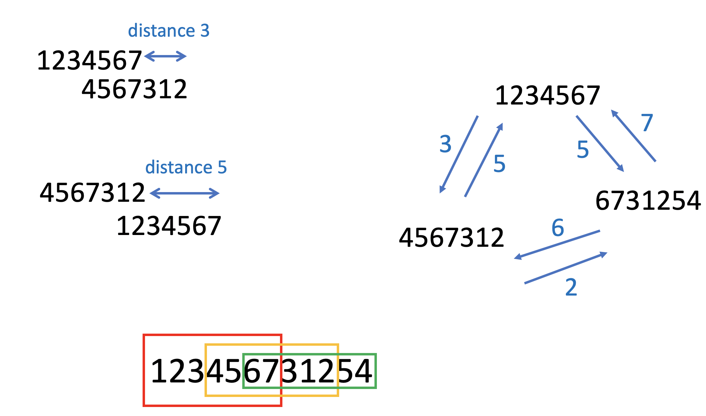

# Santa 2021 - Superpermutations 轻量深读（Tier B）

> 赛事：Featured ｜ 主题 sim-agent（组合优化，超级排列变体）｜ 867 队 ｜ 标准赛 ｜ 指标：三条字符串总长度（越小越好，含最多 2 个通配符 ★）
> 材料基础：`digests/santa-2021.md`（6 篇正文：3rd 300509 / 4th 手作 300543 / 解析解 288124 / TSP 基线 288995 / 下界 294139 / "至少 2440" 292841；80 条主题索引）+ 4 张图
> 轻读时间：2026-10（Tier B B09）

## 1. 一句话重述与数字账

构造 3 条字符串，使 7!=5040 个排列都出现，且 120 个 `12xxxxx` 排列必须在三条中都出现（最多用 2 个通配符 ★），总长度最小。真正的考点是**"把组合问题规约成可精确求解的 ATSP"**：固定"每个排列归属哪条字符串"后，每条字符串就是一个约 1760 顶点的**非对称 TSP**，LKH/Concorde 能直接求最优；剩下的功夫全在"如何分配/切分 2-循环"，社区甚至用 Concorde 的 LP 松弛证明了**非通配解的下界 2440**。

| 关键数字 | 值 | 来源 |
| --- | --- | --- |
| 3rd（300509） | 先做无 ★ 版本：固定排列归属 → 每条约 (5040+240)/3 ≈ **1760 顶点的 ATSP**（LKH/Concorde 可最优求解）；用 **2-循环**（120 个，每个含 1 个强制排列）按 40/40/40 分配 → **2480**；发现"未分到某 2-循环的字符串会用代价 7 的边去覆盖其强制排列" → **切分 2-循环**（把能 1 步到 `12xxxxx` 的邻居分给其他两条）→ **2440（无 ★）**；再加"按 n=5 的 2-循环顺序构造 n=7 的 2-循环" + "随机选两个强制排列把首个 1 换成 ★" → **2430（用 ★）**；文中还转述 eijirou 的**非 TSP 构造**：把 2-循环尾部删掉后以 3-边接到另一 2-循环的分组，块代价 56、两端两字母重叠后记 54，40 块 + 40 个强制排列（代价 7）= **2440**，用两个 ★ 可到 2435 | 300509 |
| 4th（300543，"by hand"） | 手工构造 **2440（无 ★）**：核心观察是"120 个 `12xxxxx` 不是浪费"——它们本身可充当 2-循环的一部分；用固定 1/2 的 120 个循环串（长度 45，去重后）分配成三条各 40 段 + 120 个 `12xxxxx`（7×120=840），总长 45×40+840=2640，再通过首尾合并压到 **2440**；随后用通配符做到 **2428**（帖题） | 300543 |
| 解析解帖（288124，49 票） | 背景科普：最小超级排列问题（n≤5 已知 Σi!；n=6 比 Σi! 少 1，仍未知）；本题是其变体，可表示为 n! 顶点图的 TSP | 288124 |
| TSP 基线（288995） | 把每个排列当"城市"，边权 = 重叠长度（**非对称**：1234567→4567312 距离 3，反向 5），用 **LKH-3** 起步，LB≈2500（图 1） | 288995 |
| 下界（294139，57 票） | 用 TSP 验证 2440 下界：**5281 顶点 ATSP**（5040 排列 + 240 份 1-2 排列副本 + 1 个 depot；同 1-2 排列副本之间代价 7，depot 到各点 7、各点到 depot 0），任意 Santa 解可拼成该 TSP 的解且代价 ≤ 三串总长；**Concorde 的 LP 松弛得 7320（精确算术验证）→ 下界 7320/3 = 2440**（非通配） | 294139 |
| 社区侧 | "至少 2440（无通配）"（67 票）、"2429 已死，2428 长存"（40 票）、"用可视化解决"（45 票）、"美妙的对称性"（40 票）、"资源与论文"（65 票） | 社区 |

## 2. 逐方案对照矩阵

| 维度 | 3rd | 4th | 社区（下界） |
| --- | --- | --- | --- |
| 方法 | ATSP（LKH/Concorde）+ 2-循环分配/切分 | **纯手工构造 + 枚举辅助** | ATSP + Concorde LP 松弛 |
| 关键量 | 2-循环 120 个 → 40/40/40 | 45 长度循环段 ×40 + 120×7 | 5281 顶点 ATSP |
| 结果 | 2440（无★）→ **2430（有★）** | 2440 → **2428（有★）** | **2440 下界（无★）** |
| 洞见 | 未分配的 2-循环迫使代价 7 边 | "12xxxxx 不是浪费" | 下界由 LP 松弛精确验证 |

## 3. 共识、分歧与裁决

### 共识一：规约成 ATSP 是核心突破（3rd/TSP 帖/下界帖）

TSP 基线帖把"重叠"变成非对称距离；3rd 进一步固定归属把 5040+240 个顶点切成三条 ~1760 顶点的 ATSP（可直接最优求解）；下界帖用 5281 顶点 ATSP 的 LP 松弛证明 2440。**裁决**：组合构造题的第一步是"找到能把问题交给成熟求解器（LKH/Concorde）的规约"；规约的代价是必须处理"归属/切分"这层组合自由度。置信度：高。

### 共识二：2-循环结构决定分配质量（3rd/4th/社区）

3rd 用 2-循环做分配与切分（2480→2440）；4th 手工利用"12xxxxx 是 2-循环的一部分"构造出 2440；社区帖讨论"对称性"与 2428/2429 的攻防。**裁决**：这类超级排列问题的自由度几乎都藏在 2-循环的分配方式里；"把结构讲清楚"比随机搜索更有效。置信度：高。

### 共识三：下界把"是否最优"变成可回答问题（下界帖 + 40 票帖）

非通配解的下界 2440 由 Concorde 精确验证，且多队构造出了等于下界的解（2440 就是非通配最优）；瓶颈转移到"★ 能省多少"（社区做到 2428，3rd 2430）。**裁决**：优化赛的首要产出是"可信下界 + 匹配上界"，它决定后续努力的方向与停止条件。置信度：高。

### 分歧一：TSP 求解 vs 手工/解析构造

3rd 走 ATSP；4th 手工 + 枚举；eijirou 提出完全不用 TSP 求解器的构造式（2440/2435）。**裁决**：两者互补——解析/手工构造提供"结构模板"，TSP 在固定结构内做最优填充；顶级成绩往往是两者结合。置信度：中高。

### 事件：通配符 ★ 的边界（40 票帖 + 4th）

"2429 已死，2428 长存"记录社区在 ★ 上的竞速；下界 2440 只适用于非通配解。**裁决**：特殊道具（★）会改变下界的适用范围，须分别建立"含/不含道具"的下界。置信度：中高。

## 4. 证据分级

| 断言 | 等级 | 说明 |
| --- | --- | --- |
| 3rd 的 ATSP 规约、2-循环切分与分数链 | 自述 + 伪代码 + 图 | 高 |
| 4th 的手工构造与 2440 推导 | 自述（可手工复核） | 中高 |
| 2440 下界的 LP 松弛证明 | 下界帖（Concorde 精确算术验证） | 高 |
| TSP 基线（LKH-3） | 公开 notebook | 高 |
| 2428 的社区记录 | 高票帖 | 中 |

## 5. 悬案与缺口（登记）

- 1st/2nd 与 5th–10th 的方案未入库（4th 是"by hand"帖，最高票的解法细节在别处）；
- 含 ★ 的下界未给出（2440 只适用于非通配解）；
- "用可视化解决"（45 票）与"对称性"（40 票）两帖未细读；
- 归档 4 图：TSP 规约图（图 1）与 3rd 的 3 张块结构图为图证。

## 6. 图表证据

**图 1**（topic 288995）：把排列当"城市"的规约——`1234567→4567312` 距离 3，而反向 `4567312→1234567` 距离 5（**非对称**），三城市间的距离分别为 3/5/7 与 6/2；底部展示三条排列在字符串中的重叠（红/橙/绿框 = 三个排列），这正是"总长 = 重叠浪费之和"的直观来源。

## 7. 出处

- 3rd（39 票）：https://www.kaggle.com/competitions/santa-2021/discussion/300509
- 4th by hand：https://www.kaggle.com/competitions/santa-2021/discussion/300543
- 解析解与背景（49 票）：https://www.kaggle.com/competitions/santa-2021/discussion/288124
- TSP 基线：https://www.kaggle.com/competitions/santa-2021/discussion/288995
- 2440 下界（57 票）：https://www.kaggle.com/competitions/santa-2021/discussion/294139
- 至少 2440（67 票）：https://www.kaggle.com/competitions/santa-2021/discussion/292841
