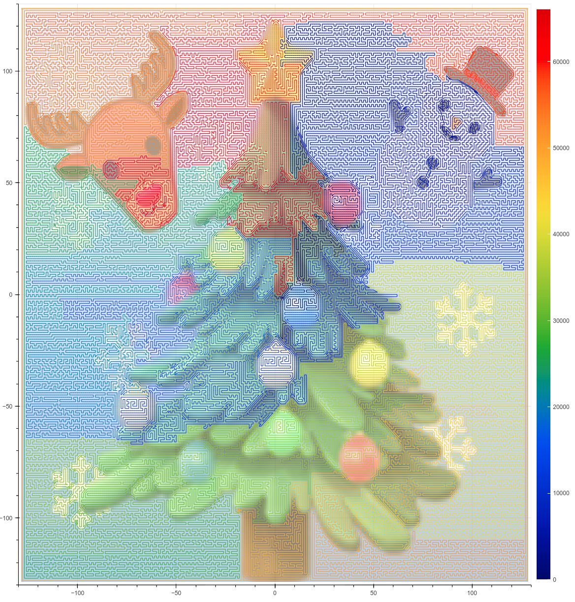

# Santa 2022 - The Christmas Card Conundrum 轻量深读（Tier B）

> 赛事：Featured ｜ 主题 sim-agent（组合优化，TSP + 机械臂逆运动学）｜ 874 队 ｜ 标准赛 ｜ 指标：总成本（路径 + 颜色 + 机械臂重构）
> 材料基础：`digests/santa-2022.md`（6 篇正文：1st 379167 / 2nd 379086 / 4th 379080 / 9th 379150 / Web Visualizer 369788 / 另一可视化 717 行处；80 条主题索引）+ 6 张图
> 轻读时间：2026-10（Tier B B09）

## 1. 一句话重述与数字账

用圣诞老人的"可重构机械臂"走遍 257×257 卡片的每个像素（颜色成本 + 移动成本 + 机械臂重构成本）。真正的考点是**"路径与构型的解耦"**：先在像素图上解带路径依赖约束的 TSP，再把这条路径"提升（lift）"为合法机械臂构型；顶端三队的最终分数都落在 **74075.7** 附近，而社区给出的 TSP 下界是 74073.73——差距只有约 2 分。

| 关键数字 | 值 | 来源 |
| --- | --- | --- |
| 1st（379167） | 两段式：① **带路径依赖约束的 TSP**（66049 个像素）用 **GA-EAX-restart**（edge assembly crossover，已知能刷大型 TSP）；把 4 条"构型可行性"约束（x<0 前需 ≥64 步 y 向移动；2x < 总 y 位移；四个对角点不能直线相连；跨象限需 ≥128 步）以**罚分**形式加进适应度，让种群逐渐淘汰违规路径；工程：并行化、可指定初始种群与自动保存/合并（支持断点续跑与 restart）、**成本用 64/128 位整数**、只保留距离矩阵的必要元素省内存；② **构型恢复**：DP 建 3D 表（step × 32 臂构型 × 64 臂构型，约 9×10^9 规模，C++ 几秒算完）判定可行，再用**束宽 500 的 beam search**（优先"更靠角"的构型、无解时回退数百步并加倍束宽）恢复构型；LB 第一名的解"在 30 vCPU 上不到一天就算出" | 379167 |
| 2nd（379086） | 同样的"先 TSP 后 lift"分解；作者把机械臂看成"嵌套滑块"来推可行性条件；**自写 C++ lifting 程序**（Ryzen7 桌面机 15 分钟内把可 lift 的路径转成解）；发现"**可 lift 是软约束**"——硬约束集中在原点附近（首/末段在 x≥0 半空间的停留时长），用**逐步加大罚分的自定义 TSP 求解器（LKH3 与自写解法的混合）**得到约 74076 的可 lift 路径；最后用 **IPT 合并 + 有限遗传算法**把分数推到 **74075.706541**（"从 76 到 75.706541 用了不到 30 分钟"） | 379086 |
| 4th（379080） | TSP 用 **Concorde + 遗传算法**求解约束版，再转换为构型（74083）；给出的三类"非最长臂"约束：① 太早画 x<128 的左半区；② 太早向右走（初始构型全向左右，首步只能上下）；③ **沿外圈第二圈像素走**（图像 resize 导致最外圈偏暗、第二圈偏亮，纯 TSP 会沿它走，但构型成本对不上） | 379080 |
| 9th（379150） | LKH v3 先出纯 TSP（≈74075）→ 用自写"家居版 LK"（PyPy3 提速约 10×）在**最小化约束罚分与颜色成本**的同时局部改进，必要时人工目测修路径；最后再搜索构型；附带可视化 GIF | 379150 |
| 社区侧 | "**Web 可视化器**"（107 票，最高票）、"如何做到 76000 以下"（88 票，配方帖）、**"TSP 下界 74073.7278"**（42 票）、"用最小生成树求下界"（36 票）、"用 Numba 加速"（30 票） | 社区 |

## 2. 逐方案对照矩阵

| 维度 | 1st | 2nd | 4th | 9th |
| --- | --- | --- | --- | --- |
| TSP 求解器 | **GA-EAX-restart**（自改） | LKH3 + 自写混合（罚分递增） | **Concorde + GA** | LKH v3 + 家居版 LK（PyPy） |
| 约束处理 | 4 条罚分约束 | "可 lift 是软约束"（原点附近硬） | 3 类构型/图像伪影约束 | 罚分最小化 + 人工修 |
| 构型恢复 | **DP（32/64 臂）+ beam 500** | 自写 C++ lifting（A→E 分段） | 转换程序 | 自写搜索 |
| 分数 | 74075.7 档（LB 1st） | **74075.706541** | 74083 | — |
| 工程 | 64/128 位整数、种群保存/合并 | 15 分钟 lift/机 | Concorde | PyPy 提速 10× |

## 3. 共识、分歧与裁决

### 共识一：解耦成"TSP + lift"是全场标准范式（1st/2nd/4th/9th）

四队都先在像素空间求路径，再恢复机械臂构型；1st/4th 明确"构型自由度很高（同一位置有海量等价构型），所以 lift 通常可行"。**裁决**：机械臂/构型类优化题应把"几何路径"与"构型可行性"分成两层，把构型约束以**罚分**形式注入外层搜索，而不是在巨大的联合空间里搜索。置信度：高。

### 共识二：约束的核心在原点与象限（1st/2nd/4th/9th）

1st 的四条约束、2nd 的"硬约束集中在原点附近的首末段"、4th 的"太早向左/向右"、9th 的"跨象限需 ≥128 步"都指向同一结构：**起始构型 + 64 臂转向能力**限制了路径在原点附近与象限切换的方式。**裁决**：这类题先围绕"初始/终止条件"推导可行性约束，再向外扩。置信度：高。

### 共识三：接近下界时"合并已有解"比继续搜索更有效（2nd/下界帖）

社区给出 **TSP 下界 74073.7278**；2nd 最终靠 IPT 合并早期收集的大量路径（"30 分钟内从 76 到 75.706541"）；1st 也实现了种群保存与合并。**裁决**：优化赛后期应把策略从"继续探索"切到"合并/复用历史最优解"，并以下界衡量剩余空间。置信度：高。

### 分歧一：TSP 求解器选择（GA vs LKH vs Concorde）

1st 押 GA-EAX（理由是"路径依赖约束实现简单 + 大规模表现好 + 目标函数调用次数少"）；2nd 用 LKH3 与自写混合；4th 用 Concorde+GA；9th 用 LKH3 + 自写 LK。**裁决**：带自定义路径约束时，**能自然容纳罚分的求解器（GA-EAX/自写 LK）**比纯精确求解器更灵活；Concorde/LKH 用于生成高质量无约束候选池。置信度：中高。

### 事件：可视化与社区工具（107 票 Web Visualizer）

可视化工具成为最高票帖；1st 也附了路线可视化（图 1）与"最优路线"。**裁决**：几何优化赛里"把解画出来"既是调试工具也是社区协作媒介，值得早做。置信度：中高。

## 4. 证据分级

| 断言 | 等级 | 说明 |
| --- | --- | --- |
| 1st 的 GA-EAX + DP/beam 与约束清单 | 自述 + 开源代码 + 路线图 | 高 |
| 2nd 的 74075.706541 与合并过程 | 自述 + 代码 | 高 |
| 4th 的 Concorde+GA 与三类伪影/构型约束 | 自述 + 可复现 notebook | 中高 |
| TSP 下界 74073.7278 | 社区帖（计算方法可查） | 中高 |
| 9th 的 PyPy 提速与人工修路径 | 自述 + 视频 | 中 |

## 5. 悬案与缺口（登记）

- 3rd/5th–8th 的方案未入库；"如何 76000 以下的配方"（88 票）与"下界"（42/36 票）未细读；
- 1st 的"LB 第一"具体分数未给（只说 74075.7 档）；
- 各队对"最优性"的判断依赖下界与互相比分，缺乏官方最优证明；
- 归档 6 图：1st 的最优路线图（图 1）、9th 的动画、Web 可视化器截图为图证。

## 6. 图表证据

**图 1**（topic 379167）：最终路线覆盖 257×257 卡片的全部像素，颜色表示路径时间（0→60000）；可见大量"蛇形"填充与沿图像边界的处理——这是"先 TSP 后 lift"策略的成品证据，也直观展示了为何"外圈第二圈"这类路径细节会显著影响成本。

## 7. 出处

- 1st（80 票）：https://www.kaggle.com/competitions/santa-2022/discussion/379167
- 2nd（81 票）：https://www.kaggle.com/competitions/santa-2022/discussion/379086
- 4th（73 票）：https://www.kaggle.com/competitions/santa-2022/discussion/379080
- 9th（30 票）：https://www.kaggle.com/competitions/santa-2022/discussion/379150
- Web Visualizer（107 票）：https://www.kaggle.com/competitions/santa-2022/discussion/369788
- TSP 下界（42 票）：https://www.kaggle.com/competitions/santa-2022/discussion/378537
