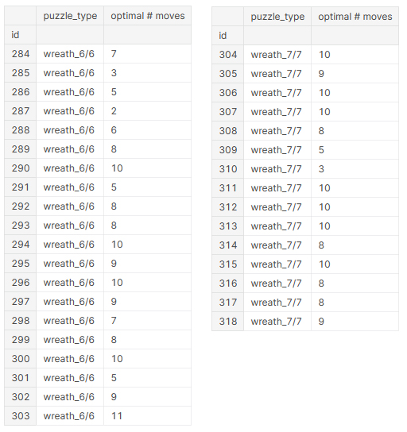
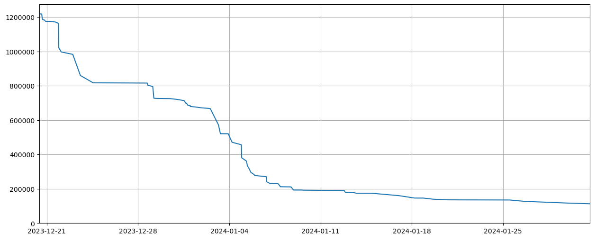

# Santa 2023 - The Polytope Permutation Puzzle 轻量深读（Tier B）

> 赛事：Featured（Santa 年度赛）｜ 主题 sim-agent（置换谜题优化）｜ 1054 队 ｜ 标准赛 ｜ 指标：Santa 2023 Metric（各谜题移动数之和，越低越好）
> 材料基础：`digests/santa-2023.md`（6 篇正文：1st 125 / 上手帖 98 / 4th 64 / 最优 wreath 39 / 16th 33 / 直接 ML 思路 29；另有 A* 搜索 29、Heuristic Transformer 27 等未收录正文；80 条主题索引）+ 3 张图
> 轻读时间：2026-10（Tier B B01）

## 1. 一句话重述与数字账

给定置换谜题（cube/wreath/globe）的初始态、目标态与每个动作的置换表，输出最短移动序列（各题移动数求和）。真正考的是**"小状态精确搜索 + 大状态代数构造 + 序列级算术"**：

| 层次 | 方法 | 数字 | 来源 |
| --- | --- | --- | --- |
| 小状态 | BFS/双向 BFS（BBFS）/约束规划 | wreath_6/6 最优 **150**（2–11 步）、wreath_7/7 **128**（3–10 步，ortools CP）；wreath_12/12/21/21 也可最优 | 最优帖+16th |
| 中状态 | 掩码+自适应迭代 BBFS（IBBFS/AIBBFS） | 适用于 globe 1/8、2/6、3/4、6/4、6/8（16th 自评最佳） | 16th |
| 大状态 | 3-rot/commutator+conjugate 库 | 1st：3-rot 序列（8–14 步）；16th：数千万条可交换对数据库（8–10 步 commutator） | 1st/16th |
| 序列算术 | 抵消、任意时刻插入、orbit TSP 排序 | 1st 的"插入 3-rot 到任意时间点"核心；16th 把 orbit 排序建成 ATSP 最大化抵消 | 1st/16th |
| 通配符 | 背包（跳过哪些 orbit） | #277 有 **176 个 wildcards（8%）** | 16th |
| 成绩 | 1st：cube_10 的 #272 用 **454 步**（gif）；4th 总计 **64,423**；16th 总计 **112,907**（小谜题已知最优） | 1st/4th/16th |

## 2. 逐方案对照矩阵

| 维度 | 1st | 16th（Always Day Zero） | 4th |
| --- | --- | --- | --- |
| 小谜题 | （聚焦 cube/globe） | BFS/BBFS 最优 + 大内存压缩状态 | 仓库+逐谜题分数表 |
| 中/大 globe | 3-rot + 簇分解 | IBBFS/AIBBFS；大 globe 两阶段（贪心 BFS 单步 + commutator 库） | 未详述 |
| cube | 簇分解 + 特殊部件优先 + 3-rot 插入 | prefix + 每 orbit commutator 求解 + 背包 + ATSP | 未详述 |
| wreath | 主动降优先级（权重低、beam search 即可） | beam search 级别 | 已拿到小尺寸最优 |
| 总计 | 1st | **112,907** | **64,423**（cube 50,651 / globe 12,610 / wreath 1,162） |

## 3. 共识、分歧与裁决

### 共识一：大谜题的核心是"只动少数块"的代数构造（1st/16th）

每个动作影响大量块 → 直接应用只能"大致有序"；必须构造只交换 3 块的序列（3-rot/commutator）：cube 例 `d3.f2.d2.-f2.-d3.f2.-d2.-f2`，globe 例 `f0.r0.f0.r1.f0.-r1.f0.-r0`；用簇（cluster）分解 + BFS 枚举所有最短 3-rot（最长 14 步）。**裁决**：置换谜题的通用解法 = 特殊部件先解 + 把剩余簇调成偶置换 + 3-rot 收尾。置信度：高。

### 共识二：小状态用精确搜索，并尽量证明最优（16th/最优帖）

BBFS 让 wreath_12/12 首次可解（省 RAM、快于单向 BFS）；wreath_6/6、7/7 用 CP/ortools 得最优（150/128）。**裁决**：能精确就精确；最优值本身是压缩其他谜题搜索空间的先验（如小 wreath 可作为子程序）。置信度：高。

### 共识三：序列级优化与群论构造同等重要（1st/16th）

1st：把 3-rot 插入到序列任意时间点（而非只追加），并利用首尾抵消；16th：把 orbit 解的顺序建成 ATSP 最大化抵消、用背包跳过通配符可省的 orbit。**裁决**：解出"每个子问题"只是中点；**顺序/插入/抵消**决定最终步数。置信度：高。

### 分歧/对照：直接 ML 预测距离（466399）未成为获胜路线

思路：训练模型预测"到目标态的距离"，再贪心选减小距离的走法；CatBoost 在小谜题可行、训练集变小即退化；状态采样/哈希/主动学习均为开放问题。**裁决**：在动作置换已知、可精确搜索的场景，代数构造+搜索显著优于学到的启发式；ML 距离函数更适合作为大状态搜索的启发式补充（本场未见成功案例）。置信度：中高。

### 事实：策略性放弃低权重谜题（1st）

wreath 总分权重低且 beam search 已足够 → 1st 明确降低其优先级，把资源投给 cube/globe。**裁决**：加权总分的比赛里，优先级 = 分数权重 × 可提升空间，而不是题面数量。置信度：高。

## 4. 证据分级

| 断言 | 等级 | 说明 |
| --- | --- | --- |
| 1st 的 3-rot/插入法、454 步 | 自述 + gif 动画 + 公开仓库 | 中高 |
| wrereath 最优 150/128 | CP/ortools 可复现 + 图证 | 高 |
| 16th 的 BBFS/IBBFS/背包/ATSP 与总分 | 自述 + 分数表 | 中高 |
| 4th 的逐谜题分数表 | 自述 + 提交文件 | 中高 |
| ML 距离思路 | 未验证的初步实验 | 低（仅为思路） |

## 5. 悬案与缺口（登记）

- 2nd/3rd 方案未收录；"Santa 2023 Metric" 的精确权重未在材料中给出（只能从总分/分项推断）。
- 1st 的完整分数表与 repo 内容未入库（仅 3-rot 示例与 454 步 gif）。
- ML 距离法在大谜题上的可行性没有结论（作者自问自答，后续未见）。
- 4th 与 16th 小谜题同为最优、大谜题差距显著（cube_33：22,024 vs 41,078），但 4th 方法细节缺失。

## 6. 图表证据

**图 1**（topic 463683）：ortools 求得的 wreath_6/6（2–11 步）与 wreath_7/7（3–10 步）逐题最优步数截图——对应最优总分 150/128。

**图 2**（topic 472405，动画 GIF）：1st 对测试谜题 #272（cube_10）的 454 步解法演示。

**图 3**（topic 472489）：16th 的分数从 ~1.2M 降到 ~12 万的阶梯式进展，展示"精确小谜题 + 大谜题构造"的阶段性收益。

## 7. 出处

- 1st（125 票）：https://www.kaggle.com/competitions/santa-2023/discussion/472405
- 上手帖（98 票）：https://www.kaggle.com/competitions/santa-2023/discussion/462236
- 4th 仓库与分数（64 票）：https://www.kaggle.com/competitions/santa-2023/discussion/472386
- 最优 wreath（39 票）：https://www.kaggle.com/competitions/santa-2023/discussion/463683
- 16th（33 票）：https://www.kaggle.com/competitions/santa-2023/discussion/472489
- 直接 ML 距离思路（29 票）：https://www.kaggle.com/competitions/santa-2023/discussion/466399
- 缺口登记：472386 的方法细节、1st 完整分数表、2nd/3rd 方案；未收录正文：A* 搜索 462317（29 票）、Heuristic Transformer 464694（27 票）、ML approach for all puzzles 472606（24 票）、Best achievable score 两帖（62/43 票）
