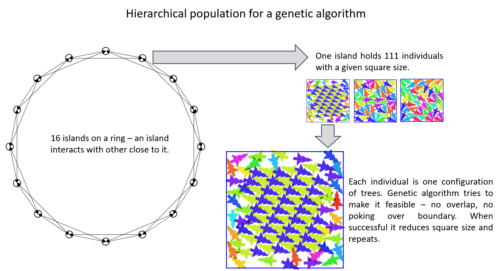

# Santa 2025 深读：几何包装的搜索工程学

> 赛事：Featured ｜ 主题 sim-agent/优化 ｜ 3357 队 ｜ 标准赛 ｜ 指标 Santa 2025 Metric（最小化正方形边长；总分按 N=1..200 汇总）（2026-01-30 截止）
> 材料基础：`digests/santa-2025.md`（8 节：1st/3rd/12th + SA 技巧 + 对称性两帖 + 1st 预览 + 10 树可视化）+ 33 张图
> 深读时间：2026-10（Tier A #20，Batch 2 收官）

## 0. 一句话重述：这道题真正在考什么

题面是"把 N 棵可旋转的树塞进最小正方形"，实际被考的是**同一套搜索范式的工程量**：

1. **双层搜索结构**：全局探索（GA / SA / Sparrow 元启发式）+ 局部精修（LBFGS 松弛 / pushing / SA 末段）交替——三家方案的骨架完全一致，差异在实现速度与"初始解结构"；
2. **初始解的结构化**（大 N 的生死线）：随机撒点只够 N≤40；其后依次是 **180° 对称**（even N，≈70）、**密铺晶体 + 随机边缘**（1st，到 200）、**矩形组合库**（3rd）、**凹包单对象放置**（12th）；
3. **自由度管理**：对称约束/晶格/矩形把 N 体问题降解为"边缘填充"；但最终最优解是**不对称**的——对称只当脚手架，不是终态（A HS 的 24 核 10 天实验）；
4. **性能即分数**：CUDA LBFGS 松弛 30,000 次/秒（100 树）、C++ SA 10.56M 迭代/秒（24 核）、增量碰撞检测把 O(N²) 打到 O(N)——在无噪声、纯优化的赛题里，**每秒多算多少次直接换算成名次**；
5. **协作工程**：3rd 的"100 提交/天 + Slack 自动播报"把团队变成 24/7 优化机。

一句话：**这是一场"搜索算力 + 初始解结构"的比赛**——算法思想（GA/SA/爬 Sparrow）是公共品，名次由"你能否把局部松弛做到 GPU 实时、把大 N 初始解变成填边"决定。

## 1. 材料与角色

| 帖子 | 作者 | 票数 | 角色与独有信息 |
| --- | --- | --- | --- |
| [640894](https://www.kaggle.com/competitions/santa-2025/discussion/640894)（SA Tips，114 票） | terry_u16 | 114 | **SA 通用教材**：循环提速（C++/Rust）、增量碰撞 Θ(N²)→Θ(N)（N=200 时 ~100×）、温度/冷却调度（几何式 `T(p)=T0^(1−p)·T1^p`）、邻域设计、留最优、多种子 |
| [672465](https://www.kaggle.com/competitions/santa-2025/discussion/672465)（1st，111 票） | Jeroen Cottaar | 111 | **GA（16 岛环）+ CUDA LBFGS 松弛**：Minkowski 精确分离距离查表（3D+三线性插值）；晶体（Perfect dimer area/tree=0.3041）；diversity 选择（Hungarian）；$250/1000h RTX 5090 |
| [671058](https://www.kaggle.com/competitions/santa-2025/discussion/671058)（1st 预览，84 票） | 同 | 84 | 全部 200 个解的可视化（发布在分享 notebook） |
| [629896](https://www.kaggle.com/competitions/santa-2025/discussion/629896)（10 树可视化，65 票） | c-number | 65 | 赛程早期的 "10 树" 可视化——本场难度共识的起点 |
| [671181](https://www.kaggle.com/competitions/santa-2025/discussion/671181)（3rd，64 票） | Gilles Vandewiele 队（5 人） | 64 | **矩形组合 + 定制 Sparrow（Rust）+ C++ SA/push**；方向偏置公式（center-aware）；角度分布（22–24°/202–204°）；100 提交/天工作流 |
| [671060](https://www.kaggle.com/competitions/santa-2025/discussion/671060)（12th，55 票） | Egor Trushin 队 | 55 | **凹包技巧**（晶格→凹包→Spyrrow 放自由树）；宽高比扰动（1→0.9–1.1→1）；N±1 迁移 |
| [664824](https://www.kaggle.com/competitions/santa-2025/discussion/664824)（对称解，46 票） | saharan | 46 | 小 N 的对称候选（N=14/18/20/22 分数 0.3695/0.3598/0.3607/0.3603） |
| [666880](https://www.kaggle.com/competitions/santa-2025/discussion/666880)（不对称实验，41 票） | A HS | 41 | **24 核 × 10 天对照**：N<60 不对称 > 对称；10.56M iters/s；N=59：0.35765 vs 0.36091 |

**材料缺口（未扩采，登记备查）**：索引里另有约 29 条 write-up 未收录，含 2nd/4th–11th 等名次方案（本场社区体量巨大：37 条 write-up 标记）。

## 2. 逐方案对照矩阵

| 维度 | 1st Jeroen | 3rd Gilles 队 | 12th Egor 队 | A HS（实验帖） |
| --- | --- | --- | --- | --- |
| 全局搜索 | **GA：16 岛环 × 111 个体**；变异（move/jiggle/twist/translate）+ 交叉（同岛/邻岛冠军） | 定制 **Sparrow（Rust）**（直接优化正方形 + 热启动 + 对称 + 方向偏置） | Spyrrow/Sparrow + memetic | Sparrow 初始化 + 自研 C++ SA |
| 局部精修 | **CUDA LBFGS 松弛**（cost=αΣoverlap²+βΣoutside²；Minkowski 查表；30k 次/秒@100 树） | C++ SA + **push（摇托盘）** | SA + 压缩 | C++ SA（10.56M iters/s） |
| 大 N 初始解 | 随机（≤40）→180° 对称（≈70）→**晶体+边缘**（到 200） | 矩形组合库（~70.0）→种子→定制 Sparrow | **凹包技巧** + 晶格块 + 边缘带 | 对称 vs 不对称对照 |
| 分数（总分/每 N） | 冠军 | 矩形组合 ~70.0 → +SA/push ~69.50（继续优化） | 每 N 0.3289–0.3349；两最佳 0.328x | N=59：0.3577（不对称） |
| 特色 | diversity 选择（转换集合距离/Hungarian）+ 岛屿重置 + 合法化 | 方向偏置（中心强/边缘弱、自适应）；上/下采样；"kicks"（整体旋转/缩放） | 宽高比扰动逃逸；N±1 树迁移 | 24 核 10 天实证 |

## 3. 共识、分歧与裁决

### 共识一：双层搜索（全局 + 局部）是所有前排方案的骨架

1st：GA + LBFGS 松弛；3rd：Sparrow + SA + push；12th：Sparrow/memetic + SA。**没有一家只用单一算法**——全局负责跳出局部极小，局部负责把"近可行"解压成"零重叠"。

**裁决**：组合优化赛的默认架构；差异在局部精修的实现速度（CUDA/C++）与初始解结构。置信度最高。

### 共识二：大 N 必须用结构化初始解，"自由度降解"是核心

1st：晶体+边缘、只动边缘树（GPU 松弛除外）；3rd：矩形组合 → 种子；12th：晶格块 + 边缘带 / 凹包。随机撒点只够 N≤40（1st 明言）。

**裁决**：把"200 体连续优化"降解为"填边缘"是工程可行性问题，也是分数问题——晶体质量（Perfect dimer 的直边+可变形性）直接决定边缘填充难度。置信度高。

### 共识三：性能工程 = 分数（本场最赤裸）

数字链：增量碰撞检测 Θ(N²)→Θ(N)（N=200 ~100×）；CUDA 松弛 30k 次/秒；C++ SA 10.56M iters/s；Rust 重写支持热启动。1st 自述"GPU 松弛让我们能接受多得多的移动"。

**裁决**：在无噪声、可精确评估的目标下，**搜索迭代量直接决定分数**；语言/并行/GPU 的每一层加速都换算成名次。置信度最高。

### 分歧一：对称——脚手架 vs 终态

- 1st：偶数 N 强制 180° 对称（到 ~70），晶体种子也配对称；"不确定是否真最优，但大幅降低自由度"；
- 3rd：Sparrow 支持 2/4 路对称做种子，"最终解中对称所剩无几"；
- A HS：24 核 10 天对照，N<60 **不对称全面优于对称**（N=59：0.35765 vs 0.36091）；挑战任何人给出更优对称解。

**裁决**：对称是**搜索脚手架**（早期降低自由度、快速收敛），不是**最优解结构**（终态应允许不对称）。1st 的对称约束可能付出了上限代价（他自己也留了问号）。置信度中高（实验 + 三家交叉）。

### 分歧二：晶体（tessellation）vs 矩形组合 vs 纯 SA

1st 押注"完美二聚体"晶体；3rd 押注"矩形组合库"（到 ~70.0 分后再精修）；12th 押注"凹包放置"。三家最终都进入 ~0.33/每 N 区间。

**裁决**：没有唯一正确的结构化方案；关键是"与你的局部精修器匹配"（晶体给 1st 的 CUDA 松弛提供整齐初值；矩形组合给 3rd 的 Sparrow 提供多样性种子）。置信度中。

## 4. 增量数字账

| 动作 | 数字 | 来源 |
| --- | --- | --- |
| 增量碰撞检测 | 检查数从 N(N−1)/2 → (N−1)：N=200 时 ~**100×** | SA Tips |
| CUDA 松弛吞吐 | 100 棵树整套松弛序列 **30,000 次/秒**（RTX 5090） | 1st |
| GA 规模 | 16 岛环；每岛 111 个体；每轮生成 3750 后代 → 选 1500 → 选 111（27 最不重叠 + 84 多样性） | 1st |
| 岛屿重置 | 卡住 ~100 代 / 冠军重复时重置 | 1st |
| 晶体质量（area/tree） | Perfect dimer 0.304133（最优）；其次 0.3104–0.3169（其余 5 种） | 1st |
| 对称可用上限 | 180° 对称到 N≈70（偶数）；密铺后到 N=200 | 1st |
| 1st 成本 | ~$250 = 1000 小时 RTX 5090（约一半用于找解，一半开发测试） | 1st |
| 3rd：矩形组合阶段 | 总分 ~**70.0** | 3rd |
| 3rd：+SA & push | 总分 ~**69.50** | 3rd |
| 3rd：每 N 分数曲线 | N=10 ~0.377 → N≈130 ~0.327 → 平台 ~0.33 | 3rd 图 |
| 3rd：最优解角度结构 | 中位角距 90° 倍数 ≈ **22–24° / 202–204°**（晶格特征） | 3rd 图 |
| 12th：代表解 | N=128:0.334935、N=132:0.333743、N=181:0.328861、N=192:0.331582；最佳 0.328x | 12th |
| A HS：吞吐与实验 | **10.56M 迭代/秒**（24 核）；10 天；N=59 不对称 0.35764784 vs 对称 0.36090970 | A HS |
| 对称候选（小 N） | N=14:0.369537、N=18:0.359769、N=20:0.360714、N=22:0.360253 | saharan |

**可复算校验（2 处吻合）**

1. 增量碰撞的复杂度比：全对检查 N(N−1)/2 vs 单树检查 N−1 → 比值 = N/2 = **100**（N=200）✓；
2. 总分量级：每 N 分数 ~0.33 × 200 ≈ **66–70** ——与 3rd"矩形组合 ~70.0 / SA 后 ~69.5"的总分口径一致 ✓。

## 5. 机制推演

**M1｜为什么"局部松弛"是本场的核心引擎**：GA/SA 的变异步大多产生重叠解（不可行）；真正把解推向可行并压缩边界的是局部精修。1st 的 LBFGS 在 GPU 上把一次"松弛序列"压到 1/30000 秒，等价于把"可尝试的变异数"放大几个数量级。**搜索类比赛里，局部精修的速度=搜索宽度。**

**M2｜Minkowski 查表为什么必要**：两棵树（非凸多边形）的"最小分离位移"沿相对位移连续变化；把 (Δx, Δy, θ) 三维空间的分离距离预计算成查表 + 三线性插值，才能在 LBFGS 的每步梯度计算中保持低成本——**把昂贵的精确几何变成一个可微的网格函数**。

**M3｜晶体种子为什么能"压缩自由度"**：无限大最优密铺由 2 树单元胞决定（Perfect dimer area/tree=0.3041 ≈ 理论密度上限附近）；把大部分树固定在晶格上，只优化边缘的自由树，等于把 O(N) 维搜索降到 O(边缘树)。Perfect dimer 的"直边 + 可变形性"使其能贴合正方形边界并被边缘解法"挤压"。

**M4｜对称的双面性**：180° 对称把自由度减半（genotype 只存一半树），显著加速早期收敛；但"最优解通常不对称"（A HS 的实证 + 1st/3rd 的观察）说明对称约束在终态是**不必要的限制**——正确用法是"以对称起步、以不对称收尾"（3rd 的种子对称 → 终态几乎无对称）。

**M5｜GA 的层次化种群为何必要**：单一群体在强选择压下会迅速被一个局部最优主导（过早收敛）；16 岛环 + 只与"低分邻岛冠军"交配 + 多样性选择（转换集合距离）+ 卡住重置，共同维持"探索多样性"与"利用强度"的平衡。**多样化不是随机性，而是被显式度量与优化的量。**

**M6｜SA 的三个关键旋钮**（Tips 帖）：温度（探索↔精修）、冷却调度（几何式）、邻域设计；外加"保留历史最优"与"多种子重启"。本场的特殊点：SA 步必须做**碰撞拒绝**（不可行步直接丢弃），因此增量碰撞检测的性能是 SA 迭代率的分母。

**M7｜N±1 迁移与宽高比扰动**（12th）：相邻 N 的最优布局高度相似（去掉/加一棵树即可）；宽高比 0.9–1.1 的来回扰动则把解推出"正方形局部极小"的窄盆地。**利用"参数连续性"做温启动，是组合优化里最便宜的加速。**

## 6. 证据分级

| 断言 | 等级 | 说明 |
| --- | --- | --- |
| 10.56M iters/s、N=59 不对称更优 | **可复现实验（24 核 10 天）** | 给出明确数字与 N 列表 |
| CUDA 松弛 30k 次/秒、$250/1000h | **自述（强）** | 有公开 notebook/GitHub |
| 晶体 area/tree 数字 | **可复算（几何）** | 六种单元胞给出面积/tree |
| 3rd 的 70.0→69.50 与角度分布 | **可读取（图）** | 有图有分 |
| 12th 的代表解分数 | **可读取（图）** | 每 N 标注 |
| "对称是脚手架不是终态" | **跨帖合取** | 1st 的疑问 + 3rd 的观察 + A HS 的对照 |
| GA 细节（3750→1500→111 等） | **自述** | 无第三方复现 |

## 7. 边界条件与反事实

- **计算是硬边界**：A HS 明言 N>60 的瓶颈"严格是算力"；1st 花 $250/1000h 才能做完全部 N。本场是"预算 → 分数"最直接的比赛之一。
- **反事实（1st）**：若不做 180° 对称约束，偶数 N 的搜索空间翻倍（更慢），但上限可能更高；他自述"不确定对称解是否真最优"。若集成 Sparrow（他列为"最大的没做的事"），可能再上一档——他发布 CSV 后"很快被人改进"。
- **反事实（3rd）**：若不把 Python 原型转 C++/Rust、不建 100 提交/天工作流，团队 24/7 的算力利用率会大降；他们的分数曲线显示后期优势来自"持续压榨"而非单点创新。
- **边界（对称）**：A HS 的实验只到 N<60；大 N 上晶体/对称作为脚手架依然必要（1st 到 200 都用了）。
- **边界（初始解）**：随机撒点 ≥40 就失效；任何"纯随机 + SA"的大 N 方案都会输在起点。

## 8. 悬案与失败学

**悬案**

1. **2nd/4th–11th 的方案**未收录：是否有人用完全不同的范式（如 RL/学习式）逼近？未知；
2. **对称的最优边界**：哪些 N 的全局最优本身就是对称的（saharan 的小 N 候选 vs A HS 的反例）没有定论；
3. **晶体族的完备性**：1st 只找到 2 树单元胞，是否存在 3+ 树的高阶晶体可进一步压低总分。

**失败学（负面清单精选）**

| 失败 | 来源 | 教训 |
| --- | --- | --- |
| 内联近似分离距离（凸分解/重叠面积） | 1st | 不如查表精确+快；几何近似会毁掉梯度质量 |
| 星形/树形/超立方体等岛间拓扑 | 1st | 环状+邻接交配最稳 |
| 锦标赛选择替代多样性选择 | 1st | 会过早收敛 |
| 初始 jiggling、向内挤压替代缩小方框 | 1st | 无效；"固定方框→压缩"的流程更优 |
| 90° 对称 | 1st | 找到好看解但不是最优 |
| 纯随机初始解（大 N） | 1st/共识 | ≥40 就失效 |
| 纯 Python SA | SA Tips | 迭代率不够，名次上不去 |
| 直接对全对做碰撞检查 | SA Tips | O(N²) 浪费 100× |
| （反方）"对称解一定最优"的直觉 | saharan/A HS | 被 24 核实验推翻；数据 > 直觉 |

## 9. 图表证据

> 路径相对本文件（`analysis/deep/`）：`../../intel/santa-2025/bodies/<topic>_img/NN.ext`

**图 1：层次化 GA 种群（16 岛环）**（1st，topic 672465）——`../../intel/santa-2025/bodies/672465_img/01.png`

*读图结论*：16 个岛在环上、岛内 111 个体共享一个方框尺寸；GA 的目标是"先可行（零重叠、不出界）→ 再缩小方框 → 重复"——本场搜索循环的完整语义。

**图 2：六种晶体单元胞（area/tree）**（1st）——`../../intel/santa-2025/bodies/672465_img/04.png`

*读图结论*：Perfect dimer **0.304133**（最密）；Base sees trunk 0.310447；Close under 0.310455；Unsnagged poker 0.314478；Snagged poker 0.316920；Odd 0.316928。Perfect dimer 胜出的两个非密度原因：**直边**（可贴正方形上下边）与**可变形**（细胞角度/长宽比可调而不显著损密度）。

**图 3：3rd 的四段管线**（topic 671181）——`../../intel/santa-2025/bodies/671181_img/01.png`

*读图结论*：Vanilla Sparrow + Lattice Construction → Rectangle Combiner（矩形库递归组合）→ Custom Sparrow（定方目标/热启动/对称/方向偏置）→ SA + Pushing → 最终解。**"造种子 → 探索 → 摇托盘"**的流水线。

**图 4：每 N 分数与角度分布**（3rd）——`../../intel/santa-2025/bodies/671181_img/09.png`

*读图结论*：分数从 N=10 的 ~0.377 降到 N≈130 的 ~0.327 后平台；柱子显示最优解的中位角距 90° 倍数呈双簇（~0-6° 与 ~18-26°），即正文所说 "22–24°/202–204° 的晶格结构"；不同 N 的结构类型（Straight/Manual/Diagonal）在图中以颜色标注。

**图 5：12th 的密铺+边缘布局**（topic 671060）——`../../intel/santa-2025/bodies/671060_img/01.png`

*读图结论*：N=128/132/181/192，蓝=晶格块、橙=自由边缘树；分数 0.3349/0.3337/0.3289/0.3316。**大 N 最优解长相 = "晶体核心 + 单/双侧自由带"**，这正是凹包技巧存在的理由。

**图 6：不对称 vs 对称（N=59）**（A HS，topic 666880）——`../../intel/santa-2025/bodies/666880_img/01.png`

*读图结论*：左（不对称，side 4.593607/score 0.35764784）优于右（对称，side 4.614507/score 0.36090970）——24 核 10 天实验的代表性样本。

**图 7：小 N 的对称最优候选（N=2 示例）**（saharan，topic 664824）——`../../intel/santa-2025/bodies/664824_img/01.png`

*读图结论*：2 树 180° 对称解 score 0.45078 / side 0.94950（高亮重叠为可视化效果）；对称结构在小 N 确实常见——与 A HS 的"N<60 不对称更优"构成张力（小 N 对称最优 vs 统计上不对称占优，取决于具体 N）。

## 10. 对既有笔记/playbook 的修订点

1. `notes/sim-agent/santa-2025.md` 升级：补齐 8 节作者/票数；方案谱系扩为 4 列对照矩阵；新增全域+局部双层结构、晶体/矩形库/凹包三类种子、对称脚手架的裁决、性能工程数字账、图证与失败学。
2. `playbook/sim-agent.md`（优化类）增补：
   - **双层搜索模板**（全局探索 + 局部精修；局部速度=搜索宽度）；
   - **自由度降解**（对称/晶格/边缘/矩形组合是种子构造的四个通用动作）；
   - **精确几何的查表化**（Minkowski+三线性插值，供梯度法使用）；
   - **SA 工程清单**（增量碰撞、几何冷却、留最优、多种子）；
   - **多样性管理**（岛环拓扑 + 转换距离 + 重置）。
3. `playbook/00-通用方法论.md` 增补："**约束是脚手架不是信仰**"——对称/晶格等约束用于加速搜索，但终态必须经实验检验（本场 24 核实验推翻对称直觉）；"**性能预算直接换算名次**"（纯优化赛的特殊性）。

## 11. 出处

- SA Tips（terry_u16，114 票）：https://www.kaggle.com/competitions/santa-2025/discussion/640894
- 1st（Jeroen Cottaar，111 票）：https://www.kaggle.com/competitions/santa-2025/discussion/672465
- 1st 预览（84 票）：https://www.kaggle.com/competitions/santa-2025/discussion/671058
- 10 树可视化（c-number，65 票）：https://www.kaggle.com/competitions/santa-2025/discussion/629896
- 3rd（Gilles Vandewiele 队，64 票）：https://www.kaggle.com/competitions/santa-2025/discussion/671181
- 12th（Egor Trushin 队，55 票）：https://www.kaggle.com/competitions/santa-2025/discussion/671060
- 对称解（saharan，46 票）：https://www.kaggle.com/competitions/santa-2025/discussion/664824
- 不对称实验（A HS，41 票）：https://www.kaggle.com/competitions/santa-2025/discussion/666880
- 未收录缺口（登记备查）：2nd/4th–11th 等约 29 条 write-up
