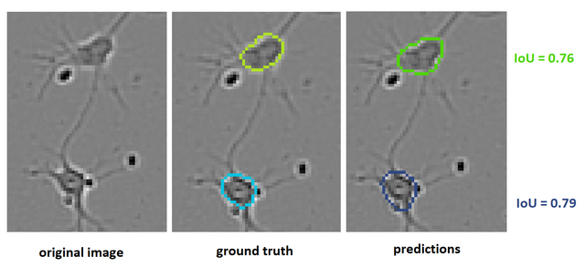

# Sartorius Cell Instance Segmentation 轻量深读（Tier B）

> 赛事：Featured ｜ 主题 cv（显微图像实例分割）｜ 1505 队 ｜ 代码赛 ｜ 指标：IntersectionOverUnionObjectSegmentation（COCO 风格 mAP）
> 材料基础：`digests/sartorius-cell-instance-segmentation.md`（5 篇正文：1st 298869 / 2nd 297988 / 3rd cellpose 297984 / 5th 298081 / 标注噪声 281205；80 条主题索引）+ 11 张图
> 轻读时间：2026-10（Tier B B07）

## 1. 一句话重述与数字账

在显微图像上做三分类细胞的实例分割（shsy5y/astro/cort），细胞只有 ~10×10 像素。真正的考点是**"先检测、后分割"的工程拆分 + 对标注噪声与指标缺陷的清醒认识**：高 IoU 阈值段（0.8–0.95）对这么小的细胞基本是抽签，因此检测框质量与阈值/后处理比"更花哨的 mask head"更值钱。

| 关键数字 | 值 | 来源 |
| --- | --- | --- |
| 标注/指标诊断（174 票） | 小细胞 ~10×10px，标注边界有 ~20px 歧义 → 同一预测的 IoU 可波动 **~0.2**；0.8/0.85/0.9/0.95 四档阈值"基本靠运气"，**约 40% 的评估是随机的**；建议按 GT 尺寸分档（<200px 用 0.5–0.75；<400px 用 0.5–0.85；≥400px 用 0.5–0.95） | 281205 |
| 1st（298869） | 明确"box-first"：**重点投在检测**，理由是 mask 质量受标注质量限制；验证用 COCO mAP（bbox AP[.5:.95] 0.396、segm 0.362）；检测器 **YOLOX（无需调参）** + 强特征提取器（CB DBS-FPN、EffDetD7、CSPDarknet-YOLOXPAFPN）、输入 1536、**LiveCell 预训练**（含 mixup 扩充上千实例的图）；为省显存用 CUDA 扩展优化 SimOTA；mask 侧 = 2 个 Mask R-CNN（CB-DBS，用 GT bbox/mask 训练）+ **4 个 UPerNet（Swin/ResNet101，LiveCell 预训练）**；训练细节：**ROIAlign 裁剪+网格采样回贴、mask 目标用双线性插值再阈值化**（跟随 Mask R-CNN mask head 的口径）；bbox 集成 → mask 头；**重排序 = bbox 分 × mask 平均分（astro mAP +0.01）**；后处理：阈值化、去重叠、丢小目标 | 298869 |
| 2nd（297988） | 2 检测器（yolov5x6、effdetD3）+ 1 UNet（EffNet-b5，裁块后预测"中心细胞 + 邻细胞"两类）+ 2 Mask R-CNN；检测框用 **WBF** 融合后送进各 mask 头；mask 用加权平均；训练流程 = LiveCell + 半监督数据多轮预训练 → 竞赛数据微调 | 297988 |
| 3rd（297984） | **cellpose（"flow mask"）路线**：不直接回归二值 mask，而是学"从像素指向细胞质心的流场"，用动力系统的不动点/吸引域还原实例——天然解决粘连细胞；模型仅 ~6M 参数（比 ResNet-18 小）；重增强 + 高倍放大 → 需要 300–500 epoch；遇到 dataloader/磁盘 IO 瓶颈自写 fast.ai 数据管线；**"diameter（细胞像素尺度）"是最大敏感超参**：试过按类别设常量、按范围 TTA、cellpose 的 size model、用检测器输出尺寸——最终用 10 模型集成，先用 size model 定初始 diameter，再按每步预测的 mask 重估 | 297984 |
| 5th（298081） | Mask R-CNN（Detectron2）先在剔除 shsy5y 的 LiveCell 上训练 → 竞赛数据 + LiveCell-shsy5y 微调 → **对 train_semi_supervised 打伪标签**再微调 → 用其预测生成 flow-x/flow-y + 语义分割作为额外通道训练 **Cellpose**（diameter=19） | 298081 |
| 社区侧 | "干净的 astro mask"共享帖（125 票）；"按类别设阈值"（85 票）；"Detectron2 教程"（83 票）；早期总结帖（154 票） | 社区 |

## 2. 逐方案对照矩阵

| 维度 | 1st | 2nd | 3rd | 5th |
| --- | --- | --- | --- | --- |
| 主路线 | **检测优先（YOLOX）+ 多 mask head** | 检测（WBF）+ UNet/MaskRCNN | **cellpose 流场** | MaskRCNN 伪标签 → cellpose |
| 检测器 | YOLOX + 3 种强骨干 | yolov5x6 + effdetD3 | 无（cellpose 自带） | MaskRCNN(RPN) |
| 预训练 | LiveCell | LiveCell + 半监督 | LiveCell | LiveCell（分阶段） |
| 关键细节 | ROIAlign + grid_sample；bilinear+阈值化；bbox×mask 重排序 | 中心/邻细胞两类分割；WBF | 流场不动点；diameter 自适应 | 伪标签 + flow 通道 |
| 后处理 | 阈值/去重叠/丢小 | 加权 mask | 按类型调后处理 | 按类型调 |

## 3. 共识、分歧与裁决

### 共识一：本赛实质是"检测 + 分块 mask"（1st/2nd/5th）

三队都把检测框质量当成主战场（1st 明说"mask 受标注质量限制，不投入过多"），mask 阶段在裁剪块上做（含"邻细胞"辅助类）。**裁决**：小目标实例分割的 ROI 顺序应是"检测 → 分块精修 → 融合"，而不是整图端到端 mask。置信度：高。

### 共识二：标注噪声/指标缺陷是必须正面处理的对象（174 票帖 + 3rd）

174 票帖量化"高阈值段 40% 随机"；1st 直接把验证口径换成 COCO mAP 并靠阈值/后处理捞分；3rd 指出"高分 astro 极难"（流场输出漂亮也只有 0.155）。**裁决**：当指标的高阈值段不可达时，优化"检测召回 + 中低阈值段的精度"是更理性的目标；同时把评测口径（分档阈值）作为诊断工具登记。置信度：高。

### 共识三：LiveCell 预训练是公共起点（1st/2nd/3rd/5th）

四队都用 LiveCell（部分做法：先剔除某类细胞再训练，避免类别混淆）。**裁决**：领域内有大规模同域数据集时，"外部预训练 + 竞赛数据微调"是标准路径。置信度：高。

### 分歧一：Mask R-CNN/UNet 系 vs cellpose 流场

1st/2nd/5th 走检测框 + mask head/UNet；3rd 用 cellpose 的流场表示（对粘连细胞更自然，且模型更小）。**裁决**：流场表示在"细胞密集粘连"场景有结构优势，但引入 diameter 这个敏感超参；两条路线可在集成中互补（5th 正是把 cellpose 与 MaskRCNN 组合）。置信度：中高。

### 分歧二：伪标签/半监督的用法

2nd/5th 用 train_semi_supervised 打伪标签再训练；3rd 试过"用大集成标注未标注数据"但结论不明确。**裁决**：半监督数据可用，但必须经过"伪标签质量 + 集成同质化"的检验（与 S5E8/E6 的结论一致）。置信度：中。

### 事件：社区数据共享（"干净的 astro mask"）

astro 类标注最脏，有人整理出干净 mask 并公开（125 票）。**裁决**：数据清洗成果的公开共享能显著抬高全场下限——这在医疗图像赛里几乎成为惯例。置信度：中高。

## 4. 证据分级

| 断言 | 等级 | 说明 |
| --- | --- | --- |
| 1st 的检测/mask 双阶段与重排序 +0.01 | 自述 + COCO 分数表 + 公开代码 | 高 |
| 174 票的标注噪声量化（IoU ±0.2） | 自述 + 示例图 + 逻辑清晰 | 中高 |
| 3rd 的 cellpose 流程与 diameter 处理 | 自述 + 图 + 代码 | 中高 |
| 2nd 的 WBF + 中心/邻细胞两类分割 | 自述 + 图 | 中高 |
| 5th 的伪标签 + flow 通道 | 自述 + 流程步骤 | 中 |

## 5. 悬案与缺口（登记）

- 4th/6th–10th 的方案未入库；"按类别设阈值"（85 票）与"早期总结"（154 票）未细读；
- 1st 未给"检测 vs mask"的逐项消融（只有最终 COCO 表）；
- cellpose 的 diameter 自动估计在生产中的误差分布未量化；
- 归档 11 图：174 票帖的 IoU 示例（图 1）、1st 的管线图、3rd 的流场输入/输出为关键图证。

## 6. 图表证据

**图 1**（topic 281205）：原图 / GT（黄、蓝轮廓）/ 预测（绿、深蓝）——两个"看起来都对"的预测 IoU 只有 0.76 与 0.79，对应 mAP 仅 ~0.6。这是"小目标 + 标注歧义 → 高阈值段近乎随机"的直接证据。

## 7. 出处

- 1st（101 票）：https://www.kaggle.com/competitions/sartorius-cell-instance-segmentation/discussion/298869
- 2nd（146 票）：https://www.kaggle.com/competitions/sartorius-cell-instance-segmentation/discussion/297988
- 3rd "Go with the flow"（124 票）：https://www.kaggle.com/competitions/sartorius-cell-instance-segmentation/discussion/297984
- 5th（84 票）：https://www.kaggle.com/competitions/sartorius-cell-instance-segmentation/discussion/298081
- 标注噪声（174 票）：https://www.kaggle.com/competitions/sartorius-cell-instance-segmentation/discussion/281205
- 干净的 astro mask（125 票）：https://www.kaggle.com/competitions/sartorius-cell-instance-segmentation/discussion/291371
