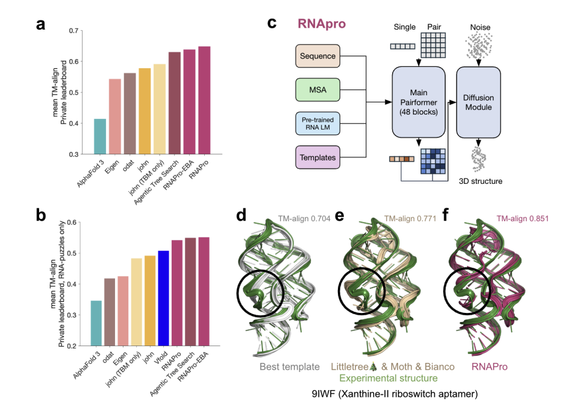

# Stanford RNA 3D Folding Part 2 轻量深读（Tier B）

> 赛事：Featured ｜ 主题 science（RNA 三维结构预测）｜ 1867 队 ｜ 代码赛 ｜ 指标：TM-score（PermuteChains，且残基需编号匹配）
> 材料基础：`digests/stanford-rna-3d-folding-2.md`（6 篇正文：1st 689386 / 2nd 691133 / 3rd 689697 / 6th 686777 / 8th 687113 / RNAPro 管线 668412；80 条主题索引）+ 1 张图
> 轻读时间：2026-10（Tier B B07）

## 1. 一句话重述与数字账

给 RNA 序列预测三维结构，**每个目标提交 5 个预测、取最好的一个计分**。Part 2 新增多链/蛋白/DNA/配体/长序列（≤5500 nt）与更严的残基编号匹配。真正的考点是**"5 个槽位的多样性分配"**：把 TBM（模板）、Protenix/AlphaFold3 系、RNAPro（扩散精化）按序列长度与算力预算分配到不同槽位，让 5 个预测覆盖不同的结构假设。

| 关键数字 | 值 | 来源 |
| --- | --- | --- |
| 1st（689386） | **"五模型 + 长度自适应分配"**：<250 nt = Boltz2×2 + RNAPro + Protenix + DRFold2；250–999 = TBM + Boltz2 + RNAPro×2 + Boltz2；**≥1000 nt = TBM×3 + Protenix×2**（RNAPro/Boltz2 在长序列会 OOM）。TBM：BioPython PairwiseAligner 全局比对（train+val 模板池、长度差 ≤30%）、top-30 候选；预测 1 = 最佳模板原样，其余从 top-12 按指数权重采样（已用模板 0.1× 惩罚）；缺口填充：C1' 线性插值、末端沿方向以 5.95Å 步长外推、无模板则沿 X 轴线性摆放；后处理 `adaptive_rna_constraints`：键长 i→i+1=5.95Å、键角 i→i+2=10.2Å、Laplacian 平滑、链长 ≥25 时 3.2Å 自避让。比赛分 0.43837/0.60037（comp pub/priv）→ 最终 0.42854/0.49669 | 689386 |
| 2nd（691133，公榜第 1） | **BPP-Protenix**：把碱基配对概率矩阵（BPP）注入 AlphaFold3/Protenix 的 Pairformer——`BPP [N,N] → LinearNoBias(1→128) → z_init += bpp_embedding`；灵感来自 2023 Ribonanza（RNAdegformer 把 BPP 当 transformer bias）；对比 EternaFold vs ViennaRNA 的 BPP 质量；为算力只训单体+短序列；槽位 = TBM + RNAPro×2 + BPP-Protenix×2（不适用时回退普通 Protenix）；自述"几乎没人改网络结构，这是唯一解"，公榜第一保持两周 | 691133 |
| 3rd（689697） | 面向 Part 2 的新要素（蛋白/DNA/配体/多链/长序列）+ 提速；**TBM 模板排序改用 LightGBM 预测 TM-score**：~19.8 万 query-template 对（最近 1000 条 query × 每条 200 个时间截断内的模板）；特征 = RNA 序列相似度（对齐分/相似度/长度差比）+ **文本嵌入余弦相似度（PubMedBERT）** + 蛋白相似度（BLOSUM62 对齐分 min/mean/max）+ DNA 相似度 + **配体 Tanimoto（Morgan 指纹）** + 组合计数 + 链数特征；取 top-2 模板；槽位 = TBM×2 + Protenix×2 + RNAPro×1；RNAPro 与 Protenix 在 2×T4 上并行 | 689697 |
| 6th（686777） | 多样性优先：先用 **TBM 便宜地造 5 个多样假设** + Protenix（no-MSA、no-template）；再把 TBM/Protenix 的输出**当模板喂给 RNAPro**（"交叉授粉"是关键）；≤1000 nt：P1/P2 = RNAPro+TBM 模板，P3/P4 = RNAPro+Protenix 模板，P5 = 纯 Protenix；>1000 nt：TBM×5 | 686777 |
| 8th（687113） | 只用 Kaggle 2×T4；TBM 侧：**ViennaRNA 二级结构并入序列比对** + **用匈牙利算法做模板内链的独立匹配**；Protenix 侧：JSON 里拆分链序列/MSA、用 dynamic chunk 把 token 上限 512→768、双 T4 并行、长序列只预测每种链一条其余视为缺失；后处理：缺失链用其他链的缩放坐标填充（避免链对齐惩罚）、2Å（Kabsch 后 RMSD）内的候选取平均、低分 TBM 候选用 Protenix 顶替；最终 priv 0.47641 | 687113 |
| 事件 | host 欢迎帖：Part 2 增加多链/多状态/蛋白-DNA-配体依赖/≤5500nt、指标要求残基编号匹配；Part 1 总结论文称"模板法（TBM）回归"是最大惊喜；**"The moving target... a huge JOKE!!!（15 票 / 37 评论）"** 指控比赛中途改动目标（数据/指标） | 社区 |

## 2. 逐方案对照矩阵

| 维度 | 1st | 2nd | 3rd | 6th | 8th |
| --- | --- | --- | --- | --- | --- |
| 5 槽位分配 | **按长度自适应** | TBM+RNAPro×2+BPP-Protenix×2 | TBM×2+Protenix×2+RNAPro | RNAPro×4+Protenix | TBM+Protenix 混合 |
| TBM 用法 | 主力（≥250nt） | 1 槽 | **LightGBM 排序模板** | 模板来源 | ViennaRNA+匈牙利匹配 |
| 神经模型 | Boltz2/RNAPro/Protenix/DRFold2 | **BPP-Protenix（改结构）** | Protenix/RNAPro | Protenix→RNAPro 互喂 | Protenix（chunk 768） |
| 长序列策略 | TBM×3+Protenix×2 | 回退 Protenix | 并行提速 | TBM×5 | 单链预测 + 缺失填充 |
| priv | 0.49669（最终） | — | — | — | 0.47641 |

## 3. 共识、分歧与裁决

### 共识一：best-of-5 的目标是"覆盖不同结构假设"（1st/6th/8th）

1st 明说"评分取 5 个中最好 → 目标是最大化结构多样性"；6th 用 TBM 便宜地造多样假设再让 RNAPro 探索；8th 在 2Å 内取平均、低分候选替换。**裁决**：这类"多预测取最优"指标的优化对象不是单个模型的精度，而是**候选集合的覆盖率**；槽位分配应按长度/模态/算力显式设计。置信度：高。

### 共识二：TBM（模板法）在 RNA 结构预测中依然强势（host + 1st/3rd/6th/8th）

Part 1 总结称"模板法回归"是最大惊喜；本场 1st 把 TBM 当长序列主力，3rd 专门训 TM-score 预测器排序模板，8th 用二级结构+匈牙利匹配改进 TBM。**裁决**：当序列与已知结构有同源性时，模板法性价比高于纯神经网络；模板检索与排序是独立可优化的模块。置信度：高。

### 共识三：2×T4 的运行时管理是一等约束（3rd/6th/8th/1st）

1st 因为长序列 OOM 而改变槽位；3rd 并行跑 RNAPro/Protenix；8th 把 token 上限调到 768 并只预测一条链；6th 对 >1000nt 直接 TBM×5。**裁决**：算力约束会直接改写方案结构（"能跑完"优先于"理论最优"）；提交前要按序列长度分档做预算规划。置信度：高。

### 分歧一：要不要改神经网络结构

2nd 把 BPP 注入 Pairformer 并称"几乎没人改结构"；其余队伍都以组合现成模型 + 后处理为主。**裁决**：在算力受限、外部模型强大的赛道，架构创新的空间小但收益独特（BPP 先验来自同族任务 Ribonanza 的迁移）；多数人应把优先级放在组合与后处理。置信度：中高。

### 事件：目标/数据的"移动靶"争议

高票帖指控比赛中途更改目标（数据/指标），37 条讨论。**裁决**：主办方中途改动会摧毁参赛者的验证基础；登记为治理风险事件，引用时以 host 帖（Part 2 变化）为准。置信度：中（现象级，无官方结论）。

## 4. 证据分级

| 断言 | 等级 | 说明 |
| --- | --- | --- |
| 1st 的长度自适应槽位表与 TBM 细节 | 自述 + 完整槽位表 + 公开代码 | 高 |
| 2nd 的 BPP 注入公式与消融思路 | 自述 + 公式 + 工具对比 | 中高 |
| 3rd 的 TM-score 预测器特征清单与数据规模 | 自述 + 数据集/脚本 | 中高 |
| 6th 的互喂模板流程 | 自述 + ASCII 管线 | 中高 |
| host 对 Part 2 变化与指标的说明 | 官方帖 | 高 |

## 5. 悬案与缺口（登记）

- 4th/5th/7th/10th 的方案未入库；"Running the evaluation metric"（21 票）、"RNAPro 管线"（26 票）只取其一；
- 2nd 的 BPP-Protenix 没有量化消融（只说"唯一解"）；
- "移动靶"争议无官方结论；
- 归档仅 1 图（RNAPro 管线图，topic 668412），其余队伍的方法图未归档——图证缺口已登记。

## 6. 图表证据

**图 1**（topic 668412）：RNAPro 管线——序列/MSA/RNA 语言模型/模板 → 48 层 Pairformer 主干（单/对表示）→ 扩散模块 → 3D 结构；右侧柱状图显示其在私榜（含 RNA-only 子集）明显优于 AlphaFold3/Eigen/odal/john(TBM)/Agentic Tree Search 等基线（TM-align 0.55–0.65 vs 0.3–0.5），并给出 9IWF 结构对比（0.704/0.771/0.851）。

## 7. 出处

- 1st（25 票）：https://www.kaggle.com/competitions/stanford-rna-3d-folding-2/discussion/689386
- 2nd（21 票）：https://www.kaggle.com/competitions/stanford-rna-3d-folding-2/discussion/691133
- 3rd（16 票）：https://www.kaggle.com/competitions/stanford-rna-3d-folding-2/discussion/689697
- 6th（23 票）：https://www.kaggle.com/competitions/stanford-rna-3d-folding-2/discussion/686777
- 8th（16 票）：https://www.kaggle.com/competitions/stanford-rna-3d-folding-2/discussion/687113
- RNAPro 管线（26 票）：https://www.kaggle.com/competitions/stanford-rna-3d-folding-2/discussion/668412
- host 欢迎帖：https://www.kaggle.com/competitions/stanford-rna-3d-folding-2/discussion/666382
- 移动靶争议（15 票 / 37 评论）：https://www.kaggle.com/competitions/stanford-rna-3d-folding-2/discussion/686651
