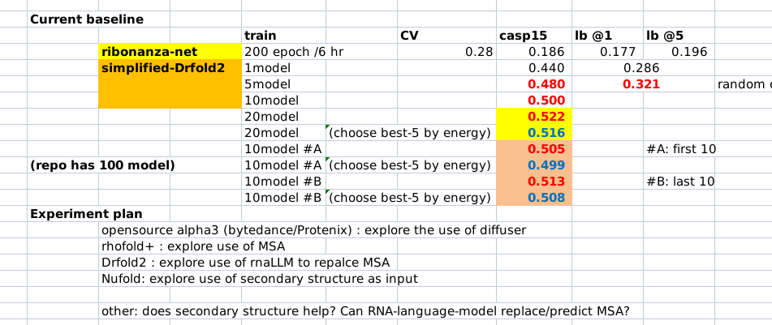
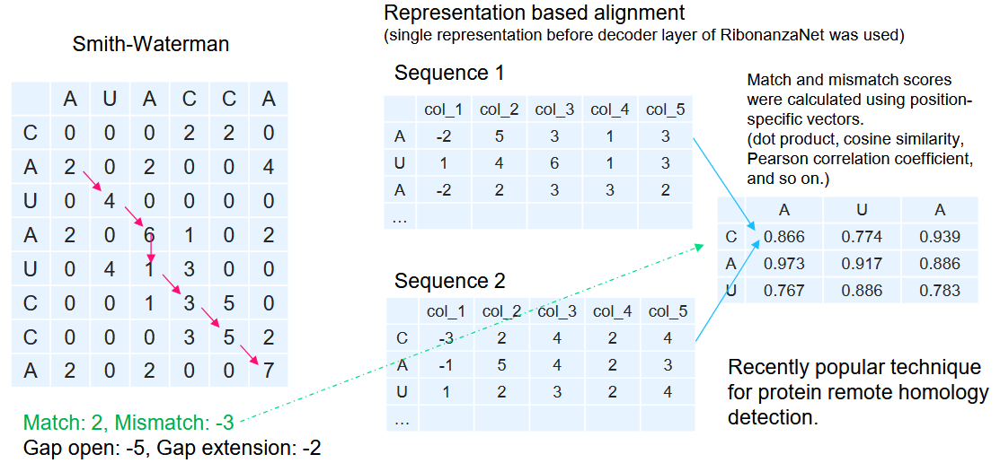

# Stanford RNA 3D Folding (Part 1) 轻量深读（Tier B）

> 赛事：Featured ｜ 主题 science（RNA 三级结构预测）｜ 1516 队 ｜ 代码赛 ｜ 指标：Ribonanza TM-score（每目标 5 个预测取最好）
> 材料基础：`digests/stanford-rna-3d-folding.md`（6 篇正文：1st 609774 / 2nd 609843 / 3rd 609701 / 0.484 单机方案 582377 / 121 票实验帖 566906 / 临时第 1 582295；80 条主题索引）+ 2 张归档图
> 轻读时间：2026-10（Tier B B11）

## 1. 一句话重述与数字账

由 RNA 序列预测三级结构、每个目标交 5 个预测取最优。本届的真正考点是**"模板检索 vs 端到端模型"的路线选择**：1st 没有 GPU，靠 TBM（模板建模）五步流程 + 对 DRfold2 的优化/选择模块做工程增强夺冠；2nd 把 RibonanzaNet 的中间层表征拿来做远程同源检索（RBSSA），并用 Chai-1/Boltz-1 补模板缺口；3rd 走另一条路——自建 rMSA 微调 Protenix，再与 DRfold2、Boltz-1 组成集成。

| 关键数字 | 值 | 来源 |
| --- | --- | --- |
| 1st（609774） | 无 GPU；TBM 五步（检索 → 全局比对 → 坐标迁移 → 缺口几何重建 → 置信度自适应精化）；DRfold2 增强 = float64 打分、`torch.cdist` 向量化、预计算样条系数、PyTorch LBFGS、GPU 加速、Boltz-1 集成；DRfold2 失败自动回退 TBM；私榜分数未披露 | 609774 |
| 2nd（609843） | 消融（私榜）：full **0.56125** → 去 RBSSA **0.50551** → 再去标准 TBM **0.37400**；dot 打分版 0.56966；公开榜 May 0.605 / Sep 0.59655；模板库 = PDB（2025-05-21）+ MMseqs2 95% 聚类 **4,779 簇（3,991 代表）**；300nt 目标 RBSSA 搜索 ≈160 秒；DL 侧 Chai-1 + Boltz-1 补缺口 | 609843 |
| 3rd（609701） | 集成 DRfold2 + Protenix + Boltz-1；自建 rMSA（官方代码，**14 天**）；Protenix 在 GH200 96GB 微调、限 <800nt、整数据 ~1 天；**无 rMSA 微调无效**；<400nt 用 DRfold2（只保留 energy selection + Arena）、>400nt 转 Protenix；两份提交：DRfold2+Protenix 公 0.60338 / 私 0.52787；Protenix+Boltz 公 **0.61253** / 私 **0.54312** | 609701 |
| 6th（提交阶段，582377） | **0.484**：纯 CPU（i5-6500 / 24GB / 无 GPU）；对全部结构做 TM-score 聚类 → Keras 五组分类器 → 返回组内最相似结构；零外部模型、零外部数据 | 582377 |
| 实验帖（566906，121 票） | 3/18 基线 lb **0.321**（DRfold2 no-MSA + RNA 语言模型替代 MSA）；5 模型 0.321、20 模型按能量选 best-5 CASP15 0.516/0.522；ribonanza-net 基线 CV 0.28 / CASP15 0.186 / LB 0.177；设备 2×A6000 48GB | 566906 |
| 临时第 1（582295） | TBM + 2025-05-21 PDB，缺口用 Boltz-1/Chai-1 填；作者自述"预期显著下跌" | 582295 |
| 社区基线 | AlphaFold3 基线：无 MSA **0.259** / rMSA **0.397**；RibonanzaNet2 alpha（40 票）、ProteinX 微调（32 票）、Boltz-1 帖（21 票） | 570292 等 |

## 2. 逐方案对照矩阵

| 维度 | 1st | 2nd | 3rd | 582377（6th/提交阶段） |
| --- | --- | --- | --- | --- |
| 核心理念 | TBM 为主 + DRfold2 工程增强 | 表征检索（RBSSA）+ 标准 TBM + DL 补缺 | 多模型集成 + rMSA 微调 | 纯检索分类，零模型 |
| 检索/模板 | host 提供的 PDB_RNA 全部 CIF（93 种核苷酸变体映射、disorder-aware 提坐标） | PDB 2025-05-21 → MMseqs2 95% → 4,779 簇；RibonanzaNet 表征 + Smith–Waterman 式 DP | 用官方 rMSA + 自建 rMSA 数据 | 赛方数据 TM-score 全对全聚类 → 5 类 |
| 神经模型 | DRfold2（选择/优化增强；Boltz-1 集成） | Chai-1、Boltz-1 仅补缺口 | DRfold2（<400nt）+ Protenix（微调）+ Boltz-1（多样性） | 无（Keras 分类器） |
| 缺口/长序列 | 几何重建：C1'–C1' ≈5.9Å、正弦扰动补压缩缺口、末端沿骨架方向外推 | DL 预测补缺口 + SVDSuperimposer 组装 | >400nt 交给 Protenix；DRfold2 只留 energy selection + Arena | — |
| 算力 | 无 GPU | 未强调 | GH200 96GB + 多机 | i5-6500 / 24GB / 无 GPU |
| 结果 | 私榜第 1（未披露分数） | 私 0.56125（dot 0.56966） | 私 0.54312（Protenix+Boltz） | 0.484 |

## 3. 共识、分歧与裁决

### 共识一：TBM/检索是本届的决定性路线（1st、2nd、582295）

2nd 的消融最有说服力：私榜 full 0.56125 → 去掉 RBSSA 0.50551（−0.056）→ 再去掉标准 TBM 仅剩 0.37400（−0.187）；1st 在没有 GPU 的前提下靠 TBM + DRfold2 增强登顶；临时第 1 的方案同样是纯 TBM。**裁决**：当目标与已知结构存在同源性时，模板检索与对齐（含表征级远程同源检索）是首位投入；端到端模型更多是补缺口/兜底。置信度：高。

> 附注（原作者的重要修正）：2nd 在帖中点名，1st 的公开说明显示"标准序列比对也能拿到很高分"，所以 RBSSA 应视为标准 TBM 之上的第二层增益，而非唯一功臣。

### 共识二：best-of-5 指标下，多样性比单模精度更重要（3rd、2nd、582295）

3rd 明说 Boltz-1 单模并不强，但加入一个 Boltz 预测改善了集成多样性（指标取多输出中最好的）；2nd 用 cosine 与 dot 两个版本互为备选；临时第 1 的"预期大跌"正说明单一模板来源不稳健。**裁决**：提交槽位应显式覆盖不同方法/模板来源/参数，集成收益来自"覆盖"而非平均。置信度：中高。

### 共识三：RNA 基础模型的表征可当检索特征用（2nd、566906、社区 starter）

2nd 取 RibonanzaNet 解码器前的表征做对齐打分（cosine/dot），300nt 目标对 3,991 条代表序列约 160 秒；82 票 starter 帖与 566906 也都是"RNA 语言模型替 MSA/提特征"的思路。**裁决**：小算力下，把预训练 RNA 模型当"特征提取器 + 检索器"比端到端微调划算。置信度：中（主要来自单队自述 + 社区帖）。

### 分歧一：算力充裕时该不该微调 AF3 系（Protenix）

3rd 证明"值得"：自建 rMSA + Protenix 微调（GH200、约 1 天/轮）拿到私榜 0.54312，并承担 >400nt 的主力；同时给出关键负结果——**不用 rMSA 的微调无效**。1st 则完全相反：不训练，只增强 DRfold2 的优化与模型选择，配合 TBM 夺冠。**裁决**：两条路线都能登顶，取决于算力与数据条件；若选择微调，RNA 场景下 rMSA 是前提而非可选项。置信度：中高。

### 事件：后期换榜（unseen data）与模板库时间敏感性

2nd 同时列出三套分数（May 公榜 0.605 → Sep 版公开分 0.59655 → 私榜 0.56125；dot 版 0.672 → 0.66171 → 0.56966）；3rd 表述"unseen data release 前是第 3，私榜也是第 3"；582295 用赛后新增 PDB 做模板并自述预期大跌。**裁决**：模板库时间敏感 + 后期在未公开数据上重算分数，会让公开榜分数显著虚高；此类比赛需把"换榜风险"计入方案选择（偏稳健、避免依赖赛后新数据）。置信度：中（机制细节只能从帖文间接还原）。

## 4. 证据分级

| 断言 | 等级 | 说明 |
| --- | --- | --- |
| 2nd 的消融数字与模板库规模（4,779 簇 / 3,991 代表 / 160 秒） | 自述 + 开源工具 | 高 |
| 3rd 的集成构成与两版提交分数（0.61253/0.54312 等） | 自述（含代码链接） | 中高 |
| 1st 的 TBM 五步 + DRfold2 增强 + 无 GPU | 自述（细节完整，无代码） | 中 |
| 582377 的 0.484 单机方案 | 自述 | 中 |
| 566906 的实验数字（lb 0.321 / CASP15 0.516 等） | 自述 + 截图 | 中 |
| AlphaFold3 基线 0.259（no-MSA）/0.397（rMSA） | 社区帖 | 中 |

## 5. 悬案与缺口（登记）

- 决赛 4th/5th/6th/7th/9th/10th 方案（609775 / 609713 / 610261 / 609921 / 609515）与"10th 如何集成"未细读；
- 1st 的私榜分数与运行时长未披露；566906 帖为滚动实验帖（107 条评论），最终版结论未归档；
- Ribonanza TM-score 与标准 TM-score 的差异、5 槽位的具体评分细则未整理；
- 合成数据/训练数据更新（567539、575109）与 rMSA 覆盖范围未逐条核对；
- **图证**：2 张（无缺口）。

## 6. 图表证据

**图 1**（topic 566906）：实验帖的基线表——ribonanza-net（CV 0.28 / CASP15 0.186 / LB 0.177）对比 simplified DRfold2：5 模型 LB 0.321、20 模型按能量选 best-5 的 CASP15 达 0.516/0.522，说明"多模型 + 能量选择"比单模型显著更强。

**图 2**（topic 609843）：RBSSA 原理——把 Smith–Waterman 的碱基匹配分替换为 RibonanzaNet 中间层"位置特异向量"的相似度（点积/余弦/皮尔逊），在表征空间做动态规划对齐，用于远程同源模板检索。

## 7. 出处

- 1st（97 票）：https://www.kaggle.com/competitions/stanford-rna-3d-folding/discussion/609774
- 2nd（16 票）：https://www.kaggle.com/competitions/stanford-rna-3d-folding/discussion/609843
- 3rd（16 票）：https://www.kaggle.com/competitions/stanford-rna-3d-folding/discussion/609701
- 滚动实验帖（121 票 / 107 评论）：https://www.kaggle.com/competitions/stanford-rna-3d-folding/discussion/566906
- 0.484 单机方案（23 票）：https://www.kaggle.com/competitions/stanford-rna-3d-folding/discussion/582377
- 临时第 1 / 预期回落的 TBM（20 票）：https://www.kaggle.com/competitions/stanford-rna-3d-folding/discussion/582295
- AlphaFold3 基线（20 票）：https://www.kaggle.com/competitions/stanford-rna-3d-folding/discussion/570292
- RibonanzaNet2 alpha（40 票）：https://www.kaggle.com/competitions/stanford-rna-3d-folding/discussion/571704
- 训练数据更新（13 票）：https://www.kaggle.com/competitions/stanford-rna-3d-folding/discussion/575109
- 赛后总结（23 票）：https://www.kaggle.com/competitions/stanford-rna-3d-folding/discussion/609187
