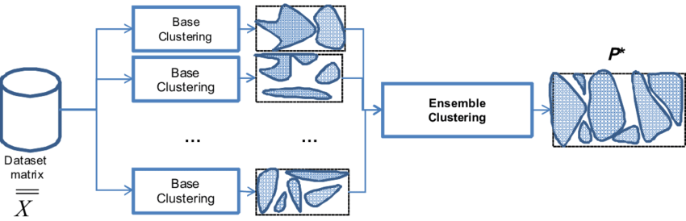

# Tabular Playground Series Jul 2022（首个无监督聚类赛）轻量深读（Tier B）

> 赛事：Playground ｜ 主题 tabular（无监督聚类，ARI）｜ 1253 队 ｜ 标准赛 ｜ 指标：Adjusted Rand Index
> 材料基础：`digests/tabular-playground-series-jul-2022.md`（6 篇正文：ARI 聚类分析 334541 / 收官经验 340874 / 七簇可视化 334808 / 1st 341023 / 聚类集成 335078 / UMAP 338839；80 条主题索引）+ 2 张归档图
> 轻读时间：2026-10（Tier B B17）

## 1. 一句话重述与数字账

Kaggle 首个无监督聚类赛：给一份表格数据预测簇标签，按 ARI（调整兰德指数）评分。1st 把结构完全逆向出来——**42 个高斯子簇 = 7 组 × 6 个子簇**，最终标签只取 7 类；只有 14 个变量与聚类相关（7 个整数 f_07–f_13 + 7 个浮点 f_22–f_28），整数呈混合泊松（被 power transform 成近正态处理），浮点中 5 个相关（均值 ±1）+ 2 个独立标准正态（均值 0）；据此写了一个**硬编码浮点均值的自定义 EM**夺冠。

| 关键数字 | 值 | 来源 |
| --- | --- | --- |
| 1st（341023） | 只有 **14 个变量**与聚类相关；整数变量来自某种**混合泊松**（自建模型失败 → 与全场一样 power transform）；用 `GaussianMixture(n_components=42)` 跑浮点列即可发现结构；真结构 = **7 组 × 每 6 个子簇 = 42**；整数均值/协方差只随 7 组变化；浮点 5 个有完整 5×5 协方差、2 个是单位正态且与任何变量无关；**自定义 EM + 硬编码浮点均值（0/±1）** 得到最佳 LB；发现线索来自读 `BayesianGMMClassifier` 源码（它用 7×7=49 个分量） | 341023 |
| 收官经验（340874） | ARI 是"配对级别的一致性 + 对随机性校正"；必须缩放；Elbow 估簇数；**丢弃不分离簇的特征**；Shapiro-Wilk / 泊松离散度检验；PCA/t-SNE/UMAP 看结构；常见算法：k-means/MeanShift/DBSCAN/GMM/层次聚类；聚类集成受内存限制；可用伪标签 + 分类器（BayesianGMMClassifier）转为有监督 | 340874 |
| 聚类集成（335078） | **共现矩阵法**：对所有样本对构造稀疏矩阵（同簇=1）→ 多个基聚类结果取均值/中位数 → 阈值（如 0.5）→ 重建簇标签；可同时混合多种算法 | 335078 |
| 社区 | "七簇可视化"（73 票 / 14 评论）；UMAP 与更细结构（63 票 / 23 评论）；"丢掉 15 个特征反而提分"（35 票 / 23 评论）；ARI 直觉（34 票）；常见聚类算法（30 票） | 索引 |

## 2. 逐方案对照矩阵

| 维度 | 1st | 集成路线（335078） | 收官经验帖 |
| --- | --- | --- | --- |
| 方法 | 自定义 EM（硬编码均值） | 共现矩阵 + 阈值 | 综述 |
| 结构认知 | 7 组 × 6 子簇 | — | Elbow/可视化 |
| 特征 | 仅 14 个相关列 | 基聚类可各用子集 | 丢弃不分离特征 |
| 结果 | 1st | 通用框架 | — |

## 3. 共识、分歧与裁决

### 共识一：真结构是分层混合（7 组 × 6 子簇），标签映射到 7 类（1st、334808；置信度高）

1st 用 42 分量 GMM 发现子结构、再合并为 7 组；3D 可视化（七簇）与 UMAP 帖也支持"表面 7 簇、内有更细结构"。**裁决**：ARI 赛先做"真实簇数"诊断（Elbow + 混合模型分量数），别假设标签数=结构数。置信度：高。

### 共识二：特征要精简，只保留能分离簇的列（1st、334875；置信度中高）

1st 只用 14 列；社区"丢 15 列反而提分"。**裁决**：聚类对噪声特征敏感，先做特征筛选再聚类。置信度：中高。

### 共识三：聚类集成可用共现矩阵 + 阈值（335078、340874；置信度中高）

该方法可同时融合多种算法，代价是 O(N²) 内存。**裁决**：聚类集成首选 co-association 矩阵，注意内存与阈值选择。置信度：中高。

### 事件：整数变量的生成机制未被揭示（1st；置信度中）

1st 尝试为混合泊松建模失败，只能 power transform，自评这是最大改进空间。**裁决**：官方未给生成过程时，登记为数据缺口；在论文/后续赛中值得回头补。置信度：中。

### 技巧：转成有监督（伪标签 + 分类器）（340874；置信度中）

用 BayesianGMMClassifier 等把聚类结果当伪标签训分类器，也是把无监督问题"外包"给成熟监督工具的思路。**裁决**：可用于稳定/加速，但伪标签错误会固化。置信度：中。

## 4. 证据分级

| 断言 | 等级 | 说明 |
| --- | --- | --- |
| 42 子簇结构、14 列、自定义 EM | 自述 + 可复核的 GMM 实验 | 高 |
| 共现矩阵集成法 | 高票帖 + 论文引用 + 图 | 中高 |
| ARI 定义与注意事项 | 高票帖（多篇互证） | 高 |
| 丢 15 列提分 | 自述 | 中 |
| UMAP 更细结构 | 观点帖 + GIF | 中 |

## 5. 悬案与缺口（登记）

- 2nd–5th 方案未收录（#1 已彻底逆向结构，前排名次可能仅差初始值/随机性）；
- 整数变量的真实生成模型未定论；
- 共现矩阵集成的阈值最优值未系统化；
- **图证缺口**：无（2 张图，本深读内嵌 1 张）。

## 6. 图表证据

**图 1**（topic 335078）：聚类集成示意——数据集 → 多个基聚类 → 集成 → 共识划分 P*；实现上用共现（同簇=1）稀疏矩阵取均值/中位数后阈值化重建标签。

## 7. 出处

- 1st（74 票 / 27 评论）：https://www.kaggle.com/competitions/tabular-playground-series-jul-2022/discussion/341023
- 收官经验（66 票 / 23 评论）：https://www.kaggle.com/competitions/tabular-playground-series-jul-2022/discussion/340874
- 七簇可视化（73 票 / 14 评论）：https://www.kaggle.com/competitions/tabular-playground-series-jul-2022/discussion/334808
- 聚类集成（47 票 / 17 评论）：https://www.kaggle.com/competitions/tabular-playground-series-jul-2022/discussion/335078
- UMAP 结构（63 票 / 23 评论）：https://www.kaggle.com/competitions/tabular-playground-series-jul-2022/discussion/338839
- ARI 分析（43 票 / 32 评论）：https://www.kaggle.com/competitions/tabular-playground-series-jul-2022/discussion/334541
- 丢掉 15 个特征（35 票 / 23 评论）：https://www.kaggle.com/competitions/tabular-playground-series-jul-2022/discussion/334875
- ARI 直觉（34 票 / 11 评论）：https://www.kaggle.com/competitions/tabular-playground-series-jul-2022/discussion/335167
- 常见聚类算法（30 票 / 7 评论）：https://www.kaggle.com/competitions/tabular-playground-series-jul-2022/discussion/334484
