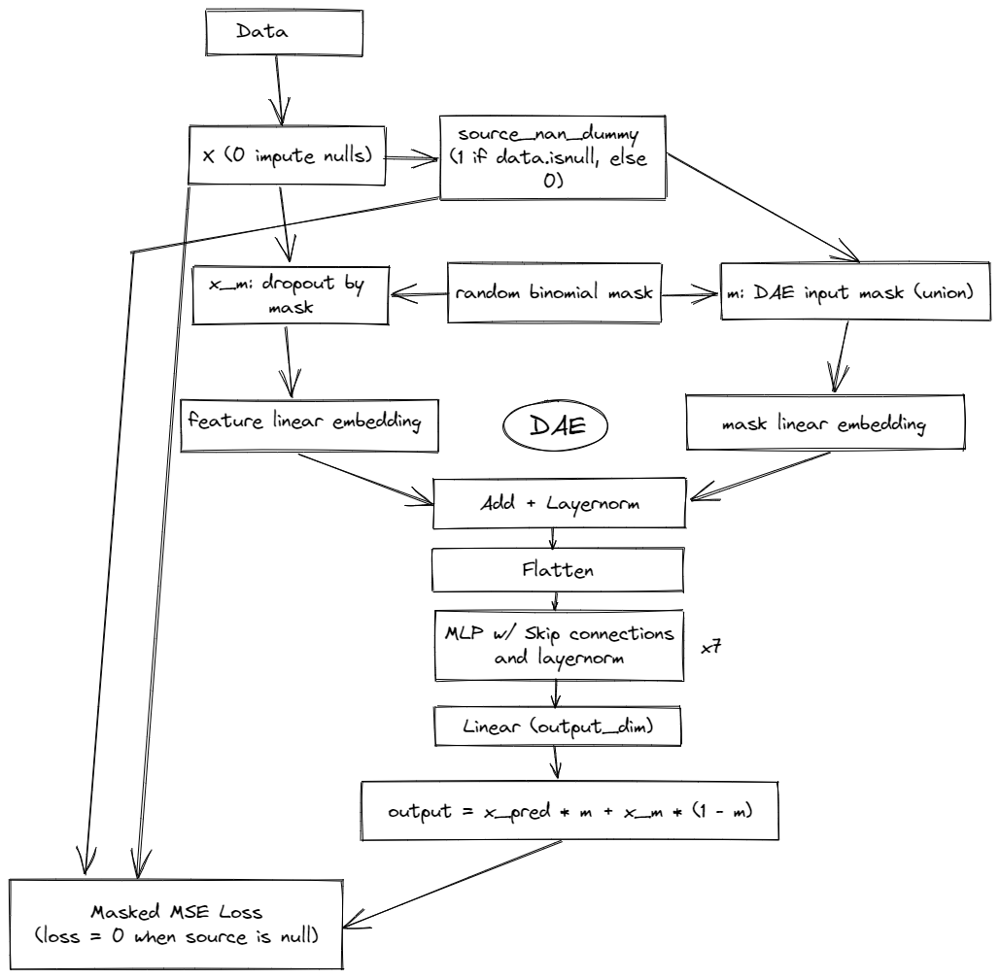

# Tabular Playground Series Jun 2022（缺失值插补）轻量深读（Tier B）

> 赛事：Playground ｜ 主题 tabular（缺失值插补，RMSE）｜ 844 队 ｜ 标准赛 ｜ 指标：RMSE
> 材料基础：`digests/tabular-playground-series-jun-2022.md`（6 篇正文：1st 334331 / 2nd 334319 / 4th 334497 / 技巧汇总 334415 / 插补综述 328568 / 回归法 328369；70 条主题索引）+ 1 张归档图
> 轻读时间：2026-10（Tier B B13）

## 1. 一句话重述与数字账

预测数据集里每个缺失单元格的值（RMSE）。数据分 F_1/F_3/F_4 三组特征（另有一组被普遍忽略）：F_1/F_3 缺失少、用均值/描述统计就够；**胜负手在 F_4——同一行有 2 个以上缺失时如何估计条件分布**。1st 用去噪自编码器（DAE）把这个条件分布学出来（私榜 0.83351），并用"仅在 F4 单缺失行上做单属性预测"的条件集成把成绩推到 **0.83343**；2nd 则按"缺失个数"把 F4 切成 6 组分别建模（≈0.8358）。

| 关键数字 | 值 | 来源 |
| --- | --- | --- |
| 1st（334331） | DAE：输入用 0 填充 + `source_nan_dummy`（原始缺失位置）；**随机二项掩码**（每行至少 1 个）与源掩码合并成 input mask；**特征与掩码各自线性嵌入（16 维）再相加**（优于 dropout / 点积注意力）；MLP = 7 层 dense + mish + LayerNorm + skip；输出按 `x_pred*m + x_mi*(1-m)` 条件混合；**masked MSE**（源缺失处 loss=0）；PyTorch×3 + TensorFlow（TF 更好）后条件平均；F1/F3 均值插补、F2 忽略；**私榜 0.83351 → 条件集成 0.83343** | 334331 |
| 2nd（334319） | 从上届（2022-05 TPS）冠军 notebook 出发；F1/F3 用均值；F4 按行内缺失数分成 **6 组（0–5 个 NaN）**，分别为每组训练"x 个输出"的模型（用无缺失组训练、按缺失组预测），实际远超 80 个回归器；最终卡在 ~0.8358 | 334319 |
| 4th（334497） | 基线 = 均值/中位数等描述统计（0.90–0.86 区间）；再用 LGBM/CatBoost/XGB；F1/F3 用线性模型 + 描述统计；F4 用 Keras 稠密网络；强调 "na count of each record" 的提示价值 | 334497 |
| 技巧汇总（334415） | 8th = 5 个 MLM 风格网络集成；16th = CatBoost 逐 NaN 循环 → 重型 PyTorch → 分片 Keras；17th = 按缺失数建模、推断公榜主要由 F4 组成；结论：DAE/掩码建模 + 按缺失模式分组是主流 | 334415 |
| 方法与资源 | 插补技术综述（59 票）：均值/中位数、FIML、MICE、SICE、MissForest/missingpy、半监督与多重插补的取舍；"逐列回归 = 80 个模型"的通用框架（28 票）；缺失值资源合集（23 票） | 328568 / 328369 / 328366 |
| 社区 | "Are we approaching this the wrong way?"（16 票）；"卡在 0.83564"（13 票 / 18 评论）；MissForest 与 missingpy（27 票） | 索引 |

## 2. 逐方案对照矩阵

| 维度 | 1st | 2nd | 4th | 8th/16th |
| --- | --- | --- | --- | --- |
| 核心 | DAE 学条件分布 | 按缺失数分组的逐列回归 | 统计基线 + F4 稠密 NN | MLM 式网络集成 |
| F1/F3 | 均值 | 均值 | 线性 + 描述统计 | — |
| F4 | 掩码 DAE + 条件集成 | 6 组 × x 输出模型 | Keras 稠密网 | 5 网络集成 |
| 关键技巧 | 特征/掩码双嵌入 + masked MSE | 缺失模式分组 | na count 视角 | 掩码语言建模 |
| 私榜 | **0.83343** | ~0.8358 | — | — |

## 3. 共识、分歧与裁决

### 共识一：F4 的"多值缺失条件分布"是唯一难点（1st、2nd、4th、17th；置信度高）

所有前列方案都把 F1/F3 交给均值/描述统计，把全部建模精力放在 F4；17th 甚至判断公榜主要由 F4 构成。**裁决**：插补赛先按"缺失模式"分解问题，再对高缺失组做条件建模。置信度：高。

### 共识二：掩码/去噪自编码器是强范式（1st、8th、16th；置信度中高）

1st 的 DAE 直接对"给定缺失掩码下的条件分布"建模，masked MSE 只在真缺失处回传梯度；8th 用 5 个 MLM 式网络集成。**裁决**：插补问题与掩码语言建模同构——"随机遮、只补遮住的部分"是正确训练目标。置信度：中高。

### 共识三：按缺失数分组建模是简单且有效的替代（2nd、17th；置信度中高）

2nd 的 6 组模型训练昂贵但可与 DAE 竞争（0.8358）。**裁决**：没有 GPU/时间做 DAE 时，"缺失模式分组 + 逐列回归"是可靠的工程解。置信度：中高。

### 事件：读懂赛题元信息与往届方案（2nd、4th；置信度中）

2nd 明确因为描述里写了"与 2022-05 TPS 相似"，直接复用上届冠军方案；4th 借用了社区 "na count" notebook 的视角。**裁决**：Playground 系列的元信息（"与往届相似"）是官方的提示，应优先于自行猜测。置信度：中。

### 分歧：先做通用插补还是直接端到端（328568 vs 1st/2nd；置信度中）

综述帖列出 MICE/FIML/SICE 等通用统计方法，但前列方案都选择了任务定制的 DAE 或回归，而非通用插补器。**裁决**：通用插补器适合作基线；顶部需要针对评分（RMSE 对每个缺失值）设计的定制模型。置信度：中。

## 4. 证据分级

| 断言 | 等级 | 说明 |
| --- | --- | --- |
| 1st 的 DAE 架构与两层分数 | 自述 + 架构图 | 高 |
| 2nd 的 6 组缺失模式建模 | 自述（含 notebook 链接） | 中高 |
| 4th 的统计基线区间与 F4 网络 | 自述 | 中 |
| 8th/16th/17th 的路线 | 二次汇总帖（引用原帖） | 中 |
| 插补方法综述 | 高票帖 + 论文引用 | 中高 |
| 公榜主要由 F4 构成 | 17th 自述判断 | 低—中 |

## 5. 悬案与缺口（登记）

- 3rd/5th–7th 方案未收录；
- 各组特征（F1/F2/F3/F4）的原始含义未归档；
- 通用插补器（MICE/SICE）在本场的量化表现缺失；
- **图证缺口**：仅 1 张 DAE 架构图（已内嵌）。

## 6. 图表证据

**图 1**（topic 334331，1st）：DAE 全流程——0 填充数据 + 源缺失 dummy；随机二项掩码与源掩码合并；特征/掩码双线性嵌入相加 → LayerNorm → 7 层带 skip 的 MLP → `x_pred*m + x_mi*(1-m)`；masked MSE 在源缺失处 loss=0。

## 7. 出处

- 1st DAE（76 票 / 20 评论）：https://www.kaggle.com/competitions/tabular-playground-series-jun-2022/discussion/334331
- 2nd 缺失模式分组（21 票 / 10 评论）：https://www.kaggle.com/competitions/tabular-playground-series-jun-2022/discussion/334319
- 4th 方案（18 票 / 8 评论）：https://www.kaggle.com/competitions/tabular-playground-series-jun-2022/discussion/334497
- 前排名技巧汇总（12 票）：https://www.kaggle.com/competitions/tabular-playground-series-jun-2022/discussion/334415
- 插补技术综述（59 票 / 26 评论）：https://www.kaggle.com/competitions/tabular-playground-series-jun-2022/discussion/328568
- 逐列回归框架（28 票 / 11 评论）：https://www.kaggle.com/competitions/tabular-playground-series-jun-2022/discussion/328369
- 缺失值资源合集（23 票）：https://www.kaggle.com/competitions/tabular-playground-series-jun-2022/discussion/328366
- MissForest / missingpy（27 票）：https://www.kaggle.com/competitions/tabular-playground-series-jun-2022/discussion/328358
