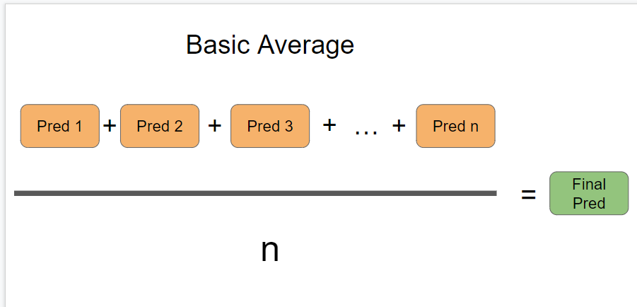
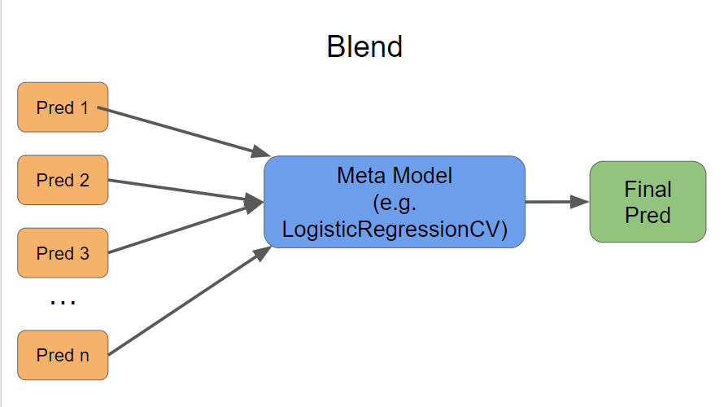
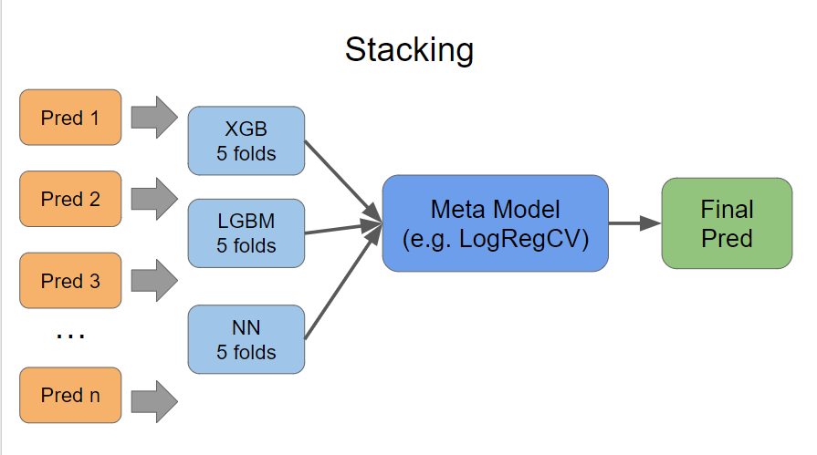

# 深读：TPS Nov 2022（"给你的不是特征，是 5000 个模型的预测"）

> 素材：现有 6 篇正文 + 74 条主题索引（未扩采）。
> 目的：示范"深读层"标准——对照矩阵 / 证据分级 / 机制推演 / 边界条件 / 悬案。

## 0. 一句话重述：这道题真正在考什么

比赛的输入是**约 5000 个已训练模型的预测文件**（而非原始特征）。因此任务被降解为两步：

1. **纠偏**：这 5000 个预测存在系统性正类高估（为什么？见 §5 的逆向工程）；
2. **择优**：在 5000 个高度相关的预测列中挑出有增量的子集并聚合。

所有前排方案都是这两步的某种组合，差异只在"纠偏用手还是自动"、"择优用相关性还是模型重要性"。

## 1. 材料与角色（谁提供了什么）

| 帖子 | 角色 | 关键信息 |
| --- | --- | --- |
| 1st Place Solution（52 票） | 冠军 | LightAutoML + XGB + LGBM + 2×NN；10/20 折；公开 7 → 私榜 1 |
| 3rd place（28 票） | 季军 | 丢弃 (0,1) 外值；Spearman 相关 0.42 阈值筛列；**Isotonic 校准**；AutoGluon |
| 7th place（14 票） | 第 7 | 5000 列中选 350：CatBoost LossFunctionChange（最优 250）+ **Null Importance（100 次打乱）**；9 模型简单平均；复现方差 ±0.005 |
| The overlooked…（54 票） | 机制帖 | **输入是预测不是特征**；预测整体偏高；`expit(logit(x)−1.17)`；单模 CV 0.6476→0.5281 |
| 7515/7485（30 票） | 探测量 | 私榜测试集 1/0 计数 = 7515 / 7485 → 正率 **50.10%** |
| 集成解说帖（56 票） | 教程 | 三种聚合：简单平均 / 探榜加权 / CV 调权；blending vs stacking |
| Host Solution（引用帖） | 注意 | 链接指向的是 **Oct 2022** 的主机方方案（Nov 的主机方案未发布）→ 本题缺官方基线参照 |

## 2. 逐方案对照矩阵

| 维度 | 1st | 3rd | 7th | overlooked（机制验证） |
| --- | --- | --- | --- | --- |
| 纠偏方式 | 隐含在集成/特征里 | **Isotonic** | 未明说（特征选择+平均） | **单参数 logit 平移 −1.17** |
| 择优方式 | 多架构差异特征 | Spearman>0.42 硬筛 | **双重模型重要性 → 350 列** | 不择优（单列做机理验证） |
| 模型 | LAML/XGB/LGBM/NN | AutoGluon | 3×LGBM + 3×NN + 3 单模 | LR-on-logits |
| 折数 | 10 / 20 折 | — | 5 折 × 5 种子 | — |
| 公开→私榜 | 7 → **1** | 172 → **3** | 97 → **7** | — |
| 关键数字 | — | 相关阈值 0.42 | 250 列最优；±0.005 | 0.6476 → 0.5281（单模） |

## 3. 共识与分歧（把"方法差异"还原成"自由度差异"）

**共识（不可省的结构）**：

- 都不直接拿 5000 列喂模型；都在做"列子集化"或等效正则；
- 都用 CV 决策（无人信公开榜：三支队伍公榜 7/97/172 → 私榜 1/7/3）；
- 都承认预测列存在系统偏差（3rd 直接校准，1st/7th 用选择+聚合吸收）。

**分歧（可自由选择的维度）**：

| 分歧点 | 观点 A | 观点 B | 我们的裁决 |
| --- | --- | --- | --- |
| 校准方式 | 单参数平移（overlooked：isotonic 过拟合阶梯） | Isotonic（3rd 拿了第 3） | 单模受控对照里平移更优（0.5281 vs 0.5286，差 5e-4）；3rd 的 isotonic 可能赢在"在更多列/集成上校准"的场景。**两者差异量级 ≈ 私榜噪声**，不足以判死任一方 |
| 聚合方式 | 1st：多架构集成 + CV 调权 | 7th：9 模型简单平均 | 7th 自己承认"简单平均"，与 1st 的复杂集成分差在 5 位小数内——**当偏差被处理干净后，聚合方式的选择空间很窄** |

## 4. 制胜增量识别（数字账）

- **单参数纠偏**：把单模 CV 从 0.6476 拉到 0.5281 → **−0.1195**（≈全部提升的 95%+）。
- **列择优**：7th 从 5000 列到 350 列；筛选曲线 1000/500/275/**250**/200（250 最优）——收益在 0.00x 量级。
- **集成规模**：前置纠偏后的模型再集成，增益在 1e-3~1e-2 量级。
- 结论：**这道题的得分结构是"1 个定性判断 + 1 个常数 + 大量琐碎择优"，而不是"更强模型"**。若把精力 100% 投在集成上而忽略 §5 的偏差来源，方向上就输了。

## 5. 机制推演：−1.17 到底是什么（本篇最有价值的一节）

1. 观测：预测整体高估正类；平移常数 c=1.17 近似最优；测试集正率 ≈ 0.501（几乎均衡）。
2. 假设：提供的预测来自**训练时被加权/重采样过的模型**（正类权重 w）。则其输出 logit 相对无偏模型整体抬高 ln(w)。
3. 推演：c ≈ ln(w) → **w ≈ e^1.17 ≈ 3.22**。
   - 即：这批预测相当于"正类被放大 ~3.2 倍"训练出来的模型输出；减去 ln(3.22) 即还原始先。
   - 这个数字可检验：若能看到 5000 个预测文件的"平均预测正率"分布，应大致落在 ~0.62 vs 真实 0.50 的关系附近（0.5·w/(0.5·w+0.5)≈0.763 上限情形，实际因模型未过拟合会低一些）。**材料里没有该分布 → 列为悬案（§8）**。
4. 为什么 isotonic 也能 work 但不占优：偏差是**几乎纯常数**（prior shift），灵活模型（isotonic）用阶梯去逼近常数 → 方差更大；单参数模型恰好命中结构。**"用最少参数拟合已知结构"**是这条推演的可迁移原则。
5. 反例价值：3rd 的 "drop by ECE" 失败——ECE 是校准质量指标，不是特征筛选器；**用错工具**比不做事更糟，这是负结果的典型。

## 6. 证据分级（把断言按可信度归档）

| 断言 | 等级 | 依据 |
| --- | --- | --- |
| 预测需纠偏、常数≈1.17、单模提升巨大 | **可验证（有数字+可复算公式）** | 帖子给出代码式公式与前后分数 |
| 私榜测试集 7515/7485 | **可验证（探测得到）** | 探测量精确到整数 |
| w≈3.2 的成因假设 | **合理推断（我们的再分析）** | 由 c=ln(w) 与均衡正率反推，未被原作者提出 |
| "isotonic 过拟合" | **弱断言** | 单模对照差 5e-4；被 3rd 的季军成绩部分反证 |
| 1st 的折数与"关键是好 CV" | **自述** | 无中间数字，不可复算 |
| 7th 的 ±0.005 方差 | **自述（但可复现设计）** | 5 种子全流程，方法透明 |

## 7. 边界条件与反事实（这套打法什么时候会失效）

- **常数平移失效条件**：偏差随子群/特征变化（如某些组正率 30%、另一些 70%）→ 必须分组校准或直接对 logits 做特征回归。验证手段：残差 logit 偏差 vs 特征相关性检验（材料中无人做）。
- **列择优失效条件**：5000 列若高度冗余且无弱信号列（纯同族复制），Null Importance 会集体淘汰 → 此时正确动作是回到"只纠偏 + 简单平均"。
- **反事实**：如果不管偏差直接集成（学 7th 的做法但不校准），大概率也能到 ~0.53 的 CV（集成吸收部分偏差），但**上限被锁死**——这解释了为什么 3rd/7th 公榜名次很差（97/172）而私榜极好：他们的分数在私榜的尾部结构里占优（50/50 均衡测试集），公榜子集分布不同。

## 8. 悬案与失败学

- **悬案 1**：5000 个预测文件的平均正率分布（检验 w≈3.2 假设的直接证据）——需要数据文件，现无。
- **悬案 2**：Nov 的主机方基线未发布（引用帖实际是 Oct 的方案）——"官方预期解法"未知。
- **悬案 3**：3rd 的 0.42 相关阈值从何而来（无推导）；7th 的 250 列最优也无误差棒。
- **失败学**：drop-by-ECE（3rd）；探榜加权（教程帖明确排序为最差）；只看公榜名次（三队都曾垫底）。

## 9. 图表证据（图证）

**图 1：Basic Average**（来源：集成解说帖 topic 363968；本地 `intel/tabular-playground-series-nov-2022/bodies/363968_img/01.PNG`）

*读图结论*：等权平均的公式化表达——与 §3"偏差被处理干净后聚合方式选择空间很窄"呼应：当 5000 列高度相关时，等权平均本身就是强基线（7th 的 9 模型简单平均进了私榜第 7）。

**图 2：Blend（元模型）**（来源同上；本地 `.../363968_img/02.PNG`）

*读图结论*：预测列 → 单一元模型（示例 LogisticRegressionCV）→ 最终预测。帖中明确排序"简单平均 < 探榜加权 < CV 调权"，且元模型用内置 CV 防止过拟合。

**图 3：Stacking（带折的二级模型）**（来源同上；本地 `.../363968_img/03.PNG`）

*读图结论*：一级用 XGB/LGBM/NN 各 5 折产生 OOF，二级元模型再融合——与 1st 的"多架构 + 10/20 折堆叠"路线一致；图中 "5 folds" 标注说明折内 OOF 是防泄漏的底线。

**不可达图（保留证据）**：机制帖 topic 364013 的两张关键图托管于 `i.imgur.com`（本机与代理均不可达）：

- `https://i.imgur.com/LmbDMLT.png`（alt=*histogram and calibration curve*，预测概率分布偏高与校准曲线）；
- `https://i.imgur.com/CPjhO08.png`（alt=*regression curves*，回归校准对比）。
- 正文描述已给出这两图的结论（0.6476→0.5286/0.5281），图不可达不改变 §5 的推演，但**数字证据的"直接目视核验"缺位**，已在 §8 记为悬案。

## 10. 对既有笔记/playbook 的修订点

1. `notes/tabular/tabular-playground-series-nov-2022.md` 升级为完整版：
   - 新增 §0 的"两步降解"框架、7515/7485 探测事实、w≈3.2 推演、isotonic 之争的裁决（噪声级）。
2. `playbook/tabular.md` §5"指标适配"表新增一行：**"输入是别人模型的预测" → 先做先验/常数校准，再做列择优与聚合**。
3. `playbook/00-通用方法论.md` 增补"最少参数拟合已知结构"与"负结果（用错指标的教训）"两条。

## 11. 出处

- 1st：https://www.kaggle.com/competitions/tabular-playground-series-nov-2022/discussion/369674
- 3rd：https://www.kaggle.com/competitions/tabular-playground-series-nov-2022/discussion/370126
- 7th：https://www.kaggle.com/competitions/tabular-playground-series-nov-2022/discussion/369731
- 机制帖：https://www.kaggle.com/competitions/tabular-playground-series-nov-2022/discussion/364013
- 7515/7485 探测量：https://www.kaggle.com/competitions/tabular-playground-series-nov-2022/discussion/364082
- 集成解说：https://www.kaggle.com/competitions/tabular-playground-series-nov-2022/discussion/363968
- Host（实为 Oct）：https://www.kaggle.com/competitions/tabular-playground-series-nov-2022/discussion/365103
