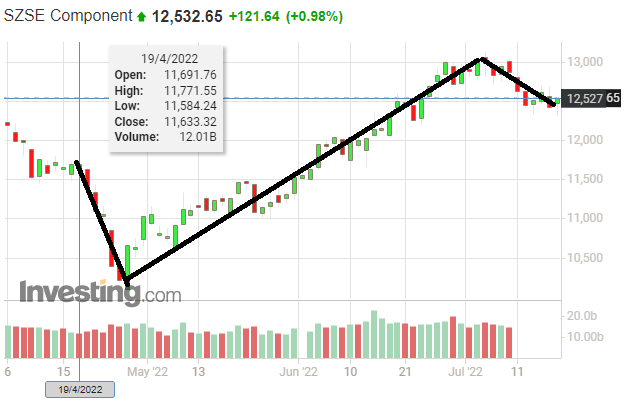

# Ubiquant Market Prediction 深读：匿名特征金融赛的稳健性工程

> 赛事：Featured ｜ 主题 tabular（金融）｜ 2893 队 ｜ 标准赛 ｜ 指标 Mean Pearson Correlation（2022-07-19 截止）
> 材料基础：`digests/ubiquant-market-prediction.md`（8 节正文：1st/2nd/3rd/5th/7th/17th + 匿名特征竞赛汇总 + Parquet 数据集帖）+ 2 张图（1 张行情图 + 1 张梗图，梗图按规范不内嵌）
> 深读时间：2026-10（Tier A #16）
> **赛制提醒**：本场采用**多轮更新（update1…final）**——每轮在新增的未来时段上重新评估；名次/分数跨轮不可直接比较（2nd：34→12→4→2→2；5th：1344→16→24→11→13→5；3rd：900+→失败→7→7→4→3）。"市场环境让模型笑了"（1st 自述）就是这一赛制的产物。

## 0. 一句话重述：这道题真正在考什么

题面是"300 个匿名特征预测未来收益"，实际被考的是**在极低信噪比 + 非平稳市场里，把"时间验证纪律"与"领域先验"做对**。降解为 5 步：

1. **时间序列验证防泄漏**：目标有前瞻窗口，样本（time_id）间存在重叠 → 必须 **Purged/Embargoed CV**（2nd 的 Purged K-Fold + embargo；1st 的 PurgedGroupTimeSeries；5th 的 20 折 + purge 10；7th 的 TimeSeriesSplit）——这是比模型更重要的第一道工程；
2. **缺失即信息**：中国市场停牌 → "上一时间步是否存在"是强特征（17th 量化：+0.0022 分 ≈ 67 个名次）；同时 1st/2nd 把"最近数据窗口/补充数据"的选择当作核心旋钮；
3. **横截面归一化**：`time_id` 聚合特征（按时间步均值）与按 time_id 标准化目标——把"市场状态"从个股信号里剥离（1st 的 +100 特征：CV 0.141→0.154；2nd 的 100 列 + 5 行级宏聚合）；
4. **模型与融合**：LGBM 是稳定基准（1st/2nd/7th）；NN/Transformer 能到前 5（3rd/5th/17th）；跨家族融合（LGBM+TabNet）提高"碰到好运的概率"；
5. **低信噪比下的实验纪律**：少做无意义的超参搜索（17th 借 G-Research 的教训）；承认运气、控制风险敞口——金融赛的"元技能"。

一句话：**这是一场"验证与归一化"的比赛**——模型选择并不决定名次；决定名次的是你是否把泄漏挡住、把市场状态剥离、把真正的横向信息（停牌、时间聚合）喂进去，以及在市场切换时不被单轮结果带着跑。

## 1. 材料与角色

| 帖子 | 作者 | 票数 | 角色与独有信息 |
| --- | --- | --- | --- |
| [301724](https://www.kaggle.com/competitions/ubiquant-market-prediction/discussion/301724)（Parquet 数据集，276 票） | Rob Mulla | 276 | 工程弹药：18GB CSV → 5GB parquet（<1 分钟）/3.5GB 低内存版（~30 秒）；3579 个 investment_id 分片——本场所有方案的加载底座 |
| [338220](https://www.kaggle.com/competitions/ubiquant-market-prediction/discussion/338220)（1st，198 票） | yuuniee | 198 | **LGBM+TabNet + 300+100 特征**；+100 time_id 均值特征：单模 CV 0.141→0.154 / LB 0.141→0.149；数据只取最近 2.4M 行；坦承"市场让模型笑了" |
| [338561](https://www.kaggle.com/competitions/ubiquant-market-prediction/discussion/338561)（3rd，69 票） | hyd | 69 | **6 层 Transformer（序列 3500 只标的）+ PCC 直接优化**；10+3 epoch；5 seeds；失败清单（feature clipping、time_id 均值、相关性筛选…） |
| [311546](https://www.kaggle.com/competitions/ubiquant-market-prediction/discussion/311546)（匿名特征竞赛汇总，34 票） | （未署名） | 34 | 12 场匿名特征赛的冠军帖索引（Allstate/BNP/Jane Street/Two Sigma/Porto Seguro…）——跨场学习入口 |
| [338400](https://www.kaggle.com/competitions/ubiquant-market-prediction/discussion/338400)（5th，33 票） | Ricardo Colomer | 33 | **最简 NN**：无特征工程（仅 QuantileTransformer）、目标 log + 去 127 离群行、4 层全连接、20 折 + purge 10；名次轨迹 1344→5 |
| [338615](https://www.kaggle.com/competitions/ubiquant-market-prediction/discussion/338615)（2nd，28 票） | Davide Stenner | 28 | **稳健 CV 优先**：Purged K-Fold + embargo；5 LGBM 以"CV 相关性"早停；100 列 time_id 均值（近 1000 time_id、>31 观测）+ 5 行级宏聚合 |
| [338293](https://www.kaggle.com/competitions/ubiquant-market-prediction/discussion/338293)（7th，24 票） | Wenrui Kong（对冲基金从业） | 24 | **单模型反例**：单 LGB（extra_trees=True）、900+ 特征（未公开）、不用补充数据；对照组（仅 300 特征）0.112 掉出奖牌；"多数人不熟市场，在公开榜上过拟合" |
| [338239](https://www.kaggle.com/competitions/ubiquant-market-prediction/discussion/338239)（17th，23 票） | Kyle Peters | 23 | **停牌 missing 特征的量化**：0.117721 vs 0.115486（无该特征会掉到 84 名）；排列重要性删 24 特征；两段式训练（l2→l1） |

**材料缺口（未扩采，登记备查）**：索引里另有 [8th（338236）](https://www.kaggle.com/competitions/ubiquant-market-prediction/discussion/338236) 与 [往届冠军方案索引（301699）](https://www.kaggle.com/competitions/ubiquant-market-prediction/discussion/301699) 未收录（本场 write-up 总量很小，缺口有限）。

## 2. 逐方案对照矩阵

| 维度 | 1st yuuniee | 2nd Davide | 3rd hyd | 5th Ricardo | 7th Wenrui | 17th Kyle |
| --- | --- | --- | --- | --- | --- | --- |
| 模型 | LGBM×5 + TabNet×5（平均） | LGBM×5（CV 相关性早停） | 6 层 Transformer，PCC 损失，5 seeds | 4 层全连接 NN（Adam/mse） | 单 LGB（extra_trees=True） | 2 隐藏层 NN（1000/512），两段式 l2→l1 |
| 特征 | 300 原文 + 100 个 time_id 均值 | 300 + 100 time_id 均值 + 5 行级宏聚合 | 仅 300 | **无 FE**（QuantileTransformer） | 900+（从更大池筛选，方法保密）；300 对照=0.112 | 全特征（排列重要性删 24 个） |
| 数据 | train+supplemental 的**最后 2.4M 行** | 全量 train+supplemental | 10 epoch 主数据 + 3 epoch 补充数据 | time_id>599 + supplemental；去 127 离群；目标 log | **不用 supplemental** | time_id>850；新时间步加权 |
| 验证 | PurgedGroupTimeSeries / TimeSeriesSplit（FE/调参）+ KFold（训练） | **Purged K-Fold + embargo** | last-k（100/200/300） | 20 折 + purge 10 | TimeSeriesSplit | 自定义时间切分 |
| 目标处理 | — | — | 归一化/裁剪尝试失败 | per-time_id 独立标准化（17th）；log（5th） | — | per-time_id 均值/方差缩放 |
| 名次轨迹 | 冠军 | 34→12→4→2→2 | 900+→失败→7→7→4→3 | 1344→16→24→11→13→5 | 7 | 1000+→17 |

## 3. 共识、分歧与裁决

### 共识一：防泄漏的时间验证是第一工程（5/6 家显式采用）

Purged K-Fold + embargo（2nd）、PurgedGroupTimeSeries + TimeSeriesSplit（1st）、purge 10 的 20 折（5th）、TimeSeriesSplit（7th）、last-k 验证（3rd）。目标的前瞻窗口造成相邻 time_id 的标签重叠——**不 purge 就没有可信的 CV**，而多轮 update 赛制又把"对未来窗口的稳健性"直接写进了评分。

**裁决**：金融序列赛的 CV 设计优先级高于任何模型选择；purge/embargo 是标准动作。置信度高。

### 共识二："缺失即信息"是本场最著名的领域特征

17th 的停牌指示特征：加入后 0.117721 vs 0.115486（+0.0022），并明确"没有它我会掉到 84 名"（从 17 名）。它同时解释了：数据里"上一时间步不存在"的样本不是随机缺失，而是交易状态事件；对这类行，价格/量类特征的语义与连续交易行不同。

**裁决**：在"缺席即事件"的领域（金融停牌、医疗失访、设备停机），缺失指示必须显式建模。置信度高（有单变量对照与名次换算）。

### 共识三：横截面（time_id）归一化是第二杠杆

- 1st：100 个"top-100 相关特征的 time_id 均值"→单模 CV 0.141→0.154、LB 0.141→0.149；
- 2nd：同一思想（近 1000 个 time_id、且要求 >31 个观测的"统计魔法数字"）+ 每行跨 300 特征的 mean/std/q10/q50/q90 五个宏聚合；
- 17th：按 time_id 独立标准化目标 + 新时间步加权。

**机制**：time_id 维度承载"市场状态"（大盘涨跌/波动/风格），减去当天均值≈把个股信号从 beta 里剥离；对树模型而言，这相当于给它一个"相对强弱"的直接读数，而不必自己从绝对水平里学 regime。

**裁决**：匿名特征赛中，"按时间步聚合/归一化"是把非平稳性打到可学习区间的通用手法。置信度高（1st 有量化、2nd 复现）。

### 分歧一：time_id 均值特征对 Transformer 无效（3rd 的负面）

3rd 把"avg features group by time_id"列入失败清单（"Maybe I'm wrong 😂"），而其它的归一化尝试（feature clipping、相关性筛选、目标归一化/裁剪、样本加权）也全部失败；他的 Transformer 靠 PCCLoss + last-k 验证 + 5 seeds 到第 3。

**裁决**：与 GBDT 不同，Transformer 的注意力/序列结构可能**自己吸收**了横截面信息，人工再注入 time_id 均值反而干扰（或与其归一化口径冲突）。这条张力说明"特征工程方法要对模型家族定向验证"，不能跨模型照搬。置信度中（单家负面 + 机制推测）。

### 分歧二：补充数据（supplemental）用不用

1st 的第一提交用 supplemental（最后 2.4M 行）成功夺冠；他的第二提交（不用 supplemental）却只有 0.115796（银牌）；7th 明确不用补充数据仍拿第 7；5th 用 supplemental。**1st 自评第二提交"排除补充数据+过度 CV/LB 过拟合"是其失分原因**。

**裁决**：补充数据是"更多同分布样本"，在多轮 update 赛制下利大于弊；但它的加入会改变内存/特征权衡（1st 为它砍到 2.4M 行）。置信度中高。

### 分歧三：集成 vs 单模型

3rd 单 Transformer（5 seeds）第 3；5th 单 NN 第 5；7th 单 LGB 第 7；反过来 1st（LGBM+TabNet）、2nd（5 LGBM）用集成。两边都成立。

**裁决**：在低信噪比下，集成的收益主要体现在"降低单模型踩中坏 regime 的概率"（1st 的"提高碰到好运的概率"）；单模型若 CV 足够稳也可行（5th/7th）。选择取决于你对"模型方差 vs 市场方差"的相对估计。置信度中。

## 4. 增量数字账

| 动作 | 数字 | 来源 |
| --- | --- | --- |
| +100 个 time_id 均值特征（1st，单 LGBM） | CV 0.141→0.154；LB 0.141→0.149 | 1st |
| 停牌 missing 特征（17th） | 0.115486→0.117721（+0.0022）≈ 17 名 vs 84 名 | 17th |
| 排列重要性删除 24 个特征（17th） | 用于最终模型（未给分差） | 17th |
| 仅 300 特征 vs 900+ 特征（7th 对照） | 0.112（掉出奖牌）vs 第 7 名 | 7th |
| 1st 第二提交（无 supplemental、无限训练） | 0.115796（银牌） | 1st |
| 2nd 名次轨迹（对轮次） | 34（0.0828）→12（0.1159）→4（0.1331）→2（0.1282）→2（0.123175） | 2nd |
| 5th 名次轨迹 | 1344（0.1481）→16→24→11→13→**5**（0.1198） | 5th |
| 3rd 名次轨迹 | 900+→失败→7→7→4→**3** | 3rd |
| Parquet 压缩 | 18GB→5GB（<1min）→3.5GB 低内存（~30s）；3579 个 investment_id | Rob Mulla |
| 5th 数据处理 | time_id>599；去 127 个目标离群行；20 折 + purge 10 | 5th |

**可复算校验（2 处吻合）**

1. 2nd 的特征账：300 + 100 + 5 = **405 个特征**；1st：300+100=**400**——两家的"基础+聚合"结构同构（100 列 time_id 均值是共同项）；
2. 压缩比：18GB→5GB ≈ 3.6×、→3.5GB ≈ 5.1×，与 parquet/dtype 优化的典型量级一致 ✓。

**跨轮分数的口径警告**：2nd 的 0.1331（第 3 轮）比 0.123175（第 5 轮）"更高"，但名次从 4→2——**不同 update 的测试时段不同、市场环境不同，分数不可跨轮比较**；只有"同一轮内的相对名次"有信息量。这是本场最重要的读数规则。

## 5. 机制推演

**M1｜为什么必须 purge/embargo**：目标通常是"未来 k 期收益"，相邻 time_id 的训练样本与验证样本存在标签窗口重叠；重叠会让验证分虚高（模型看到未来信息）。Purged K-Fold 把与验证窗口重叠的训练样本剔除（embargo 再隔离一段缓冲）。在一场"每轮都在新的未来时段重估"的比赛里，泄漏的代价被重复放大。

**M2｜停牌为什么是信号而非噪声**：停牌行"上一时间步不存在"携带交易状态（监管/事件/流动性枯竭）；复牌后的价格行为与连续交易完全不同。给模型一个显式指示，等于允许它对两类样本使用不同映射——树模型尤其受益（指示变量 + 交互）。

**M3｜time_id 均值特征为何有效（对 GBDT）**：把绝对特征替换为"相对市场当日的水平"，把 regime 变化从特征里消掉；树模型只需学"相对强弱→未来相对收益"的稳定映射，而不必在每个叶子节点里隐含编码时间状态。1st 只取"与目标相关性最高的 100 个特征"做聚合，等价于先验挑选最可能过拟合市场状态的维度。

**M4｜per-time_id 目标标准化（17th）**：同一横截面内缩放目标，消除波动率 regime 的尺度变化；与特征侧的 time_id 均值互为镜像（一个作用在 X，一个作用在 y）。

**M5｜低信噪比 → 实验上限法则**：17th 明确"少做实验"（G-Research 教训）；7th 的手调 LGB 不调参；5th 的无 FE 最简 NN——三者都把"验证稳健性"置于"迭代次数"之上。机制：在分数噪声（±0.005 级）与增益同量级时，任何基于单轮 LB 的调参都是在拟合噪声；**多轮 update 结构相当于给了多次独立验证，靠运气活不长久**。

**M6｜行情 regime 与"运气"的数学**：SZSE 在评估期（2022-04—07）先深跌后反弹（图 1）；不同 regime 下同模型的 Pearson 可达性不同。1st 的"提高碰到好运的概率"= 用模型多样性 + 稳健特征，让"市场切换时失效"的概率下降，而不是去预测市场——这是金融赛与常规 Kaggle 的心态差异。

## 6. 证据分级

| 断言 | 等级 | 说明 |
| --- | --- | --- |
| 停牌 missing 的对照（0.1177 vs 0.1155；17→84 名） | **可读取 + 自述（强）** | 单变量对照；名次换算明确 |
| 1st 的 +100 特征增益（0.141→0.154） | **自述** | 无逐特征消融；但 2nd 独立复现同思想 |
| 2nd/5th/3rd 的名次-轮次轨迹 | **可读取（帖内表）** | 跨轮分数不可比（已注） |
| 7th 的 900+ 特征与保密描述 | **弱（不可核验）** | 方法未公开；只作"单模型可行"的存在性证据 |
| 3rd 的失败清单 | **自述（负面）** | time_id 均值的负面与 1st/2nd 矛盾，机制未证 |
| Parquet 尺寸/加载时间 | **可复现** | 数据集公开 |
| "市场让模型笑了" | **作者自白** | 对"名次归因"的重要限定 |

## 7. 边界条件与反事实

- **多轮 update 是隐藏的第二赛场**：名次轨迹（1344→5、900+→3）说明早期单轮成绩毫无参考价值；策略必须假设"测试分布会切换"。反事实：若只按单轮公开榜选提交（如 5th 在第一轮 1344 名时放弃），会错失最终第 5。
- **补充数据的双面性**：1st 用它对；其第二提交不用它 → 0.115796（银）。补充数据本身不是万能：1st 第二提交还叠加了"150 特征 + 无限训练"的过拟合。反事实难以拆分。
- **内存 vs 特征 vs 数据量**：1st 的 300+100 特征把 RAM 逼到 13GB 极限，只能取最后 2.4M 行；若在更大内存机器上，两个方向（更多特征/更多行）都有上行空间。工程约束直接改写了方法选择。
- **反事实（2nd）**：若没有 Purged/embargo，其 CV 会虚高，第 2 名可能不存在；"稳健 CV"是名次与运气之间的保护层。
- **适用边界**：本场结论绑定"匿名特征 + 短横截面 + 多轮更新 + 中国股市"；换市场（如美股无停牌制度）缺失特征的意义会变。

## 8. 悬案与失败学

**悬案**

1. **time_id 均值特征对 NN/Transformer 到底是否有效**（1st/2nd 对 GBDT 有效 vs 3rd 的负面）——缺跨模型家族的系统对照；
2. **7th 的 900+ 特征是什么**（保密）——本场"特征选择空间"的上限未知；
3. **多轮 update 下的最优提交策略**（是否应保留不同 regime 的模型组合）无人系统讨论。

**失败学**

| 失败 | 来源 | 教训 |
| --- | --- | --- |
| AE MLP（Jane Street 方案迁移） | 2nd | 跨场方案直接搬运不灵 |
| 特征中性化 / PCA | 2nd | 匿名特征上无效 |
| feature clipping / 相关性筛选 / time_id 均值 / 目标归一化 / 样本加权 | 3rd | Transformer 路线下全部失败（与 GBDT 的经验相反） |
| 只用 300 原始特征 | 7th 对照 | 0.112，掉出奖牌——特征选择空间是硬上限 |
| 无补充数据 + 无限训练（1st 第二提交） | 1st | 银牌；作者归因"排除 supplemental + 过拟合 CV/LB" |
| 单轮公开榜选模型/放弃 | 5th/3rd 轨迹的反面 | 名次轨迹证明单轮信号噪声极大；坚持稳健 CV 才有翻盘 |

## 9. 图表证据

> 路径相对本文件（`analysis/deep/`）：`../../intel/ubiquant-market-prediction/bodies/338220_img/NN.ext`。本场仅 2 图：内嵌 1 张行情图；`02.jpg` 为主题梗图（300 勇士），按规范跳过不内嵌。

**图 1：评估期的市场 regime（SZSE 深证成指）**（1st，topic 338220）——`../../intel/ubiquant-market-prediction/bodies/338220_img/01.png`

*读图结论*：2022-04—07 评估期内，指数先急跌（~11,700→~10,500）后持续反弹至 ~12,500——一个典型"先空后多"的切换 regime。第一名用这张图来解释"市场条件让模型笑了"：在多轮 update 赛制下，模型对 regime 的暴露（而非模型本身）能左右名次。**这是理解本场"运气占比"的第一手证据。**

## 10. 对既有笔记/playbook 的修订点

1. `notes/tabular/ubiquant-market-prediction.md` 升级：补齐 8 节作者/票数；方案谱系扩为 6 方案对照矩阵；新增 purge/embargo、missing 量化、time_id 归一化双面性、多轮 update 口径警告、图证与失败学。
2. `playbook/tabular.md`（金融序列节）增补：
   - **Purged/Embargo CV 标准动作**；
   - **缺失指示建模**（停牌/失访/停机）；
   - **横截面归一化**（time_id 均值特征、per-time_id 目标标准化）；
   - **低信噪比实验纪律**（少调参、重稳健、多轮评估）；
   - **名次归因纪律**（跨轮分数不可比；单轮名次≈噪声）。
3. `playbook/00-通用方法论.md` 增补："**竞品期刊结构**——多轮更新/滚动评估的赛场中，早期名次不构成证据；提交策略应保留对 regime 的鲁棒性。"

## 11. 出处

- Parquet 数据集（Rob Mulla，276 票）：https://www.kaggle.com/competitions/ubiquant-market-prediction/discussion/301724
- 1st（yuuniee，198 票）：https://www.kaggle.com/competitions/ubiquant-market-prediction/discussion/338220
- 3rd（hyd，69 票）：https://www.kaggle.com/competitions/ubiquant-market-prediction/discussion/338561
- 匿名特征竞赛汇总（34 票）：https://www.kaggle.com/competitions/ubiquant-market-prediction/discussion/311546
- 5th（Ricardo Colomer，33 票）：https://www.kaggle.com/competitions/ubiquant-market-prediction/discussion/338400
- 2nd（Davide Stenner，28 票）：https://www.kaggle.com/competitions/ubiquant-market-prediction/discussion/338615
- 7th（Wenrui Kong，24 票）：https://www.kaggle.com/competitions/ubiquant-market-prediction/discussion/338293
- 17th（Kyle Peters，23 票）：https://www.kaggle.com/competitions/ubiquant-market-prediction/discussion/338239
- 未收录缺口（登记备查）：338236（8th）、301699（往届冠军方案索引）
